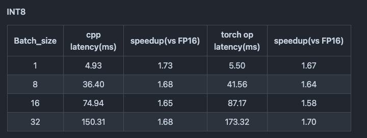
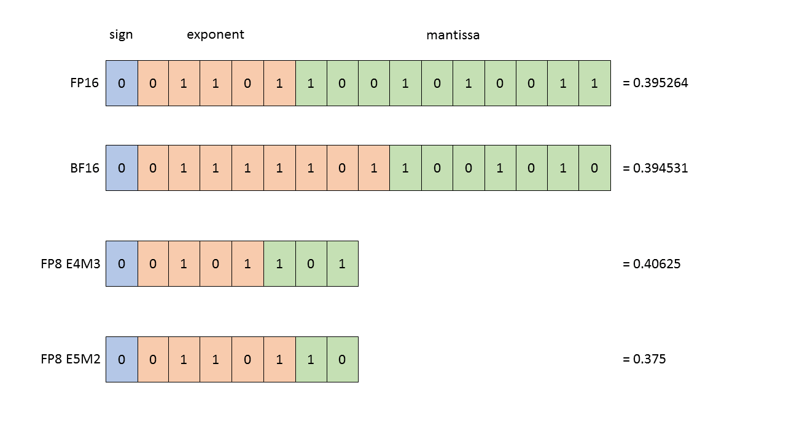
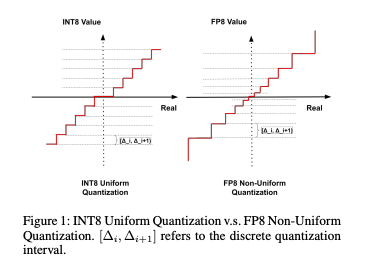
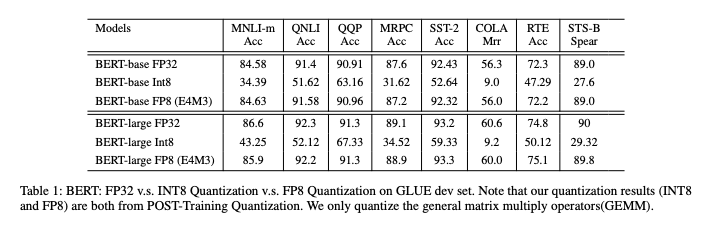
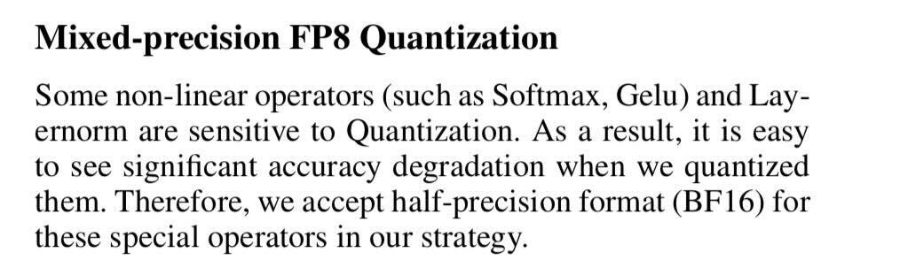

# Transformerの量子化の最新動向

# Transformerの量子化の最新動向

[](https://kyakuno.medium.com/?source=post_page---byline--ec1fbc0ea10a---------------------------------------)

[Kazuki Kyakuno](https://kyakuno.medium.com/?source=post_page---byline--ec1fbc0ea10a---------------------------------------)

12 min read

·

Jun 24, 2024

--

Share

Transformerは量子化の難しいネットワークとして知られています。本記事では、Transformerの量子化に関する最近の動向を紹介します。

## Transformerの概要

TransformerはAttentionを使用したDNNモデルです。Transformerは2017年に「Attention Is All You Need」の論文で発表されました。Transformerは当初、自然言語処理の分野に適用されましたが、その後、Vision Transformer、EnCodecなど、画像・音声の分野でも一般的に使用されるようになっています。言語も、画像も、音声も、一律にトークンとして扱うことが可能になり、昨今のマルチモーダルAIの基盤となっています。

[## Attention Is All You Need

### The dominant sequence transduction models are based on complex recurrent or convolutional neural networks in an…

arxiv.org](https://arxiv.org/abs/1706.03762?source=post_page-----ec1fbc0ea10a---------------------------------------)

## Transformerの量子化

Transformerは量子化の難しいネットワークとして知られています。Transformerのアーキテクチャのうち、最も負荷の高いAttentionは、Value \* Key \* Queryで表現され、QueryとKeyを内積し、Valueを乗算することで、微分可能なテーブル参照を実現しています。Attention自体は、Int8に量子化しても精度を保つことが可能です。しかし、Norm、Softmax、GeLUの非線形演算は量子化に弱いことが知られています。


Transformerの構造（出典：<https://arxiv.org/pdf/1706.03762>）

## NVIDIAによるFaster Transformerの事例

下記は、NVIDIAのTransformerの高速実装であるFaster Transformerにおける、Vision Transformerの実装例です。Attentionの行列積であるGemmはInt8精度で実装されていますが、SoftmaxとLayer Norm、ActivationはFloat精度で実装されています。QuantはFloat to Int8、deQuantはInt8 to Floatで、それぞれ、Q、DQと呼ばれています。

Press enter or click to view image in full size


FasterTransformerにおけるVITの量子化（出典：<https://github.com/NVIDIA/FasterTransformer/blob/main/docs/vit_guide.md>）

[## FasterTransformer/docs/vit\_guide.md at main · NVIDIA/FasterTransformer

### Transformer related optimization, including BERT, GPT - FasterTransformer/docs/vit\_guide.md at main ·…

github.com](https://github.com/NVIDIA/FasterTransformer/blob/main/docs/vit_guide.md?source=post_page-----ec1fbc0ea10a---------------------------------------)

FatserTransformerの実装では、INT8のGEMMを使用することで、2.15%程度の精度劣化が生じます。

Press enter or click to view image in full size


出典：<https://github.com/NVIDIA/FasterTransformer/blob/main/docs/vit_guide.md>

INT8のGEMMを使用することで、T4における推論時間は1.67倍高速になります。

Press enter or click to view image in full size



出典：<https://github.com/NVIDIA/FasterTransformer/blob/main/docs/vit_guide.md>

SoftmaxとLayer Norm、Activationを整数精度で実装しているI-ViTも提案されています。ただし、Int8ではないものの、Int32を使用しているため、Mixed Precisionとなります。

[## I-ViT：ViTを整数型で計算！？I-BERTの技術を進化させたShiftmax、ShiftGELUも登場！

### 3つの要点✔️ Vision Transformerの計算をすべて整数型で実現したI-ViTを提案✔️ Softmax、GELUをビットシフトを用いた計算で実現し、さらなる高速化を実現✔️…

ai-scholar.tech](https://ai-scholar.tech/articles/transformer/i-ViT?source=post_page-----ec1fbc0ea10a---------------------------------------)

## INT8ではなくFP8を使用する事例

近年、NVIDIAのH100がFP8に対応したことで、FP8が注目されています。

Press enter or click to view image in full size



FP8のフォーマット（出典：<https://docs.nvidia.com/deeplearning/transformer-engine/user-guide/examples/fp8_primer.html>）

FP8はINT8に比べて、値が小さいところはより細かく、値が大きいところはより荒くなる、非線形量子化の特性を持っています。



FP8のレンジ（出典：<https://arxiv.org/pdf/2312.05725v2>）

下記は、FP8でBERTを実装する論文となります。

[## FP8-BERT: Post-Training Quantization for Transformer

### Transformer-based models, such as BERT, have been widely applied in a wide range of natural language processing tasks…

arxiv.org](https://arxiv.org/abs/2312.05725v2?source=post_page-----ec1fbc0ea10a---------------------------------------)

FP8を使用することで、BERTの演算精度が大幅に改善します。

Press enter or click to view image in full size



FP8の精度（出典：<https://arxiv.org/pdf/2312.05725v2>）

ただし、この論文でも、SoftmaxとGeluなどのnon-linear operatorは量子化にsensitiveであることが言及されており、FP8を使用する場合も、SoftmaxとGeluはBF16で実行しています。

Press enter or click to view image in full size



FP8におけるMixed Precision（出典：<https://arxiv.org/pdf/2312.05725v2>）

## llama.cppの4bit量子化の事例

LLMはTransformerを使用しています。LLMのランタイムである、llama.cppでは、4bit量子化が広く使用されています。

## Get Kazuki Kyakuno’s stories in your inbox

Join Medium for free to get updates from this writer.

Subscribe

Subscribe

Remember me for faster sign in

llama.cppの量子化形式は下記となります。

```
Q4_0 : レガシー  
Q4_1 : レガシー  
Q4_K_S : 小規模モデル k-quantを使用 全てのテンソルを4bitで量子化  
Q4_K_M : 中規模モデル k-quantを使用 半分のテンソルを4bitで量子化 残りを6bitで量子化  
IQ4_NL : 4.50bit 非線形量子化 重要度行列を使用  
IQ4_XS  : 4.25bit 非線形量子化 重要度行列を使用
```

[## TheBloke/Llama-2-7B-Chat-GGML · Hugging Face

### We're on a journey to advance and democratize artificial intelligence through open source and open science.

huggingface.co](https://huggingface.co/TheBloke/Llama-2-7B-Chat-GGML?source=post_page-----ec1fbc0ea10a---------------------------------------#provided-files)

Q4\_K\_Mが推奨となっており、Kがついていないのが古いフォーマット、Kがついているのが新しい量子化フォーマットになっています。また、IQ4\_XSがキャリブレーションデータを使って重要度行列を用いているもので、性能が高くなる可能性があるものですが、日本語モデルに対しても英語でキャリブレーションをかけている場合があるので、日本語モデルだと性能が低くなる可能性があります。

llama.cppはWeight Quantizationであり、さらに非線形量子化されているため、4bitのウエイトはFP16に拡張されてGemmが計算されます。そのため、TensorはFP16で実装されています。

下記はllama.cppにおけるGemmの実装コードです。cublasを使用し、FP16で実装されています。

```
        cublasGemmBatchedEx(ctx.cublas_handle(), CUBLAS_OP_T, CUBLAS_OP_N,  
                ne01, ne11, ne10,  
                alpha, (const void **) (ptrs_src.get() + 0*ne23), CUDA_R_16F,   nb01/nb00,  
                       (const void **) (ptrs_src.get() + 1*ne23), CUDA_R_16F,   nb11/nb10,  
                beta,  (      void **) (ptrs_dst.get() + 0*ne23), cu_data_type, ne01,  
                ne23,  
                cu_compute_type,  
                CUBLAS_GEMM_DEFAULT_TENSOR_OP));
```

[## llama.cpp/ggml-cuda.cu at master · ggerganov/llama.cpp

### LLM inference in C/C++. Contribute to ggerganov/llama.cpp development by creating an account on GitHub.

github.com](https://github.com/ggerganov/llama.cpp/blob/master/ggml-cuda.cu?source=post_page-----ec1fbc0ea10a---------------------------------------)

llama.cppの量子化の形式は下記が詳しいです。

[## llama.cpp の動かし方と量子化手法

### Turingアドベントカレンダー17日目です！今日は Research チームの柏谷が担当します。 Research…

zenn.dev](https://zenn.dev/turing_motors/articles/f5f19f875bd8ba?source=post_page-----ec1fbc0ea10a---------------------------------------)

## NPUの動向

上記の通り、Transformerで精度を出そうとした場合、FP16とInt8のMixed Precisionが必要というのが昨今の流れとなっています。そのため、最近のNPUでは、Int8に加えて、FP16演算をサポートするものが増えてきています。

下記は、RockchipのSoCであるRK3588でWhisperを動かすための実装です。この例では、ActivationなどはArm v8のFP16命令で行い、AttentionはNPUのFP16 Gemmで実装しています。

[## GitHub - usefulsensors/useful-transformers: Efficient Inference of Transformer models

### Efficient Inference of Transformer models. Contribute to usefulsensors/useful-transformers development by creating an…

github.com](https://github.com/usefulsensors/useful-transformers?source=post_page-----ec1fbc0ea10a---------------------------------------)

## ONNXの動向

ONNXにはQとDQが実装されており、Mixed Precisionに対応しています。ONNX Runtimeの量子化ツールでは、nodes\_to\_quantizeオプションを使用することで、GemmだけをInt8に量子化することが可能です。

```
            nodes_to_quantize:  
                List of nodes names to quantize. When this list is not None only the nodes in this list  
                are quantized.
```

[## onnxruntime/onnxruntime/python/tools/quantization/quantize.py at…

### ONNX Runtime: cross-platform, high performance ML inferencing and training accelerator …

github.com](https://github.com/microsoft/onnxruntime/blob/fff68c3151b774d8a2e9290e96b9f707cd950216/onnxruntime/python/tools/quantization/quantize.py?source=post_page-----ec1fbc0ea10a---------------------------------------#L51-L61)

## まとめ

現在のTransformerの量子化実装は、Int8とBF16のMixed Precisionが主流となっています。また、NPUやフレームワークの実装も、Mixed Precisionを前提としたものになってきているようです。

ax株式会社はAIを実用化する会社として、クロスプラットフォームでGPUを使用した高速な推論を行うことができるailia SDKを開発しています。ax株式会社ではコンサルティングからモデル作成、SDKの提供、AIを利用したアプリ・システム開発、サポートまで、 AIに関するトータルソリューションを提供していますのでお気軽に[お問い合わせ](https://axinc.jp/)ください。