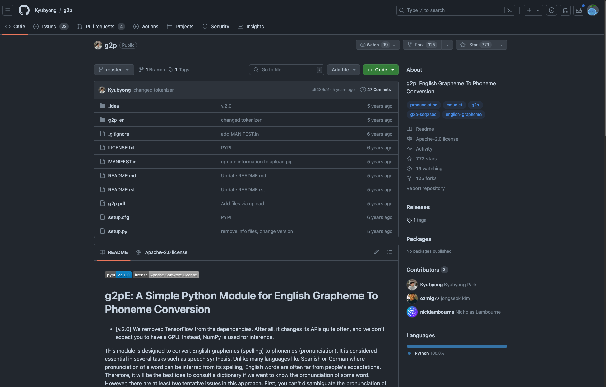
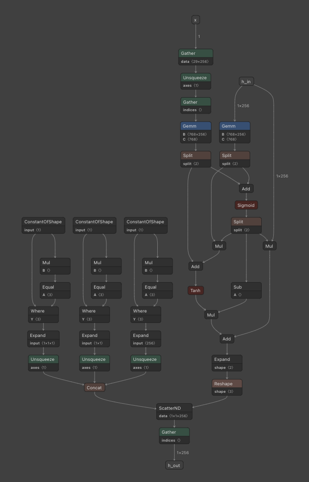

# G2P_EN : 英語のテキストを音素に変換する機械学習モデル

# G2P\_EN : 英語のテキストを音素に変換する機械学習モデル

[](https://kyakuno.medium.com/?source=post_page---byline--88947c27b9ea---------------------------------------)

[Kazuki Kyakuno](https://kyakuno.medium.com/?source=post_page---byline--88947c27b9ea---------------------------------------)

6 min read

·

Jun 27, 2024

--

Share

英語のテキストを音素に変換する機械学習モデルであるG2P-ENのご紹介です。

## G2P\_ENの概要

G2P\_ENは、辞書と機械学習モデルで英語のテキストを音素に変換するアルゴリズムです。GPT-SoVITSの英語モードで使用されています。

Press enter or click to view image in full size



G2P\_ENのリポジトリ

[## GitHub - Kyubyong/g2p: g2p: English Grapheme To Phoneme Conversion

### g2p: English Grapheme To Phoneme Conversion. Contribute to Kyubyong/g2p development by creating an account on GitHub.

github.com](https://github.com/Kyubyong/g2p?source=post_page-----88947c27b9ea---------------------------------------)

## G2Pとは

G2Pとは、Grapheme to Phonemeの略で、テキストを音素に変換するための処理です。主に、Text2Speechの前処理として使用されています。

例えば、「To be or not to be, that is the question」というテキストがあった場合、G2Pの処理結果は「T UW1 B IY1 AO1 R N AA1 T T UW1 B IY1 DH AE1 T IH1 Z DH AH0 K W EH1 S CH AH0 N」のようになります。

## G2P\_ENのアルゴリズム

### アルゴリズムの概要

従来、G2Pは、辞書ベースで実装されていました。しかし、辞書に含まれていない単語に対して、音素に変換できないという課題があります。G2P\_ENでは、未知語に対してニューラルネットワークで音素を予測します。

### 入力されたテキストの整形

入力されたテキストの数値表記を英語にします。「10」だと「ten」、「10000」だと「ten thousand」のように置換します。

```
text = normalize_numbers(text)
```

非対応の記号をマスクします。「’.,?!-」以外の記号はマスクされます。

```
text = text.lower()  
text = re.sub("[^ a-z'.,?!\-]", "", text)  
text = text.replace("i.e.", "that is")  
text = text.replace("e.g.", "for example")
```

英語でよく使う省略形を展開します。

```
text = text.replace("i.e.", "that is")  
text = text.replace("e.g.", "for example")
```

### 単語分割

テキストをnltkのTweetTokenizerで単語に分割します。スペース＋unicodeのP属性区切りでも単語区切りは行えますが、TweetTokenizerは、[@name](http://twitter.com/name)などを考慮して単語区切りを行います。ただし、G2P\_ENでは、事前に@をマスクしているため、TweetTokenizerを使う意味がない気もします。

### 辞書適用

分割した単語に対して、homographs.enと、cmudictの2つの辞書を使用して音素に変換します。

## Get Kazuki Kyakuno’s stories in your inbox

Join Medium for free to get updates from this writer.

Subscribe

Subscribe

Remember me for faster sign in

homographs.enは、品詞によって発音が変化することを考慮し、2パターンの発音が定義されています。[nltkのパーセプトロン](https://github.com/nltk/nltk/blob/develop/nltk/tag/perceptron.py)による品詞分類を行った後、辞書から発音を決定します。

homographs.enの内容の例は下記となります。テキスト、発音1、発音2、品詞が定義されています。品詞が一致する場合は発音1、一致しない場合は発音2が使用されます。

```
ABUSE|AH0 B Y UW1 Z|AH0 B Y UW1 S|V  
ABUSES|AH0 B Y UW1 Z IH0 Z|AH0 B Y UW1 S IH0 Z|V
```

cmudictの例は下記となります。複数の発音が定義されている場合、G2P\_ENでは、最初の発音を使用します。

```
ABUSE 1 AH0 B Y UW1 S  
ABUSE 2 AH0 B Y UW1 Z  
ABUSED 1 AH0 B Y UW1 Z D  
ABUSER 1 AH0 B Y UW1 Z ER0
```

### 音素の推定

辞書から単語が見つからなかった場合、ニューラルネットワークで単語の発音を予測します。G2P\_ENのv1はTensorFlowで実装されていましたが、G2P\_ENのv2はnumpyで実装されています。Encoder、Decoderの構成で、最大20シンボルをGreedySearchでデコードします。

Encoderの構成は下記となります。文字単位でループしてEmbeddingを計算します。



Encoder

Decoderの構成は下記となります。出力文字単位でループして、シンボル3が出現したら終了します。最大ループは20文字です。


Decoder

## G2P\_ENの使用方法

ailia SDKでG2P\_ENを使用するには下記のようにします。

```
$ python3 g2p_en.py --input "I'm an activationist."
```

出力例です。I’m anは辞書から、activationistはニューラルネットワークで音素が予測されます。

```
Output : ['AY1', 'M', ' ', 'AE1', 'N', ' ', 'AE2', 'K', 'T', 'IH0', 'V', 'EY1', 'SH', 'AH0', 'N', 'IH0', 'S', 'T', ' ', '.']
```

[## ailia-models/natural\_language\_processing/g2p\_en at master · axinc-ai/ailia-models

### The collection of pre-trained, state-of-the-art AI models for ailia SDK …

github.com](https://github.com/axinc-ai/ailia-models/tree/master/natural_language_processing/g2p_en?source=post_page-----88947c27b9ea---------------------------------------)

Pythonだけでなく、C++版も提供しています。

[## ailia-models-cpp/natural\_language\_processing/g2p\_en at master · axinc-ai/ailia-models-cpp

### C++ version of ailia models repository. Contribute to axinc-ai/ailia-models-cpp development by creating an account on…

github.com](https://github.com/axinc-ai/ailia-models-cpp/tree/master/natural_language_processing/g2p_en?source=post_page-----88947c27b9ea---------------------------------------)

ax株式会社はAIを実用化する会社として、クロスプラットフォームでGPUを使用した高速な推論を行うことができるailia SDKを開発しています。ax株式会社ではコンサルティングからモデル作成、SDKの提供、AIを利用したアプリ・システム開発、サポートまで、 AIに関するトータルソリューションを提供していますのでお気軽に[お問い合わせ](https://axinc.jp/)ください。