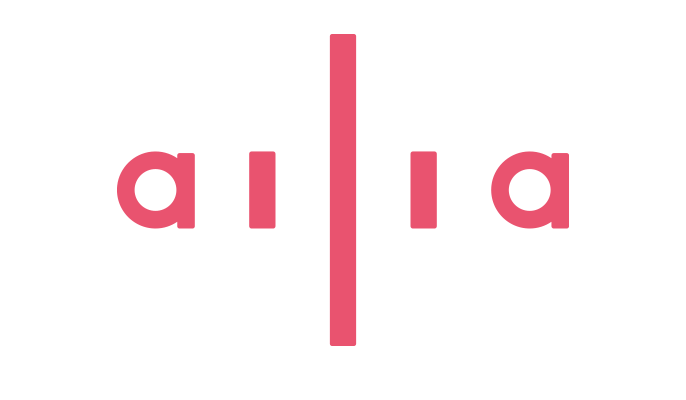
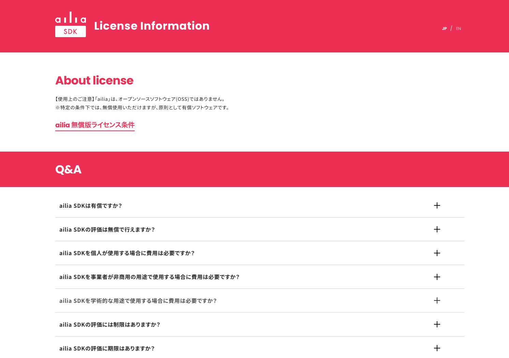

# ailia SDKの無償範囲を拡大、個人の小規模商用目的での無償利用が可能に

# ailia SDKの無償範囲を拡大、個人の小規模商用目的での無償利用が可能に

[Kazuki Kyakuno](https://kyakuno.medium.com/?source=post_page---byline--586253c36659---------------------------------------)

Jul 16, 2024

--

Share

ailia SDKの個人利用の無償範囲を拡大しました。個人の小規模商用目的での無償利用が可能になります。ailia SDKは、API使用料のかからないAIを実現し、AIの民主化に貢献します。

## ailia SDKの個人利用の無償範囲を拡大

2024年7月16日より、ailia SDKのライセンスを改定し、ailia SDKの個人利用の無償範囲を拡大しました。

ailia SDK

12ヶ月間のユーザー製品による経済的利益 (売上高、広告収入、その他の経済的利益) の合計が10万ドル未満の場合を小規模商用目的と定義し、個人の小規模商用目的の場合は、商用目的でも無償で利用可能となりました。

これにより、ailia SDKを使用したインディーゲームの販売や、広告を含むAIアプリなどの配信が可能となります。

詳細なライセンスは下記のサイトを確認ください。

Press enter or click to view image in full size

ailia SDK License情報

[## ailia SDK License

### ailia SDK License Information [Japanese] [English] About license 【使用上のご注意】…

ailia.ai](https://ailia.ai/license/?source=post_page-----586253c36659---------------------------------------)

## クラウドAIを個人利用する場合の課題

クラウドAIを実行する場合、使用量に応じてAPI使用料が必要です。個人開発のAIアプリのユーザ数が、数十万規模になった場合に、API使用料が非常に高額になります。そのため、個人開発で、AI機能を搭載したアプリの開発と配信が難しいという課題がありました。

## ailia SDKとエッジAIによるAIの民主化

ailia SDKでエッジAIを使用すると、AIはユーザのデバイス上で実行されます。そのため、ユーザ数がどれだけ拡大しても、API使用料が不要です。これにより、個人でも、大規模なAIアプリの開発が可能になります。

## Get Kazuki Kyakuno’s stories in your inbox

Join Medium for free to get updates from this writer.

Subscribe

Subscribe

Remember me for faster sign in

今後、B2Cの領域でAIの利用が拡大していくと見込まれており、ailia SDKは、AIの民主化に貢献していきたいと考えています。

## ailia SDKの特徴

ailia SDKは、画像認識、音声認識、音声合成、OCR、翻訳などを、エッジデバイス上で実行可能です。

プログラミング言語には、Python、Unity、Flutter、C++を使用可能です。

ailia SDKは、ライブラリと共に、公式で各言語へのバインディングと、各種モデルのサンプルプログラムを提供しています。これにより、一貫したインタフェースによる快適な開発環境を提供します。

ailia SDKのコアは、できるだけシンプルなアーキテクチャとなるように設計しており、主役であるユーザのアプリケーションに簡単に取り込むことが可能です。また、ailia MODELSとして、すぐに必要な機能を見つけて取り込める、イージーな実装を提供します。

ailia SDKの使用方法は下記の記事を参照ください。

[## ailia SDKのインストール方法

### ailia SDKのインストール方法と、サンプルの実行方法を解説します。Python、Unity、Flutter、C++について順番に説明します。

medium.com](https://medium.com/axinc/ailia-sdk%E3%81%AE%E3%82%A4%E3%83%B3%E3%82%B9%E3%83%88%E3%83%BC%E3%83%AB%E6%96%B9%E6%B3%95-ad66647de967?source=post_page-----586253c36659---------------------------------------)

## ailia Universe Program

ailia SDKを使用して開発したアプリケーションの事業化をサポートするスタートアップ支援プログラム、ailia Universe Programも開始しました。AIアプリの事業化を検討されている方は、下記のサイトより、ぜひ、お問い合わせください。

Press enter or click to view image in full size

ailia Universe Program

[## ailia Universe Program｜ailia AI Series

### ailia Universe ProgramはあなたのAIを事業化し、具現化するための共創パートナーシップ・プログラムです。

ailia.ai](https://ailia.ai/universe/?source=post_page-----586253c36659---------------------------------------)

ax株式会社はAIを実用化する会社として、クロスプラットフォームでGPUを使用した高速な推論を行うことができるailia SDKを開発しています。ax株式会社ではコンサルティングからモデル作成、SDKの提供、AIを利用したアプリ・システム開発、サポートまで、 AIに関するトータルソリューションを提供していますのでお気軽に[お問い合わせ](https://axinc.jp/)ください。