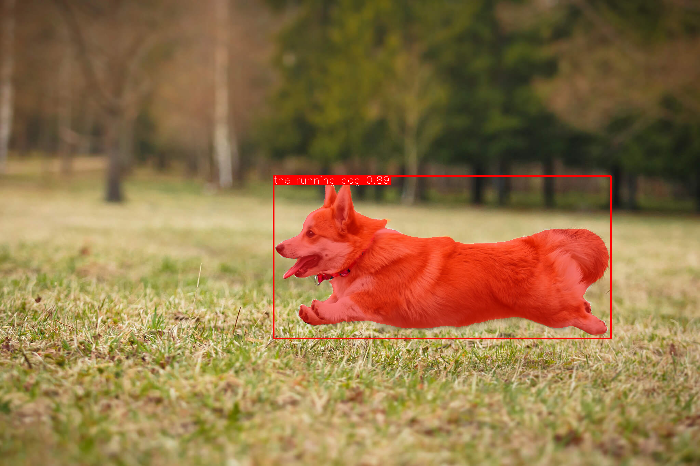
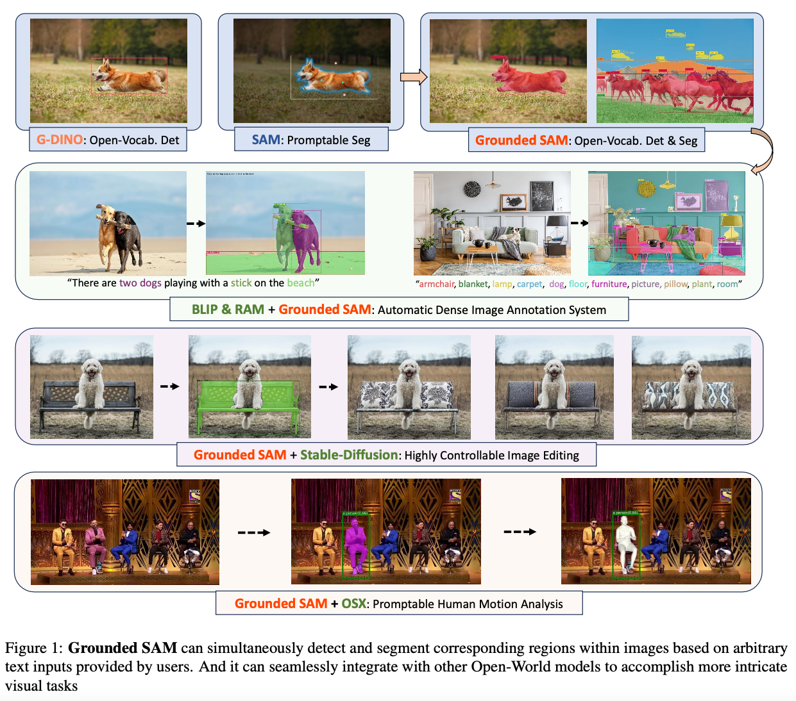

# Grounded-SAM : 任意の物体をセグメンテーションできる機械学習モデル

# Grounded-SAM : 任意の物体をセグメンテーションできる機械学習モデル

[](https://kyakuno.medium.com/?source=post_page---byline--4ed37911fef8---------------------------------------)

[Kazuki Kyakuno](https://kyakuno.medium.com/?source=post_page---byline--4ed37911fef8---------------------------------------)

Jul 18, 2024

--

Share

任意の物体をセグメンテーションできる機械学習モデルであるGrounded-SAMのご紹介です。

## Grounded-SAMの概要

Grounded-SAMは、テキストで指定した任意の物体をセグメンテーションできる機械学習モデルです。

Press enter or click to view image in full size



出典：https://github.com/IDEA-Research/Grounded-Segment-Anything/blob/main/assets/demo2.jpg

[## GitHub - IDEA-Research/Grounded-Segment-Anything: Grounded SAM: Marrying Grounding DINO with…

### Grounded SAM: Marrying Grounding DINO with Segment Anything &amp; Stable Diffusion &amp; Recognize Anything …

github.com](https://github.com/IDEA-Research/Grounded-Segment-Anything?source=post_page-----4ed37911fef8---------------------------------------)

[## Grounded SAM: Assembling Open-World Models for Diverse Visual Tasks

### We introduce Grounded SAM, which uses Grounding DINO as an open-set object detector to combine with the segment…

arxiv.org](https://arxiv.org/abs/2401.14159?source=post_page-----4ed37911fef8---------------------------------------)

## Grounded-SAMのアーキテクチャ

Grounded-SAMは、GroundingDINOを使用して、指定されたテキストのBounding Boxを計算し、そのBounding Boxを指示としてSegement Anythingでセグメンテーションを取得します。既存の2つのモデルを統合することで、任意の物体のセグメンテーションを実現しています。

Press enter or click to view image in full size



Grounded SAMのアーキテクチャ（<https://arxiv.org/abs/2401.14159>）

応用例として、Grounded SAMとStable Diffusionを組み合わせることで、テキストで椅子を指定し、椅子だけの模様を変更するなど、高度な画像編集が可能になります。

## Get Kazuki Kyakuno’s stories in your inbox

Join Medium for free to get updates from this writer.

Subscribe

Subscribe

Remember me for faster sign in

Grounded-SAMは、「ピンクの服を着た人」や、「サングラスをかけた男」などを、テキストからセグメンテーションすることが可能です。

Press enter or click to view image in full size


Grounded SAMのアーキテクチャ（<https://arxiv.org/abs/2401.14159>）

GroundingDINOとSegmentAnythingについては、下記を参照してください。

[## Grounding DINO : 任意の物体を検出できる物体検出モデル

### 任意の物体を検出できる物体検出モデルであるGrounding DINOのご紹介です。検出したい物体をテキストで指定すると、指定した物体のBounding Boxを取得可能です。

medium.com](https://medium.com/axinc/grounding-dino-%E4%BB%BB%E6%84%8F%E3%81%AE%E7%89%A9%E4%BD%93%E3%82%92%E6%A4%9C%E5%87%BA%E3%81%A7%E3%81%8D%E3%82%8B%E7%89%A9%E4%BD%93%E6%A4%9C%E5%87%BA%E3%83%A2%E3%83%87%E3%83%AB-3cc87db64f0c?source=post_page-----4ed37911fef8---------------------------------------)

[## SegmentAnything : セグメンテーションの対象を座標で指定できるセグメンテーションモデル

### セグメンテーションの対象を座標で指定できるセグメンテーションモデルであるSegmentAnythingのご紹介です。

medium.com](https://medium.com/axinc/segmentanything-%E3%82%BB%E3%82%B0%E3%83%A1%E3%83%B3%E3%83%86%E3%83%BC%E3%82%B7%E3%83%A7%E3%83%B3%E3%81%AE%E5%AF%BE%E8%B1%A1%E3%82%92%E5%BA%A7%E6%A8%99%E3%81%A7%E6%8C%87%E5%AE%9A%E3%81%A7%E3%81%8D%E3%82%8B%E3%82%BB%E3%82%B0%E3%83%A1%E3%83%B3%E3%83%86%E3%83%BC%E3%82%B7%E3%83%A7%E3%83%B3%E3%83%A2%E3%83%87%E3%83%AB-fa6c917c3e51?source=post_page-----4ed37911fef8---------------------------------------)

## Grounded-SAMの使用方法

ailia SDKでGrounded-SAMを使用するには、下記のコマンドを使用します。メモリ消費量が5GB程度です。VRAMが少ない場合は、-e 1オプションを付与してCPUで実行してください。

```
$ python3 grounded_sam.py -i demo.jpg --caption "The running dog."
```

[## ailia-models/image\_segmentation/grounded\_sam at master · axinc-ai/ailia-models

### The collection of pre-trained, state-of-the-art AI models for ailia SDK - ailia-models/image\_segmentation/grounded\_sam…

github.com](https://github.com/axinc-ai/ailia-models/tree/master/image_segmentation/grounded_sam?source=post_page-----4ed37911fef8---------------------------------------)

Grounded SAMの実行にはBERT Tokenizerのためにailia\_tokenizerが必要です。下記のコマンドでインストールしてください。

```
pip3 install ailia_tokenizer
```

ax株式会社はAIを実用化する会社として、クロスプラットフォームでGPUを使用した高速な推論を行うことができるailia SDKを開発しています。ax株式会社ではコンサルティングからモデル作成、SDKの提供、AIを利用したアプリ・システム開発、サポートまで、 AIに関するトータルソリューションを提供していますのでお気軽に[お問い合わせ](https://axinc.jp/)ください。