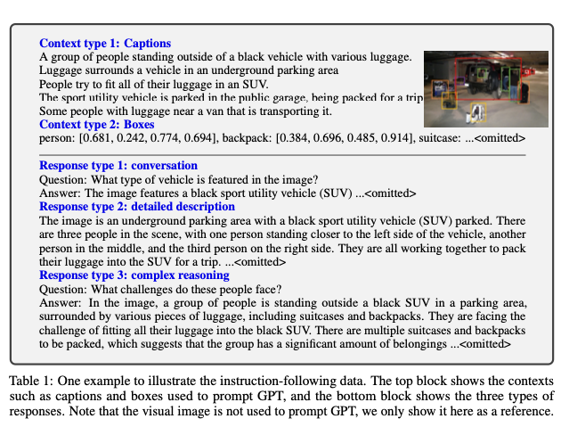
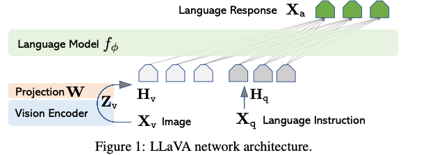

# LLaVA : 画像に対して質問できる大規模言語モデル

# LLaVA : 画像に対して質問できる大規模言語モデル

[](https://kyakuno.medium.com/?source=post_page---byline--6ede836f2bed---------------------------------------)

[Kazuki Kyakuno](https://kyakuno.medium.com/?source=post_page---byline--6ede836f2bed---------------------------------------)

6 min read

·

Jul 19, 2024

--

Share

画像に対して質問できる大規模言語モデルであるLLaVAのご紹介です。

## LLaVAの概要

LLaVAは2023年12月にUniversity of Wisconsin-MadisonとMicrosoft ResearchとColumbia Universityにより公開された、CLIPとLlama2を組み合わせた大規模言語モデルです。OpenAIのGPT4Vと同様に、画像を入力し、画像に対してプロンプトで質問可能です。

[## Visual Instruction Tuning

### Instruction tuning large language models (LLMs) using machine-generated instruction-following data has improved…

arxiv.org](https://arxiv.org/abs/2304.08485?source=post_page-----6ede836f2bed---------------------------------------)

## LLaVAのアーキテクチャ

マルチモーダルのAIモデルを開発する際の重要な課題は、学習に使用するデータの不足です。LLaVAは、大規模なデータセットが入手できる画像とキャプションのみから、テキストのみを扱えるLLMを使用して、Instruction形式（質問・回答の形式）にデータ再構成するためのパイプラインを構築します。

LLaVAは画像を扱えるGPT4Vではなく、画像を扱えないGPT4を使用することで、Instruction形式のデータセットを構築します。画像を与えることはできないため、入力コンテキストとして、画像に対するキャプションと、画像のバウンディングボックスを与えています。画像のバウンディングボックスを与えることで、画像をLLMが認識できるシーケンスとしてエンコードしています。これらのコンテキストを元に、GPT4に会話、詳細な説明、複雑な推論のレスポンスを生成しています。

Press enter or click to view image in full size



データセット作成のためのLLMへの入力と出力の例（出典：<https://arxiv.org/pdf/2304.08485>）

次に、こうして作成した、Instruction形式のデータセットと画像を、AIモデルの学習によって紐付けます。



LLaVAのアーキテクチャ（出典：<https://arxiv.org/pdf/2304.08485>）

モデルアーキテクチャとしては、ビジュアルエンコーダのCLIPを大規模言語モデルVicunaに接続し、新たに構築したInstruction形式のデータセットでファインチューイニングすることで、大規模なマルチモーダルLLMを構築します。

## Get Kazuki Kyakuno’s stories in your inbox

Join Medium for free to get updates from this writer.

Subscribe

Subscribe

Remember me for faster sign in

LLaVAは、画像をVision Encoderに通した後、トークンにProjectionし、プロンプトとなるLanguage Instructionと共にLanguage Modelに入力することで、プロンプトに対する回答であるテキストを出力します。

## LLaVAの実行例

LLaVAの実行例です。車の後部でアイロン掛けしている人物の画像に対して、この画像のどこが一般的ではないのですかと聞くと、LLaVAはミニバンの後でアイロンをかけているところが一般的ではないと回答することが可能です。

Press enter or click to view image in full size


出典：<https://arxiv.org/pdf/2304.08485>

## ailia SDKからLLaVAを使用する

ailia SDKからLLaVAを使用するには下記のコマンドを使用します。LLaVAはFP32で28GB程度のメモリを必要とするため、十分なVRAMがない場合は、-e 1オプションでCPUで実行します。

```
$ python3 llava.py --input input.jpg --prompt "What are the things I should be cautious about when I visit here?" -e 1
```

[## ailia-models/vision\_language\_model/llava at master · axinc-ai/ailia-models

### The collection of pre-trained, state-of-the-art AI models for ailia SDK - ailia-models/vision\_language\_model/llava at…

github.com](https://github.com/axinc-ai/ailia-models/tree/master/vision_language_model/llava?source=post_page-----6ede836f2bed---------------------------------------)

入力画像です。

Press enter or click to view image in full size


出典：<https://llava-vl.github.io/static/images/view.jpg>

出力例です。

```
When visiting this location, which features a pier extending over a large body of water, you should be cautious about several things. First, be mindful of the weather conditions, as the pier may be affected by strong winds or storms, which could make it unsafe to walk on. Second, be aware of the water depth and currents, as they can change rapidly and pose a risk to swimmers or those who venture too close to the edge. Additionally, be cautious of the presence of any wildlife in the area, as they may pose a potential danger or distraction. Finally, be mindful of the pier's structural integrity, as it may be subject to wear and tear over time, and it is essential to ensure that it is safe for use.
```

ax株式会社はAIを実用化する会社として、クロスプラットフォームでGPUを使用した高速な推論を行うことができるailia SDKを開発しています。ax株式会社ではコンサルティングからモデル作成、SDKの提供、AIを利用したアプリ・システム開発、サポートまで、 AIに関するトータルソリューションを提供していますのでお気軽に[お問い合わせ](https://axinc.jp/)ください。