# ailia DX InsightでAIにプログラムを書いてもらう

# ailia DX InsightでAIにプログラムを書いてもらう

[](https://kyakuno.medium.com/?source=post_page---byline--f75486dc7655---------------------------------------)

[Kazuki Kyakuno](https://kyakuno.medium.com/?source=post_page---byline--f75486dc7655---------------------------------------)

22 min read

·

Jul 22, 2024

--

Share

ailia DX InsightはAIと共に働くためのネイティブアプリケーションです。本記事では、ailia DX Insightの活用例として、AIにプログラムを書いてもらう方法を解説します。

## ailia DX Insightの概要

ailia DX Insightはax株式会社および株式会社アクセルが提供する、様々なAIが統合されたネイティブアプリケーションです。ChatGPTやGeminiなどのクラウドLLM、Gemma2などのローカルLLM、ailia SDKによるローカルAIを組み合わせて使用することができます。これにより、様々なAIを簡単に使用することが可能です。AIと共に働く時代に向けた、新しいアプリケーションです。

Press enter or click to view image in full size


[## DX Insight ｜ailia AI Series

### 文書検索、翻訳、議事録、画像生成も！AIを、身近な仕事の相棒に。ひとつですべてをこなすDXアプリ「DX Insight」です。

ailia.ai](https://ailia.ai/dx/?source=post_page-----f75486dc7655---------------------------------------)

## ailia DX Insightでプログラムを書く

ailia DX Insightでプログラムを書くには、チャットモードを使用します。ちょっとしたものを一瞬で書いてくれます。

例えば、「C++でstd::stringの先頭が<s>だった場合に除去するコードを書いてください」とお願いしてみます。

Press enter or click to view image in full size

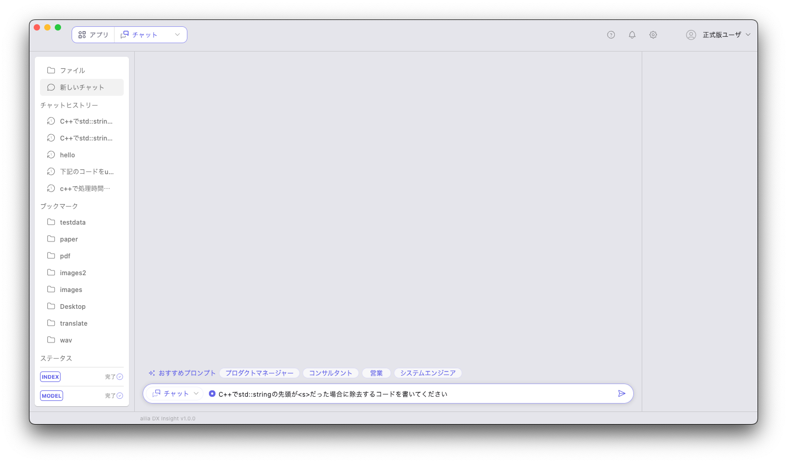

すごいスピードでプログラムを書いてくれます。

Press enter or click to view image in full size

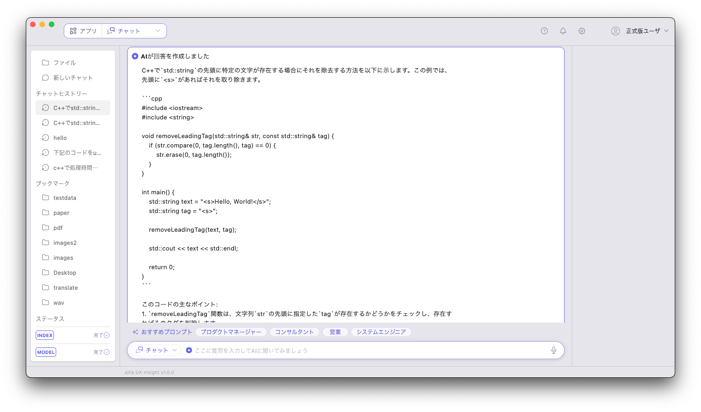

出力例です。

```
#include <iostream>  
#include <string>  
  
int main() {  
  std::string str = "<s>Hello, world!";  
  
  // 先頭の"<s>"を削除  
  if (str.substr(0, 3) == "<s>") {  
    str.erase(0, 3);  
  }  
  
  // 結果を出力する  
  std::cout << str << std::endl; // 出力: Hello, world!  
  
  return 0;  
}
```

やっぱりC99にしたい場合は、そのようにお願いします。

Press enter or click to view image in full size

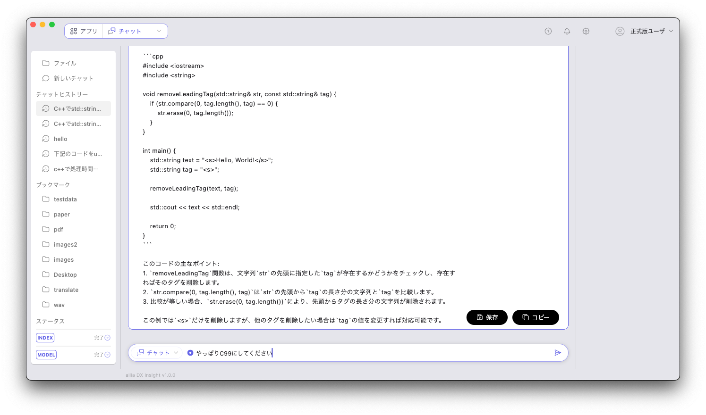

例によってすごいスピードでコードを書いてくれます。

Press enter or click to view image in full size

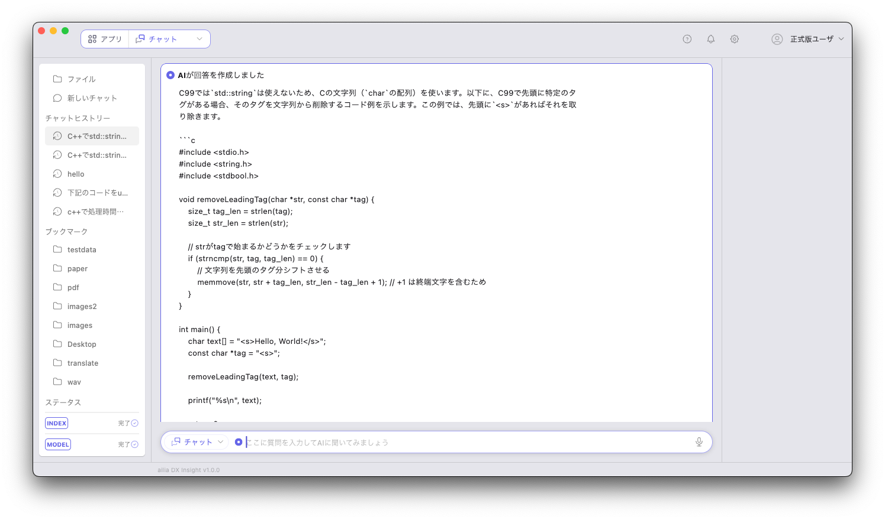

出力例です。

```
#include <stdio.h>  
#include <string.h>  
#include <stdbool.h>  
  
void removeLeadingTag(char *str, const char *tag) {  
    size_t tag_len = strlen(tag);  
    size_t str_len = strlen(str);  
  
    // strがtagで始まるかどうかをチェックします  
    if (strncmp(str, tag, tag_len) == 0) {  
        // 文字列を先頭のタグ分シフトさせる  
        memmove(str, str + tag_len, str_len - tag_len + 1); // +1 は終端文字を含むため  
    }  
}  
  
int main() {  
    char text[] = "<s>Hello, World!</s>";  
    const char *tag = "<s>";  
  
    removeLeadingTag(text, tag);  
  
    printf("%s\n", text);  
  
    return 0;  
}
```

ちょっとしたコードだと、自分でソースコードをキーボードで打ち込むよりも、LLMにお願いしたほうが速いです。

## ailia DX Insightでソースコードを高速化する

もう少し応用的な使い方として、ソースコードの高速化にも便利です。下記は、BPEを使用して文章をトークナイズするコードです。

```
std::vector<std::string> vocab  
std::vector<std::string> bpe_tokens;  
  
 for (int i = 0; i< bpe_tokens.size(); i++){  
  if (debug){  
   printf("token_idx %d bpe_token %s ", i, bpe_tokens[i].c_str());  
  }  
  int token_n = vocab.size();  
  int match_t = -1;  
  for(int t=0;t<token_n;t++){  
   int len;  
   const unsigned char * vocab_text;  
   len = vocab[t].length();  
   vocab_text = (const unsigned char*)&vocab[t];  
   std::string bpe_token_from_t;  
   bpe_token_from_t = vocab[t];  
   if (debug){  
    printf("from %s byteencode %s\n", vocab_text, bpe_token_from_t.c_str());  
   }  
   if (bpe_tokens[i].size() == bpe_token_from_t.size()){  
    if (bpe_token_from_t == bpe_tokens[i]){  
     ids.push_back(t);  
     match_t = t;  
     break;  
    }  
   }  
  }  
  if (debug){  
   printf("token_id %d\n", match_t);  
  }  
 }
```

このコードを高速化するために、「下記のコードを高速化してください。」とお願いします。

Press enter or click to view image in full size

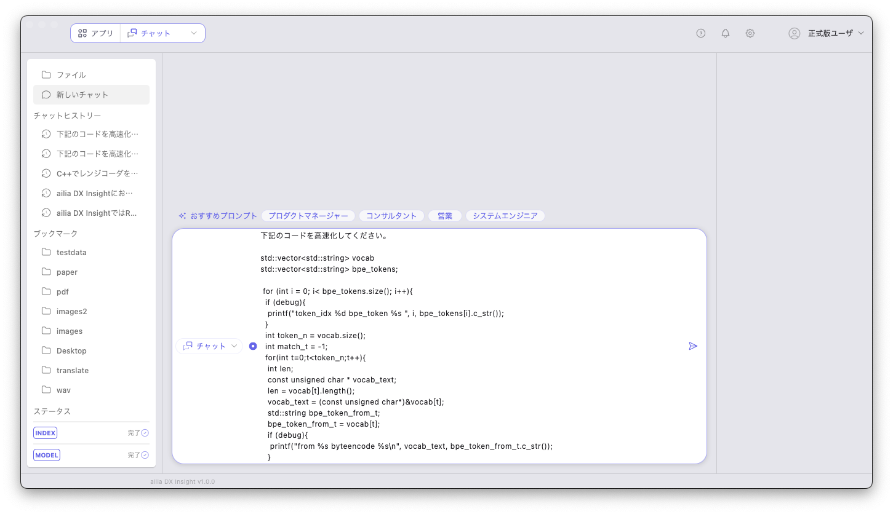

Press enter or click to view image in full size

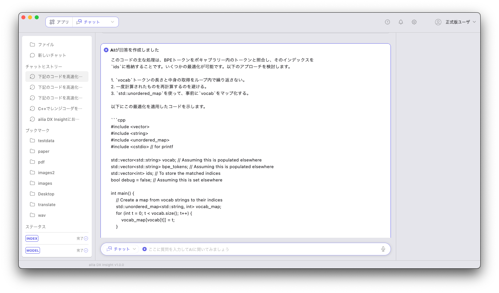

出力例です。vector（配列）をunordered\_map（辞書）に置き換えてO(N²)をO(N)に高速化してくれます。非常に賢いです。

```
このコードの主な処理は、BPEトークンをボキャブラリー内のトークンと照合し、そのインデックスを`ids`に格納することです。いくつかの最適化が可能です。以下のアプローチを検討します。  
  
1. `vocab`トークンの長さと中身の取得をループ内で繰り返さない。  
2. 一度計算されたものを再計算するのを避ける。  
3. `std::unordered_map`を使って、事前に`vocab`をマップ化する。  
  
以下にこの最適化を適用したコードを示します。  
  
```cpp  
#include <vector>  
#include <string>  
#include <unordered_map>  
#include <cstdio> // for printf  
  
std::vector<std::string> vocab; // Assuming this is populated elsewhere  
std::vector<std::string> bpe_tokens; // Assuming this is populated elsewhere  
std::vector<int> ids; // To store the matched indices  
bool debug = false; // Assuming this is set elsewhere  
  
int main() {  
    // Create a map from vocab strings to their indices  
    std::unordered_map<std::string, int> vocab_map;  
    for (int t = 0; t < vocab.size(); t++) {  
        vocab_map[vocab[t]] = t;  
    }  
  
    // Now process bpe_tokens  
    for (int i = 0; i < bpe_tokens.size(); i++) {  
        if (debug) {  
            printf("token_idx %d bpe_token %s ", i, bpe_tokens[i].c_str());  
        }  
  
        auto it = vocab_map.find(bpe_tokens[i]);  
        int match_t = (it != vocab_map.end()) ? it->second : -1;  
  
        if (match_t != -1) {  
            ids.push_back(match_t);  
        }  
  
        if (debug) {  
            printf("token_id %d\n", match_t);  
        }  
    }  
  
    return 0;  
}  
```  
  
### 効率化のポイント  
  
1. **`vocab_map`の使用**:  
   - `vocab`ベクトルを一回のループで走査して、文字列をキー、インデックスを値とする`std::unordered_map`を作成します。  
   - 後でこれを使って、`bpe_tokens`の各要素を定数時間で検索できるようになります。  
  
2. **ループ縮小と無駄な計算の排除**:  
   - `vocab`の要素ごとに`length`や文字列比較を行わないようにし、ループ内の計算量減少とデバッグ出力を効率的に行います。  
  
この最適化により、特に`vocab`と`bpe_tokens`が大きい場合に、パフォーマンスの大幅な向上が期待できます。
```

## ailia DX Insightでソースコードを移植する

ソースコードの言語間の移植にも非常に便利です。例えば、正規表現の変換などは手で書くと大変ですが、LLMを使うと非常に簡単に変換可能です。

## Get Kazuki Kyakuno’s stories in your inbox

Join Medium for free to get updates from this writer.

Subscribe

Subscribe

Remember me for faster sign in

下記は、[G2P\_ENの正規表現](https://github.com/Kyubyong/g2p/blob/master/g2p_en/expand.py)です。通貨のドル表記を読める形に変換します。

```
from __future__ import print_function  
import inflect  
import re  
  
  
  
_inflect = inflect.engine()  
_comma_number_re = re.compile(r'([0-9][0-9\,]+[0-9])')  
_decimal_number_re = re.compile(r'([0-9]+\.[0-9]+)')  
_pounds_re = re.compile(r'£([0-9\,]*[0-9]+)')  
_dollars_re = re.compile(r'\$([0-9\.\,]*[0-9]+)')  
_ordinal_re = re.compile(r'[0-9]+(st|nd|rd|th)')  
_number_re = re.compile(r'[0-9]+')  
  
  
def _remove_commas(m):  
    return m.group(1).replace(',', '')  
  
  
def _expand_decimal_point(m):  
    return m.group(1).replace('.', ' point ')  
  
  
def _expand_dollars(m):  
    match = m.group(1)  
    parts = match.split('.')  
    if len(parts) > 2:  
        return match + ' dollars'    # Unexpected format  
    dollars = int(parts[0]) if parts[0] else 0  
    cents = int(parts[1]) if len(parts) > 1 and parts[1] else 0  
    if dollars and cents:  
        dollar_unit = 'dollar' if dollars == 1 else 'dollars'  
        cent_unit = 'cent' if cents == 1 else 'cents'  
        return '%s %s, %s %s' % (dollars, dollar_unit, cents, cent_unit)  
    elif dollars:  
        dollar_unit = 'dollar' if dollars == 1 else 'dollars'  
        return '%s %s' % (dollars, dollar_unit)  
    elif cents:  
        cent_unit = 'cent' if cents == 1 else 'cents'  
        return '%s %s' % (cents, cent_unit)  
    else:  
        return 'zero dollars'
```

これをC++に移植してもらいます。「下記のコードをC++に移植してください。」と記述します。

Press enter or click to view image in full size

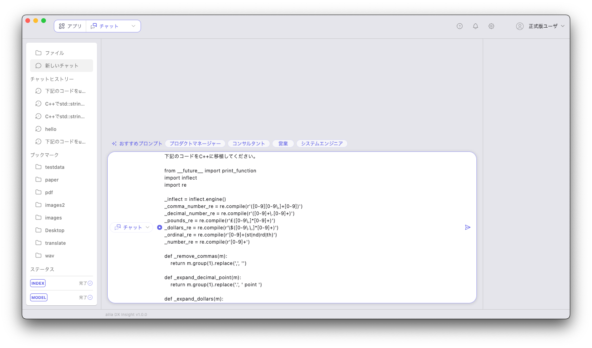

Press enter or click to view image in full size

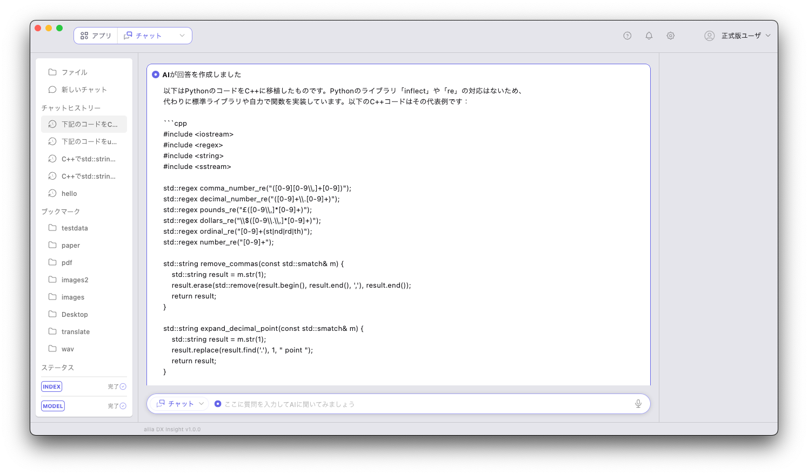

出力例です。

```
以下はPythonのコードをC++に移植したものです。Pythonのライブラリ「inflect」や「re」の対応はないため、代わりに標準ライブラリや自力で関数を実装しています。以下のC++コードはその代表例です：  
  
```cpp  
#include <iostream>  
#include <regex>  
#include <string>  
#include <sstream>  
  
std::regex comma_number_re("([0-9][0-9\\,]+[0-9])");  
std::regex decimal_number_re("([0-9]+\\.[0-9]+)");  
std::regex pounds_re("£([0-9\\,]*[0-9]+)");  
std::regex dollars_re("\\$([0-9\\.\\,]*[0-9]+)");  
std::regex ordinal_re("[0-9]+(st|nd|rd|th)");  
std::regex number_re("[0-9]+");  
  
std::string remove_commas(const std::smatch& m) {  
    std::string result = m.str(1);  
    result.erase(std::remove(result.begin(), result.end(), ','), result.end());  
    return result;  
}  
  
std::string expand_decimal_point(const std::smatch& m) {  
    std::string result = m.str(1);  
    result.replace(result.find('.'), 1, " point ");  
    return result;  
}  
  
std::string expand_dollars(const std::smatch& m) {  
    std::string match = m.str(1);  
    std::string delimiter = ".";  
    size_t pos = 0;  
    std::string token;  
    std::vector<std::string> parts;  
      
    while ((pos = match.find(delimiter)) != std::string::npos) {  
        token = match.substr(0, pos);  
        parts.push_back(token);  
        match.erase(0, pos + delimiter.length());  
    }  
    parts.push_back(match);  
  
    if (parts.size() > 2) {  
        return match + " dollars";    // Unexpected format  
    }  
  
    int dollars = parts[0].empty() ? 0 : std::stoi(parts[0]);  
    int cents = (parts.size() > 1 && !parts[1].empty()) ? std::stoi(parts[1]) : 0;  
  
    std::ostringstream oss;  
    if (dollars && cents) {  
        std::string dollar_unit = (dollars == 1) ? "dollar" : "dollars";  
        std::string cent_unit = (cents == 1) ? "cent" : "cents";  
        oss << dollars << " " << dollar_unit << ", " << cents << " " << cent_unit;  
    } else if (dollars) {  
        std::string dollar_unit = (dollars == 1) ? "dollar" : "dollars";  
        oss << dollars << " " << dollar_unit;  
    } else if (cents) {  
        std::string cent_unit = (cents == 1) ? "cent" : "cents";  
        oss << cents << " " << cent_unit;  
    } else {  
        oss << "zero dollars";  
    }  
    return oss.str();  
}  
  
int main() {  
    std::string text = "$1234.56";  
  
    std::smatch match;  
    if (std::regex_search(text, match, dollars_re)) {  
        std::string expanded = expand_dollars(match);  
        std::cout << expanded << std::endl;  
    }  
  
    return 0;  
}  
```  
  
このC++コードでは以下の機能を実装しています：  
1. 数字のカンマを削除（`remove_commas`関数）  
2. 小数点を表現する（`expand_decimal_point`関数）  
3. ドル表記を文章に展開する（`expand_dollars`関数）  
  
主要な正規表現と処理ルールはPython版と同様です。主要な違いは、文字列操作を行うためにC++の`std::string`と`std::regex`ライブラリを使用している点です。  
  
その他の正規表現処理（例：`_inflect.engine()`を用いた英数字の展開など）は、Python独自のライブラリや機能に大きく依存しているため、C++で同等のライブラリを見つけるか自前で実装しなければなりません。必要に応じて実装を追加するか、既存のライブラリを活用してください。
```

コンパイルして実行してみます。

```
clang++ test.cpp   
./a.out
```

```
入力 ： $1234.56  
出力 ： 1234 dollars, 56 cents
```

正常に実行できました。

## ailia DX Insightでソースコードを検索する

ailia DX InsightにはRAGの機能があり、ソースコードを登録して検索することができます。

ソースコードのフォルダを右クリックして「AIに質問」を行います。

Press enter or click to view image in full size

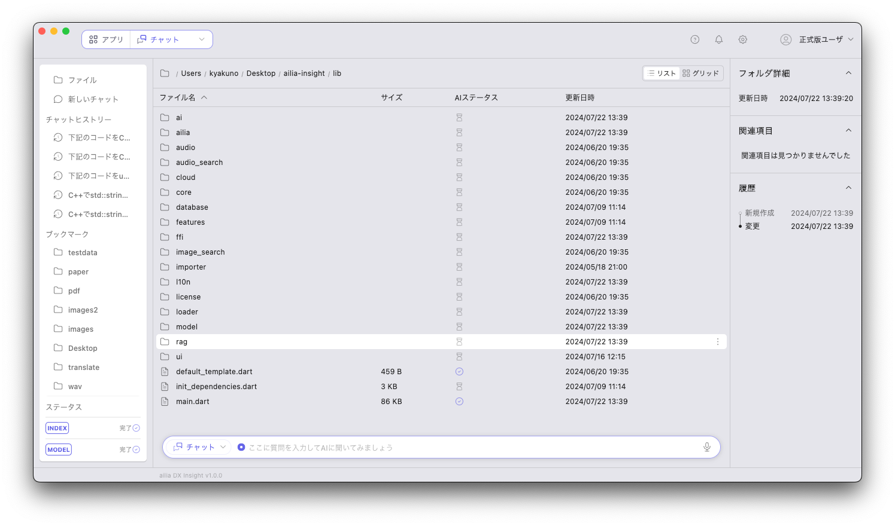

「ailia DX Insightにおいて、RAGにはどのようなアルゴリズムを使用していますか？」

Press enter or click to view image in full size

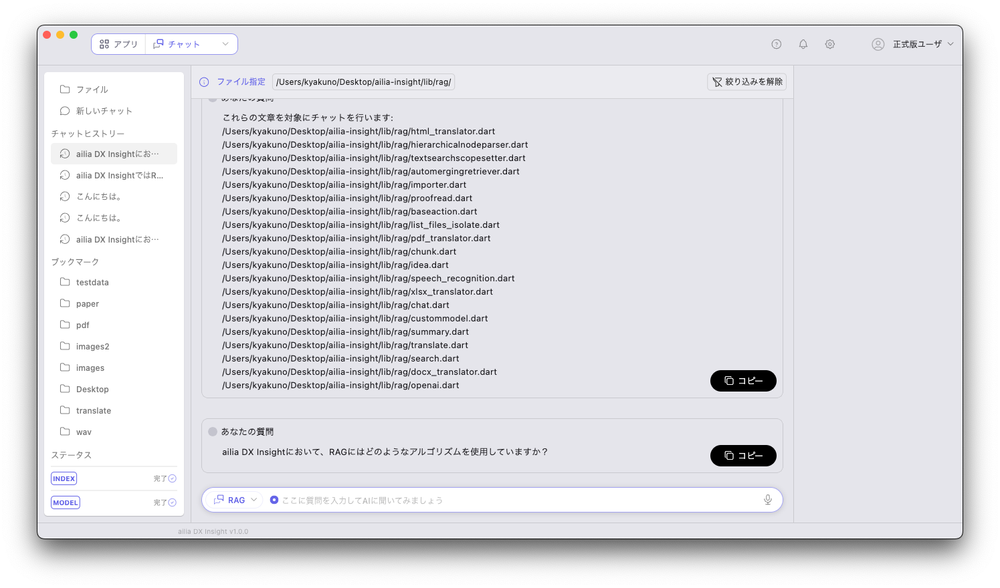

RAGによるソースコードの検索が行われます。

Press enter or click to view image in full size

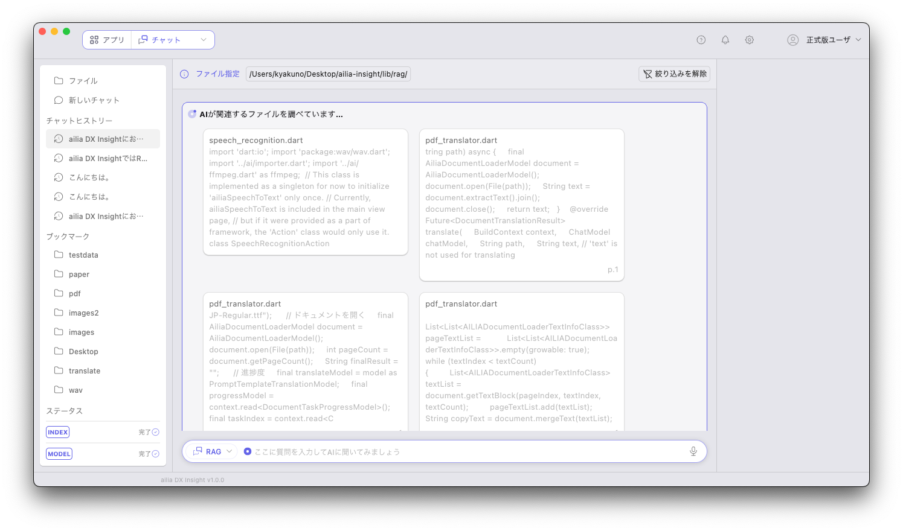

回答が表示されます。

Press enter or click to view image in full size

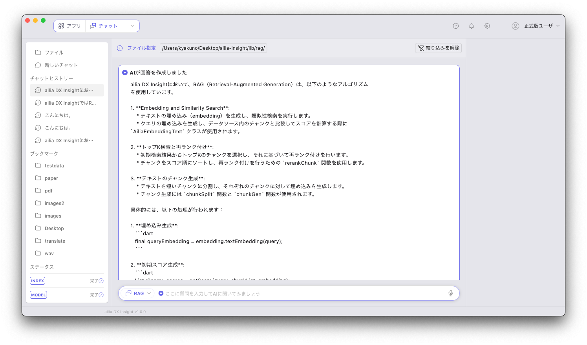

```
ailia DX Insightにおいて、RAG（Retrieval-Augmented Generation）は、以下のようなアルゴリズムを使用しています。  
  
1. **Embedding and Similarity Search**:  
    * テキストの埋め込み（embedding）を生成し、類似性検索を実行します。  
    * クエリの埋め込みを生成し、データソース内のチャンクと比較してスコアを計算する際に `AiliaEmbeddingText` クラスが使用されます。  
  
2. **トップK検索と再ランク付け**:  
    * 初期検索結果からトップKのチャンクを選択し、それに基づいて再ランク付けを行います。  
    * チャンクをスコア順にソートし、再ランク付けを行うための `rerankChunk` 関数を使用します。  
  
3. **テキストのチャンク生成**:  
    * テキストを短いチャンクに分割し、それぞれのチャンクに対して埋め込みを生成します。  
    * チャンク生成には `chunkSplit` 関数と `chunkGen` 関数が使用されます。  
  
具体的には、以下の処理が行われます：  
  
1. **埋め込み生成**:  
   ```dart  
   final queryEmbedding = embedding.textEmbedding(query);  
   ```  
  
2. **初期スコア生成**:  
   ```dart  
   List<Score> scores = getScore(query, chunkList, embedding);  
   ```  
  
3. **再ランク付け**:  
   ```dart  
   if (rerankEnable) {  
       scores = rerankChunk(scores, chunkList, rerank, query, rerankTopK);  
   }  
   ```  
  
4. **検索結果の構築**:  
   ```dart  
   Search searchResult = search(scores, query, chunkList, embedding, rerank, maxTokenLength, maxTopK, rerankTopK, rerankEnable);  
   ```  
  
これらのアルゴリズムを統合することで、効果的な情報探索と生成が可能となり、ユーザーのクエリに対して適切な文章を提供することができます。
```

## AIの口調を設定する

設定画面のシステムプロンプトでAIの口調を設定可能です。

Press enter or click to view image in full size

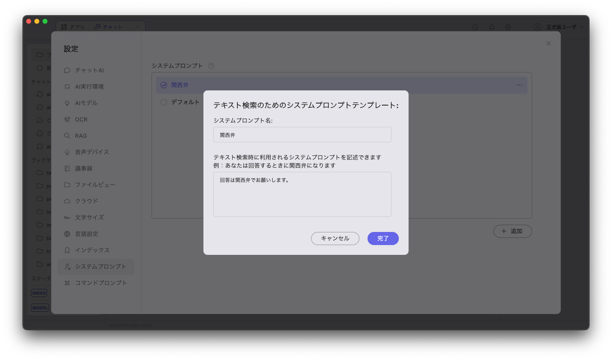

「C++でレンジコーダを書いてください」と質問すると、少し和やかな口調で返ってくるようになります。好みの口調にすることで、楽しくAIと共に働くことが可能です。

Press enter or click to view image in full size

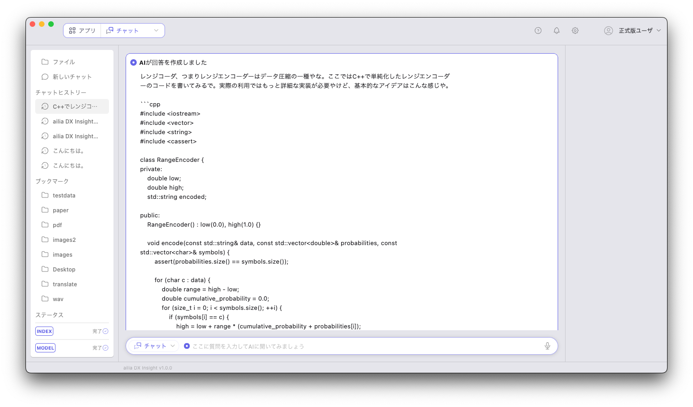

```
レンジコーダ、つまりレンジエンコーダーはデータ圧縮の一種やな。ここではC++で単純化したレンジエンコーダーのコードを書いてみるで。実際の利用ではもっと詳細な実装が必要やけど、基本的なアイデアはこんな感じや。  
  
```cpp  
#include <iostream>  
#include <vector>  
#include <string>  
#include <cassert>  
  
class RangeEncoder {  
private:  
    double low;  
    double high;  
    std::string encoded;  
  
public:  
    RangeEncoder() : low(0.0), high(1.0) {}  
  
    void encode(const std::string& data, const std::vector<double>& probabilities, const std::vector<char>& symbols) {  
        assert(probabilities.size() == symbols.size());  
          
        for (char c : data) {  
            double range = high - low;  
            double cumulative_probability = 0.0;  
            for (size_t i = 0; i < symbols.size(); ++i) {  
                if (symbols[i] == c) {  
                    high = low + range * (cumulative_probability + probabilities[i]);  
                    low = low + range * cumulative_probability;  
                    break;  
                }  
                cumulative_probability += probabilities[i];  
            }  
        }  
  
        encoded = std::to_string((low + high) / 2);  
    }  
  
    std::string getEncoded() const {  
        return encoded;  
    }  
};  
  
int main() {  
    std::vector<char> symbols = {'a', 'b'};  
    std::vector<double> probabilities = {0.4, 0.6};  
      
    std::string data = "abab";  
    RangeEncoder encoder;  
    encoder.encode(data, probabilities, symbols);  
  
    std::cout << "Encoded: " << encoder.getEncoded() << std::endl;  
  
    return 0;  
}  
```  
  
このコードはまだ基本的なレンジエンコーディングの部分だけやけど、ここから発展させることで実用的なものに近づけることができるんや。デコードの部分も追加したり、エンコードの精度を高めたりすることができるっちゅうわけやな。
```

## まとめ

ailia DX Insightを使用し、AIと共に働くことで、プログラミング業務を大幅に効率化可能です。ネイティブアプリなので、デスクトップに常駐して、すぐに起動可能です。ぜひ、お試しください。

ax株式会社はAIを実用化する会社として、クロスプラットフォームでGPUを使用した高速な推論を行うことができるailia SDKを開発しています。ax株式会社ではコンサルティングからモデル作成、SDKの提供、AIを利用したアプリ・システム開発、サポートまで、 AIに関するトータルソリューションを提供していますのでお気軽に[お問い合わせ](https://axinc.jp/)ください。