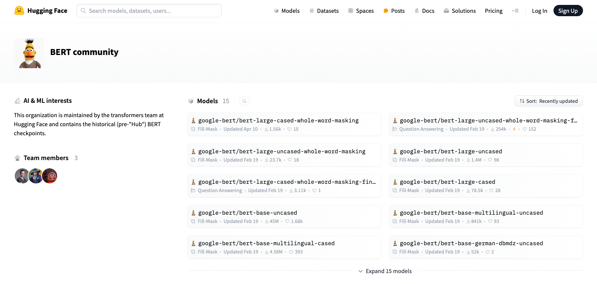

# BERT Tokenizer : 英語向けトークナイザ

# BERT Tokenizer : 英語向けトークナイザ

[](https://kyakuno.medium.com/?source=post_page---byline--7cdb86c5e035---------------------------------------)

[Kazuki Kyakuno](https://kyakuno.medium.com/?source=post_page---byline--7cdb86c5e035---------------------------------------)

6 min read

·

Aug 8, 2024

--

Share

BERT Tokenizerは言語処理モデルのBERTで使用されている、英語向けのトークナイザです。

## BERT Tokenizerについて

BERT Tokenizerは言語処理モデルのBERTで使用されている、英語向けのトークナイザです。英語のテキストを入力し、AI処理可能なトークン列に変換します。

Press enter or click to view image in full size



google-bertのリポジトリ

[## transformers/src/transformers/models/bert/tokenization\_bert.py at main · huggingface/transformers

### 🤗 Transformers: State-of-the-art Machine Learning for Pytorch, TensorFlow, and JAX. …

github.com](https://github.com/huggingface/transformers/blob/main/src/transformers/models/bert/tokenization_bert.py?source=post_page-----7cdb86c5e035---------------------------------------)

BERT TokenizerはWordPieceでサブワード分割しています。WordPieceのVocabは下記に定義されています。

[## vocab.txt · google-bert/bert-base-uncased at main

### We're on a journey to advance and democratize artificial intelligence through open source and open science.

huggingface.co](https://huggingface.co/google-bert/bert-base-uncased/blob/main/vocab.txt?source=post_page-----7cdb86c5e035---------------------------------------)

## BERT Tokenizerのアルゴリズム

BERTにはUNCASEDとCASEDがあります。UNCASEDでは、大文字と小文字を区別せず、全て小文字として扱います。CASEDでは、大文字と小文字を区別して扱います。

BERT Tokenizerでは、まず、入力された文字列を、Python標準のSplitを使用して、空白・改行・タブを区切り文字として、単語分割します。さらに、UnicodeにP属性のあるPunctuation記号（!\”#$%&’()\*+,-./:;<=>?@[\\]^\_`{|}~）でも単語分割します。

## Get Kazuki Kyakuno’s stories in your inbox

Join Medium for free to get updates from this writer.

Subscribe

Subscribe

Remember me for faster sign in

UNCASEDの場合、さらにアクセント記号の除去を行います。lower()でテキストを小文字にした後、\_run\_strip\_accentsでUnicodeのNFD変換を行い濁音を分割した後、unicodedata.categoryがMnのコードを除去することで、アクセント記号を除いたテキストに変換します。日本語が入力された場合も濁音が除去されるため、「で」が「て」に変換されます。

その後、単語に対してWordPieceを使用して、サブワードに分割します。Vocabに定義された単語リストから、貪欲な最長一致優先戦略でSubword分割が可能です。

[## transformers/src/transformers/models/bert/tokenization\_bert.py at main · huggingface/transformers

### 🤗 Transformers: State-of-the-art Machine Learning for Pytorch, TensorFlow, and JAX. …

github.com](https://github.com/huggingface/transformers/blob/main/src/transformers/models/bert/tokenization_bert.py?source=post_page-----7cdb86c5e035---------------------------------------#L361)

## BERT Tokenizerのトークナイズの例

入力するテキストを「To be or not to be, that is the question」とすると、空白とPunctuation記号で分割され、[‘to’, ‘be’, ‘or’, ‘not’, ‘to’, ‘be’, ‘,’, ‘that’, ‘is’, ‘the’, ‘question’]となります。

次に、wordpiece分割され、[2000, 2022, 2030, 2025, 2000, 2022, 1010, 2008, 2003, 1996, 3160]となります。これをデコードすると、「to be or not to be, that is the question」となります。

## ailia TokenizerからBERT Tokenizerを使用する

ax株式会社では、iOSやAndroidにも対応したトークナイザとして、ailia Tokenizerを提供しています。ailia Tokenizer 1.3以降でBERT Tokenizerを使用可能です。

[## ailia Tokenizer : UnityやC++から使用できるNLP向けトークナイザ

### UnityやC++から使用できるNLP向けトークナイザのailia Tokenizerのご紹介です。ailia Tokenizerを使用することで、Python不要で、NLPのトークナイズを行うことが可能です。

medium.com](https://medium.com/axinc/ailia-tokenizer-unity%E3%82%84c-%E3%81%8B%E3%82%89%E4%BD%BF%E7%94%A8%E3%81%A7%E3%81%8D%E3%82%8Bnlp%E5%90%91%E3%81%91%E3%83%88%E3%83%BC%E3%82%AF%E3%83%8A%E3%82%A4%E3%82%B6-b60b68c46b06?source=post_page-----7cdb86c5e035---------------------------------------)

C++によるailia TokenizerでのBERT Tokenizerの実装例です。

```
AILIATokenizer *net;  
ailiaTokenizerCreate(&net, AILIA_TOKENIZER_TYPE_BERT, AILIA_TOKENIZER_FLAG_NONE);  
ailiaTokenizerOpenVocabFile(net, "./test/gen/bert/tokenizer/vocab.txt");  
ailiaTokenizerOpenTokenizerConfigFile(net, "./test/gen/bert/tokenizer/tokenizer_config.json");  
ailiaTokenizerEncode(net, u8"To be or not to be, that is the question");  
unsigned int count;  
ailiaTokenizerGetTokenCount(net, &count);  
std::vector<int> tokens(count);  
ailiaTokenizerGetTokens(net, &tokens[0], count);  
ailiaTokenizerDestroy(net);
```

ax株式会社はAIを実用化する会社として、クロスプラットフォームでGPUを使用した高速な推論を行うことができるailia SDKを開発しています。ax株式会社ではコンサルティングからモデル作成、SDKの提供、AIを利用したアプリ・システム開発、サポートまで、 AIに関するトータルソリューションを提供していますのでお気軽に[お問い合わせ](https://axinc.jp/)ください。