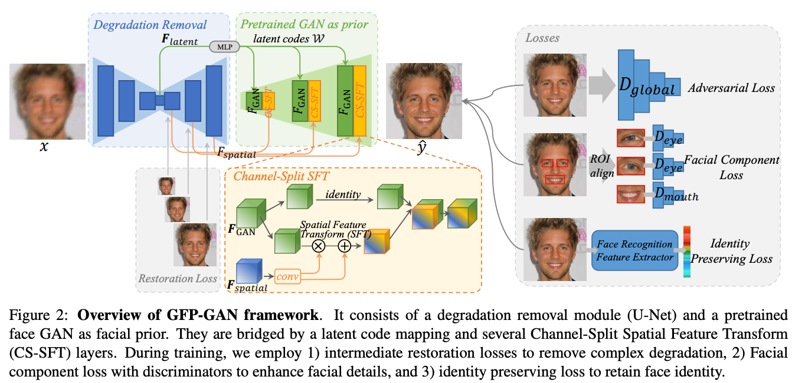
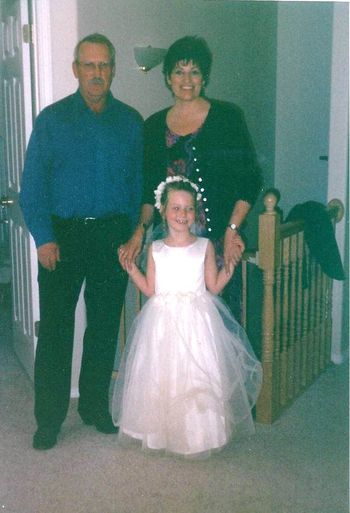
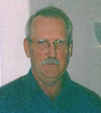
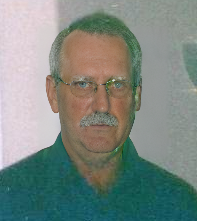

# GFPGAN : 顔画像を高画質化する機械学習モデル

# GFPGAN : 顔画像を高画質化する機械学習モデル

[](https://kyakuno.medium.com/?source=post_page---byline--547acd717086---------------------------------------)

[Kazuki Kyakuno](https://kyakuno.medium.com/?source=post_page---byline--547acd717086---------------------------------------)

7 min read

·

Nov 27, 2023

--

Share

顔画像を高画質化する機械学習モデルであるGFPGANのご紹介です。GFPGANを使用することで、劣化した顔画像から高品質な顔画像を復元可能です。

## GFPGANの概要

GFPGAN（Generative Facial Prior GAN）は低画質な顔画像を入力して高画質な顔画像を復元する機械学習モデルです。2021年1月にTencentにより発表されました。

[## GitHub - TencentARC/GFPGAN: GFPGAN aims at developing Practical Algorithms for Real-world Face…

### GFPGAN aims at developing Practical Algorithms for Real-world Face Restoration. - GitHub - TencentARC/GFPGAN: GFPGAN…

github.com](https://github.com/TencentARC/GFPGAN?source=post_page-----547acd717086---------------------------------------)

[## Towards Real-World Blind Face Restoration with Generative Facial Prior

### Blind face restoration usually relies on facial priors, such as facial geometry prior or reference prior, to restore…

arxiv.org](https://arxiv.org/abs/2101.04061?source=post_page-----547acd717086---------------------------------------)

## GFPGANのアーキテクチャ

GFPGANはBlind Face Restorationという分野に属しています。Blind Face Restorationは、低解像度やノイズ、ブラー、圧縮ノイズなどの劣化を復元するタスクです。

GFPGANは、シングルパスで、顔のディテールとカラーを補正します。

Press enter or click to view image in full size



GFPGANのアーキテクチャ（出典：<https://arxiv.org/pdf/2101.04061.pdf>）

GFPGANでは、RetinaFaceで顔を検出した後、顔の領域を補正する処理を行います。具体的に、RetinaFaceの5点のランドマークを使用し、cv2.estimateAffinePartial2Dによって[cv2.LMEDS](https://home.hiroshima-u.ac.jp/tkurita/lecture/statimage/node30.html)の反復最適化を使用したアフィン変換を行い、顔の向きの正規化を行います。

Press enter or click to view image in full size



入力画像（出典：<https://github.com/TencentARC/GFPGAN/blob/master/inputs/whole_imgs/10045.png>）


正規化された顔

顔画像が取得できたら、それぞれの顔に対して、UNetを使用してノイズ除去を行います。その後、StyleGAN2を適用することで、高精細な顔画像を復元します。

## Get Kazuki Kyakuno’s stories in your inbox

Join Medium for free to get updates from this writer.

Subscribe

Subscribe

Remember me for faster sign in

GFPGANの入力解像度は512x512です。画像はRGB順で、-1〜+1のレンジになります。


入力画像

GFPGANの出力画像の形式は入力画像と同じです。出力された顔画像を逆アフィンで変形し、境界にガウシアンブラーを付与して元画像と合成します。


境界合成用のマスク



出力画像

## GFPGANの効果

GFPGANを使用することで、ノイズ除去とディテールの追加を行うことが可能です。

Press enter or click to view image in full size


GFPGANの効果（出典：<https://arxiv.org/pdf/2101.04061.pdf>）

## StableDiffusionでの利用

Stable Diffusion WebUIには、標準機能としてGFPGANが搭載されています。具体的に、Restore facesのチェックボックスを有効にすると、顔検出とGFPGANが適用されます。

## GFPGANの使用方法

ailia SDKでGFPGANを使用するには下記のようにします。

```
$ python3 gfpgan.py --input input.jpg --savepath output.jpg
```

-mオプションを付与することで、GFPGANのバージョンを選択することが可能です。デフォルトはv1.3です。

```
$ python3 gfpgan.py --input input.jpg --savepath output.jpg -m v1.4
```

[## ailia-models/face\_restoration/gfpgan at master · axinc-ai/ailia-models

### The collection of pre-trained, state-of-the-art AI models for ailia SDK - ailia-models/face\_restoration/gfpgan at…

github.com](https://github.com/axinc-ai/ailia-models/tree/master/face_restoration/gfpgan?source=post_page-----547acd717086---------------------------------------)

出力例です。v1.3とv1.4に大きな差はなさそうです。


入力画像


GFPGAN 1.3



GFPGAN 1.4

## UnityからGFPGANを使用する

下記にUnityからGFPGANを使用するサンプルがあります。このサンプルでは、RetinaFaceではなくBlazeFaceを使用しています。

[## ailia-models-unity/Assets/AXIP/AILIA-MODELS/GenerativeAdversarialNetworks at master ·…

### Unity version of ailia models repository. Contribute to axinc-ai/ailia-models-unity development by creating an account…

github.com](https://github.com/axinc-ai/ailia-models-unity/tree/master/Assets/AXIP/AILIA-MODELS/GenerativeAdversarialNetworks?source=post_page-----547acd717086---------------------------------------)

Press enter or click to view image in full size


GFPGAN適用前

Press enter or click to view image in full size


GFPGAN適用後

ax株式会社はAIを実用化する会社として、クロスプラットフォームでGPUを使用した高速な推論を行うことができるailia SDKを開発しています。ax株式会社ではコンサルティングからモデル作成、SDKの提供、AIを利用したアプリ・システム開発、サポートまで、 AIに関するトータルソリューションを提供していますのでお気軽に[お問い合わせ](https://axinc.jp/)ください。