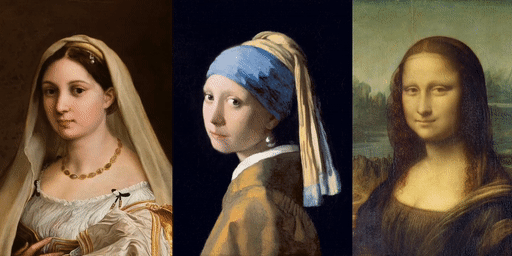
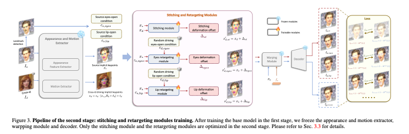

# Live Portrait : 1枚の画像を動かせるAIモデル

# Live Portrait : 1枚の画像を動かせるAIモデル

[](https://kyakuno.medium.com/?source=post_page---byline--8eaa7d3eb683---------------------------------------)

[Kazuki Kyakuno](https://kyakuno.medium.com/?source=post_page---byline--8eaa7d3eb683---------------------------------------)

7 min read

·

Nov 24, 2024

--

Share

1枚の画像を動かすことができるAIモデルであるLive Portraitを紹介します。

## Live Portraitの概要

Live Portraitは中国のショート動画プラットフォームである[KUAISHOU](https://ja.wikipedia.org/wiki/%E5%BF%AB%E6%89%8B)が2024年7月に公開したAIモデルです。1枚の画像の表情を非常に滑らかに動かすことが可能です。



出典：<https://github.com/KwaiVGI/LivePortrait>

[## GitHub - KwaiVGI/LivePortrait: Bring portraits to life!

### Bring portraits to life! Contribute to KwaiVGI/LivePortrait development by creating an account on GitHub.

github.com](https://github.com/KwaiVGI/LivePortrait?source=post_page-----8eaa7d3eb683---------------------------------------)

[## LivePortrait: Efficient Portrait Animation with Stitching and Retargeting Control

### Portrait Animation aims to synthesize a lifelike video from a single source image, using it as an appearance reference…

arxiv.org](https://arxiv.org/abs/2407.03168?source=post_page-----8eaa7d3eb683---------------------------------------)

## Live Portraitのアーキテクチャ

近年、GANやDiffusionで、さまざまなポートレート画像のアニメーションが行えるようになっています。従来のDiffusionベースのモデルは、品質面は高いものの、計算コストが高いという問題があります。また、Diffusionではない、アルゴリズムベースの方法では、キーポイントとOptical Flowによって中間画像を生成するため高速ですが、品質が低いという課題があります。

Live Portraitは、Diffusionベースではない、アルゴリズムベースの手法を基本としながら、アルゴリズムのモジュールをAI化することで高品質化します。従来のDiffusionベースのモデルに比べて非常に高速に動作し、RTX4090上で1フレームにつき128msで推論可能です。

アルゴリズムベースの手法は、入力画像からキーポイントを計算し、入力画像のキーポイントと出力画像のキーポイントからOptical Flowを計算するWarping Moduleと、入力画像とOptical Flowから画像を生成するDecoder Moduleで構成されています。Warping ModuleとDecoder Moduleはアルゴリズムで記載されています。Live Portraitは、このWarping ModuleとDecoder ModuleをアルゴリズムからAIモデルに置き換えています。

Press enter or click to view image in full size


ベースモデルの学習（出典：<https://arxiv.org/abs/2407.03168>）

Live Portraitでは、ベースモデルとしてface vid2vidを採用しています。入力画像Isから、出力画像Idを得るため、Isからキーポイントであるxsと、Idからキーポイントであるxdを取得し、xsとxdを入力としてOptical Flowのような潜在表現を出力するWarping Moduleと、潜在表現から画像を得るためのDecoderを学習します。

Press enter or click to view image in full size



セカンドステージモデルの学習（出典：<https://arxiv.org/abs/2407.03168>）

セカンドステージモデルでは、Live Portrait独自の手法として、さらに、ウィンクなどの目の動きや、口の動きなど、微表情を捉える特徴量を追加しています。

## Get Kazuki Kyakuno’s stories in your inbox

Join Medium for free to get updates from this writer.

Subscribe

Subscribe

Remember me for faster sign in

Live Portraitは、face vid2vidよりも大規模な、6900万枚の画像を使用して学習されています。ベースモデルの学習には8枚のNVIDIA A100 GPUを使用しており、10日間で学習しています。セカンドステージモデルは、2日間で学習しています。入力画像のサイズは256x256、出力画像のサイズは512x512です。

## Live Portraitの使用方法

ailia SDKでLive Portraitを仕様するには下記のコマンドを使用します。キャラクターの画像は-iオプションで与えます。WEBカメラの顔から画像をリアルタイムに操作するには、 — driving 0を指定します。

```
$ python3 live_portrait.py -i s6.jpg --driving 0
```

[## ailia-models/generative\_adversarial\_networks/live\_portrait at master · axinc-ai/ailia-models

### The collection of pre-trained, state-of-the-art AI models for ailia SDK …

github.com](https://github.com/axinc-ai/ailia-models/tree/master/generative_adversarial_networks/live_portrait?source=post_page-----8eaa7d3eb683---------------------------------------)

デフォルトではInsight Faceを使用します。 — det facemeshでFace Meshを使用することも可能です。

```
$ python3 live_portrait.py -i s6.jpg --driving 0 --det facemsh
```

LivePortraitはMITライセンスですが、Insight FaceのモデルはNonCommercialPurposeOnlyとなっているため、商用利用を検討されている場合はFaceMeshを使用してください。

```
The code of InsightFace is released under the MIT License.  
The models of InsightFace are for non-commercial research purposes only.  
  
If you want to use the LivePortrait project for commercial purposes, you   
should remove and replace InsightFace’s detection models to fully comply with   
the MIT license.
```

[## LivePortrait/LICENSE at main · KwaiVGI/LivePortrait

### Bring portraits to life! Contribute to KwaiVGI/LivePortrait development by creating an account on GitHub.

github.com](https://github.com/KwaiVGI/LivePortrait/blob/main/LICENSE?source=post_page-----8eaa7d3eb683---------------------------------------)

ax株式会社はAIを実用化する会社として、クロスプラットフォームでGPUを使用した高速な推論を行うことができるailia SDKを開発しています。ax株式会社ではコンサルティングからモデル作成、SDKの提供、AIを利用したアプリ・システム開発、サポートまで、 AIに関するトータルソリューションを提供していますのでお気軽に[お問い合わせ](https://axinc.jp/)ください。