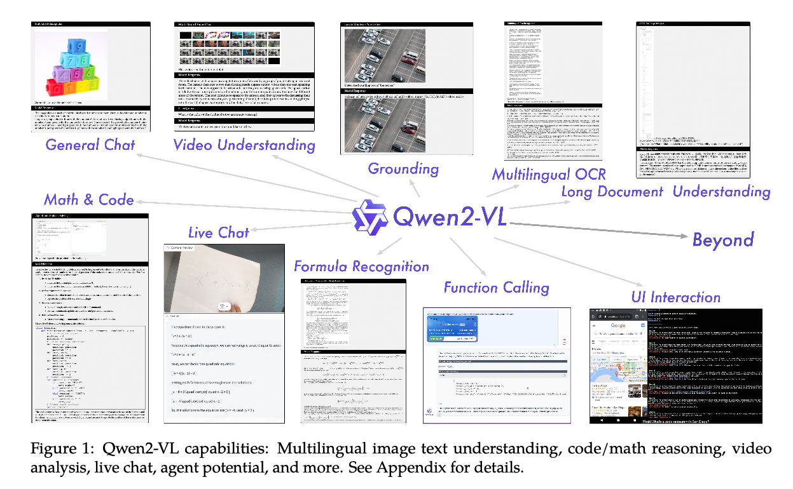
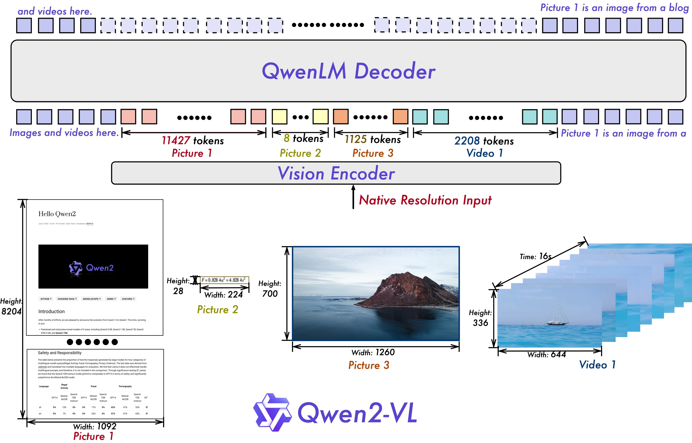
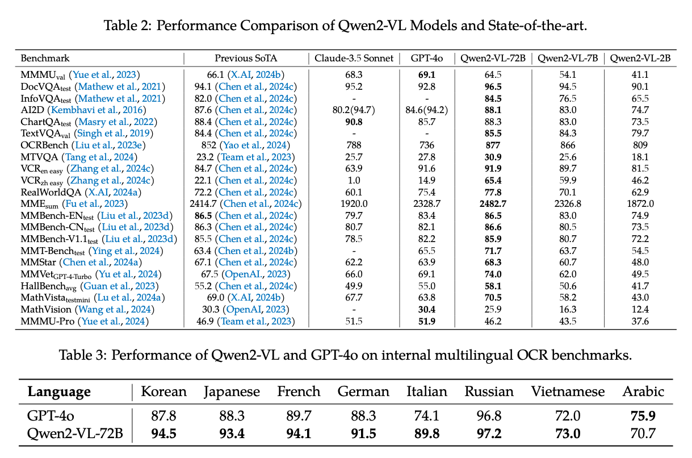
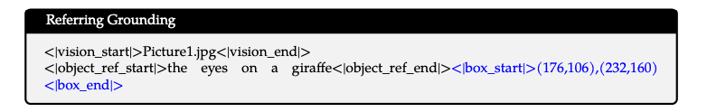
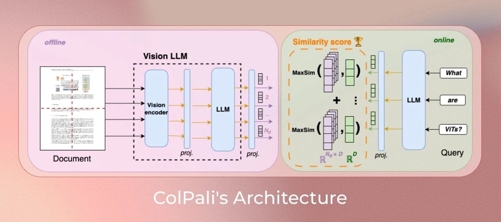

# Qwen2-VL : ローカルで動作するVision Language Model

# Qwen2-VL : ローカルで動作するVision Language Model

[](https://kyakuno.medium.com/?source=post_page---byline--b6f75fa30a08---------------------------------------)

[Kazuki Kyakuno](https://kyakuno.medium.com/?source=post_page---byline--b6f75fa30a08---------------------------------------)

11 min read

·

Nov 20, 2024

--

Share

ローカルで動作するVision Language ModelであるQwen2-VLのご紹介です。Qwen2-VLを使用することで、ローカル環境で画像に対して質問することが可能です。

## Qwen2-VLの概要

Qwen2-VLはAlibabaが2024年10月に公開したVision Language Modelです。2B、7B、72Bの3つのモデルが提供されており、GPT-4oの画像認識モードと同様に、画像に対してテキストで質問することが可能です。

応用例としては、多言語画像テキスト理解、コード/数学推論、ビデオ分析、ライブチャット、エー ジェントが挙げられています。

従来、OSSのVision Language Modelとしては[LLAVA](https://medium.com/axinc/llava-%E7%94%BB%E5%83%8F%E3%81%AB%E5%AF%BE%E3%81%97%E3%81%A6%E8%B3%AA%E5%95%8F%E3%81%A7%E3%81%8D%E3%82%8B%E5%A4%A7%E8%A6%8F%E6%A8%A1%E8%A8%80%E8%AA%9E%E3%83%A2%E3%83%87%E3%83%AB-6ede836f2bed)が使用されていましたが、最小のモデルサイズが7Bとやや大きく、日本語にも対応していないという課題がありました。Qwen2-VLは2Bという比較的、小さなモデルで、日本語が使用可能です。

Press enter or click to view image in full size



[## GitHub - QwenLM/Qwen2-VL: Qwen2-VL is the multimodal large language model series developed by Qwen…

### Qwen2-VL is the multimodal large language model series developed by Qwen team, Alibaba Cloud. - QwenLM/Qwen2-VL

github.com](https://github.com/QwenLM/Qwen2-VL?source=post_page-----b6f75fa30a08---------------------------------------)

## Qwen2-VLのアーキテクチャ

Qwen2-VLでは、入力画像をトークン化し、プロンプトのテキストと合わせてVision Encoderで潜在表現に変換した後、QwenLM Decoderに投入します。ビデオにも対応しており、ビデオの場合は、最大30フレームをまとめてトークン化します。

Press enter or click to view image in full size



出典：<https://github.com/QwenLM/Qwen2-VL>

従来のVLMは、

・入力画像を固定された解像度でエンコードしている  
・Vision EncoderにCLIPを使用している

という課題があり、Qwen2-VLでは、

・入力解像度をそのまま扱う（RoPEで位置情報を埋め込む）  
・Vision EncoderにViTを使用して学習対象とする

ことで、高精度化を行っています。

Qwen2-VLの学習においては、第一段階としてViTをトレーニングします。第二段階では、LLMを含むすべてのパラメータを学習します。最終段階では、ViTのパラメータを固定し、Instruction Datasetを使用して、Instruction チューニングを行います。

事前学習では、6000億トークンを使用します。LLMは、Qwen2のパラメータで初期化されます。第二段階では、画像関連のデータを追加で8000億トークン扱います。累計で、1.4兆トークンを扱います。

## Qwen2-VLの性能

Qwen2-VL-72BはGPT-4oよりも高い性能を持っています。

Press enter or click to view image in full size



出典：<https://github.com/QwenLM/Qwen2-VL>

2B、7B、72Bのモデルの性能の比較です。72Bが最も高精度ですが、2Bでも良好な性能を持っています。

Press enter or click to view image in full size


出典：<https://github.com/QwenLM/Qwen2-VL>

Qwen2-VL-2Bは、最も効率的なモデルで、ほとんどのシナリオに対して十分なパフォーマンスを提供します。7Bは、テキスト認識とビデオ理解能力が大幅に向上しています。72Bは、指示の遵守、意思決定、エージェントの能力でさらに改善をもたらします。

## Get Kazuki Kyakuno’s stories in your inbox

Join Medium for free to get updates from this writer.

Subscribe

Subscribe

Remember me for faster sign in

Vision Encoderのパラメータ数は675Mで固定であるため、画像の認識性能は、モデルパラメータに依存せず高くなっています。そのため、OCRなどのタスクでは、2Bでも高い性能を得ることが可能です。

Press enter or click to view image in full size


出典：<https://github.com/QwenLM/Qwen2-VL>

## Qwen2-VLのプロンプトテンプレート

Qwen2-VLでは、<|vision\_start|>と<|vision\_end|>というSpecial Tokenを使用します。対話では、<|im\_start|>を使用します。Bounding Boxの符号化には、<|box\_start|>と<|box\_end|>を使用します。Bounding BoxとCaptionをリンクするため、<|object\_ref\_start|>と<|object\_ref\_end|>を使用します。

Press enter or click to view image in full size



出典：<https://github.com/QwenLM/Qwen2-VL>

サンプルを実行した際のプロンプトです。<|image\_pad|>は画像をトークン化した値に置き換わり、Vision Encoderに供給されます。

```
<|im_start|>system  
You are a helpful assistant.<|im_end|>  
<|im_start|>user  
<|vision_start|><|image_pad|><|vision_end|>Describe this image.<|im_end|>  
<|im_start|>assistant
```

入力トークンが(1, 913)の場合、Vision Encoderの出力は(1, 913, 1536)になります。これを、QwenLM Decoderに入力し、テキストを得ます。

## Qwen2-VLのトークナイザ

Qwen2-VLでは、トークナイザとしてQwen2Tokenizerを使用します。Qwen2TokenizerとGPT2Tokenizerは同じBPEベースの手法で、GPT2Tokenizerと互換性があります。

## Qwen2-VLを実行する

ailia SDK（1.5以降）でQwen2-VLを実行するには下記のコマンドを使用します。2Bモデルで、モデルサイズは10GB (FP32) です。promptには日本語も使用可能です。

```
$ python3 qwen2_vl.py --input demo.jpeg --prompt "Describe this image."
```

[## ailia-models/vision\_language\_model/qwen2\_vl at master · axinc-ai/ailia-models

### The collection of pre-trained, state-of-the-art AI models for ailia SDK - ailia-models/vision\_language\_model/qwen2\_vl…

github.com](https://github.com/axinc-ai/ailia-models/tree/master/vision_language_model/qwen2_vl?source=post_page-----b6f75fa30a08---------------------------------------)

M2 MacのCPUで推論した場合、画像のEmbedding（1024x683）で23sec程度、テキストの生成で42sec程度必要です。画像のEmbeddingの処理時間は画像の解像度に依存し、テキストの生成はあまり依存しません。

モデルサイズを削減した、FP16版のONNXも提供しています。FP16版を使用するには、 — fp16オプションを使用してください。

```
$ python3 qwen2_vl.py --input demo.jpeg --prompt "Describe this image." --fp16
```

Qwen2-VLは、llama.cppでは動作せず、[Issue #9426](https://github.com/ggerganov/llama.cpp/issues/9246)で対応が進められています。（2024年11月20日現在）

## Qwen2-VLの実行例

Qwen2-VLで画像に対してクエリをする例です。クエリでは、日本語も使用可能です。また、日本語のOCRも可能です。

Press enter or click to view image in full size


出典：https://qianwen-res.oss-cn-beijing.aliyuncs.com/Qwen-VL/assets/demo.jpeg

### Describe this image.

The image depicts a serene beach scene with a woman and a dog. The woman is sitting on the sand, wearing a plaid shirt and black pants, and appears to be smiling. She is giving a high-five to the dog, which is sitting on the sand next to her. The dog is wearing a colorful harness and appears to be wagging its tail. The background shows the ocean with gentle waves, and the sky is clear with a soft glow, suggesting either sunrise or sunset. The overall atmosphere is peaceful and joyful.

### この画像を説明して。

この画像には、ビーチで笑顔の女性と犬が描かれています。女性は黒いシャツを着ており、犬は黄色い毛の犬種の犬で、背中には青いラインがついています。犬は女性の手を握りしめ、一緒に笑顔をしています。ビーチは砂浜で、海が見える場所です。日は夕方の光が照り付いており、空は晴れています。

Press enter or click to view image in full size


出典：<https://ailia.ai/>

### この画像を説明して。

この画像は、AI専門メディア「ailia.ai」のロゴです。背景はピンクと黄色のグラデーションで、右上に「ailia.ai」の文字が表示されています。右下には「AIで、しごとをするなら」のメッセージが表示されています。このメッセージは、AIを活用してさまざまな業務を効率的に行うことを示しています。右下の「AI専門メディア」の文字は、ailia.aiが提供するAIに関する情報を提供するメディアのことを示しています。

### この画像の文字を抽出して。

AIで、しごとをするなら  
活用・開発・導入を加速させるための  
AI専門メディア

## Qwen2-VLの応用

Qwen2-VLのVision Encoderの出力をプロジェクションした特徴量を使用してPDFのRAGを行い、該当ページの画像に対して、Qwen2-VLのPromptで質問を行い、回答を行うという、ColQwen2が提案されています。従来のRAGはすべてテキストベースで処理するため、図表を扱うことが難しいという課題がありましたが、Qwen2-VLを使用したColPaliを使用することで、すべて画像ベースで扱うことで、この問題を解決しようというアプローチになります。

Press enter or click to view image in full size



出典：<https://huggingface.co/vidore/colqwen2-v0.1>

[## vidore/colqwen2-v0.1 · Hugging Face

### We're on a journey to advance and democratize artificial intelligence through open source and open science.

huggingface.co](https://huggingface.co/vidore/colqwen2-v0.1?source=post_page-----b6f75fa30a08---------------------------------------)

ax株式会社はAIを実用化する会社として、クロスプラットフォームでGPUを使用した高速な推論を行うことができるailia SDKを開発しています。ax株式会社ではコンサルティングからモデル作成、SDKの提供、AIを利用したアプリ・システム開発、サポートまで、 AIに関するトータルソリューションを提供していますのでお気軽に[お問い合わせ](https://axinc.jp/)ください。