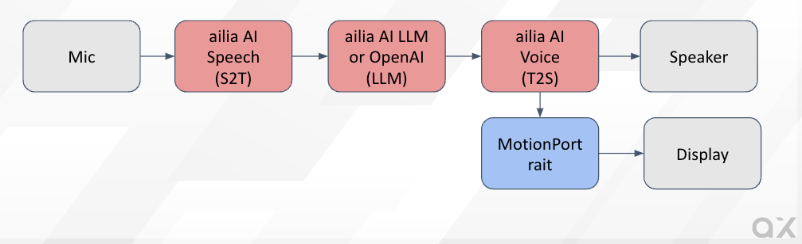
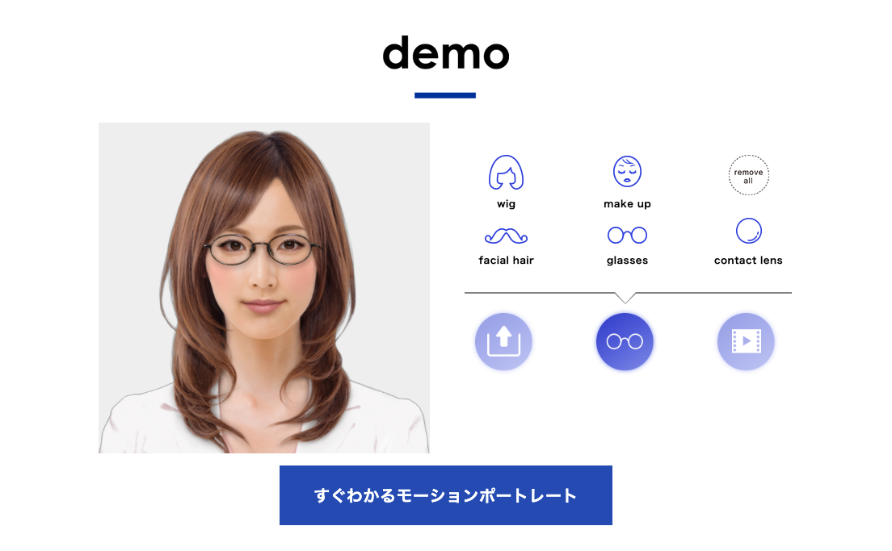
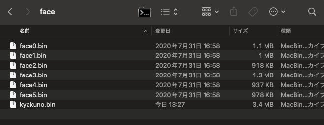

# MotionPortrait : LLMと合わせて使えるaxのアバターソリューション

# MotionPortrait : LLMと合わせて使えるaxのアバターソリューション

[](https://kyakuno.medium.com/?source=post_page---byline--ea5d940ead03---------------------------------------)

[Kazuki Kyakuno](https://kyakuno.medium.com/?source=post_page---byline--ea5d940ead03---------------------------------------)

21 min read

·

Nov 25, 2024

--

Share

LLMと合わせて使えるaxのアバターソリューションであるMotionPortraitのご紹介です。

## MotionPortraitの概要

MotionPortraitは、1枚の画像から簡単にアバターを生成できるソリューションです。近年、LLMを使用してアバターとの対話が実現できるようになりましたが、テキストだけだとシンプルなため、同時にアバターを表示したいというニーズが高まっています。

ax株式会社の提供するMotionPortraitを使用することで、1枚の画像からアバターを生成し、簡単に表示可能です。MotionPortraitは非常に軽量で、ブラウザやモバイルデバイスで実行可能です。

Press enter or click to view image in full size


Motion Portraitの実行例

[## モーションポートレート株式会社

### モーションポートレート株式会社のホームページ。モーションポートレート技術を紹介しています。

www.motionportrait.com](https://www.motionportrait.com/indexj.php?source=post_page-----ea5d940ead03---------------------------------------)

ax株式会社では、ailia AI Speechの音声認識、ailia AI Voiceの音声合成、Open AIやailia LLMによる対話生成と合わせて、MotionPortraitを使用することで、一貫したアバターソリューションを提供しています。

Press enter or click to view image in full size



Avatar Solution

## MotionPortraitの提供する機能

MotionPortraitは下記の機能を提供します。

・1枚の画像からアバターの生成  
・アバターの描画  
・アニメーション再生  
・表情変化  
・リップシンク  
・アイテム付加（髪、帽子、眼鏡など）  
・化粧

## MotionPortraitの使用例

ailia.aiのサイトのチャットボットのアバターに使用しています。右下に、アニメーション可能なアバターを、MotionPortraitを使用して表示しています。ブラウザで非常に軽量に動作します。

Press enter or click to view image in full size


[## ailia AI Series

### 株式会社アクセルのAI製品サイトです。「AIは、人を自由にする。」を胸に、先進のAI技術を開発・提供する国産のAIトータルソリューションです。世界最速クラスの推論エンジン「ailia SDK（アイリア…

ailia.ai](https://ailia.ai/?source=post_page-----ea5d940ead03---------------------------------------)

MotionPortraitのトップページでもメガネの試着やバーチャル化粧を含めたテストが可能です。

Press enter or click to view image in full size



[## MotionPortrait, Inc.

### MotionPortrait, Inc. web site. Introduction to MotionPortrait technology.

www.motionportrait.com](https://www.motionportrait.com/?source=post_page-----ea5d940ead03---------------------------------------)

## MotionPortraitの採用実績

MotionPortraitは、涼宮ハルヒの憂鬱のPSP版やアプリ版や、神次元ゲイム ネプテューヌのキャラクターアニメーションに採用されています。他、様々なゲームやTV番組で使用されています。

[## モーションポートレート、iPhoneアプリ『涼宮ハルヒのあにポケ』の無償提供と、『長門有希のあにポケ』、『朝比奈みくるのあにポケ』の発売を開始

### ソニーネットワークコミュニケーションズ株式会社のプレスリリース（2011年7月7日…

prtimes.jp](https://prtimes.jp/main/html/rd/p/000000743.000000196.html?source=post_page-----ea5d940ead03---------------------------------------)

[## 【PSP】涼宮ハルヒの約束 モーションポートレートサンプル【ハルヒver.】

### 【PSP】涼宮ハルヒの約束 モーションポートレートサンプル【ハルヒver.】 PS2のハルヒもいいが、PSPのハルヒの方が世界初のモーションポートレート技術の採用とか、何気に凄...

www.nicovideo.jp](https://www.nicovideo.jp/watch/sm1015377?source=post_page-----ea5d940ead03---------------------------------------)

[## ポストエフェクトミドルウェア『YEBIS 2』とモーションポートレート搭載の開発ツール『MPEditor』、PS3(R)用ゲームソフト『神次元ゲイム ネプテューヌＶ』に採用

### ポストエフェクトミドルウェア『YEBIS 2』とモーションポートレート搭載の開発ツール『MPEditor』、PS3(R)用ゲームソフト『神次元ゲイム ネプテューヌＶ』に採用。ミドルウェアがグラフィックスの強化をサポート

www.siliconstudio.co.jp](https://www.siliconstudio.co.jp/news/pressreleases/2012/1209yebis.html?source=post_page-----ea5d940ead03---------------------------------------)

## MotionPortraitの使用方法

### アバターの生成

アバターを生成するには、ブラウザ向けのアバター生成ツールを使用します。アバター生成ツールに画像をアップロードするだけで、自動的にアバターを生成可能です。

## Get Kazuki Kyakuno’s stories in your inbox

Join Medium for free to get updates from this writer.

Subscribe

Subscribe

Remember me for faster sign in

画像をアップロードすると、特徴点の編集画面になります。人物の場合は自動で特徴点を検出しますので、必要があれば調整してください。また、アバターの解像度をtexsizeで設定可能です。最後に、Generate Avatarを押して、アバターのbinファイルをダウンロードします。

Press enter or click to view image in full size


MotionPortraitは動物にも対応しています。動物の場合、特徴点がうまく検出できない場合があるため、その場合、特徴点を手動で調整してください。

Press enter or click to view image in full size


注意事項として、アルファ付きのPNGを使用した場合、アルファ値をキャラクターの輪郭として使用します。そのため、アルファ付きで背景が全て255の画像を与えた場合、正方形のキャラクター画像が生成されます。キャラクターの輪郭を自動で推定させたい場合は、JPEGなど、アルファなしの画像を与えてください。また、より高精度なアバターを作成した場合は、アルファチャンネルにキャラクターのマスク値を含めてください。

### アバターの利用

アバターを利用するには、Motion Portrait SDKを使用します。

**WebGLのサンプル**

ブラウザ向けでは、mpsdk/sample.WebGL/で下記のコマンドでWEBサーバを立ち上げます。

```
python3 -m http.server 8000
```

アバターのbinファイルは下記に配置します。

```
mpsdk/sample.WebGL/Web/sample/mpviewer/items/face
```



アバターのbinファイルのリストは、js/mp\_fileio.jsに追加します。

```
var faceFiles = ["web_version.bin", "kyakuno.bin", "face0.bin", "face1.bin", "face2.bin", "face3.bin", "face4.bin", "face5.bin"];
```

ブラウザでアクセスすることで、アニメーションを実行可能です。

> <http://localhost:8000/Web/sample/mpviewer/>

実際のコードはmp\_demo.jsに記載されています。音声ファイルからのリップシンクも、しゃべらせたいmp3ファイルを指定するだけの、非常に簡単なコードで実装可能です。

```
function onVoiceStart() {  
    if (voiceFiles == undefined || voiceFiles == null || voiceFiles.length <= 0)  
        return;  
    var typevoice = 2;  
    var isPlaying = mpwebgl.instance.isanimplaying(typevoice);  
    if (isPlaying == typevoice) {  
        mpwebgl.instance.pauseaudio();  
        mpwebgl.instance.unloadanimation();  
        mpwebgl.instance.destroyvoice();  
        return;  
    }  
    var voiceId = mpwebgl.instance.loadvoice('items/voice/' + voiceFiles[voiceIndex]);  
    if (voiceId > 0) {  
        if (++voiceIndex == voiceFiles.length)  
            voiceIndex = 0;  
    }  
    else  
        console.error("load voice fail");  
}
```

**C++のサンプル**

ネイティブアプリ向けでは、C++のAPIを提供しています。下記は、アバターをOpenGLを使用してレンダリングするサンプルプログラムです。アバターファイルをMpFaceに読み込み、MpRenderにアバターを設定し、OpenGLの描画ループでDrawを呼び出すことで描画可能です。

```
#include <OpenGL/gl.h>  
#include "mprender.h"  
#include "mpface.h"  
#include "mpctlanimation.h"  
#include "mpctlitem.h"  
#include "mpctlspeech.h"  
#include "mpcosme.h"  
  
#include <time.h>  
#include <sys/timeb.h>  
#include <stdio.h>  
#include <opencv2/opencv.hpp>  
  
#include <GLUT/GLUT.h>  
  
const GLfloat lightPosition1[4] = {0.0f,3.0f, 5.0f, 1.0f};  
const GLfloat green[] = { 0.0, 1.0, 0.0, 1.0 };  
const GLfloat lightPosition2[4] = {5.0f,3.0f, 0.0f, 1.0f};  
const GLfloat red[] = { 1.0, 0.0, 0.0, 1.0 };  
  
const GLfloat teapotAmbient[4] = {0.3f,0.5f, 0.0f, 1.0f};  
const GLfloat teapotDiffuse[4] = {1.0f,1.0f, 0.3f, 1.0f};  
const GLfloat teapotSpecular[4] = {1.0f,1.0f, 1.0f, 1.0f};  
const GLfloat teapotShininess[4] = {20.0f};  
  
void setup(void) {  
   glClearColor(0.0f, 0.0f, 0.0f, 1.0f);  
   glEnable(GL_DEPTH_TEST);  
   glEnable(GL_LIGHTING);  
   glEnable(GL_LIGHT0);  
   glEnable(GL_LIGHT1);  
     
   glLightfv(GL_LIGHT0, GL_POSITION, lightPosition1);  
   glLightfv(GL_LIGHT0, GL_DIFFUSE, red);  
   glLightfv(GL_LIGHT0, GL_SPECULAR, red);  
   glLightfv(GL_LIGHT1, GL_POSITION, lightPosition2);  
   glLightfv(GL_LIGHT1, GL_DIFFUSE, green);  
   glLightfv(GL_LIGHT1, GL_SPECULAR, green);  
   glMaterialfv(GL_FRONT, GL_AMBIENT, teapotAmbient);  
   glMaterialfv(GL_FRONT, GL_DIFFUSE, teapotDiffuse);  
   glMaterialfv(GL_FRONT, GL_SPECULAR, teapotSpecular);  
   glMaterialfv(GL_FRONT, GL_SHININESS, teapotShininess);  
}  
  
void resize(int width, int height) {  
   glViewport(0, 0, width, height);  
   glMatrixMode(GL_PROJECTION);  
   glLoadIdentity();  
   gluPerspective(45.0,  
                  (double)width/height,  
                  0.1,  
                  100.0);  
   glMatrixMode(GL_MODELVIEW);  
   glLoadIdentity();  
   gluLookAt(-0.5, 2.1, 2.0,  
             0.0, 0.0, 0.0,  
             0.0, 4.0, 0.0);  
}  
  
class mpView {  
    bool isFaceLoaded_;  
    long animStartTime_;  
  
    // MP instance  
    motionportrait::MpRender *render_;  
    motionportrait::MpFace   *face_;  
    motionportrait::MpCosme  *cosme_;  
  
    // MP controller  
    motionportrait::MpCtlAnimation *ctlAnim_;  
  
    motionportrait::MpCtlSpeech    *ctlSpeech_;  
    motionportrait::MpCtlSpeech::VoiceId voice_;  
    motionportrait::MpCtlItem      *ctlGlasses_;  
    motionportrait::MpCtlItem::ItemId glasses_;  
    motionportrait::MpCtlItem      *ctlHair_;  
    motionportrait::MpCtlItem::ItemId hair_;  
  
    //NSMutableArray *beardID_;  
  
    // cosme ID  
    motionportrait::MpCosme::CosmeId cosmeIdEye_;  
    motionportrait::MpCosme::CosmeId cosmeIdCheek_;  
    motionportrait::MpCosme::CosmeId cosmeIdLip_;  
  
    motionportrait::MpCtlAnimation::AnimDataId animData_;  
  
    motionportrait::mpVector2 eyesCenter_;  
  
public:  
  
bool initMPRenderer(void) {  
  
    // MpRender::Init() must be called before any MP functions  
    render_ = new motionportrait::MpRender();  
    render_->Init();  
  
    int width = 640;  
    motionportrait::mpRect viewport = {0, 0, width, width};  
    render_->SetViewport(viewport);  
  
    // initialize MpFace instance  
    face_ = new motionportrait::MpFace();  
  
    // init cosme  
    cosme_ = new motionportrait::MpCosme();  
    cosmeIdEye_ = NULL;  
    cosmeIdCheek_ = NULL;  
    cosmeIdLip_ = NULL;  
  
    // get controllers  
    ctlSpeech_ = face_->GetCtlSpeech();  
    ctlAnim_ = face_->GetCtlAnimation();  
    ctlGlasses_ = face_->GetCtlItem(motionportrait::MpFace::ITEM_TYPE_GLASSES);  
    ctlHair_ = face_->GetCtlItem(motionportrait::MpFace::ITEM_TYPE_HAIR);  
  
    return true;  
}  
  
bool loadFace(const char *face) {  
    if (face_->Load(face)) {  
        printf("can't load specied face");  
        return false;  
    }  
  
    // set face to renderer  
    render_->SetFace(face_);  
  
    // set neck rotation parameters  
    motionportrait::MpCtlAnimation *anim = face_->GetCtlAnimation();  
    anim->SetParamf(motionportrait::MpCtlAnimation::NECK_X_MAX_ROT, 2.0f);  
    anim->SetParamf(motionportrait::MpCtlAnimation::NECK_Y_MAX_ROT, 2.0f);  
    anim->SetParamf(motionportrait::MpCtlAnimation::NECK_Z_MAX_ROT, 0.3f);  
  
    // calculate eyes center position  
    motionportrait::MpFace::PartsPosition partsPos;  
    motionportrait::MpFace::GetPartsPosition(face, partsPos);  
    eyesCenter_.x = (partsPos.eyeLeft.x + partsPos.eyeRight.x) / 2;  
    eyesCenter_.y = (partsPos.eyeLeft.y + partsPos.eyeRight.y) / 2;  
  
    return true;  
}  
  
  
bool startAnimation(const char *animation) {  
    stopAnimation();  
    animData_ = ctlAnim_->CreateAnimation(animation);  
    if (animData_) {  
        animStartTime_ = getmsec();  
        return true;  
    } else {  
        return false;  
    }  
}  
  
void stopAnimation(void) {  
    if (animData_) {  
        ctlAnim_->DestroyAnimation(animData_);  
        animData_ = 0;  
    }  
}  
  
void drawBackground(bool draw) {  
    render_->EnableDrawBackground(draw);  
}  
  
void setBackgroundColor(float red, float green, float blue, float alpha) {  
    //[glContext_ makeCurrentContext];  
    glClearColor(red, green, blue, alpha);  
}  
  
void lookAt(float x, float y, float time) {  
    motionportrait::mpVector2 pos = {x - eyesCenter_.x + 0.5f, y - eyesCenter_.y + 0.5f};  
    ctlAnim_->LookAt(time, pos, 1.0f);  
}  
  
 void drawRect(void) {  
    // update unconcious animation  
    long cTime = getmsec();  
    motionportrait::MpCtlAnimation *anim = face_->GetCtlAnimation();  
    anim->Update(cTime);  
  
    if (animData_) {  
        // play animation file  
        int playing = ctlAnim_->AnimateData(animStartTime_, cTime, animData_);  
        if (playing == 0) {  
            // clean up after animation finish  
            stopAnimation();  
        }  
    }  
  
    // render  
    glClear(GL_COLOR_BUFFER_BIT);  
    render_->Draw();  
    glFlush();  
}  
  
long getmsec(void) {  
    static bool first = true;  
    static double start;  
    double now;  
    struct timeb time;  
  
    ftime(&time);  
    now = (double)time.time * 1000 + time.millitm;  
    if (first) {  
        start = now;  
        first = false;  
    }  
    return (long)(now - start);  
}  
  
};  
  
mpView* mpView_ = NULL;  
float t = 0.0f;  
  
void draw(void) {  
   glClear(GL_COLOR_BUFFER_BIT | GL_DEPTH_BUFFER_BIT);  
   glutSolidTeapot(0.5 + t);  
   if (mpView_ != NULL){  
    mpView_->drawRect();  
   }  
   t = t + 0.01f;  
   glFlush();  
   glutPostRedisplay();  
}  
  
int main(int argc, char ** argv) {  
    glutInit(&argc, argv);  
    glutInitWindowSize(600,600);  
    glutInitDisplayMode(GLUT_SINGLE | GLUT_RGBA | GLUT_DEPTH);  
    glutCreateWindow("Wire_teapot");  
    glutReshapeFunc(resize);  
    glutDisplayFunc(draw);  
  
    mpView_ = new mpView();  
  
    mpView_->initMPRenderer();  
  
    mpView_->drawBackground(false);  
    mpView_->setBackgroundColor(0.5f, 0.5f, 0.5f, 1.0f);  
    bool status = mpView_->loadFace("items/face.bin");  
    if (!status){  
        return -1;  
    }  
  
    status = mpView_->startAnimation("anim0/anim.ani2");  
    if (!status){  
        return -1;  
    }  
  
    mpView_->lookAt(-0.5f, 0.0f, 1.0f);  
  
    setup();  
  
    glutMainLoop();  
  
    return 0;  
}
```

## MotionPortraitの評価版のお問い合わせ

MotionPortraitの変換ツールとSDKの入手方法は、下記からお問い合わせください。

[## 製品サービスに関するお問い合わせ

### Edit description

www.ailia.ai](https://www.ailia.ai/contact_ax?source=post_page-----ea5d940ead03---------------------------------------)

評価版の提供物は下記となります。

- WEB版のアバター生成ツールのアカウント
- 各プラットフォーム向けのSDK（mpsdk.zip）

## まとめ

MotionPortraitを使用することで、非常に簡単に、LLMと連携したアバターアプリを開発することが可能です。ぜひ、ご検討ください。

ax株式会社はAIを実用化する会社として、クロスプラットフォームでGPUを使用した高速な推論を行うことができるailia SDKを開発しています。ax株式会社ではコンサルティングからモデル作成、SDKの提供、AIを利用したアプリ・システム開発、サポートまで、 AIに関するトータルソリューションを提供していますのでお気軽に[お問い合わせ](https://axinc.jp/)ください。

AIで、しごとするなら『[ailia.ai（アイリア ドット エーアイ](https://blog.ailia.ai/)）』は、AIの開発を行う企業、株式会社アクセルおよびax株式会社が展開するAI専門メディアです。ビジネスやライフスタイルを取り巻く最新のAI関連製品やサービスを深く読み解くとともに、ailiaブランドが展開する最新のサービスや、AIの活用・開発・導入を加速させるための情報を幅広く網羅。  
近い未来、AIが私たちにもたらすであろう“本質的な自由“について、さまざまな角度から情報を発信します。