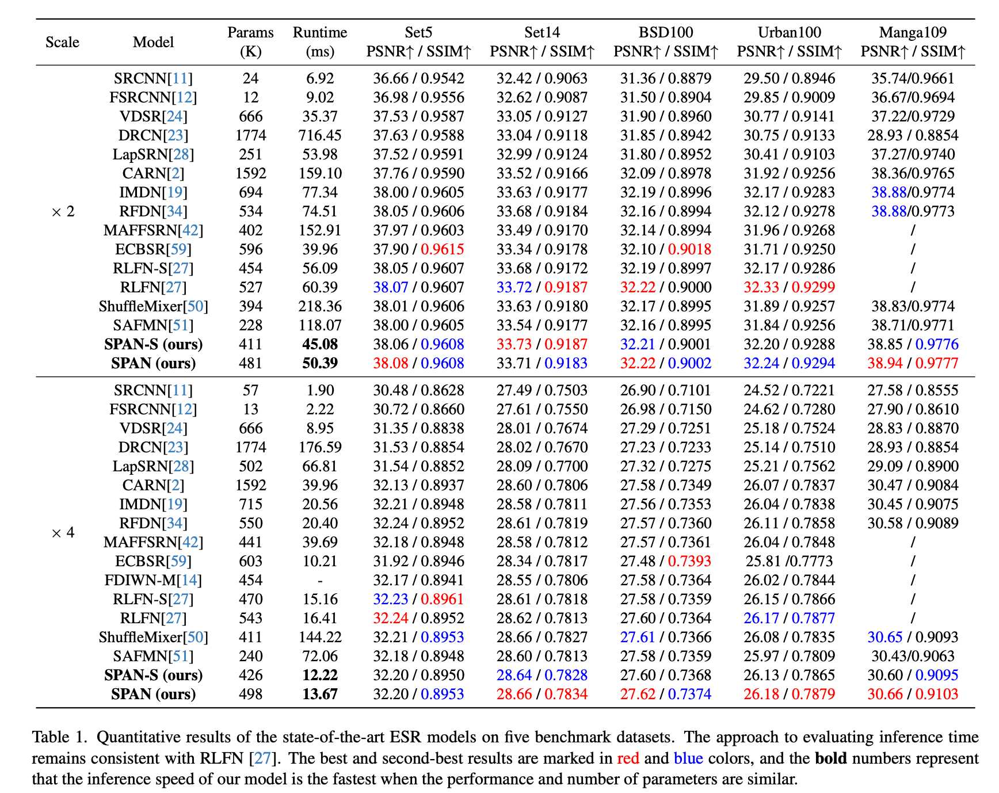
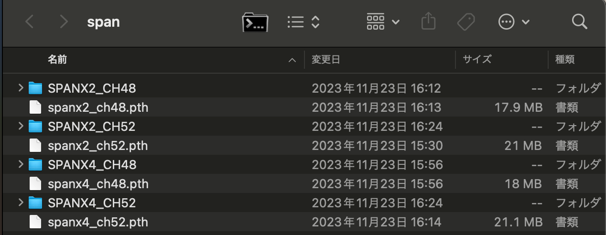

# SPAN : パラメータフリーのAttentionによる効率的な超解像モデル

# SPAN : パラメータフリーのAttentionによる効率的な超解像モデル

[](https://kyakuno.medium.com/?source=post_page---byline--3af731eae44a---------------------------------------)

[Kazuki Kyakuno](https://kyakuno.medium.com/?source=post_page---byline--3af731eae44a---------------------------------------)

9 min read

·

Jan 6, 2025

--

Share

パラメータフリーのAttentionを使用することで、高速かつ高精度を実現した超解像モデルであるSPANの紹介です。

## SPANの概要

SPAN（Swift Parameter-free Attention Network for Efficient Super-Resolution）は2023年11月にジョージア工科大学とシャオミによって公開された超解像モデルです。NTIRE 2024の効率的な超解像チャレンジで、総合性能と実行時間の両方で1位を獲得しました。

[## GitHub - hongyuanyu/SPAN: Swift Parameter-free Attention Network for Efficient Super-Resolution

### Swift Parameter-free Attention Network for Efficient Super-Resolution - hongyuanyu/SPAN

github.com](https://github.com/hongyuanyu/SPAN?source=post_page-----3af731eae44a---------------------------------------)

[## Swift Parameter-free Attention Network for Efficient Super-Resolution

### Single Image Super-Resolution (SISR) is a crucial task in low-level computer vision, aiming to reconstruct…

arxiv.org](https://arxiv.org/abs/2311.12770?source=post_page-----3af731eae44a---------------------------------------)

## SPANの特徴

SPANは、パラメーター数、推論速度、画像品質 のバランスを取った非常に効率的な超解像モデルです。従来、モデルの効率性を高めるために、FLOPsやパラメータの削減によって高速化がされていましたが、単純にFLOPsやパラメータの削減を行なっても、モデルの推論速度が改善しない場合があります。SPANは、パラメータフリーのAttentionを導入することで、精度を保ったまま、モデルの高速化を行います。

Press enter or click to view image in full size


SPANの効率性（出典：<https://arxiv.org/abs/2311.12770>）

## SPANのアーキテクチャ

SPANでは、パラメータフリーのAttention機構を提案しています。畳み込み層によって生成された高レベルの特徴情報から、活性化関数を使用して、直接、Attention Mapを計算します。

Press enter or click to view image in full size


SPANのアーキテクチャ（出典：<https://arxiv.org/abs/2311.12770>）

Attention Mapが必要なのは、超解像モデルが複雑なテクスチャ、 エッジ、色の遷移などの局所的な情報が特に豊富な 場所に焦点を合わせる必要があるためです。Attention Mapを使用しない場合、ぼかしによるアーティファクトが起こりやすくなるといった課題があります。

SPANでは、Attentionに必要なこれらのエッジとテクス チャの情報は、訓練中に学習された畳み込みカーネルを通じて直接検出します。

Press enter or click to view image in full size


計算したAttention（出典：<https://arxiv.org/abs/2311.12770>）

## TransformerのAttentionとの比較

SPANでは、Attentionがパラメータフリーで設計されています。これにより、通常のTransformerのAttention計算といくつかの点で異なります。一般的なTransformerのAttention（例えば、Self-Attention）は、複数の線形変換（通常はクエリ、キー、バリューの変換）を含み、各要素間の関連性を学習するために追加のパラメータが使用されます。

一方、SPANでは、Convolution層の出力をそのまま活用してAttentionマップを生成するため、追加の学習パラメータや複雑な計算を必要としません。このプロセスは次の特徴があります。

1. \*\*対称活性化関数の使用\*\*: SPANは、対称的な活性化関数を使ってAttention Mapを生成します。これは、計算のシンプルさとスピードを向上させます。

2. \*\*パラメータフリー\*\*: SPANのAttentionメカニズムは学習可能なパラメータを追加しないため、モデル全体の複雑性と計算コストが低く抑えられています。対照的に、通常のTransformerのAttentionは多くのパラメータが追加され、それが計算の負担を増加させます。

3. \*\*Residual Connection\*\*: SPANでは、残差接続を用いることで情報の損失を最小限に抑えつつ、効率的な特徴抽出を可能にしています。これにより、Attentionにおける情報の強調と損失のバランスを取っています。

## Get Kazuki Kyakuno’s stories in your inbox

Join Medium for free to get updates from this writer.

Subscribe

Subscribe

Remember me for faster sign in

結果として、SPANはよりシンプルで効率的なアプローチを採用しており、それが推論速度とパフォーマンスのトレードオフを大きく改善しています。これにより、特にリソースが制約されたシナリオでの実用性が高まっています。

## SPANの性能

SPANの性能は下記となります。BSD100データセットの4倍拡大で、PSNR27.62を13.67msで達成しています。高精度かつ高速であることに特徴があります。

Press enter or click to view image in full size



SPANの性能（出典：<https://arxiv.org/abs/2311.12770>）

## SPANのチェックポイント

SPANは拡大率x2とx4、チャンネル数48と52の組み合わせで、4種類のチェックポイントが公開されています。

Press enter or click to view image in full size



SPANのチェックポイント

## SPANの画質比較

Real ESRGANとSPAN（x4、ch52）の画質比較です。Real ESRGANはデノイズを強くかける傾向にあり、SPANはReal ESRGANに比べて、細かなテクスチャを残す絵作りになります。

Press enter or click to view image in full size


RealESRGAN（出典：<https://github.com/sanghyun-son/EDSR-PyTorch/blob/master/test/0853x4.png>）

Press enter or click to view image in full size


SPAN（出典：<https://github.com/sanghyun-son/EDSR-PyTorch/blob/master/test/0853x4.png>）


RealESRGAN（出典：<https://github.com/sanghyun-son/EDSR-PyTorch/blob/master/test/0853x4.png>）


SPAN（出典：<https://github.com/sanghyun-son/EDSR-PyTorch/blob/master/test/0853x4.png>）

## SPANの速度比較

M2 Mac (ailia SDK 1.5) (MPS)での速度比較です。SPANはRealESRGANよりも非常に高速に実行可能です。

### RealESRGAN (510x339 -> 1785x1186)

2989ms

### SPAN (510x339 -> 2040x1356)

x4 ch48 : 139ms  
x4 ch52 : 168ms

## SPANの使用方法

ailia SDKでSPANを使用するには下記のコマンドを使用します。

```
python3 span.py -i input.jpg
```

拡大率は2と4で選択可能です。デフォルトは2倍拡大となります。

```
python3 span.py -i input.jpg --scale 4
```

[## ailia-models/super\_resolution/span at master · axinc-ai/ailia-models

### The collection of pre-trained, state-of-the-art AI models for ailia SDK - ailia-models/super\_resolution/span at master…

github.com](https://github.com/axinc-ai/ailia-models/tree/master/super_resolution/span?source=post_page-----3af731eae44a---------------------------------------)

ax株式会社はAIを実用化する会社として、クロスプラットフォームでGPUを使用した高速な推論を行うことができるailia SDKを開発しています。ax株式会社ではコンサルティングからモデル作成、SDKの提供、AIを利用したアプリ・システム開発、サポートまで、 AIに関するトータルソリューションを提供していますのでお気軽に[お問い合わせ](https://axinc.jp/)ください。

AIで、しごとするなら『[ailia.ai（アイリア ドット エーアイ](https://blog.ailia.ai/)）』は、AIの開発を行う企業、株式会社アクセルおよびax株式会社が展開するAI専門メディアです。ビジネスやライフスタイルを取り巻く最新のAI関連製品やサービスを深く読み解くとともに、ailiaブランドが展開する最新のサービスや、AIの活用・開発・導入を加速させるための情報を幅広く網羅。  
近い未来、AIが私たちにもたらすであろう“本質的な自由“について、さまざまな角度から情報を発信します。