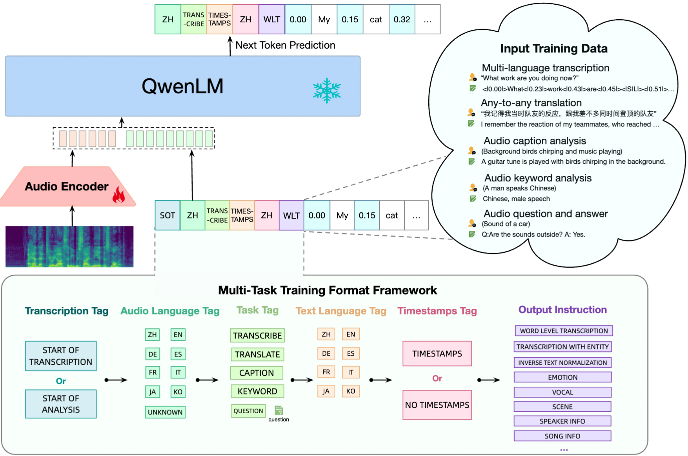
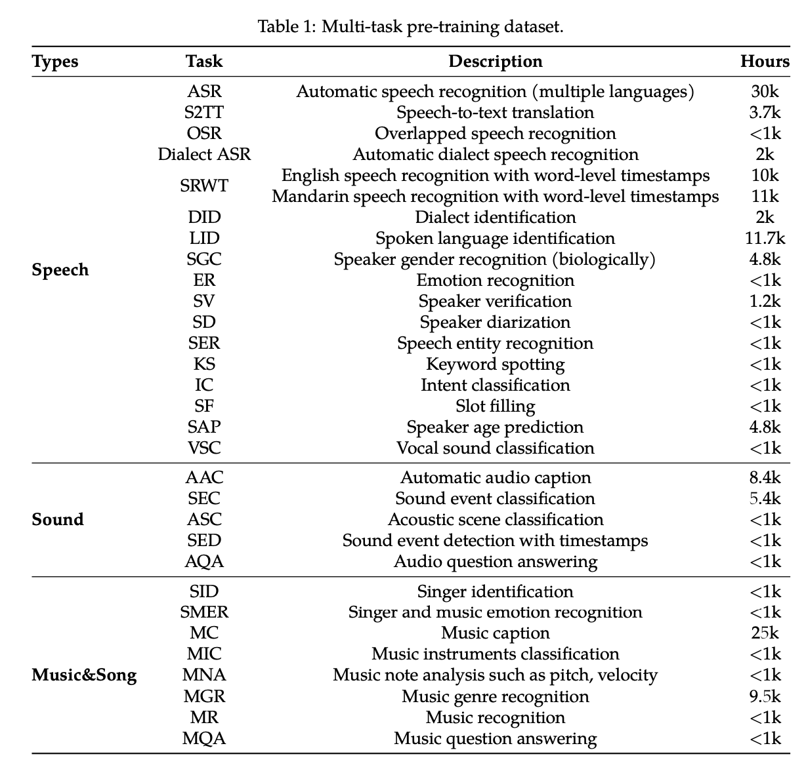
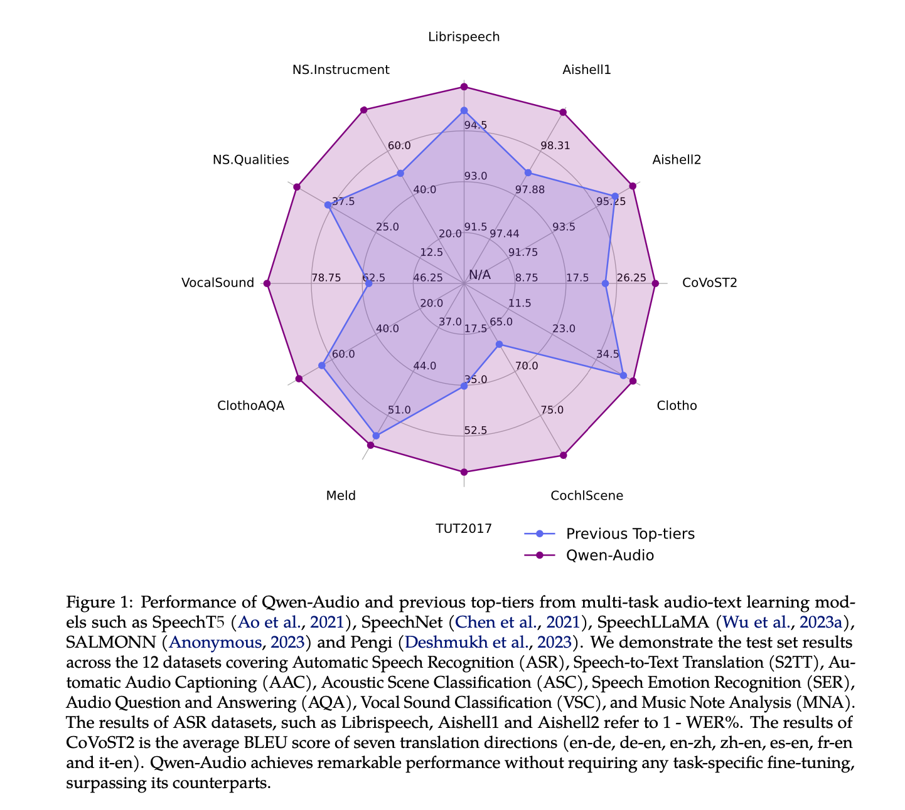

# Qwen Audio : 音を入力してテキストを生成可能なAudio Language Model

# Qwen Audio : 音を入力してテキストを生成可能なAudio Language Model

[](https://kyakuno.medium.com/?source=post_page---byline--57d3a5c71643---------------------------------------)

[Kazuki Kyakuno](https://kyakuno.medium.com/?source=post_page---byline--57d3a5c71643---------------------------------------)

Jan 16, 2025

--

Share

音を入力してテキストを生成可能なAudio Language ModelであるQwen Audioの紹介です。

## Qwen Audioの概要

Qwen Audioは、Alibabaが2023年11月に公開した、音に対応したLLMです。音を入力して、任意のプロンプトでテキストを生成可能です。

[## GitHub - QwenLM/Qwen-Audio: The official repo of Qwen-Audio (通义千问-Audio) chat & pretrained large…

### The official repo of Qwen-Audio (通义千问-Audio) chat & pretrained large audio language model proposed by Alibaba Cloud. …

github.com](https://github.com/QwenLM/Qwen-Audio?source=post_page-----57d3a5c71643---------------------------------------)

## Qwen Audioの概要

プロンプト可能な音声言語モデルが、音声とのインタラクションの観点で注目を集めています。しかし、大規模なデータで学習された事前学習済みの音声モデルはありませんでした。

QwenAudioは、大規模なデータで事前学習することで、30以上のタスクと、人間の音声、自然音、音楽、歌などのさまざまな音声タイプをカバーすることで、ユニバーサルな音声理解能力を促進し、この制限に対処します。

しかし、すべてのタスクとデータセットを直接訓練すると、タスクの焦点、言語、アノテーションの粒度、テキスト構造の違いにより、異なるデータセットに関連付けられたテキストラベルが大 きく異なるため、干渉の問題が生じる可能性があります。

この問題を克服するために、階層的なタグのシーケンスでデコーダーを条件付けすることにより、知識の共有を促し、共有されたタグと特定のタグを通じて干渉を回避するマルチタスク訓練フレームワークを設計します。

Qwen-Audioの機能を基に、Qwen-Audio-Chatをさらに開発し、さまざまな音声とテキスト入力からの入力を可能にし、マルチターンの対話を実現し、さまざまな音声中心のシナリオをサポートします。

## Qwen Audioのアーキテクチャ

QwenAudioでは、入力音声に対して、Whisper Large V2をベースとしたAudio Encoderを適用し、音声の意味を含むEmbeddingに変換し、Qwen 7BをベースとしたLLMのDecoderを適用することで、テキストを得ます。

Press enter or click to view image in full size



QwenAudioのアーキテクチャ（出典：<https://arxiv.org/abs/2311.07919>）

Whisper Large V2は32層のTransformerモデルで、2つの畳み込みダウンサンプリング層を含んでいます。Whisper Large V2のAudio Encoderは640Mのパラメータで構成されています。Whisper Large V2は音声認識と翻訳のために教師あり学習が行われていますが、そのエンコードされた表現は依然として豊富な情報を含んでいます。

## Get Kazuki Kyakuno’s stories in your inbox

Join Medium for free to get updates from this writer.

Subscribe

Subscribe

Remember me for faster sign in

言語モデルは、Qwen-7Bに由来する事前学習済みの重みを使用して初期化されます。Qwen-7Bは32層のTransformerデコーダーモデルで、隠れ層数は4096、総パラメータ数は7.7Bです。

## Qwen Audioの対応するタスク

Qwen Audioでは、Speech To Textや、Speech To Text With Word-level Timestamp、Audio Caption、Scene Classification、Emotion Recognition、Audio Question、Vocal Sound Classification、などに対応します。

Press enter or click to view image in full size


QwenAudioのタスク（出典：<https://arxiv.org/abs/2311.07919>）

データセットは下記が使用されています。音声認識のほか、方言識別や、性別認識、感情認識、話者認証、話者分離、話者年齢予測、ボーカル音の分類、音響シーン分類、歌手の識別、楽器の分類、音符の分析、音声ジャンル認識など、多様なデータが使用されています。

Press enter or click to view image in full size



QwenAudioのデータセット（出典：<https://arxiv.org/abs/2311.07919>）

## QwenAudioの性能

Qwen-Audioは多様なベンチマークタスクにおいて、個別のタスク調整を必要とせず、全てのタスクで高いパフォーマンスを達成しています。これは、自然言語処理におけるBERTのような、印象的な結果です。

Press enter or click to view image in full size



QwenAudioの性能（出典：<https://arxiv.org/abs/2311.07919>）

## Qwen Audioを使用する

ailia SDKでQwen Audioを使用するには下記のコマンドを使用します。Qwen Audioは、7Bクラスのデコーダを使用しているため、32GB程度のメモリが必要です。また、実行には時間がかかります。

```
python3 qwen_audio.py --input 1272-128104-0000.flac --prompt "what does the person say?"
```

[## ailia-models/audio\_language\_model/qwen\_audio at master · axinc-ai/ailia-models

### The collection of pre-trained, state-of-the-art AI models for ailia SDK - ailia-models/audio\_language\_model/qwen\_audio…

github.com](https://github.com/axinc-ai/ailia-models/tree/master/audio_language_model/qwen_audio?source=post_page-----57d3a5c71643---------------------------------------)

ax株式会社はAIを実用化する会社として、クロスプラットフォームでGPUを使用した高速な推論を行うことができるailia SDKを開発しています。ax株式会社ではコンサルティングからモデル作成、SDKの提供、AIを利用したアプリ・システム開発、サポートまで、 AIに関するトータルソリューションを提供していますのでお気軽に[お問い合わせ](https://axinc.jp/)ください。

AIで、しごとするなら『[ailia.ai（アイリア ドット エーアイ](https://blog.ailia.ai/)）』は、AIの開発を行う企業、株式会社アクセルおよびax株式会社が展開するAI専門メディアです。ビジネスやライフスタイルを取り巻く最新のAI関連製品やサービスを深く読み解くとともに、ailiaブランドが展開する最新のサービスや、AIの活用・開発・導入を加速させるための情報を幅広く網羅。  
近い未来、AIが私たちにもたらすであろう“本質的な自由“について、さまざまな角度から情報を発信します。