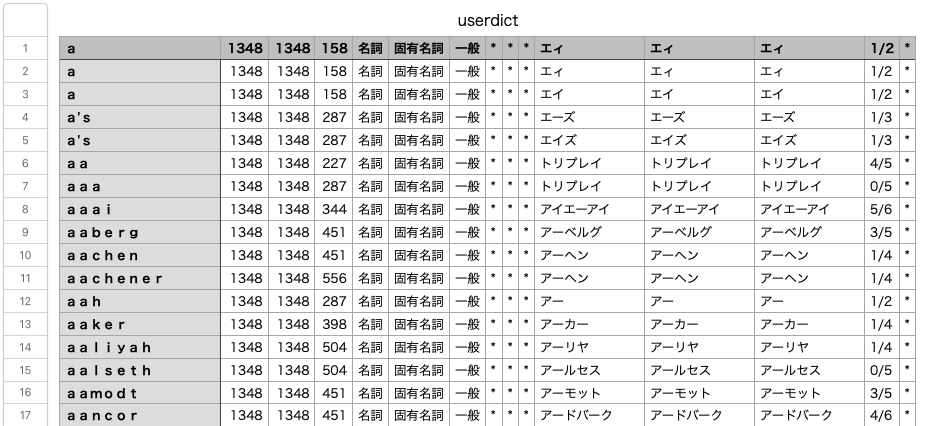

# ailia AI Voiceでユーザ辞書を使用する

# ailia AI Voiceでユーザ辞書を使用する

[](https://kyakuno.medium.com/?source=post_page---byline--b704fc4f81a8---------------------------------------)

[Kazuki Kyakuno](https://kyakuno.medium.com/?source=post_page---byline--b704fc4f81a8---------------------------------------)

7 min read

·

Jan 24, 2025

--

Share

ailia AI Voiceでは、OpenJTalk形式のユーザ辞書を使用可能です。ユーザ辞書の作成や読み込みを行う方法を紹介します。

## ailia AI Voiceの概要

ailia AI VoiceはクロスプラットフォームでAIを使用した高精度な音声合成を行うことのできるライブラリです。ailia AI Voice 1.3でユーザ辞書の読み込みに対応し、専門用語を正しく発音できるようになりました。

Press enter or click to view image in full size


ailia AI Voice

[## AI Voice ｜ailia AI Series

### 日本語にも対応する、リアルタイム音声合成機能。あなたのAIエージェントに、音声合成機能をプラス。簡単にAIに喋らせることが可能。「AI Voice」です。

www.ailia.ai](https://www.ailia.ai/voice?source=post_page-----b704fc4f81a8---------------------------------------)

## ユーザ辞書について

音声合成では、日本語のテキストを音素に変換した上で、音素を音声合成します。日本語のテキストから音素への変換には辞書が使用されます。専門用語など、辞書に含まれない単語では、間違った読みを行う場合があります。

## 間違った読みの例

ailia AI Voiceでは、下記のPythonスクリプトで音素変換の出力を確認可能です。

```
import ailia_voice  
g2p = ailia_voice.G2P()  
g2p.initialize_model(model_path = "../models/")  
print(g2p.g2p("事事無碍法界", g2p_type=ailia_voice.AILIA_VOICE_G2P_TYPE_GPT_SOVITS_JA))
```

例えば、「事事無碍法界」の正しい読みは「ジジムゲホッカイ」ですが、g2pをすると「k o t o g o t o m u g e h o o k a i .」となり、「コトゴトムゲホオカイ」となります。

## ユーザ辞書の作成

下記のようなuserdic.csvを作成します。1はコストで、小さいほど選択されやすくなります。0/8はアクセント位置で、8が音素の数、0はアクセント位置を示します。

```
事事無碍法界,,,1,名詞,固有名詞,一般,*,*,*,事事無碍法界,ジジムゲホッカイ,ジジムゲホッカイ,0/8,*
```

このCSVはMecabの形式にOpenJTalkの拡張が加えられたものです。各項目は下記となります。

```
表層形,左文脈ID,右文脈ID,コスト,品詞,品詞細分類1,品詞細分類2,品詞細分類3,活用型,活用形,原形,読み,発音,アクセント,アクセント結合規則
```

注意点として、アルファベットの単語をユーザ辞書に登録する場合、半角で記載すると、正しく反映されません。全角で記載することで、この問題は回避可能です。

```
ａｉｌｉａ,,,1,名詞,固有名詞,一般,*,*,*,ａｉｌｉａ,アイリア,アイリア,0/4,*
```

## ユーザ辞書の変換

pyopenjtalk（0.4.0）を使用して、csvをdicファイルに変換します。

```
import pyopenjtalk  
pyopenjtalk.mecab_dict_index("userdic.csv", "userdic.dic")
```

## ユーザ辞書の読み込み

initialize\_modelのuser\_dict\_path引数に変換したdicファイルを指定します。

```
import ailia_voice  
g2p = ailia_voice.G2P()  
g2p.initialize_model(model_path = "../models/", user_dict_path="userdic.dic")  
print(g2p.g2p("事事無碍法界", g2p_type=ailia_voice.AILIA_VOICE_G2P_TYPE_GPT_SOVITS_JA))
```

出力は「j i j i m u g e h o cl k a i .」となり、正しく「ジジムゲホッカイ」と発音できるようになりました。

## Get Kazuki Kyakuno’s stories in your inbox

Join Medium for free to get updates from this writer.

Subscribe

Subscribe

Remember me for faster sign in

C++ではailiaVoiceSetUserDictionaryFile API、UnityとFlutterではSetUserDictionary APIを使用することで、dicファイルを指定可能です。ユーザ辞書の指定は、ailiaVoiceOpenDictionaryFile APIやOpenDictionary APIの前に実行する必要があります。

```
voice.SetUserDictionary(path + "/userdic.dic", AiliaVoice.AILIA_VOICE_DICTIONARY_TYPE_OPEN_JTALK);  
voice.OpenDictionary(path, AiliaVoice.AILIA_VOICE_DICTIONARY_TYPE_OPEN_JTALK);
```

## GPT-SoVITS v3の公式辞書

GPT-SoVITS v3では公式でユーザ辞書が公開されています。このユーザ辞書には、一般的な英単語が含まれてます。

[## GPT-SoVITS/GPT\_SoVITS/text/ja\_userdic/userdict.csv at main · RVC-Boss/GPT-SoVITS

### 1 min voice data can also be used to train a good TTS model! (few shot voice cloning) …

github.com](https://github.com/RVC-Boss/GPT-SoVITS/blob/main/GPT_SoVITS/text/ja_userdic/userdict.csv?source=post_page-----b704fc4f81a8---------------------------------------)

Press enter or click to view image in full size



ユーザ辞書の内部

このユーザ辞書をコンパイルしてailia AI Voiceで使用できるファイルは下記にアップロードしています。

<https://storage.googleapis.com/ailia-models/gpt-sovits-v3/user.dict>

## まとめ

ailia AI Voiceのユーザ辞書機能を使用することで、より違和感のない音声合成が可能です。特にクラウドの音声合成APIで、特定の単語が正しく読まれない場合に、ailia AI Voiceを使用していただくと、音声合成の精度の向上やAPIコストの削減が可能です。ぜひ、ご検討ください。

ax株式会社はAIを実用化する会社として、クロスプラットフォームでGPUを使用した高速な推論を行うことができるailia SDKを開発しています。ax株式会社ではコンサルティングからモデル作成、SDKの提供、AIを利用したアプリ・システム開発、サポートまで、 AIに関するトータルソリューションを提供していますのでお気軽に[お問い合わせ](https://axinc.jp/)ください。

AIで、しごとするなら『[ailia.ai（アイリア ドット エーアイ](https://blog.ailia.ai/)）』は、AIの開発を行う企業、株式会社アクセルおよびax株式会社が展開するAI専門メディアです。ビジネスやライフスタイルを取り巻く最新のAI関連製品やサービスを深く読み解くとともに、ailiaブランドが展開する最新のサービスや、AIの活用・開発・導入を加速させるための情報を幅広く網羅。  
近い未来、AIが私たちにもたらすであろう“本質的な自由“について、さまざまな角度から情報を発信します。