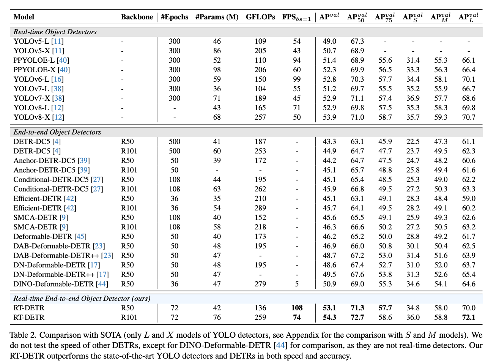

# RT-DETR : ConvolutionとTransformerのハイブリッドな物体検出モデル

# RT-DETR : ConvolutionとTransformerのハイブリッドな物体検出モデル

[](https://kyakuno.medium.com/?source=post_page---byline--7b73fd6a8de9---------------------------------------)

[Kazuki Kyakuno](https://kyakuno.medium.com/?source=post_page---byline--7b73fd6a8de9---------------------------------------)

7 min read

·

Jan 29, 2025

--

Share

ConvolutionとTransformerのハイブリッドな物体検出モデルであるRT-DETRのご紹介です。

## RT-DETRの概要

RT-DETRは2023年4月にBaiduによって公開された、ConvolutionとTransformerのハイブリッドな構成を持つ物体検出モデルです。また、RT-DETRv2は、2024年7月にBaiduによって公開されたRT-DETRを改良した物体検出モデルです。RT-DETRはConvolutionとTransformerを融合することで、高速かつ高精度な物体検出を実現しています。

[## GitHub - lyuwenyu/RT-DETR: [CVPR 2024] Official RT-DETR (RTDETR paddle pytorch), Real-Time…

### CVPR 2024] Official RT-DETR (RTDETR paddle pytorch), Real-Time DEtection TRansformer, DETRs Beat YOLOs on Real-time…

github.com](https://github.com/lyuwenyu/RT-DETR?source=post_page-----7b73fd6a8de9---------------------------------------)

[## DETRs Beat YOLOs on Real-time Object Detection

### The YOLO series has become the most popular framework for real-time object detection due to its reasonable trade-off…

arxiv.org](https://arxiv.org/abs/2304.08069?source=post_page-----7b73fd6a8de9---------------------------------------)

[## RT-DETRv2: Improved Baseline with Bag-of-Freebies for Real-Time Detection Transformer

### In this report, we present RT-DETRv2, an improved Real-Time DEtection TRansformer (RT-DETR). RT-DETRv2 builds upon the…

arxiv.org](https://arxiv.org/abs/2407.17140?source=post_page-----7b73fd6a8de9---------------------------------------)

## RT-DETRのアーキテクチャ

物体検出ではConvolutionベースのYOLOが有名ですが、YOLOの速度と精度は、NMS（NonMaxSuppression）に依存することが知られています。NMSは、Bounding Boxの重複を検知して、重なりに応じて重複を削除する処理です。NMSは、しきい値の設定の難しさと、重なりの過剰な除去、クラス間の重なりの考慮不足、暗い画像や一部が隠れているオブジェクトなどスコアが低いオブジェクトの過剰な除去の問題があります。

この問題に対して、近年はDETRなど、Transformerを使用してNMSを持たない物体検出モデルが登場しています。しかし、DETRは計算コストが高いという問題があります。

RT-DETRでは、ConvolutionとTransformerのハイブリッドエンコーダを使用することで、高速かつ高精度な物体検出を実現しています。

RT-DETRの推論速度と精度は下記となります。左上に行くほど高性能なモデルであり、RT-DETRはYOLOv8よりも高い性能を持ちます。


出典：<https://arxiv.org/abs/2304.08069>

## ハイブリッドエンコーダについて

ハイブリッドエンコーダは、効率的なマルチスケール特徴処理のために設計されています。

## Get Kazuki Kyakuno’s stories in your inbox

Join Medium for free to get updates from this writer.

Subscribe

Subscribe

Remember me for faster sign in

RT-DETRの構造は下記となります。BackboneにはResNet50を使用します。入力画像をConvolutionのBackboneに投入して特徴ベクトルを取得した後、TransformerのAIFIでAttentionを適用し、ConvolutionのCCFFでスケール間の特徴を融合します。

Press enter or click to view image in full size


出典：<https://arxiv.org/abs/2304.08069>

AIFI（Attention-based Intra-scale Feature Interaction）は、高レベルの特徴（特に最後のステージからの特徴S5）に対して自己注意機構を適用することで、概念的なエンティティ間の関係を捉えることを目的としています。高レベルのセマンティック情報がリッチな特徴のみで自己注意を行うことで、計算コストを削減しつつ、物体の局在化と認識を促進します。低レベルの特徴（S3やS4）には適用せず、冗長性や混乱を避けます。

CCFF（CNN-based Cross-scale Feature Fusion）は、クロススケールでの特徴融合を行うために、複数の畳み込み層で構成される融合ブロックを導入しています。この融合ブロックは、隣接するスケールの特徴を新しい特徴に融合し、最終的にCNNベースのアプローチで軽量かつ効率的に融合します。これにより、異なるスケールの間で相互作用を効率的に実現し、低レベルの特徴からよりリッチなセマンティック情報を含む高レベルの特徴を体系的に融合します。

## RT-DETRの精度

ハイブリッドエンコーダにより、RT-DETRは多くのオブジェクト検出タスクで優れたスピードと精度のバランスを実現しています。

Press enter or click to view image in full size



出典：<https://arxiv.org/abs/2304.08069>

## RT-DETRv2のアーキテクチャ

RT-DETRv2は、RT-DETRをベースに改良を加えたモデルです。具体的に、grid\_sampleをdiscerete\_sampleに置き換えと、学習時に強いデータ拡張の導入、ハイパーパラメータの調整を行っています。

## RT-DETRの使用方法

ailia SDKでRT-DETRv2を使用するには下記のコマンドを使用します。

```
$ python3 rt-detr-v2.py --input demo.jpg
```

[## ailia-models/object\_detection/rt-detr-v2 at master · axinc-ai/ailia-models

### The collection of pre-trained, state-of-the-art AI models for ailia SDK - ailia-models/object\_detection/rt-detr-v2 at…

github.com](https://github.com/axinc-ai/ailia-models/tree/master/object_detection/rt-detr-v2?source=post_page-----7b73fd6a8de9---------------------------------------)

ax株式会社はAIを実用化する会社として、クロスプラットフォームでGPUを使用した高速な推論を行うことができるailia SDKを開発しています。ax株式会社ではコンサルティングからモデル作成、SDKの提供、AIを利用したアプリ・システム開発、サポートまで、 AIに関するトータルソリューションを提供していますのでお気軽に[お問い合わせ](https://axinc.jp/)ください。

AIで、しごとするなら『[ailia.ai（アイリア ドット エーアイ](https://blog.ailia.ai/)）』は、AIの開発を行う企業、株式会社アクセルおよびax株式会社が展開するAI専門メディアです。ビジネスやライフスタイルを取り巻く最新のAI関連製品やサービスを深く読み解くとともに、ailiaブランドが展開する最新のサービスや、AIの活用・開発・導入を加速させるための情報を幅広く網羅。  
近い未来、AIが私たちにもたらすであろう“本質的な自由“について、さまざまな角度から情報を発信します。