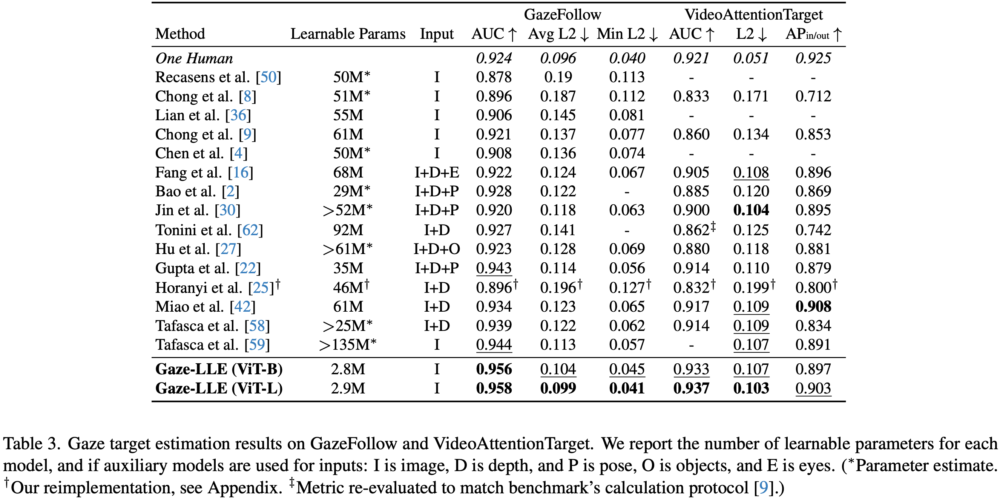
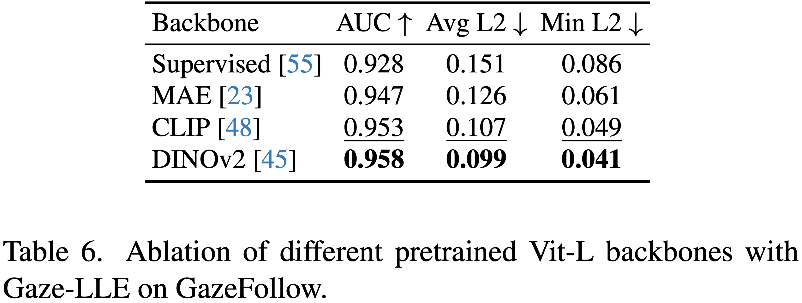
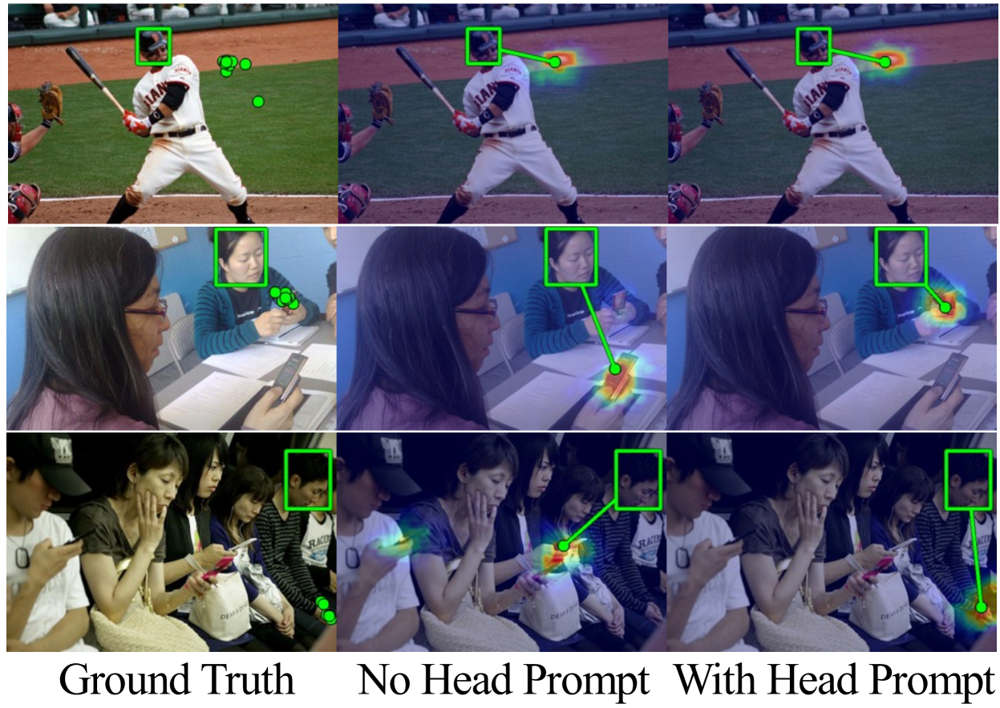

# Gaze-LLE：大規模データで学習された基盤モデルによる効率的な視線推定モデル

# Gaze-LLE：大規模データで学習された基盤モデルによる効率的な視線推定モデル

[](https://medium.com/@koichiozaki0?source=post_page---byline--7176706a0e4e---------------------------------------)

[Koichiozaki](https://medium.com/@koichiozaki0?source=post_page---byline--7176706a0e4e---------------------------------------)

Mar 12, 2025

--

Share

大規模データで学習された基盤モデルを活用することで、学習パラメータの削減と優れた性能を実現した視線推定モデルであるGaze-LLEの紹介です。

## Gaze-LLEの概要

Gaze-LLEは2024年12月にジョージア工科大学とイリノイ大学アーバナ・シャンペーン校によって公開された視線推定モデルです。vitb14、vitl14、vitb14\_inout、vitl14\_inoutの4つの学習済みモデルが提供されています。

すべてのモデルは、入力として画像と対象人物の頭部の境界ボックスを受け取ります。vitb14とvitl14は視線先のヒートマップを出力し、vitb14\_inoutとvitl14\_inoutはヒートマップに加えて視線先が画像内に含まれている確率も推定します。

[## GitHub - fkryan/gazelle

### Contribute to fkryan/gazelle development by creating an account on GitHub.

github.com](https://github.com/fkryan/gazelle?source=post_page-----7176706a0e4e---------------------------------------)

[## Gaze-LLE: Gaze Target Estimation via Large-Scale Learned Encoders

### We address the problem of gaze target estimation, which aims to predict where a person is looking in a scene…

arxiv.org](https://arxiv.org/abs/2412.09586?source=post_page-----7176706a0e4e---------------------------------------)

## Gaze-LLEの特徴

従来の視線推定では、Scene EncoderやHead Encoderに加え、深度推定やポーズ推定といった複数のモジュールを組み合わせた複雑なアーキテクチャが主流でした。しかし、これらの手法は学習が困難で、モデルの収束が遅い場合があるという課題がありました。

Gaze-LLEでは、大規模な基盤モデルをエンコーダとして使用し、軽量なデコーダを新たに構築しました。この設計により、従来の手法に比べてアーキテクチャを大幅に簡略化し、学習効率を飛躍的に向上させています。

Press enter or click to view image in full size


従来のアプローチとGaze-LLEのアプローチの比較（出典：<https://arxiv.org/abs/2412.09586>）

## Gaze-LLEのアーキテクチャ

Gaze-LLEは、以下の手順で視線推定を行います。

まず、入力画像を凍結されたエンコーダ(主にDINOv2)に通し、画像の特徴を抽出します。次に、頭部の境界ボックスから生成したバイナリマスクを用いて、抽出した特徴に位置埋め込み(position embedding)を追加します。この処理により、特定の人物の頭部に焦点を合わせた特徴マップが生成されます。この操作は「Head Prompting」と呼ばれます。

生成された画像特徴マップは、3つのTransformer層によって更新されます。その後、アップサンプリング処理を行い、視線先のヒートマップとしてデコードされます。

Press enter or click to view image in full size


Gaze-LLEのアーキテクチャ（出典：<https://arxiv.org/abs/2412.09586>）

Gaze-LLEでは、頭部の境界ボックスをシーンエンコーダの後に追加する設計を採用しました。これにより、境界ボックスをシーンエンコーダの前に入力画像と組み合わせる従来の手法に比べ、性能が大幅に向上しました。

## Gaze-LLEの性能

Gaze-LLEは、GazeFollowとVideoAttentionTargetの両データセットにおいて優れた性能を示しました。特に、学習可能なパラメータが先行研究と比較して1～2桁少ないにもかかわらず、主要な評価指標で最先端またはそれに近い結果を達成しました。

## Get Koichiozaki’s stories in your inbox

Join Medium for free to get updates from this writer.

Subscribe

Subscribe

Remember me for faster sign in

この結果から、Gaze-LLEは軽量かつ高精度な視線推定が可能であることを実証しています。

Press enter or click to view image in full size



Gaze-LLEの性能（出典：<https://arxiv.org/abs/2412.09586>）

## 基盤モデルの可用性

Gaze-LLEでは主にDINOv2を使用していますが、他の基盤モデルとも互換性があります。以下では、異なる事前学習済みモデルを用いた場合の性能を示しています。その中でも、DINOv2は最先端の特徴抽出エンコーダとして、最も高い精度を達成しました。一方、CLIPも優れた性能を示しています。また、今後さらに性能の高い基盤モデルが開発されることで、Gaze-LLEを活用した視線推定の精度がより向上する可能性が期待されます。

Press enter or click to view image in full size



基盤モデルの可用性（出典：<https://arxiv.org/abs/2412.09586>）

## Head Promptingの有効性

Gaze-LLEにおけるHead Promptingの有効性を検証するために、Head Promptingを除去したモデルを用いて推論を行い、結果を比較しました。

Press enter or click to view image in full size



Head Promptingの有効性（出典：<https://arxiv.org/abs/2412.09586>）

1段目のように、画像内に1人しかいない場合、Head Promptingがなくても正確に視線を推定できることが確認されました。これは、エンコーダがすでに画像中の頭部を検出し、その情報を活用しているためだと考えられます。

一方、2段目や3段目のように複数人が画像内にいる場合、モデルは間違った人物の視線を推定することが確認されました。このことから、Head Promptingは、視線推定を行う際にどの人物の情報を基にすべきかをモデルに明確に伝える役割を果たしていると考えられます。

## Gaze-LLEの使用方法

ailia SDKでGaze-LLEを使用するには、下記のコマンドを使用します。デフォルトでは事前学習済みモデルとしてvitl14\_inoutを使用します。

```
python3 gazelle.py --input input.png --savepath output.png
```

視線推定の結果をヒートマップで表示する場合は、heatmapオプションを加えます。

```
python3 gazelle.py --input input.png --headmap
```

[## ailia-models/face\_recognition/gazelle at master · axinc-ai/ailia-models

### The collection of pre-trained, state-of-the-art AI models for ailia SDK - ailia-models/face\_recognition/gazelle at…

github.com](https://github.com/axinc-ai/ailia-models/tree/master/face_recognition/gazelle?source=post_page-----7176706a0e4e---------------------------------------)

ax株式会社はAIを実用化する会社として、クロスプラットフォームでGPUを使用した高速な推論を行うことができるailia SDKを開発しています。ax株式会社ではコンサルティングからモデル作成、SDKの提供、AIを利用したアプリ・システム開発、サポートまで、 AIに関するトータルソリューションを提供していますのでお気軽に[お問い合わせ](https://axinc.jp/)ください。

AIで、しごとするなら『[ailia.ai（アイリア ドット エーアイ](https://blog.ailia.ai/)）』は、AIの開発を行う企業、株式会社アクセルおよびax株式会社が展開するAI専門メディアです。ビジネスやライフスタイルを取り巻く最新のAI関連製品やサービスを深く読み解くとともに、ailiaブランドが展開する最新のサービスや、AIの活用・開発・導入を加速させるための情報を幅広く網羅。  
近い未来、AIが私たちにもたらすであろう“本質的な自由“について、さまざまな角度から情報を発信します。