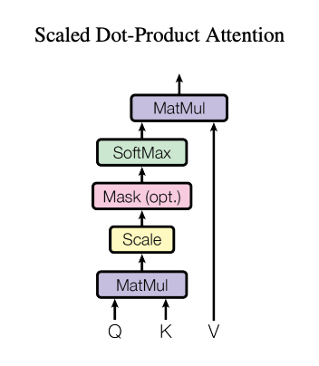
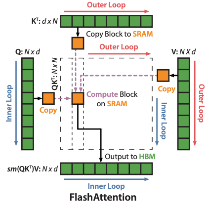
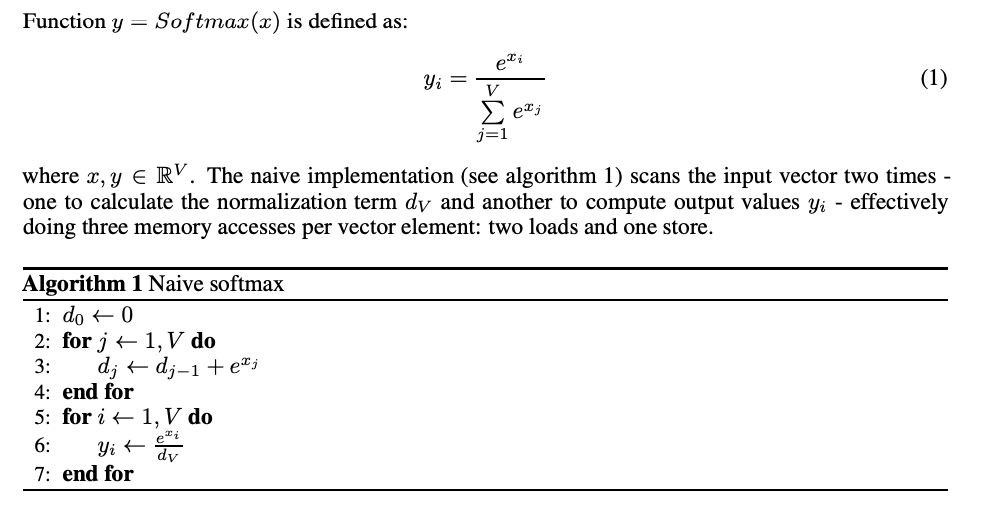
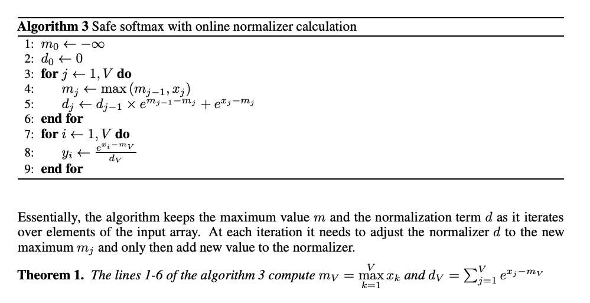
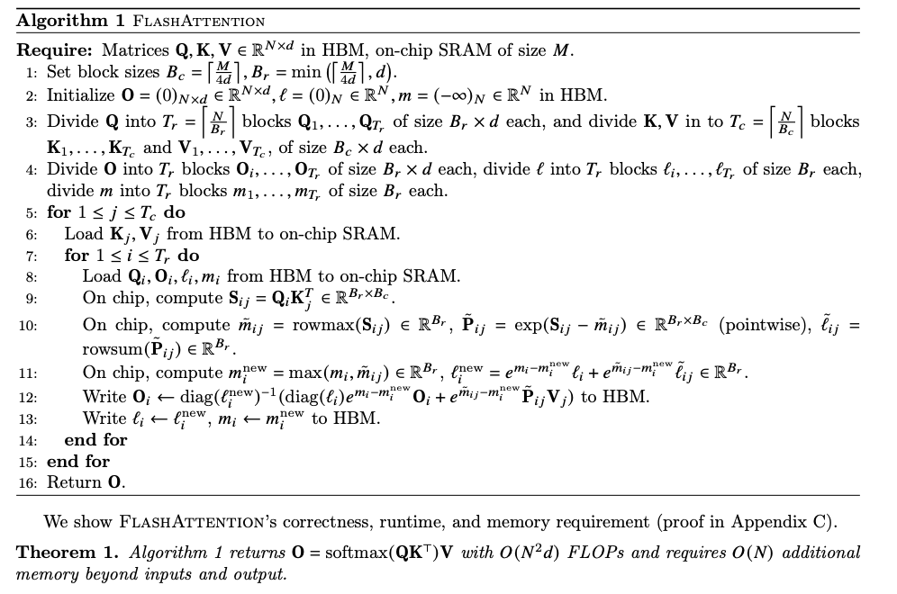
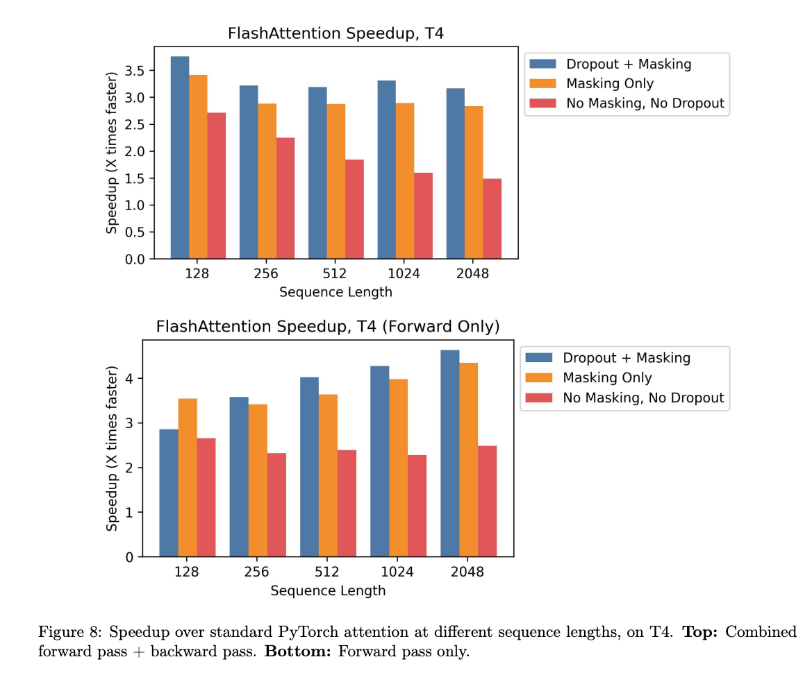

# Flash Attention : メモリ帯域を削減することでAttentionを高速化するアルゴリズム

# Flash Attention : メモリ帯域を削減することでAttentionを高速化するアルゴリズム

[Kazuki Kyakuno](https://kyakuno.medium.com/?source=post_page---byline--f4b740c1054c---------------------------------------)

11 min read

·

May 19, 2025

--

Share

メモリ帯域を削減することでAttentionを高速化するアルゴリズムであるFlash Attentionの紹介です。

## Flash Attentionの概要

Flash Attentionは、メモリ帯域を削減することでAttentionを高速化する手法です。2022年5月にスタンフォード大学の研究グループによって発表されました。

[## FlashAttention: Fast and Memory-Efficient Exact Attention with IO-Awareness

### Transformers are slow and memory-hungry on long sequences, since the time and memory complexity of self-attention are…

arxiv.org](https://arxiv.org/abs/2205.14135?source=post_page-----f4b740c1054c---------------------------------------)

近年のGPUは、TensorCoreなどの行列積演算回路の搭載によって、行列積の演算性能が飛躍的に向上していますが、テンソルを格納しているHBMなどのメモリの速度はあまり向上していないという課題があります。そのため、カタログスペックのFLOPSに対して、AIの実効性能が低くなっています。

Flash Attentionはこの問題に対して、GPU内のSRAMを活用することで、演算速度を改善しています。SRAMは、HBMと比べて、非常に高速ですが、容量が非常に小さいという特性があります。HBMは40GB程度あったとしても、SRAMは20MB程度です。

Press enter or click to view image in full size

出典：<https://arxiv.org/abs/2205.14135>

Flash Attentionでは、Attentionをタイル分割して計算することで、HBMへのアクセスを削減します。Flash AttentionはAttentionと数学的に等価であり、十分な演算精度で実行した場合、誤差は十分に小さくなります。

## Attentionについて

Attentionは、Transformerで使用される自己注意機構です。QueryとKeyとValueのテンソルを入力し、行列積とSoftmaxで出力テンソルを得ます。AttentionにはSelf AttentionとCross Attentionがあります。Self AttentionはQueryとKeyとValueが同じテンソルになります。Cross AttentionはQueryとKeyとValueが違うテンソルになります。Self AttentionとCross Attentionは、scaled\_dot\_product\_attentionとして一般化されます。

Scaled Dot Product Attention（出典：<https://arxiv.org/pdf/1706.03762v7>）

[## torch.nn.functional.scaled\_dot\_product\_attention — PyTorch 2.7 documentation

### Read the PyTorch Domains documentation to learn more about domain-specific libraries

docs.pytorch.org](https://docs.pytorch.org/docs/stable/generated/torch.nn.functional.scaled_dot_product_attention.html?source=post_page-----f4b740c1054c---------------------------------------)

演算を細かく見ていきます。QueryとKeyを行列積し、Softmaxを適用し、Valueを行列積します。QueryとKeyを内積することは、QueryとKeyのCos類似度を計算することになります。QueryとKeyの行列積に対してSoftmaxを適用し、確率値を0〜1に正規化することで、Keyのどの要素がQueryと近いかを計算することになります。最後に、Valueを行列積し、類似度に応じて重み付けして加算することで、Keyに対応するValueを取り出します。

これは、微分可能なテーブル参照に近いです。SoftmaxをMaxに置き換えた場合、Queryに最も近いKeyを探索し、対応するValueを出力することになります。

## Attentionのメモリアクセス

一般に、QとKとVは巨大なテンソルになります。また、QとKの行列積の結果も巨大なテンソルになります。そのため、QとKとVはSRAMに置くことができず、HBMから直接読み込まれます。

具体的に、Attentionのナイーブな処理は下記のようになります。

・QとKをHBMから読み込み、QとKの行列積、結果をHBMに書き込み  
・HBMから読み込み、Softmaxを実行、HBMに書き込み  
・Softmaxの結果とVをHBMから読み込み、Softmaxの結果とVの行列積を実行、結果をHBMに書き込み

Attentionの計算では、3回のHBMの読み込みと、3回のHBMの書き込みが発生します。

## Flash Attentionのタイル分割

Flash Attentionでは、QとKをHBMからタイル単位でSRAMに転送し、QとKの行列積を実行、その結果に対してSoftmaxを適用、Vの行列積を計算後、HBMに書き込みます。2つ目以降のタイルでは、HBMから前回のVの行列積の結果を取得し、値をスケーリングした後、今回のタイルのVの行列積の結果を加算します。

これにより、2回のHBMの読み込みと、1回のHBMの書き込みまでメモリアクセスを削減します。

Flash Attentionのポイントは、Softmaxの次元数であるdも分割している点です。従来、dが分割できないために、Attentionはタイル分割できないとされてきました。Softmaxは、入力されたテンソルの値を全て使って、0〜1の分布を計算するため、d個の全ての値が揃うまで計算できないためです。

## Get Kazuki Kyakuno’s stories in your inbox

Join Medium for free to get updates from this writer.

Subscribe

Subscribe

Remember me for faster sign in

Flash Attentionでは、Online Softmaxの拡張を行い、d個の値が揃わない状態の仮の分布でVとの内積を行い、次回のタイルで、前回の内積の結果を補正、リードモディファイライトを行うことで、最終的に辻褄を合わせています。

## Online Softmaxについて

Flash AttentionはOnline Softmaxの拡張であるため、先にOnline Softmaxについて解説します。

[## Online normalizer calculation for softmax

### The Softmax function is ubiquitous in machine learning, multiple previous works suggested faster alternatives for it…

arxiv.org](https://arxiv.org/abs/1805.02867?source=post_page-----f4b740c1054c---------------------------------------)

Softmaxは下記の式で表されます。入力テンソルのexpの合計を計算し、その総和で除算します。

Press enter or click to view image in full size

しかし、expは急速に値が大きくなるため、無限大に発散してしまいます。そこで、Safe Softmaxが利用されています。Safe Softmaxでは、入力テンソルの最大値を減算し、expを負数の領域で計算することで、expのレンジを0〜1に抑えることで、無限大に発散することを抑えています。

Press enter or click to view image in full size

しかし、Safe Softmaxでは、入力テンソルの最大値の計算、最大値を減算したExpの合計の計算、Expの合計での除算と、3回のメモリのリードが発生します。

Online Softmaxでは、最大値の計算と、Expの合計の計算を同時に行い、2回のメモリアクセスで実行します。

Press enter or click to view image in full size

これは、本来のmaxの値ではないbefore\_maxでexpの合計値を計算しておいた後、真のmaxであるafter\_maxが算出された場合、その差分である(after\_max -before\_max)で補正することで、結果を合わせる仕組みになっています。

仮の値：exp(x-before\_max)  
真の値：exp(x-after\_max)  
仮の値からの復元：exp(x-before\_max) **\* exp(before\_max-after\_max)**

## Flash AttentionへのOnline Softmaxの適用

Online Softmaxは要素単位で補正を行いますが、Flash Attentionではタイル単位で補正を行います。前回のタイルにおけるSoftmaxとVの内積がbefore\_maxで計算されたとして、今回のタイルでafter\_maxに更新された場合、前回の内積結果に、exp(before\_max-after\_max)を乗算することで補正します。before\_maxとafter\_maxとの差分が0であれば1が、after\_maxが更新された場合は1未満の値が補正値として計算されます。

前回のタイルは、本来のmaxで計算した場合は例えば0〜0.4の確率がVに乗算されるはずだったところが、仮のmaxで計算しているために0〜1.0の確率がVに乗算されていることになります。そこで、前回の結果にexp(before\_max-after\_max)とbefore\_sum/after\_sumを乗算することで、真の値に補正することになります。

Flash Attentionの概念図

仮の値：exp(x-before\_max)/before\_sum \* V1  
真の値：exp(x-after\_max)/after\_sum \* V1 + exp(x-after\_max)/after\_sum \* V2  
仮の値からの復元：exp(x-before\_max)/before\_sum \* V1 \* **exp(before\_max-after\_max)\*(before\_sum/after\_sum)** + exp(x-after\_max)/after\_sum \* V2

これを定式化すると下記になります。

Press enter or click to view image in full size

Flash Attention（出典：<https://arxiv.org/pdf/2205.14135>）

## Flash Attentionのパフォーマンス

Flash AttentionはT4における推論（No Masking、No Dropout）で、2倍程度、高速化します。

Press enter or click to view image in full size

出典：<https://arxiv.org/pdf/2205.14135>

## まとめ

Flash AttentionはOnline Softmaxをタイルに拡張することで、Attentionをタイル分割可能とし、HBMへのメモリアクセスを削減することが可能です。Flash Attentionは、HBMに限らず、低速なメモリと高速なメモリの組み合わせで構成されたハードウェアに適用可能で、特に高速なメモリに乗り切らないテンソルサイズの場合に、大幅な高速化を見込むことが可能です。

ax株式会社では、AIコンピューティング事業として、お客様のAIモデルを高速化し、デバイス実装する開発サービスを提供しています。TorchのP2TEや、ailia SDK、ONNX Runtime、CoreML、QNNなどを駆使することで、近代的で大規模なTransformerモデルをお客様のデバイスに実装可能です。ご興味がありましたら、ぜひ、お気軽に[お問い合わせ](https://www.ailia.ai/contact_ax)ください。

AIで、しごとするなら『[ailia.ai（アイリア ドット エーアイ](https://blog.ailia.ai/)）』は、AIの開発を行う企業、株式会社アクセルおよびax株式会社が展開するAI専門メディアです。ビジネスやライフスタイルを取り巻く最新のAI関連製品やサービスを深く読み解くとともに、ailiaブランドが展開する最新のサービスや、AIの活用・開発・導入を加速させるための情報を幅広く網羅。  
近い未来、AIが私たちにもたらすであろう“本質的な自由“について、さまざまな角度から情報を発信します。