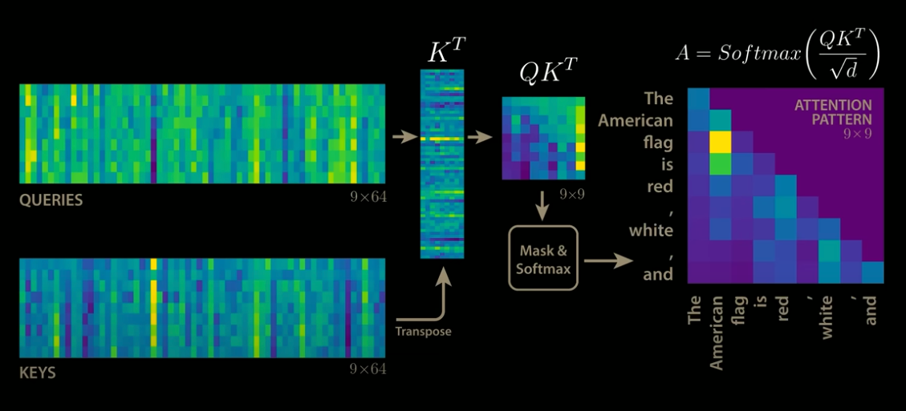
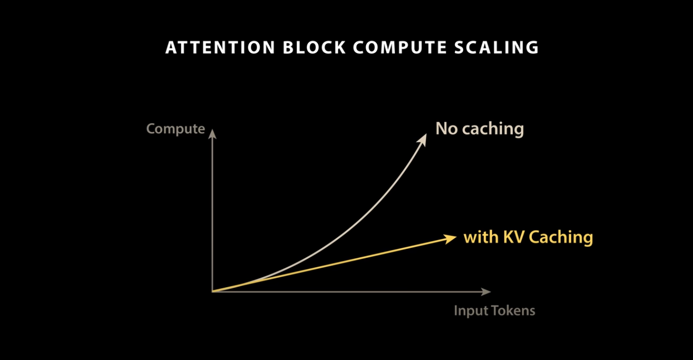
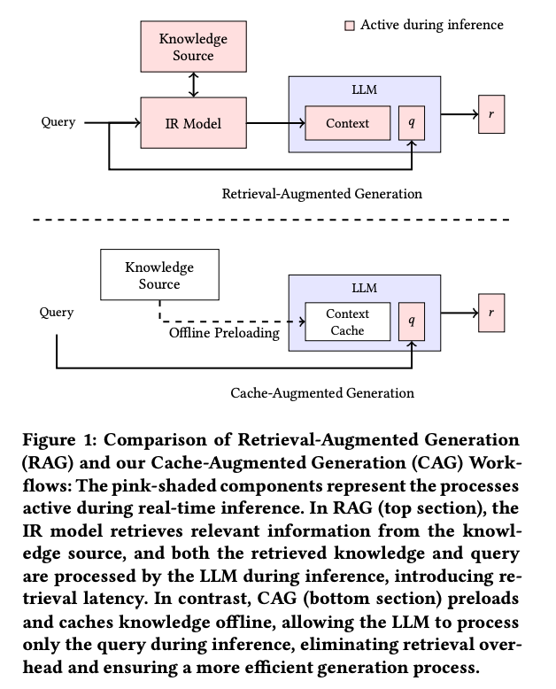
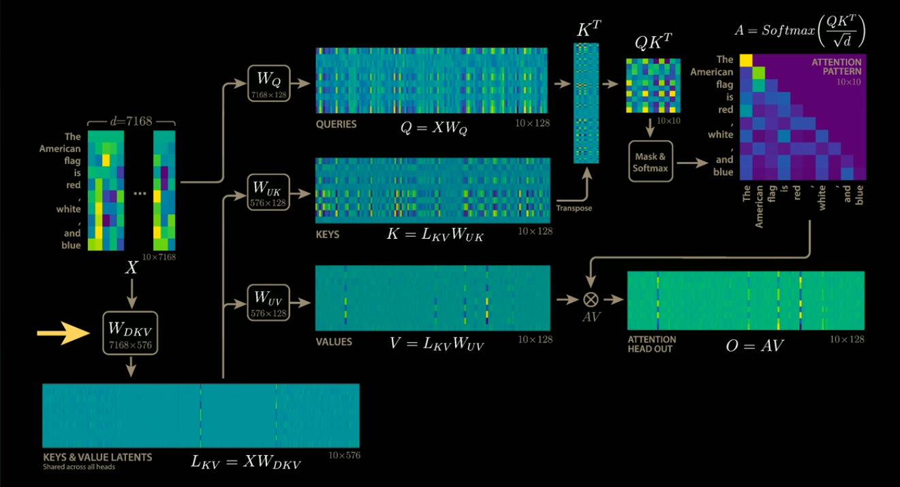

# KVCache : Attentionの計算結果をキャッシュすることで高速化するアルゴリズム

# KVCache : Attentionの計算結果をキャッシュすることで高速化するアルゴリズム

[Kazuki Kyakuno](https://kyakuno.medium.com/?source=post_page---byline--1be8210c8627---------------------------------------)

May 29, 2025

--

Share

Attentionの計算結果をキャッシュすることでTransformerを高速化するアルゴリズムであるKVCacheの紹介です。

## KVCacheの概要

KVCacheはAttentionの計算結果をキャッシュすることで、Transformerを高速化する技術です。

KVCacheの解説動画

Transformerによる言語モデルでは、現在の推論の出力トークンは入力トークンと連結され、次の推論の入力トークンとして繰り返し使用されます。そのため、N+1回目の推論では、N個とのトークンは前回の推論と全く同じで、追加された1つのトークンのみが異なります。

KVCacheは、現在の推論の再利用可能な計算結果をキャッシュしておき、次回の推論でキャッシュされた結果を読み込み、使用します。そのため、通常のキャッシュとは異なり、キャッシュミスは発生しません。

KVCacheは、Transformerの中のAttentionの計算結果をキャッシュします。

## 通常のAttention

Attentionでは、QとKを行列積し、QKを計算、Softmaxを適用後、Vとの行列積を行って、出力を計算します。この時、Nトークンのデコード完了後に、次のN+1トークンを推論する場合、QKの行列積の列サイズは(N+1)になります。そのため、デコードが進むごとに処理時間が増加します。

Press enter or click to view image in full size

通常のAttention（出典：<https://www.youtube.com/watch?app=desktop&v=0VLAoVGf_74>）

## KVCacheを使用したAttention

KVCacheを使用した場合、前回のQとKの行列積の結果をVRAMにキャッシュしておき、新しく増えた1トークン分の行列積のみを計算し、前回の行列積の結果と統合します。これにより、新しく増えたトークンのみの処理となるため、高速化されます。

Press enter or click to view image in full size

KVCacheの実装（出典：<https://www.youtube.com/watch?app=desktop&v=0VLAoVGf_74>）

QとKに新しいトークンが1行増えた場合、QKは一番下の行だけでなく、一番右の列も変化しそうに思えますが、Transformerでは未来のトークンは参照しないようにマスクするため、QKの一番下の行だけが更新されます。そのため、QKVも一番下の行だけが更新され、Attentionが複数連結されている場合も、KVCacheは正しく動作します。

Press enter or click to view image in full size

KQのマスク（出典：<https://blog.csdn.net/taoqick/article/details/137476233>）

## KVCacheの効果

KVCacheを使用しない場合、入力トークン長に対して、処理時間は非線形に増加します。KVCacheを使用することで、入力トークン数に対して、処理時間を線形にすることができます。

Press enter or click to view image in full size

KVCacheのパフォーマンス（出典：<https://www.youtube.com/watch?app=desktop&v=0VLAoVGf_74>）

## KVCacheの応用

KVCacheは、Transformerのデコードの高速化の他、LLMのプロンプトキャッシュでも使用されています。プロンプトキャッシュは、KVCacheを退避しておくことで、同じコンテキストに対して、異なる複数の質問を高速に行うことが可能です。

## Get Kazuki Kyakuno’s stories in your inbox

Join Medium for free to get updates from this writer.

Subscribe

Subscribe

Remember me for faster sign in

また、RAGの変化系として、CAG (Cache-Augumented Generation)というのも提案されており、コンテキストとなるドキュメントを丸ごとKVCacheにキャッシュしておくことで、RAGを高速化します。

出典：<https://arxiv.org/pdf/2412.15605>

[## Don't Do RAG: When Cache-Augmented Generation is All You Need for Knowledge Tasks

### Retrieval-augmented generation (RAG) has gained traction as a powerful approach for enhancing language models by…

arxiv.org](https://arxiv.org/abs/2412.15605?source=post_page-----1be8210c8627---------------------------------------)

## KVCacheの課題

KVCacheは、行列積の結果をVRAMに保存するため、VRAMの使用量が大きくなるという課題があります。この課題に対して、DeepSeekでは、KVCacheを圧縮するという手法を導入しています。

Press enter or click to view image in full size

KVCacheの圧縮（出典：<https://www.youtube.com/watch?app=desktop&v=0VLAoVGf_74>）

## まとめ

KVCacheを使用することで、Attentionの計算結果をキャッシュし、デコードを高速化することが可能です。KVCacheの課題はVRAMの使用量ですが、近年は、KVCacheを圧縮する手法も提案されています。

ax株式会社では、AIコンピューティング事業として、お客様のAIモデルを高速化し、デバイス実装する開発サービスを提供しています。TorchのP2TEや、ailia SDK、ONNX Runtime、CoreML、QNNなどを駆使することで、近代的で大規模なTransformerモデルをお客様のデバイスに実装可能です。ご興味がありましたら、ぜひ、お気軽に[お問い合わせ](https://www.ailia.ai/contact_ax)ください。

AIで、しごとするなら『[ailia.ai（アイリア ドット エーアイ](https://blog.ailia.ai/)）』は、AIの開発を行う企業、株式会社アクセルおよびax株式会社が展開するAI専門メディアです。ビジネスやライフスタイルを取り巻く最新のAI関連製品やサービスを深く読み解くとともに、ailiaブランドが展開する最新のサービスや、AIの活用・開発・導入を加速させるための情報を幅広く網羅。  
近い未来、AIが私たちにもたらすであろう“本質的な自由“について、さまざまな角度から情報を発信します。