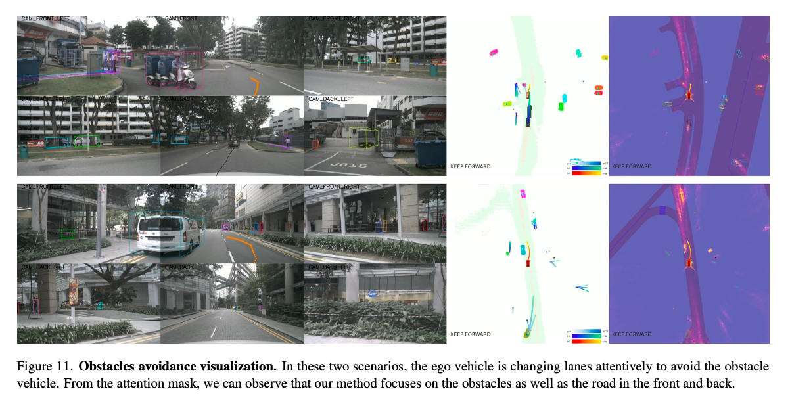
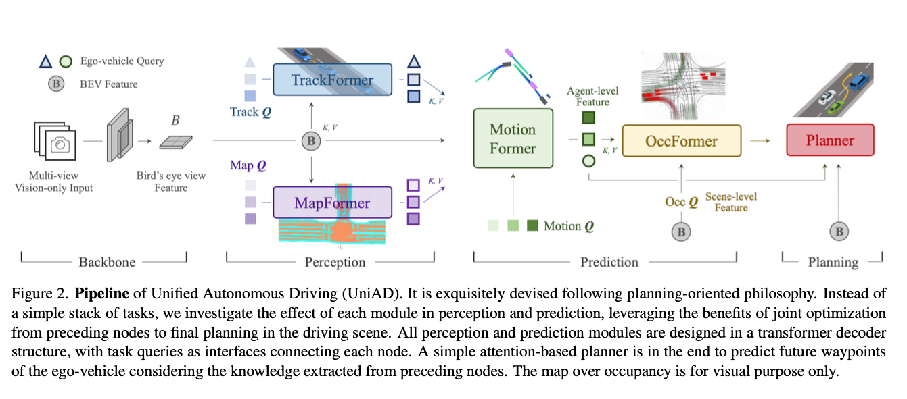
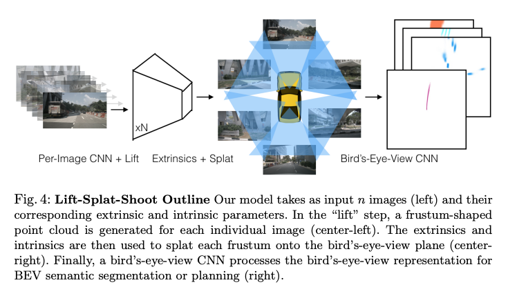
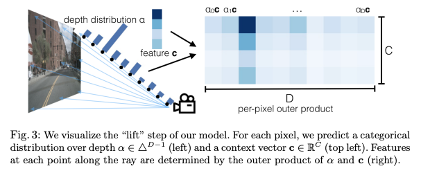
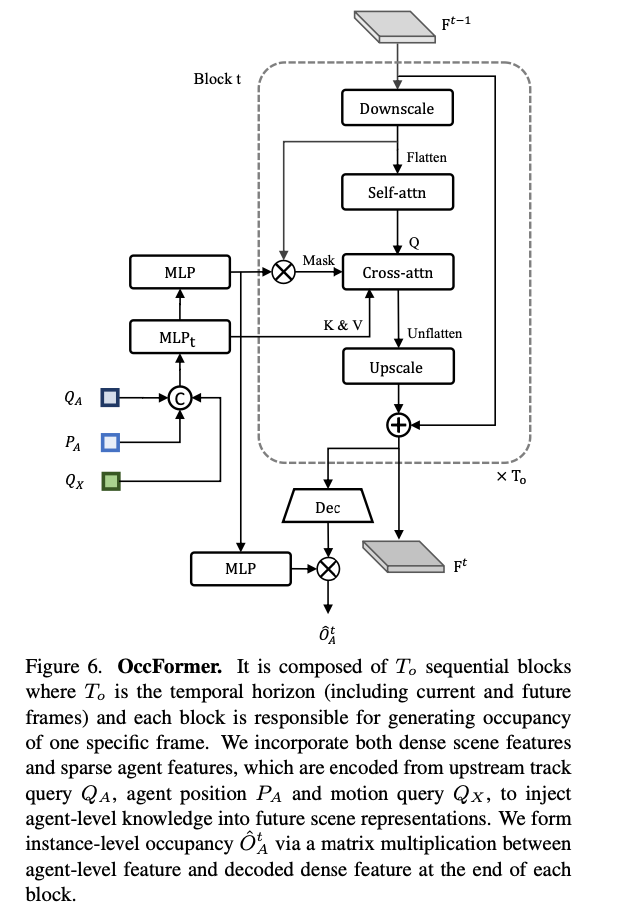
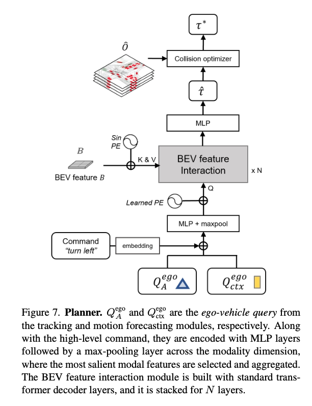
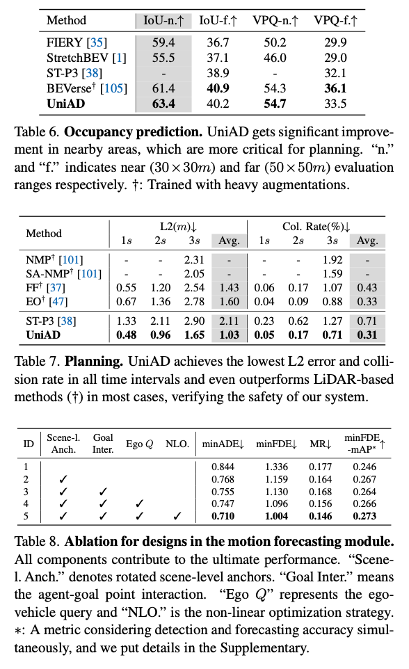
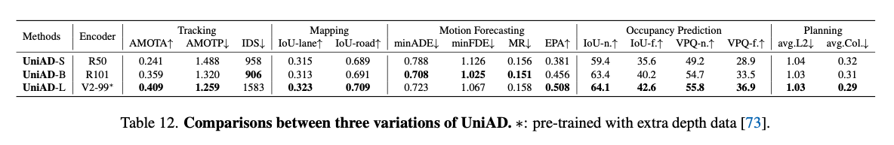
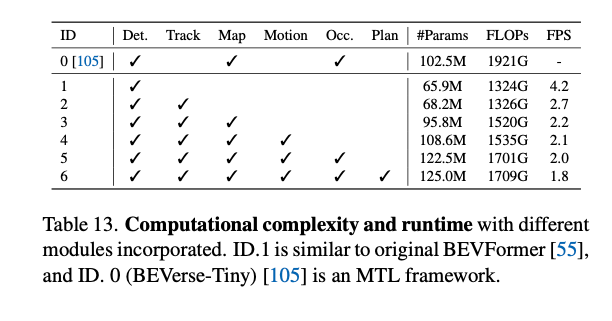

# UniAD : End2Endの自動運転の基本となるモデル

# UniAD : End2Endの自動運転の基本となるモデル

[Kazuki Kyakuno](https://kyakuno.medium.com/?source=post_page---byline--39339e6e277b---------------------------------------)

Jun 9, 2025

--

Share

End2Endの自動運転の基本となるモデルであるUniADを紹介します。

## UniADについて

UniADは、End2Endの自動運転の基本となるモデルです。2023年4月に、OpenDriveLab、Wuhan University、SenseTime Researchにより発表されました。CVPR 2023でBest Paper Awardを獲得しています。

Press enter or click to view image in full size

出典：<https://arxiv.org/abs/2212.10156>

画像認識がVLMに統合されていったように、自動運転もEnd2Endの基盤モデルに統合されていく流れがあり、UniADはEnd2Endの自動運転モデルの基本となるアーキテクチャを提案しています。

[## Planning-oriented Autonomous Driving

### Modern autonomous driving system is characterized as modular tasks in sequential order, i.e., perception, prediction…

arxiv.org](https://arxiv.org/abs/2212.10156?source=post_page-----39339e6e277b---------------------------------------)

## UniADの概要

自動運転は、カメラからPerceptionで3D Bounding Boxを認識し、PredictionにおけるMotionで追跡、Occupancy（占有率）で障害物を検知し、PlanningのPlannerで最適な移動経路を決定します。従来の自動運転では、PerceptionとPrediction、Planningが別々のモジュールとなっていました。

End2Endの自動運転では、PerceptionとPrediction、Planningのモジュールを接続し、PlanningからPerceptionまで、Back Propagationを適用して学習できるようにすることで、各モジュールが情報量の多い中間表現を取得可能にすることで、高精度化を行います。

また、従来の自動運転では、事前に作成された静的な点群の地図を用い、自己位置推定により自車の位置を把握、地図を元にした仮想的なガイドを元に走行することが多かったですが、UniADではオンラインでマップを作成しており、静的な地図は不要で自動運転を実現しています。

出典：<https://arxiv.org/abs/2212.10156>

## UniADのモデルアーキテクチャ

UniADは、LiDARは使用せず、マルチビューのカメラ画像を扱います。カメラ画像は、BEV (Bird’s eye view Feature）で扱います。BEVの空間で、TrackFormerによるエージェント（対向車や歩行者）の発生とトラッキングと、MapFormerによるオンラインマップの作成、MotionFormerによるエージェントごとの経路予測、OccFormerによる占有率予測、Plannerによる経路の決定を行っています。

Press enter or click to view image in full size

出典：<https://arxiv.org/abs/2212.10156>

UniADの中間の予測結果をカメラ画像やBEV空間に投影して可視化した例です。UniADはEnd2Endで学習と経路予測を行いますが、各モジュールの出力は個別に可視化することができ、適切な認識が行われているかを確認することができます。

Press enter or click to view image in full size

出典：<https://arxiv.org/abs/2212.10156>

## BEVについて

BEVは、 Bird’s eye view Featureの略称です。入力画像から、Frustrum Featuresを生成し、BEV変換により、上から見た視点にデータを再配置します。

Press enter or click to view image in full size

Frustrum Features（出典：<https://arxiv.org/abs/2008.05711>）

まず、カメラの画像に対してResNetを適用して2Dの特徴抽出を行った後、奥行きを持ったFrustrum Featuresに変換します。Frustrumとは、 視錐台のことであり、カメラや視点から見える領域を立体的に定義した形状で、通常はピラミッドや円錐の形をしています。この領域内の物体がカメラに映ることになります。Frustrum Featuresはボクセルであり、ボクセルの中にResNetの特徴量が入っているような構造になります。これにより、カメラの概要とLiDARの情報を、一元的に扱えるようになります。

## Get Kazuki Kyakuno’s stories in your inbox

Join Medium for free to get updates from this writer.

Subscribe

Subscribe

Remember me for faster sign in

2Dから3DへのLifting（持ち上げ）には様々な手法があり、2DのDepth推定を使用するものや、カメラの配置情報を使用したもの、LiDARの情報を制約として使用するものなどがあります。

Depth推定によるLifting（出典：<https://arxiv.org/pdf/2008.05711>）

Press enter or click to view image in full size

LiDARの情報を制約として使用するLifting（出典：<https://arxiv.org/abs/2303.17895>）

最後に、Frustrum Featuresから、BEV変換によって、上から見た視点にデータを再配置します。

## モデルアーキテクチャ

MotionFormerは、TrackFormerとMapFormerの出力をKeyとValueとして受け取り、BEV featureと合わせてMLPによって経路を予測します。

出典：<https://arxiv.org/abs/2212.10156>

OccFormerはSelf-attnとCross-attnを使用したTransformerの構成となっています。1フレームの占有率を予測します。

出典：<https://arxiv.org/abs/2212.10156>

Plannerでは、複数フレームの占有率を受け取り、最適な経路をMLPで予測します。

出典：<https://arxiv.org/abs/2212.10156>

## UniADの評価

UniADはnuSceneデータセットで評価されています。

UniADは、End2Endで学習していますが、物体追跡などの個別タスクでSoTAに近い性能を持っています。

出典：<https://arxiv.org/abs/2212.10156>

Planningにおいては、SoTAを達成しています。

出典：<https://arxiv.org/abs/2212.10156>

## 演算量

UniADは、S・M・Lの3バリエーションがあります。

Press enter or click to view image in full size

出典：<https://arxiv.org/abs/2212.10156>

全モジュールを使用して1フレームを処理するのに必要なFLOPSは1.7T FLOPSとなります。

出典：<https://arxiv.org/abs/2212.10156>

## まとめ

UniADは、End2Endの自動運転の基本となるモデルとなります。その後、LiDARを統合したFusionADなどに発展しており、End2Endの自動運転の礎を作ったモデルであると考えています。

ax株式会社では、AIコンピューティング事業として、お客様のAIモデルを高速化し、デバイス実装する開発サービスを提供しています。TorchのP2TEや、ailia SDK、ONNX Runtime、CoreML、QNNなどを駆使することで、近代的で大規模なTransformerモデルをお客様のデバイスに実装可能です。ご興味がありましたら、ぜひ、お気軽に[お問い合わせ](https://www.ailia.ai/contact_ax)ください。

AIで、しごとするなら『[ailia.ai（アイリア ドット エーアイ](https://blog.ailia.ai/)）』は、AIの開発を行う企業、株式会社アクセルおよびax株式会社が展開するAI専門メディアです。ビジネスやライフスタイルを取り巻く最新のAI関連製品やサービスを深く読み解くとともに、ailiaブランドが展開する最新のサービスや、AIの活用・開発・導入を加速させるための情報を幅広く網羅。  
近い未来、AIが私たちにもたらすであろう“本質的な自由“について、さまざまな角度から情報を発信します。