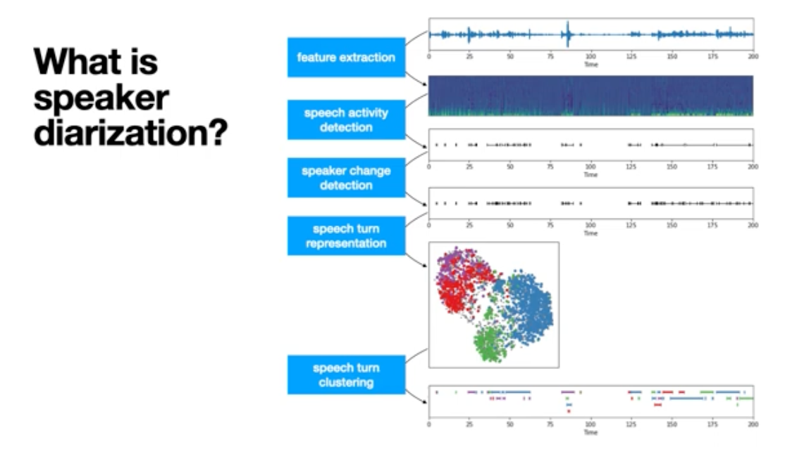
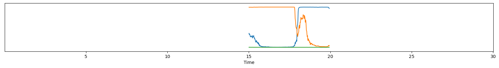
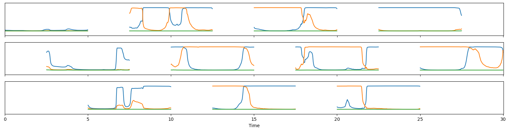
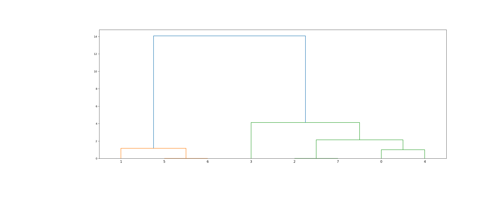
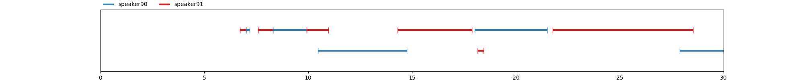

# PyannoteAudio : 話者分離を行うための機械学習モデル

# PyannoteAudio : 話者分離を行うための機械学習モデル

[](https://kyakuno.medium.com/?source=post_page---byline--fca61f4ef5d0---------------------------------------)

[Kazuki Kyakuno](https://kyakuno.medium.com/?source=post_page---byline--fca61f4ef5d0---------------------------------------)

9 min read

·

Apr 19, 2024

--

Share

話者分離を行うための機械学習モデルであるPyannoteAudioのご紹介です。PyannoteAudioを使用することで、高精度な話者分離が可能です。

## PyannoteAudioの概要

PyannoteAudioは、複数人が会話している音声ファイルを入力して、話者分離を行うための機械学習モデルです。時間ごとに、誰が発話しているかのIDを出力することが可能です。

Press enter or click to view image in full size



出典：<https://www.youtube.com/watch?v=37R_R82lfwA>

[## GitHub - pyannote/pyannote-audio: Neural building blocks for speaker diarization: speech activity…

### Neural building blocks for speaker diarization: speech activity detection, speaker change detection, overlapped speech…

github.com](https://github.com/pyannote/pyannote-audio?source=post_page-----fca61f4ef5d0---------------------------------------)

## PyannoteAudioのアーキテクチャ

PyannoteAudioのアーキテクチャは下記のBLOGで解説されています。

[## One speaker segmentation model to rule them all

### CNRS / IRIT / SAMoVA

herve.niderb.fr](https://herve.niderb.fr/fastpages/2022/10/23/One-speaker-segmentation-model-to-rule-them-all?source=post_page-----fca61f4ef5d0---------------------------------------)

### Segmentation

Segmentationでは、入力された波形から、話者の切り替え点を検知します。

入力波形があります。

Press enter or click to view image in full size


出典：<https://herve.niderb.fr/fastpages/2022/10/23/One-speaker-segmentation-model-to-rule-them-all>

segmentationモデルを使用して、3人の話者の会話の確率値を出力します。

Press enter or click to view image in full size



出典：<https://herve.niderb.fr/fastpages/2022/10/23/One-speaker-segmentation-model-to-rule-them-all>

確率値を元に2値化して、IDを付与します。

Press enter or click to view image in full size


出典：<https://herve.niderb.fr/fastpages/2022/10/23/One-speaker-segmentation-model-to-rule-them-all>

長い音声ファイルの場合、5秒ごとにSlidingWindowを使用して確率値を計算し、その結果を結合します。

Press enter or click to view image in full size



出典：<https://herve.niderb.fr/fastpages/2022/10/23/One-speaker-segmentation-model-to-rule-them-all>

この段階では、Window単位で独立に話者に分解されるため、Window間の話者の紐付けを行う必要があります。Windows間の話者の紐付けを行うため、Embeddingを使用します。

### Embedding

Embeddingでは、speaker-embeddingのモデルを使用することで、音声からEmbeddingを計算します。Embedding同士のユークリッド距離を計測することで、同一人物かどうかを判定し、Segmentationの結果に対してSpeakerIDを付与します。

## Get Kazuki Kyakuno’s stories in your inbox

Join Medium for free to get updates from this writer.

Subscribe

Subscribe

Remember me for faster sign in

まず、入力された音声全体を30msごとに10msオーバラップで分割してチャンクごとにEmbeddingを計算し、[AgglomerativeClustering](https://somathor.hatenablog.com/entry/2013/04/23/123552)による階層型クラスタリング（scipy.cluster.hierarchy.linkageとfcluster）を行います。

linkageによる階層型クラスタリングの動作は下記となります。Embedding同士の距離を計算し、最も近い距離のEmbeddingを結合する、という操作を、クラスタ数が1になるまで繰り返します。

Press enter or click to view image in full size



出典：<https://docs.scipy.org/doc/scipy/reference/generated/scipy.cluster.hierarchy.linkage.html>

最終的に、クラスタ間の距離がthreshold = 0.7045以上のクラスタは、別のSpeakerと判定されます。

クラスタリングを行ってクラスタを計算した後、Segmentationの結果にクラスターのIDを紐づけます。soft\_clusterには、チャンクのセグメンテーションのスピーカーに対して、クラスタごとの確率値が入ります。hard\_clusterには、チャンクのセグメンテーションのスピーカーに対して、クラスタのIDが入ります。

```
soft_clusters : (num_chunks, num_speakers, num_clusters)-shaped array  
hard_clusters : (num_chunks, num_speakers)-shaped array  
centroids : (num_clusters, dimension)-shaped array  
            Clusters centroids
```

## PyannoteAudioの使用方法

ailia SDKからPyannoteAudioを使用するには下記のコマンドを使用します。

```
python pyannote-audio.py -i ./data/sample.wav
```

出力例です。発話区間の秒数と、対応するスピーカーのIDが出力されます。

Press enter or click to view image in full size



```
[ 00:00:06.714 -->  00:00:07.003] A speaker91  
[ 00:00:07.003 -->  00:00:07.173] B speaker90  
[ 00:00:07.580 -->  00:00:08.310] C speaker91  
[ 00:00:08.310 -->  00:00:09.923] D speaker90  
[ 00:00:09.923 -->  00:00:10.976] E speaker91  
[ 00:00:10.466 -->  00:00:14.745] F speaker90  
[ 00:00:14.303 -->  00:00:17.886] G speaker91  
[ 00:00:18.022 -->  00:00:21.502] H speaker90  
[ 00:00:18.157 -->  00:00:18.446] I speaker91  
[ 00:00:21.774 -->  00:00:28.531] J speaker91  
[ 00:00:27.886 -->  00:00:29.991] K speaker90
```

[## ailia-models/audio\_processing/pyannote-audio at master · axinc-ai/ailia-models

### The collection of pre-trained, state-of-the-art AI models for ailia SDK - ailia-models/audio\_processing/pyannote-audio…

github.com](https://github.com/axinc-ai/ailia-models/tree/master/audio_processing/pyannote-audio?source=post_page-----fca61f4ef5d0---------------------------------------)

## PyannoteAudioの応用

PyannoteAudioの応用例として、入力波形に対して、WhisperによるSpeechToTextと、PyannoteAudioによる話者分離の両方を適用し、結果をタイムスタンプで統合することで、同じ話者のテキストを1行に統合することが可能です。また、議事録アプリなどで話者ごとに異なる色で表示することが可能です。

[## pyaanote.audio × Whisperで話者分離文字起こし〜パターン別比較 | R Tech Blog

### はじめに 文字起こしのための音声認識モデルとしてOpenAIが提供するWhisperが存在しますが、今のところ（2023年9月時点）複数人が話している音声に対してそれぞれを識別することはできません。…

r-tech14.com](https://r-tech14.com/pyannote-whisper-speaker-diarization/?source=post_page-----fca61f4ef5d0---------------------------------------)

## PyannoteAudioのC++実装

アイリア株式会社では、PyannoteAudioのC++ライブラリを販売しています。ailia SDKとPyannoteAudioを使用して、iOSやAndroidアプリに話者分離を導入可能です。詳細はお問い合わせください。

アイリア株式会社はAIを実用化する会社として、クロスプラットフォームでGPUを使用した高速な推論を行うことができるailia SDKを開発しています。アイリア株式会社ではコンサルティングからモデル作成、SDKの提供、AIを利用したアプリ・システム開発、サポートまで、 AIに関するトータルソリューションを提供していますのでお気軽に[お問い合わせ](https://axinc.jp/)ください。