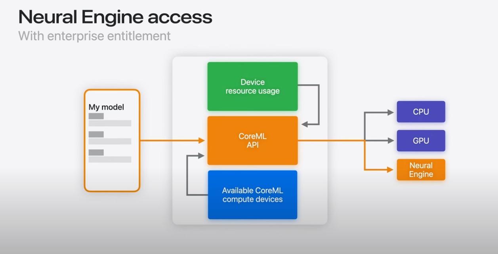
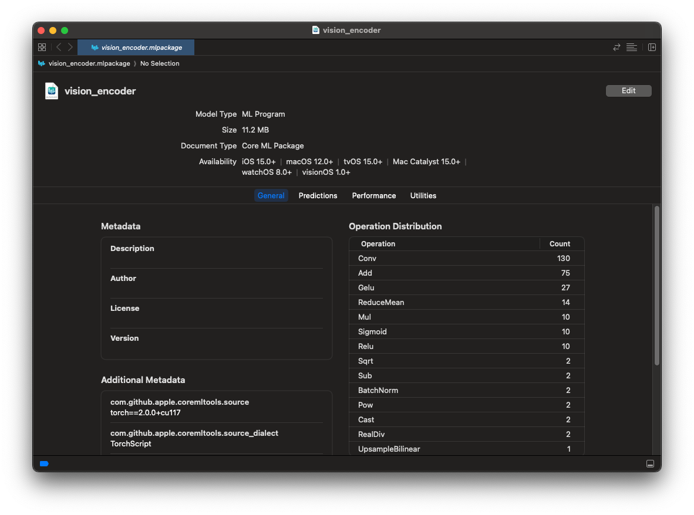
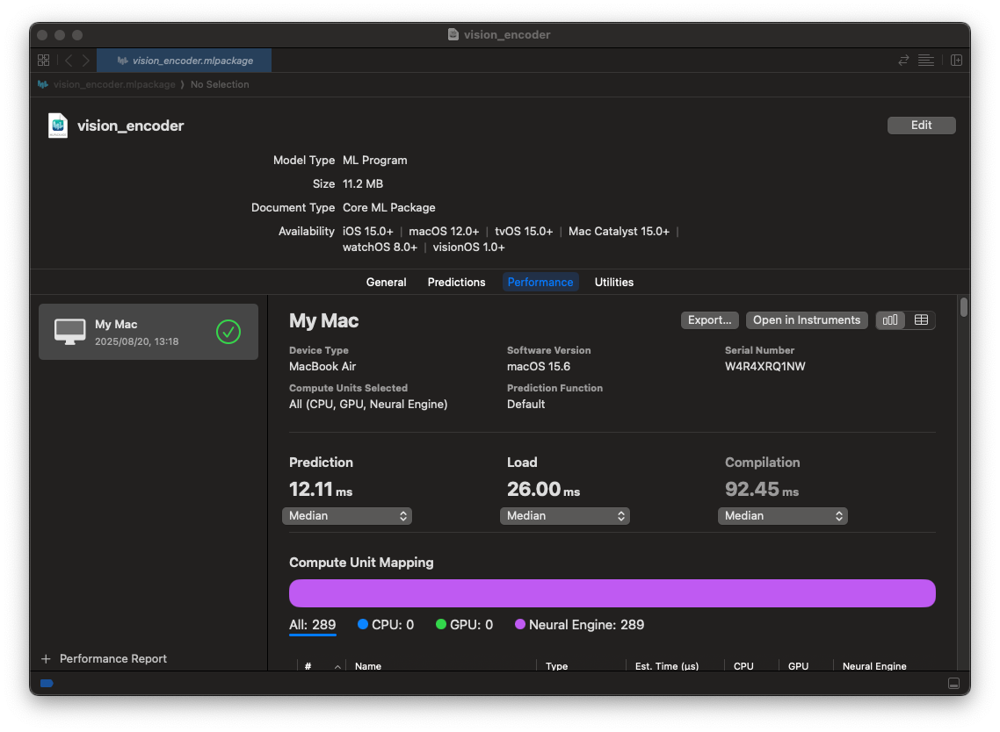
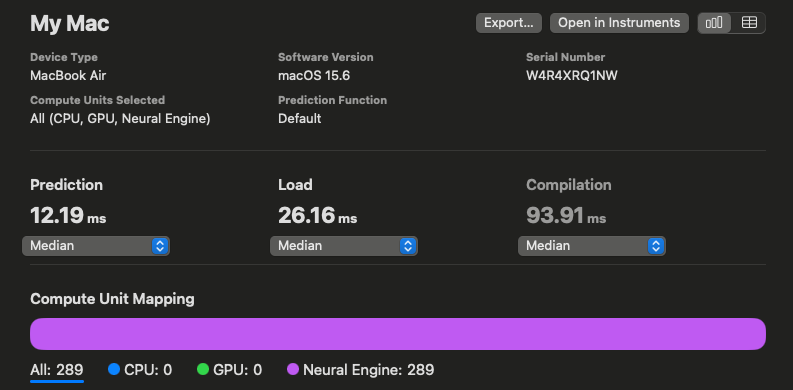
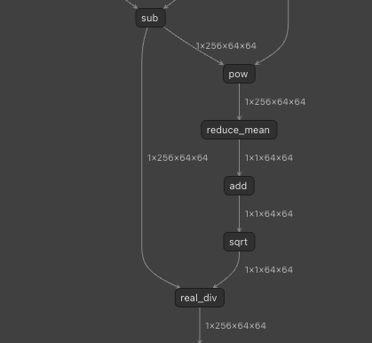
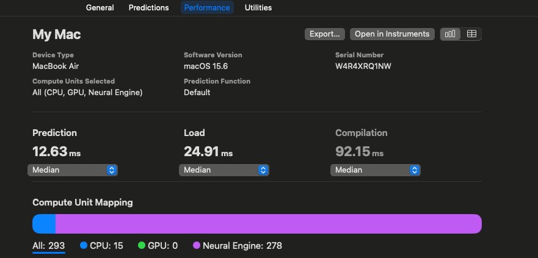
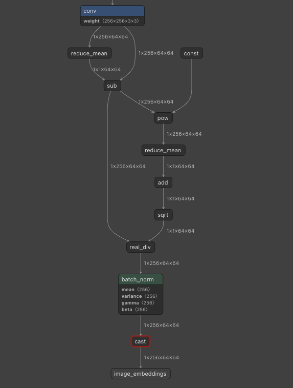

# CoreMLでMixed Precisionを使用する

# CoreMLでMixed Precisionを使用する

[](https://kyakuno.medium.com/?source=post_page---byline--b6e5c0bce9da---------------------------------------)

[Kazuki Kyakuno](https://kyakuno.medium.com/?source=post_page---byline--b6e5c0bce9da---------------------------------------)

14 min read

·

Aug 20, 2025

--

Share

CoreMLでMixed Precisionを使用することで速度を維持しながら精度を改善する方法を解説します。

## CoreMLについて

CoreMLはAppleの提供するAIフレームワークです。CoreMLは、CPU、GPU、ANE（NPU）を抽象化し、AppleのハードウェアでAIを高速に推論可能です。

Press enter or click to view image in full size



出典：<https://www.youtube.com/watch?v=LOYD9aQNuGM>

CoreMLのモデルはmlpackage形式となります。Pytochのモデルからcoremltoolsを使用することでmlpackageを出力可能です。


MLPACKAGEについて（出典：<https://developer.apple.com/documentation/coreml/>）

出力したmlpackageはPython APIで推論可能です。また、mlpackageからmlmodelcに変換することで、Swiftから推論可能です。

## ANEについて

ANEはAppleのNPUです。基本的にはFP16で推論することを想定したアーキテクチャとなっています。M3まではWeight Quantizatinにのみ対応しており、Int8化はモデルサイズの削減と、メモリバンド幅の節約のために使用されます。

なお、A17 proとM4では新規でInt8での演算に対応しており、用途によっては、更なる推論の高速化が期待されます。

Press enter or click to view image in full size


[## Overview

### This section covers optimization techniques that help you get a smaller model by compressing its weights and…

apple.github.io](https://apple.github.io/coremltools/docs-guides/source/opt-overview.html?source=post_page-----b6e5c0bce9da---------------------------------------)

## PytorchからCoreMLへのモデル変換

coremltoolsを使用し、torchのグラフからmlpackageを出力します。CoreMLのテンソルはFP16で動作します。そのため、mlpackageへの出力にキャリブレーションデータは不要です。coremltoolsはLinuxにも対応しており、macOSでない環境でも使用可能です。

```
import coremltools as ct  
import coremltools.optimize.coreml as cto  
  
def export_encoder(vision_encoder, args):  
    image_input = torch.randn(1, 3, 1024, 1024, dtype=torch.float)  
  
    traced_model = torch.jit.trace(vision_encoder, image_input)  
    outputs = [ct.TensorType(name="image_embeddings")]  
  
    coreml_model = ct.convert(  
        traced_model,  
        inputs=[ct.TensorType(shape=image_input.shape, name="image")],  
        outputs=outputs,  
        convert_to="mlprogram"  
    )  
    return coreml_model
```

変換したmlpackageはmacOSのFinderでダブルクリックすることで情報を見ることができます。

Press enter or click to view image in full size



Performanceで推論速度を計測することも可能です。

Press enter or click to view image in full size



## PythonでのCoreMLのモデルの推論

PythonでCoreMLモデルを推論するには下記のコードを使用します。mlpackageからMLModelのインスタンスを作成し、predictで推論します。

```
import coremltools as ct  
encoder_model_path = "encoder.mlpackage"  
encoder_model = ct.models.MLModel(encoder_model_path, ct.ComputeUnit.ALL)  
encoder_inputs = {  
    "image": image_input_expanded,  
}  
encoder_output = encoder_model.predict(encoder_inputs)  
embedding = encoder_output['image_embeddings']
```

## mlpackageからmlmodelcへの変換

mlpackageからmlmodelcに変換するには下記のコマンドを使用します。coremlcでcompileオプションを使用し、mlpackageを与えます。

```
/Applications/Xcode.app/Contents/Developer/usr/bin/coremlc compile encoder.mlpackage ./
```

## SwiftでのCoreMLのモデルの推論

SwiftでCoreMLモデルを推尊するには下記のコードを使用します。

```
private var encoderModel: MLModel?  
let encoderURL = URL(fileURLWithPath: "encoder.mlmodelc")  
encoderModel = try MLModel(contentsOf: encoderURL)  
  
imagePixel = Array(repeating: 0.0, count: totalPixels * 3)  
  
// fill imagePixel  
  
let inputArray = convertToMLMultiArray(  
            imagePixel: imagePixel,  
            inputShape: [1,3,  
                         inferenceSize.width as NSNumber,  
                         inferenceSize.height as NSNumber])  
let input = try MLDictionaryFeatureProvider(dictionary: [  
                "image": inputArray  // inputArray must be MLMultiArray  
            ])  
let result = try encoderModel.prediction(from: input)  
var imageEmbeddings: MLMultiArray! = nil  
imageEmbeddings = result.featureValue(for: "image_embeddings")?.multiArrayValue  
let pointer = UnsafeMutablePointer<Float32>(OpaquePointer(imageEmbeddings.dataPointer))
```

## CoreMLの精度について

CoreMLはデフォルトではFP16で動作します。TransformerのLayerNormなどはFP16ではレンジが不足することがあり、精度が低下する場合があります。

## Get Kazuki Kyakuno’s stories in your inbox

Join Medium for free to get updates from this writer.

Subscribe

Subscribe

Remember me for faster sign in

具体的に、FP16は指数部が5bitであり、最大値が65504になります。BFP16だと指数部がFP32と同じ8bitあるため、レンジ不足は発生しないのですが、ANE（NPU）のFP16だと、SquaredDifferenceやPowでオーバフローしてNaNになることがあります。

このような場合、FP16ではなくFP32で推論することで、オーバフローを抑制する必要があります。CoreMLでFP32のモデルを出力するには、ct.convertにcompute\_precision=ct.precision.FLOAT32を与えます。

```
import coremltools as ct  
import coremltools.optimize.coreml as cto  
  
def export_encoder(vision_encoder, args):  
    image_input = torch.randn(1, 3, 1024, 1024, dtype=torch.float)  
  
    traced_model = torch.jit.trace(vision_encoder, image_input)  
    outputs = [ct.TensorType(name="image_embeddings")]  
  
    coreml_model = ct.convert(  
        traced_model,  
        inputs=[ct.TensorType(shape=image_input.shape, name="image")],  
        outputs=outputs,  
        convert_to="mlprogram",  
        compute_precision=ct.precision.FLOAT32,  
    )  
    return coreml_model
```

ただし、FP32にすると、ANE（NPU）では実行できなくなり、全てGPUで実行されるため、推論速度は低下します。Vision Encoderの例だと、12.23msが35.57msに速度低下します。

Press enter or click to view image in full size



FP16での速度

Press enter or click to view image in full size


FP32での速度

## Mixed Precisionを使用する

全てのレイヤーをFP32にするのではなく、特定のレイヤーだけをFP32にすることで、高速化することを考えます。複数の精度を混合する方式をMixed Precisionと呼びます。

CoreMLでは、モデル変換時にcompute\_precisionを関数で与えることができ、指定したop\_typeだけをFP32にすることが可能です。下記の例では、l2\_normをFP32で実行しています。

```
def selector(op):  
    return op.op_type != "l2_norm"  
  
compute_precision = ct.transform.FP16ComputePrecision(op_selector=selector)  
  
coreml_model = ct.convert(  
    ...,  
    compute_precision=compute_precision,  
)
```

[## Convert OpenELM to float16 Core ML · Issue #95 · huggingface/swift-transformers

### I converted the models to float32 using this script: https://gist.github.com/pcuenca/23cd08443460bc90854e2a6f0f575084…

github.com](https://github.com/huggingface/swift-transformers/issues/95?source=post_page-----b6e5c0bce9da---------------------------------------)

[## more-ane-transformers/convert.py at main · smpanaro/more-ane-transformers

### Run transformers (incl. LLMs) on the Apple Neural Engine. - more-ane-transformers/convert.py at main ·…

github.com](https://github.com/smpanaro/more-ane-transformers/blob/main/convert.py?source=post_page-----b6e5c0bce9da---------------------------------------)

今回のモデルはLayerNormが含まれており、LayerNormはPowを含むため、FP16化するとレンジが不足し、精度が低下します。そこで、LayerNormに対応する区間をFP32で実行します。



LayerNormは複数のオペレータに分解される

具体的に、LayerNormに対応する、powで始まり、sqrtまでの区間をFP32で実行します。

```
import coremltools as ct  
import coremltools.optimize.coreml as cto  
  
layer_norm = False  
  
def op_selector(op):  
    global layer_norm  
    if op.op_type == "pow":  
        layer_norm = True  
    is_fp16 = not layer_norm  
    if op.op_type == "sqrt":  
        layer_norm = False  
    print(op.op_type, is_fp16)  
    return is_fp16  
  
def export_encoder(vision_encoder, args):  
    image_input = torch.randn(1, 3, 1024, 1024, dtype=torch.float)  
  
    traced_model = torch.jit.trace(vision_encoder, image_input)  
    outputs = [ct.TensorType(name="image_embeddings")]  
  
    coreml_model = ct.convert(  
        traced_model,  
        inputs=[ct.TensorType(shape=image_input.shape, name="image")],  
        outputs=outputs,  
        convert_to="mlprogram",  
        compute_precision=ct.transform.FP16ComputePrecision(op_selector)  
    )  
    return coreml_model
```

推論速度です。FP16の12.19ms、FP32の36.05msに対して、Mixed Precisionでは12.63msになります。PowはCPUで実行されますが、それ以外はANE（NPU）で実行されるため、FP32モデルよりも高速になります。

Press enter or click to view image in full size



## MLPackageのモデルの解析

MLPackageのモデルは、encoder.mlpackage/Data/com.apple.CoreML/model.mlmodelに含まれており、Netronで解析可能です。

Press enter or click to view image in full size


MLPackageの内部



Netronで可視化

## まとめ

CoreMLを使用することで、AppleデバイスでANE（NPU）を使用した推論が行えることを確認しました。また、Mixed Precisionを使用することで、精度と速度のバランスを取ることができることを確認しました。

## 検証環境

検証はMacBook M2とcoremltools==7.1で行いました。

アイリア株式会社では、[AIコンピューティング事業](https://ailia.ai/ai-computing/)として、お客様のAIモデルを高速化し、デバイス実装する開発サービスを提供しています。TorchのP2TEや、ailia SDK、ONNX Runtime、CoreML、QNNなどを駆使することで、近代的で大規模なTransformerモデルをお客様のデバイスに実装可能です。ご興味がありましたら、ぜひ、お気軽に[お問い合わせ](https://ailia.ai/ai-computing/contact.html)ください。

[アイリア株式会社](https://ailia.ai/)はAIを実用化する会社として、クロスプラットフォームでGPUを使用した高速な推論を行うことができるailia SDKを開発しています。アイリア株式会社ではコンサルティングからモデル作成、SDKの提供、AIを利用したアプリ・システム開発、サポートまで、 AIに関するトータルソリューションを提供していますのでお気軽に[お問い合わせ](https://ailia.ai/contact/)ください。