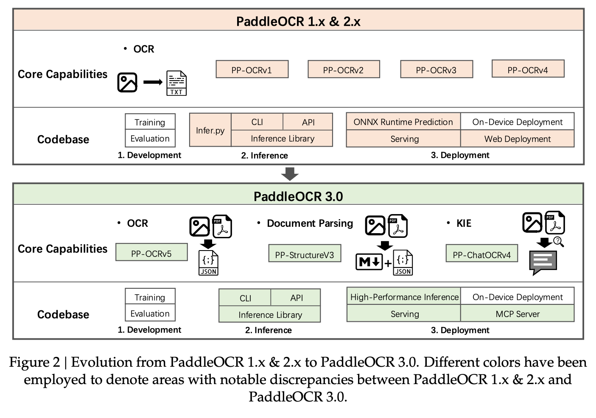
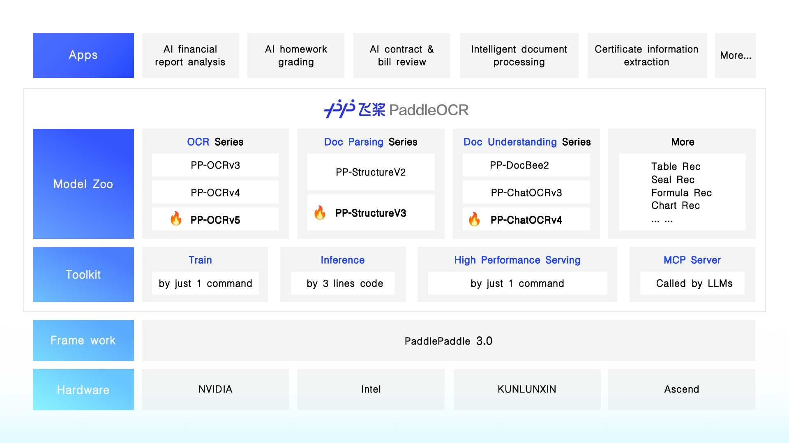
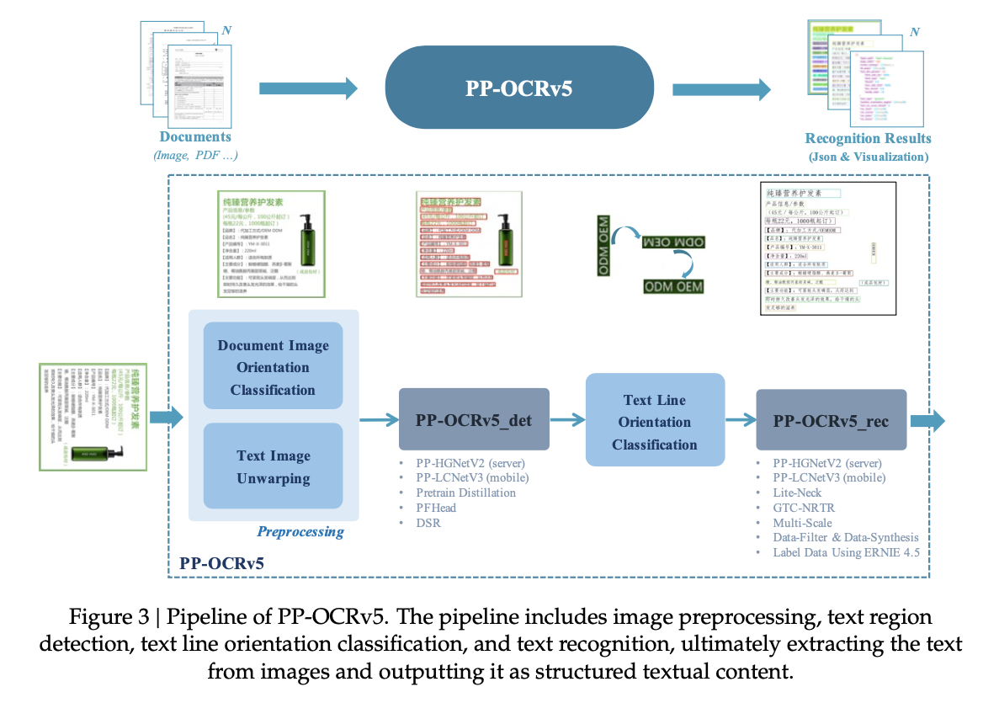
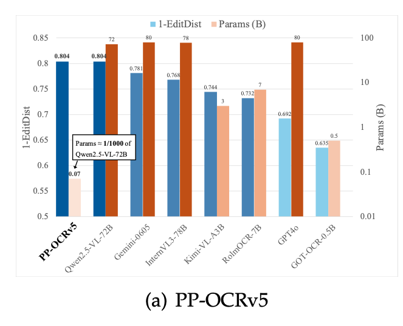
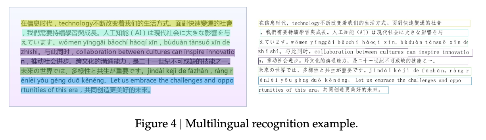
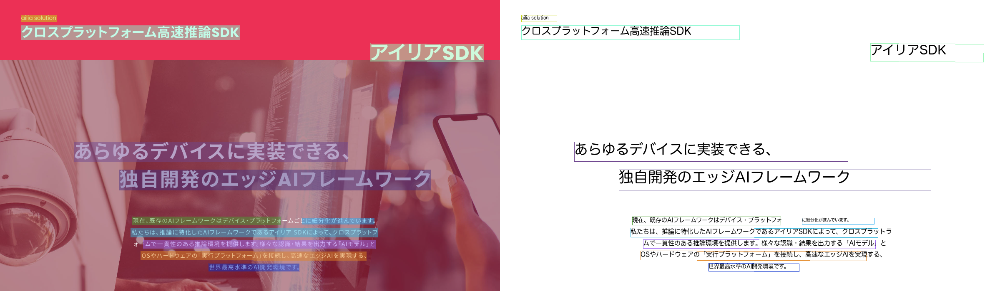
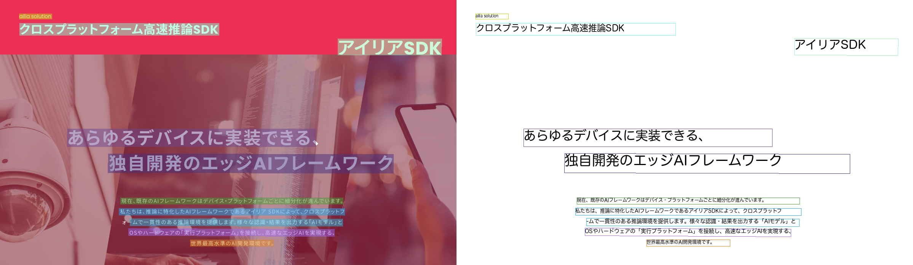
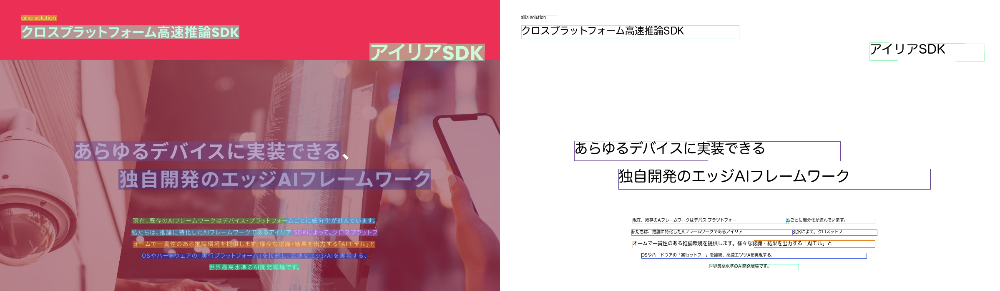

# PaddleOCR v3 : 日本語が高精度化した最新のOCRモデル

# PaddleOCR v3 : 日本語が高精度化した最新のOCRモデル

[](https://kyakuno.medium.com/?source=post_page---byline--7dfa93a3dfcd---------------------------------------)

[Kazuki Kyakuno](https://kyakuno.medium.com/?source=post_page---byline--7dfa93a3dfcd---------------------------------------)

8 min read

·

Sep 21, 2025

--

Share

日本語が高精度化した最新のOCRモデルであるPaddleOCR v3の紹介です。

## PaddleOCRについて

PaddleOCRはBaiduの開発した高速なOCRモデルです。2020年に公開されたv1では、日本語にも対応していましたが、軽量なMobileモデルのみが公開されており、精度に課題がありました。

[## PaddleOCR: 最新の軽量OCRシステム

### ailia SDKで使用できる機械学習モデルである「PaddleOCR」のご紹介です。「PaddleOCR」を使用することで日本語のOCRを簡単に実装することができます。

medium.com](https://medium.com/axinc/paddleocr-%E6%9C%80%E6%96%B0%E3%81%AE%E8%BB%BD%E9%87%8Focr%E3%82%B7%E3%82%B9%E3%83%86%E3%83%A0-8744205f3703?source=post_page-----7dfa93a3dfcd---------------------------------------)

## PaddleOCR v3について

PaddleOCR v3は2025年7月に公開された、PaddleOCRの最新版です。

Press enter or click to view image in full size



PaddleOCR v1からv3への変更点（出典：<https://arxiv.org/abs/2507.05595>）

PaddleOCR v3では、公式の高精度モデルに日本語が追加されました。モデルアーキテクチャとしては、PP-OCRv5が導入され、Universal Text Recognitionとして、1つのモデルで、Chinese、Tranditional Chinese、English、Japanese、Pinyinをサポートしています。PaddleOCR v1では言語を事前に指定する必要がありましたが、PaddleOCR v3では言語の指定が不要になっています。

Press enter or click to view image in full size



PaddleOCRの機能一覧（出典：<https://github.com/PaddlePaddle/PaddleOCR>）

PaddleOCR v3のテクニカルレポートは下記に公開されています。

[## PaddleOCR 3.0 Technical Report

### This technical report introduces PaddleOCR 3.0, an Apache-licensed open-source toolkit for OCR and document parsing. To…

arxiv.org](https://arxiv.org/abs/2507.05595?source=post_page-----7dfa93a3dfcd---------------------------------------)

## PP-OCRv5について

PP-OCRv5には、Detectionモデルと、Recognitionモデルが存在します。DetectionモデルとRecognitionモデルの入出力のフォーマットは従来のモデルと共通です。Orientation Classificationモデルは従来のモデルから更新はありません。

Press enter or click to view image in full size



PP-OCRv5のアーキテクチャ（出典：<https://arxiv.org/abs/2507.05595>）

テキスト検出モデルのアーキテクチャとしては、PP-HGNetV2を採用しています。学習においては、知識蒸留を使用しています。GOT-OCR2.0のVision Encoderを教師モデルとして利用しています。アーキテクチャはDBです。AIモデルの出力は、テキストの範囲を示す4点の座標です。

[## PaddleOCR/configs/det/PP-OCRv5/PP-OCRv5\_server\_det.yml at main · PaddlePaddle/PaddleOCR

### Turn any PDF or image document into structured data for your AI. A powerful, lightweight OCR toolkit that bridges the…

github.com](https://github.com/PaddlePaddle/PaddleOCR/blob/main/configs/det/PP-OCRv5/PP-OCRv5_server_det.yml?source=post_page-----7dfa93a3dfcd---------------------------------------)

テキスト認識モデルのアーキテクチャとしては、デュアルブランチを採用しています。入力ShapeはV1の(3, 32, 320)から、V3の(3, 48, 320)に解像度が上がっています。

[## PaddleOCR/configs/rec/PP-OCRv5/PP-OCRv5\_server\_rec.yml at main · PaddlePaddle/PaddleOCR

### Turn any PDF or image document into structured data for your AI. A powerful, lightweight OCR toolkit that bridges the…

github.com](https://github.com/PaddlePaddle/PaddleOCR/blob/main/configs/rec/PP-OCRv5/PP-OCRv5_server_rec.yml?source=post_page-----7dfa93a3dfcd---------------------------------------)

テキスト検出モデルで検知した結果から、テキスト認識モデルの入力画像をリサイズする際、V1では、バッチ入力するテキストの最大のアスペクト比であるmax\_wh\_ratioを用いて、predict\_rec.pyのresize\_norm\_imageでテンソルの横幅を決定していました。

```
imgW = int((32 * max_wh_ratio))
```

V3では、高さが32とは限らなくなったため、テキスト検出モデルの要求高さであるimgHを使用して計算するようになっています。

```
imgW = int((imgH * max_wh_ratio))
```

[## add ppocrv3 rec by andyjiang1116 · Pull Request #6033 · PaddlePaddle/PaddleOCR

### add ppocrv3 rec

by andyjiang1116 · Pull Request #6033 · PaddlePaddle/PaddleOCR
add ppocrv3 recgithub.com](https://github.com/PaddlePaddle/PaddleOCR/pull/6033?source=post_page-----7dfa93a3dfcd---------------------------------------)

## PP-OCRv5のデータセット

PP-OCRv5のデータセットは非公開のデータセットです。手書きデータは、中国語および英語のみ含まれています。

## PP-OCRv5の精度

PP-OCRv5はOCRの性能の高いVLMとして知られるQwen2.5-VL-72Bの1/1000のパラメータ数で、Qwen2.5-VL-72Bと同等の精度を持っています。



PP-OCRv5の精度（出典：<https://arxiv.org/abs/2507.05595>）

PP-OCRv5では、単一モデルで多言語対応が可能です。

Press enter or click to view image in full size



PP-OCRv5のマルチリンガル処理（出典：<https://arxiv.org/abs/2507.05595>）

## ailia SDKでPaddleOCR v3を使用する

ailia SDKでPaddleOCR v3を使用するには、下記のコマンドを使用します。PaddleOCR v3はマルチリンガルモデルであるため、言語指定が不要になりました。軽量なモバイルモデルと、高精度なサーバモデルを選択可能です。デフォルトでサーバモデルで動作します。

```
python3 paddleocr_v3.py -i input.jpg -c mobile  
python3 paddleocr_v3.py -i input.jpg -c server
```

[## ailia-models/text\_recognition/paddleocr\_v3 at master · axinc-ai/ailia-models

### The collection of pre-trained, state-of-the-art AI models for ailia SDK - ailia-models/text\_recognition/paddleocr\_v3 at…

github.com](https://github.com/axinc-ai/ailia-models/tree/master/text_recognition/paddleocr_v3?source=post_page-----7dfa93a3dfcd---------------------------------------)

## 実行例

実行例です。v1からv3になり、detとrecの両方のモデルの性能が向上しています。

## Get Kazuki Kyakuno’s stories in your inbox

Join Medium for free to get updates from this writer.

Subscribe

Subscribe

Remember me for faster sign in

PaddleOCR v1 (japanese mobile)

Press enter or click to view image in full size


PaddleOCR v1 (japanese server) (独自学習モデル)

Press enter or click to view image in full size



PaddleOCR v3 (mobile)

Press enter or click to view image in full size



PaddleOCR v3 (server)

Press enter or click to view image in full size



[アイリア株式会社](https://ailia.ai/)はAIを実用化する会社として、クロスプラットフォームでGPUを使用した高速な推論を行うことができるailia SDKを開発しています。アイリア株式会社ではコンサルティングからモデル作成、SDKの提供、AIを利用したアプリ・システム開発、サポートまで、 AIに関するトータルソリューションを提供していますのでお気軽に[お問い合わせ](https://ailia.ai/contact/)ください。