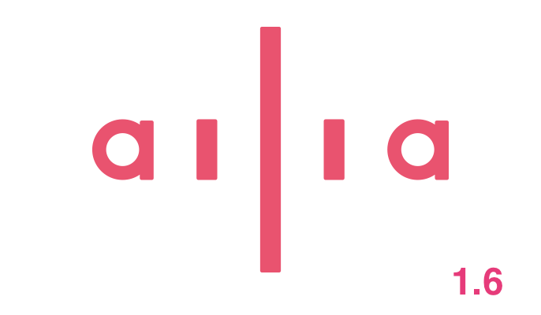
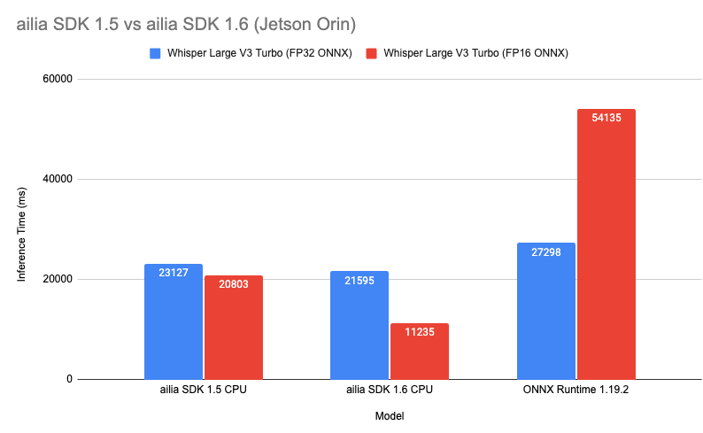
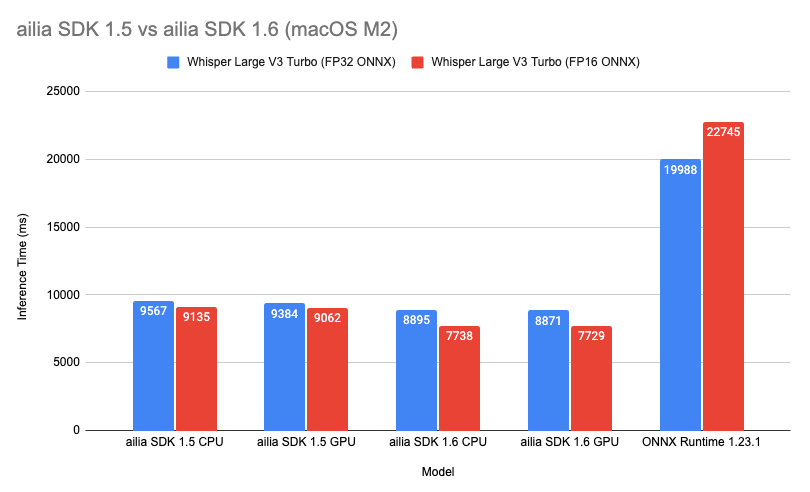
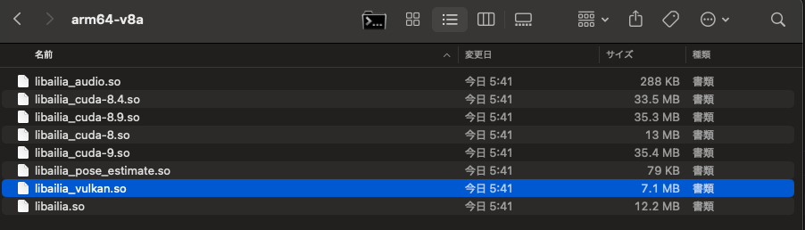

# ailia SDK 1.6をリリース

# ailia SDK 1.6をリリース

[](https://kyakuno.medium.com/?source=post_page---byline--c602b3b2df72---------------------------------------)

[Kazuki Kyakuno](https://kyakuno.medium.com/?source=post_page---byline--c602b3b2df72---------------------------------------)

7 min read

·

Oct 31, 2025

--

Share

Arm v8.2のNEON-FP16命令とLinux Arm64のVulkan対応を行ったailia SDK 1.6をリリースしました。



## 新機能

### Arm v8.2のFP16命令による高速化

CPU推論において、Arm v8.2のFP16命令に対応しました。

従来の実装では、FP16の重みはFP32に変換され、FP32のNEON-FP32で演算を行なっていました。ailia SDK 1.6では、NEON-FP16命令を使用し、FP16のまま演算を行うことで、従来よりも高速に推論が可能です。NEON-FP32のレジスタ長は128bitであり、FP32の場合は4並列でSIMD演算を行いますが、NEON-FP16では8並列でSIMD演算を行うことが可能です。

## Get Kazuki Kyakuno’s stories in your inbox

Join Medium for free to get updates from this writer.

Subscribe

Subscribe

Remember me for faster sign in

Jetson AGX OrinのArm Cortex-A78AE (12core) における推論速度の比較です。Whisper Large V3 Turboを使用し、11秒の音声をCPUで音声認識する時間を評価しています。FP16のONNXを使用し、ArmのNEON-FP16命令を使用することで、従来よりも1.85倍の速度で推論が可能です。

Press enter or click to view image in full size



M2 Macでの比較です。M2にはApple独自の行列積であるAMXが搭載されており、Accelerate Framework経由で使用します。Accelerate FrameworkがFP32のみの対応であるため、FP16からFP32への変換コストが発生しており、Jetsonほどは高速化しません。しかし、Gemm以外のレイヤーがNEON-FP16で高速化されるため、トータルでは1.15倍の速度で推論が可能です。

Press enter or click to view image in full size



実際に試してみるには、ailia-modelsのWhisperで — fp16オプションを付与します。このオプションで、FP16のONNXが使用可能です。

```
python3 whisper.py -b -m turbo   
python3 whisper.py -b -m turbo --fp16
```

[## ailia-models/audio\_processing/whisper at master · axinc-ai/ailia-models

### The collection of pre-trained, state-of-the-art AI models for ailia SDK - ailia-models/audio\_processing/whisper at…

github.com](https://github.com/axinc-ai/ailia-models/tree/master/audio_processing/whisper?source=post_page-----c602b3b2df72---------------------------------------)

手元のFP32のONNXをFP16モデルに変換するには、onnx\_converter\_commonを使用します。keep\_io\_types=Trueと設定することで、入出力はFP32のまま、内部のテンソルとウエイトだけをFP16に変換可能です。

```
import onnx  
from onnxconverter_common.float16 import convert_float_to_float16  
model = onnx.load("encoder_turbo.onnx")  
model_fp16 = convert_float_to_float16(model, disable_shape_infer=True, keep_io_types=True)  
onnx.save(model_fp16, "encoder_turbo_fp16.onnx")
```

[## Float16 and mixed precision models

### ONNX Runtime: cross-platform, high performance ML inferencing and training accelerator

onnxruntime.ai](https://onnxruntime.ai/docs/performance/model-optimizations/float16.html?source=post_page-----c602b3b2df72---------------------------------------)

### Linux Arm64のVulkan対応

Linux Arm64でもVulkanが使用できるようになりました。今までよりも多くの環境でVulkanによるGPU推論に対応します。

Press enter or click to view image in full size



Linux/Arm64向けのパッケージにlibailia\_vulkan.soを追加

### 新しいレイヤーへの対応

Multinomial、Blackman Window、Hann Window、Hamming Window、MelWeightMatrix、Shrinkに対応しました。

## 最適化

### CPU / GPUの高速化

各種のレイヤーのCPU / GPU高速化を行いました。また、VulkanのDynamic Shapeの高速化を行いました。

### メモリ使用量削減

FP16のONNXモデルの場合は、ウエイトをFP16のまま保持するようになりました。メモリ使用量を削減可能です。

### Attentionの高速化

CUDAおよびVulkanにFlash Attentionを導入することで、高速化を行いました。

## プラットフォーム対応

### Google Pixel 10対応

Google Pixel 10への対応と最適化を行いました。Pixel10で採用されたImagination TechnologiesのPowerVRにおいて、PowerVR特有の挙動でVulkanで期待値エラーが発生する問題の修正を行なっています。また、ArmのSVEのベクトル長がNEONと同じ場合は、SVEではなくNEONの方を呼び出すように最適化しています。

### Androidの16KBページサイズ対応

Androidのストア要件に対応して、16KBページサイズに対応しました。

### Raspberry Pi 5対応

Arm64の評価版バイナリでRaspberry Pi5に対応しました。ailia SDK 1.5の評価版はページサイズが小さいためにRaspberry Pi5の64bitモードで動作しない問題を修正しています。

## ダウンロード

ailia SDK 1.6は下記のページからダウンロード可能です。また、Python向けはpip3 install ailiaでもインストール可能です。

[## ailia Inc.

### アイリア株式会社のコーポレートサイトです。あらゆるデバイスにAI が載る未来。そのような未来が来ることを我々は信じています。その未来に向けて我々は高速なSDK を開発し、最新のAI モデルを常に研究し続けます。アイリア株式会社は最新のAI…

ailia.ai](https://ailia.ai/trial/?source=post_page-----c602b3b2df72---------------------------------------)

[アイリア株式会社](https://ailia.ai/)はAIを実用化する会社として、クロスプラットフォームでGPUを使用した高速な推論を行うことができるailia SDKを開発しています。アイリア株式会社ではコンサルティングからモデル作成、SDKの提供、AIを利用したアプリ・システム開発、サポートまで、 AIに関するトータルソリューションを提供していますのでお気軽に[お問い合わせ](https://ailia.ai/contact/)ください。