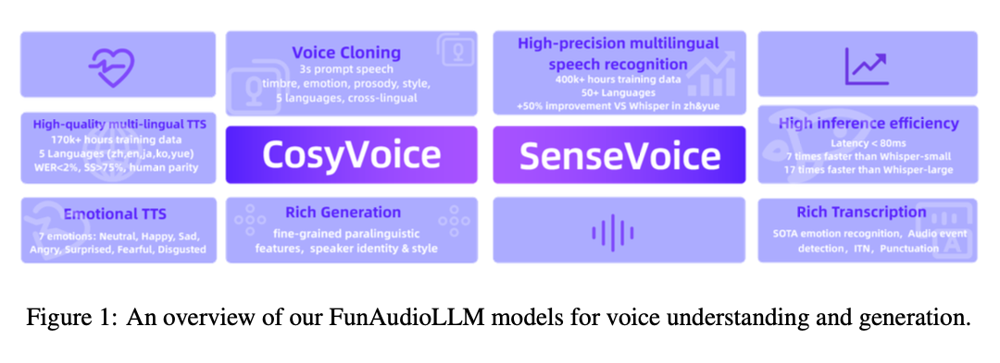
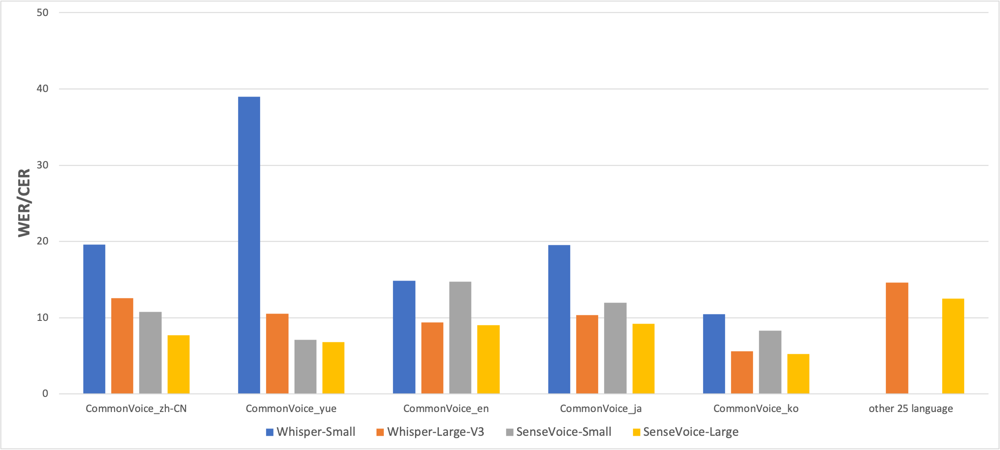
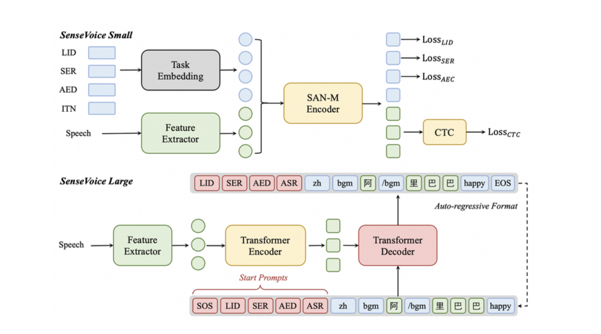
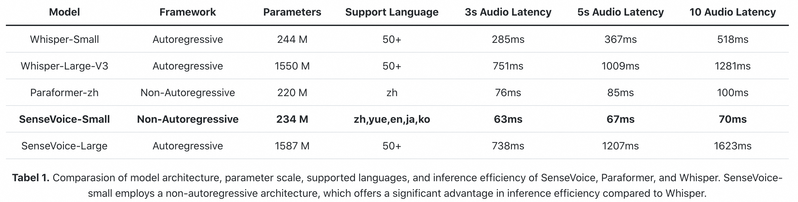
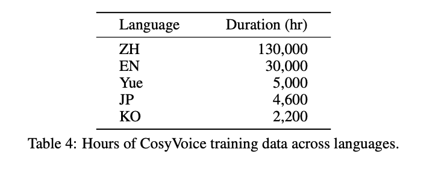
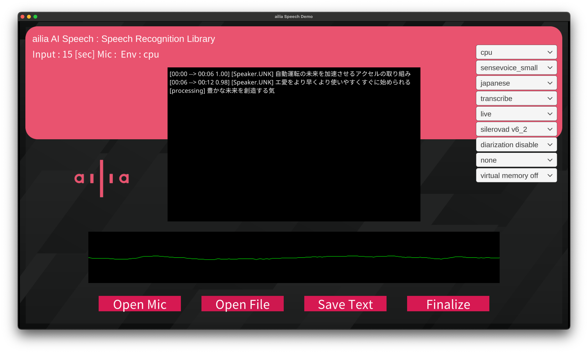

# SenseVoice : 日本語にも対応した高速な音声認識モデル

# SenseVoice : 日本語にも対応した高速な音声認識モデル

[](https://kyakuno.medium.com/?source=post_page---byline--3721c79e0592---------------------------------------)

[Kazuki Kyakuno](https://kyakuno.medium.com/?source=post_page---byline--3721c79e0592---------------------------------------)

12 min read

·

Dec 25, 2025

--

Share

Alibabaの開発した高速な音声認識モデルであるSenseVoiceの紹介です。

## SenseVoiceの概要

SenseVoiceはAlibabaが2024年7月に公開した音声認識モデルです。中国語、英語、日本語、韓国語の4言語に対応しています。SenseVoice-SmallはWhisper-Largeよりも15倍高速、Whisper-Smallよりも5倍高速で、Whisper-Largeに近い精度を実現しています。

Press enter or click to view image in full size



出典：<https://arxiv.org/abs/2407.04051>

[## GitHub - FunAudioLLM/SenseVoice: Multilingual Voice Understanding Model

### Multilingual Voice Understanding Model. Contribute to FunAudioLLM/SenseVoice development by creating an account on…

github.com](https://github.com/FunAudioLLM/SenseVoice?source=post_page-----3721c79e0592---------------------------------------)

## SenseVoiceの認識精度

中国語、英語、日本語、韓国語での認識精度比較です。WERはワードエラーレートで、低いほど高精度になります。日本語（ja）では、Sense-Voice-SmallはWhisper-Smallよりも高精度で、Whisper-Largeに近い性能を持ちます。

Press enter or click to view image in full size



出典：<https://github.com/FunAudioLLM/SenseVoice/blob/main/README_ja.md>

## SenseVoiceのアーキテクチャ

SenseVoiceは非自己回帰のアーキテクチャを採用しています。Whisperでは、複数回の推論を繰り返すことで、1トークンずつデコードしていきます。SenseVoiceでは、全てのトークンを1回でまとめてデコードし、[CTC（Connectionist Temporal Classification）](https://distill.pub/2017/ctc/)によってトークンを選択することで、高速な推論を実現しています。

Press enter or click to view image in full size



出典：<https://arxiv.org/abs/2407.04051>

Whisperとは異なり、前フレームの音声認識結果は参照せず、ステートレスになっています。VADで分割した単位で独立して音声認識が実行されるため、音声間の文脈は考慮されません。また、タイムスタンプもありません。

モデルサイズの比較です。ONNXだとSenseVoice-SmallはFP32で936.9MBとなり、Whisper-SmallのEncoderとDecoderを合わせた1127.8MBに比べて小さくなっています。

Press enter or click to view image in full size



出典：<https://github.com/FunAudioLLM/SenseVoice/blob/main/README_ja.md>

音声波形は16kHzで扱います。音声波形をMelSpectrumに変換した後、CMVNで平均と分散を使用した正規化を行います。その後、MelSpectrumを入力として推論を行い、出てきたlogitsをCTCによってトークンに変換します。最後にトークンをSentenePieceでテキストに戻します。非常にシンプルなアーキテクチャとなっています。

最大で入力可能な音声の長さは30秒になります。そのため、30秒以上の音声を入力する場合、事前にVADで音声を分割する必要があります。

## SenseVoiceのデータセット

SenseVoiceのデータセットは下記となります。日本語は4600時間のデータで学習されています。

Press enter or click to view image in full size



出典：<https://arxiv.org/abs/2407.04051>

## SenseVoice特有の機能

SenseVoiceでは、感情とイベントを認識可能です。音声認識結果に下記のトークンが含まれています。

```
emo_dict = {  
    "<|HAPPY|>": "😊",  
    "<|SAD|>": "😔",  
    "<|ANGRY|>": "😡",  
    "<|NEUTRAL|>": "",  
    "<|FEARFUL|>": "😰",  
    "<|DISGUSTED|>": "🤢",  
    "<|SURPRISED|>": "😮",  
}  
  
event_dict = {  
    "<|BGM|>": "🎼",  
    "<|Speech|>": "",  
    "<|Applause|>": "👏",  
    "<|Laughter|>": "😀",  
    "<|Cry|>": "😭",  
    "<|Sneeze|>": "🤧",  
    "<|Breath|>": "",  
    "<|Cough|>": "🤧",  
}
```

## SenseVoiceを使用したストリーミング

SenseVoiceは非常に高速であるため、30秒やVADの終了を待たずに、PCMバッファを毎回デコードして結果をプレビューすることで、ストリーミングのような動作を行うことが可能です。

[## GitHub — pengzhendong/streaming-sensevoice: Pseudo Streaming SenseVoice with Hotwords

### Pseudo Streaming SenseVoice with Hotwords. Contribute to pengzhendong/streaming-sensevoice development by creating an…

github.com](https://github.com/pengzhendong/streaming-sensevoice?source=post_page-----3721c79e0592---------------------------------------)

## SenseVoiceの推論の例

ailia SDK 1.6を使用してWhisperとSenseVoiceで40秒の音声を推論した場合の速度と精度の比較です。環境はM2 MacのCPUです。

## Get Kazuki Kyakuno’s stories in your inbox

Join Medium for free to get updates from this writer.

Subscribe

Subscribe

Remember me for faster sign in

日本語に対しても、Whisper Tinyと同等の速度で、Whisper Tinyよりも高品質な音声認識が可能です。

Whisper-Large V3 Turbo (18798ms)

```
python3 whisper.py -m turbo -i ax.wav -b -e 1
```

```
[00:00.860 --> 00:03.780] 自動運転の未来を加速させる  
[00:03.780 --> 00:06.000] アクセルの取り組み  
[00:06.000 --> 00:11.460] AIをより早く、より使いやすく、すぐに始められる  
[00:11.460 --> 00:16.600] 豊かな未来を創造する企業の良き理解者になる  
[00:16.600 --> 00:20.860] AI実装に必要な学習から推論まで  
[00:20.860 --> 00:23.000] トータルソリューションを提供できる  
[00:23.760 --> 00:27.800] アクセルはテクノロジーで未来を加速させる  
[00:27.800 --> 00:34.180] アクセルでは、ハードウェア、ソフトウェア、要素技術の  
[00:34.180 --> 00:39.040] 3つの開発力をもとに、5つの事業領域に展開をしています  
 INFO whisper.py (1113) :  total processing time 18798 ms  
 INFO whisper.py (1124) : Script finished successfully.
```

Whisper-Small (8451ms)

```
python3 whisper.py -m small -i ax.wav -b -e 1
```

```
[00:00.000 --> 00:06.000] 自動運転の未来を加速させるアクセルの取り組み  
[00:06.000 --> 00:12.000] AIをより早く、より使いやすく、すぐに始められる  
[00:12.000 --> 00:17.000] 豊かな未来を想像する企業の良き理解者になる  
[00:17.000 --> 00:23.000] AI実装に必要な学習から推論までトータルソリューションを提供できる  
[00:23.000 --> 00:29.000] アクセルはテクノロジーで未来を加速させる  
[00:30.000 --> 00:37.000] アクセルでは、ハードメア、ゾップトメア、要素技術の3つの開発力を基に  
[00:37.000 --> 00:40.000] 5つの事業領域に展開をしています  
 INFO whisper.py (1113) :  total processing time 8451 ms
```

Whisper-Tiny (2112ms)

```
python3 whisper.py -m tiny -i ax.wav -b -e 1
```

```
[00:00.000 --> 00:07.000] 自動運転の未来を重くさせる アクセルの取り組み  
[00:07.000 --> 00:12.000] AIをより早くより使いやすく 常に始められる  
[00:12.000 --> 00:17.000] ユタカな未来を想像する気によるのを よき理解さになる  
[00:17.000 --> 00:24.000] AI実想に必要な学習からスイロンマリ 通宅ソリューションの提供できる  
[00:24.000 --> 00:29.000] アクセルはテクノロシューで未来を重くさせる  
[00:30.000 --> 00:37.000] アクセルではアープメー ソップメース 両速実の3つの開発力を求める  
[00:37.000 --> 00:40.000] 実の事業力に気に点かいをしています  
 INFO whisper.py (1113) :  total processing time 2112 ms
```

Sense Voice (1954ms)

```
python3 sensevoice.py -i ax.wav -b -e 1
```

```
[00:00.000 --> 00:00.710]   
[00:00.990 --> 00:03.970] 🎼自動運転の未来を加速させる  
[00:04.250 --> 00:05.640] 🎼アクセルの取り組み  
[00:07.230 --> 00:09.900] 🎼エーアイをより早くより使いやすく  
[00:10.180 --> 00:11.680] 🎼すぐに始められる  
[00:12.370 --> 00:16.350] 🎼豊かな未来を創造する企業の良き理解者になる  
[00:17.350 --> 00:23.360] 🎼エーア実装に必要な学習から推論までトータルソリューションを提供できる  
[00:23.970 --> 00:28.070] 🎼アクセルはテクノロジーで未来を加速させる  
[00:29.580 --> 00:39.720] 🎼アクセルではハードウェアソフトウェア要素技術の三つの開発力をもに5つの事業領域に展開をしています😊  
 INFO sensevoice.py (141) :  s2t processing time 1954 ms
```

## SenseVoiceの使用方法

ailia SDKでSenseVoiceを使用するには下記のコマンドを使用します。長い音声を入力した場合、VADも自動的に適用されます。

```
python3 sensevoice.py -i ja.wav
```

[## ailia-models/audio\_processing/sensevoice at master · axinc-ai/ailia-models

### The collection of pre-trained, state-of-the-art AI models for ailia SDK - ailia-models/audio\_processing/sensevoice at…

github.com](https://github.com/axinc-ai/ailia-models/tree/master/audio_processing/sensevoice?source=post_page-----3721c79e0592---------------------------------------)

## アプリでSenseVoiceを試す

iOSとAndroidでは、アイリア株式会社の提供するailia AI Showcaseの音声認識タブでSenseVoiceを実行することが可能です。アプリでマイクからの認識精度と推論速度を確認可能です。

[AppStoreでダウンロード](https://apps.apple.com/jp/app/ailia-ai-showcase/id1522828798)  
[Google Playでダウンロード](https://play.google.com/store/apps/details?id=jp.axinc.ailia_ai_showcase&hl=ja)

WindowsとmacOSでは、アイリア株式会社の提供するailia AI SpeechのデモアプリでSenseVoiceを実行することが可能です。マイクとファイルからの認識精度と推論速度を確認可能です。下記のページの「AIを使ってみる」からダウンロードしてください。

[## AI Speech ｜ailia AI Series

### オフラインでも動く！どんなプラットフォームにも対応する、リアルタイム音声認識機能「AI Speech」です。

www.ailia.ai](https://www.ailia.ai/speech?source=post_page-----3721c79e0592---------------------------------------)

Press enter or click to view image in full size



Windows / macOS向けのデモアプリ

ailia AI Speechはアイリア株式会社の提供する音声認識ミドルウェアです。バージョン1.5からSenseVoiceを使用可能です。ailia AI SpeechはPython / C# (Unity) / C++ / Kotlin / Flutterから使用できる音声認識ライブラリです。Windows / macOS / Android / iOS / Linux / RaspberryPi / Jetsonで簡単にVADとSenseVoiceを組み合わせて使用可能です。また、話者分離も適用可能です。

[アイリア株式会社](https://ailia.ai/)はAIを実用化する会社として、クロスプラットフォームでGPUを使用した高速な推論を行うことができるailia SDKを開発しています。アイリア株式会社ではコンサルティングからモデル作成、SDKの提供、AIを利用したアプリ・システム開発、サポートまで、 AIに関するトータルソリューションを提供していますのでお気軽に[お問い合わせ](https://ailia.ai/contact/)ください。