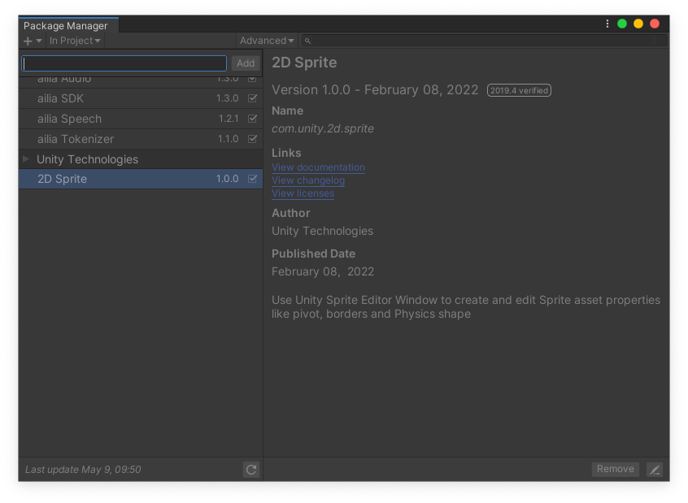
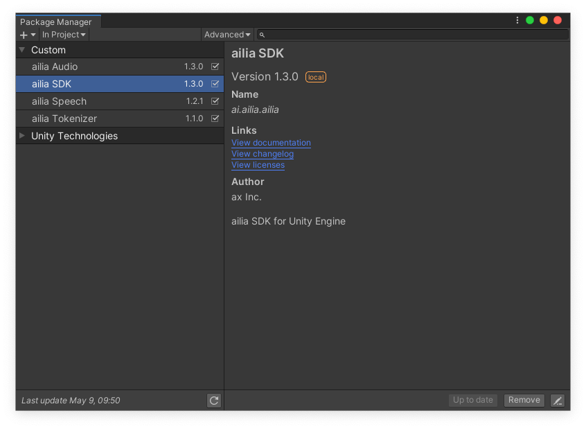
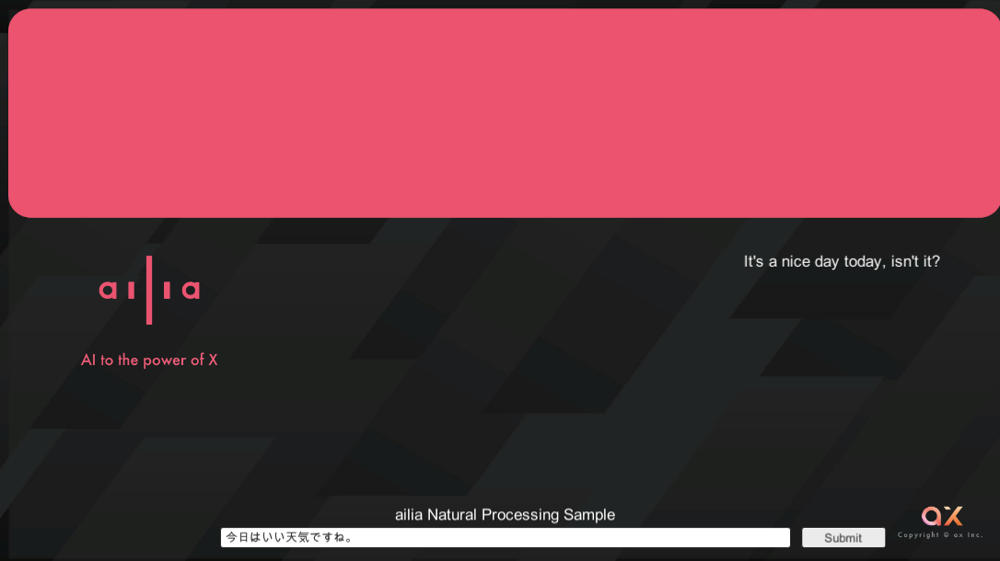
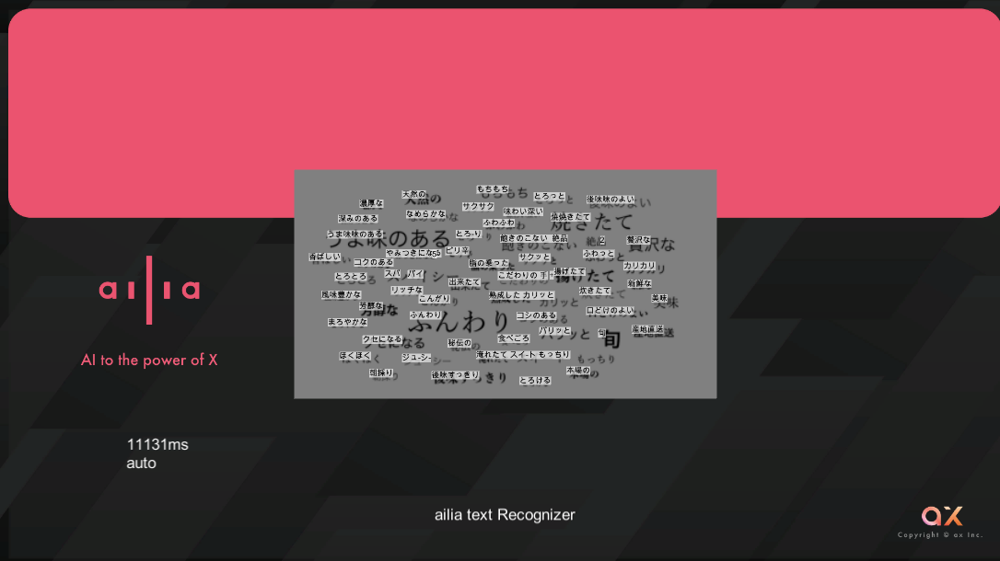
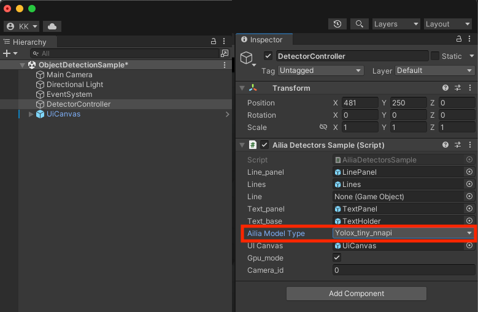

# ailia SDKがUnity Package Managerでインストール可能に

# ailia SDKがUnity Package Managerでインストール可能に

[](https://kyakuno.medium.com/?source=post_page---byline--0ecce0f2ab38---------------------------------------)

[Kazuki Kyakuno](https://kyakuno.medium.com/?source=post_page---byline--0ecce0f2ab38---------------------------------------)

8 min read

·

May 9, 2024

--

Share

ailia SDKのUnity Package Managerでの提供を開始しました。これにより、従来よりも簡単にailia SDKをUnityのアプリケーションに取り込むことが可能になります。

## ailia SDKについて

ailia SDKはAIの推論エンジンで、ailia MODELSに公開されている各種のAIモデルを簡単にUnityに取り込むことが可能です。開発したアプリケーションは、Windows、macOS、iOS、Android、Linuxで実行可能です。

## Unity Package Managerについて

Unity Package ManagerはUnity公式のパッケージ管理ツールです。githubのURLを登録することで、簡単に各種のパッケージを導入することが可能です。

## ailia SDKのUnity Package Managerでのインストール

従来、ailia SDKはUnity Packageで提供していたため、評価版のダウンロードとライセンスファイルの設定の作業が必要でした。Unity Package Managerを使用することで、Unity上でURLを登録するだけでailia SDKを使用することができます。

Press enter or click to view image in full size


ailia x Unity Package Manager

ウィンドウメニューのPackage Managerを開きます。

Press enter or click to view image in full size


UnityのPackage Manager

左上の+から、Add Package from git urlを指定します。

Press enter or click to view image in full size



Packageの追加

下記のURLのうち、必要なものを追加してAddを押します。

[ailia SDK](https://github.com/axinc-ai/ailia-sdk-unity)（コアモジュール）  
https://github.com/ailia-ai/ailia-sdk-unity.git

[ailia Audio](https://github.com/axinc-ai/ailia-audio-unity)（音声処理に必要）  
https://github.com/ailia-ai/ailia-audio-unity.git

[ailia Tokenizer](https://github.com/axinc-ai/ailia-tokenizer-unity)（自然言語処理に必要）  
https://github.com/ailia-ai/ailia-tokenizer-unity.git

[ailia Speech](https://github.com/axinc-ai/ailia-speech-unity)（音声認識に必要）  
https://github.com/ailia-ai/ailia-speech-unity.git

[ailia TFLite Runtime](https://github.com/axinc-ai/ailia-tflite-unity) (AndroidのNPU推論に必要）  
https://github.com/ailia-ai/ailia-tflite-unity.git

## Get Kazuki Kyakuno’s stories in your inbox

Join Medium for free to get updates from this writer.

Subscribe

Subscribe

Remember me for faster sign in

インストールすると、下記のようにリストに表示されます。

Press enter or click to view image in full size



インストールされたailia

インストールしたパッケージは、プロジェクトのPackagesに表示されます。

Press enter or click to view image in full size


Packagesに含まれるailia

Windowsの場合で、「No ‘git’ executable was found. Please install Git on your system then restart Unity and Unity Hub」というエラーが発生した場合は、下記のURLからgitをインストールした後、PCを再起動してください。

[## Git - Downloading Package

### Click here to download the latest ( 2.45.2) 32-bit version of Git for Windows. This is the most recent maintained…

git-scm.com](https://git-scm.com/download/win?source=post_page-----0ecce0f2ab38---------------------------------------)

## ailia SDKを使用することでできること

ailia SDKを使用すると、画像認識だけでなく、音声認識、翻訳、OCRなども実行可能です。

Press enter or click to view image in full size


音声認識

Press enter or click to view image in full size



翻訳

Press enter or click to view image in full size



OCR

## ailia MODELS Unityの使用方法

ailia SDKを使用したUnityのサンプルプログラムは、ailia-models-unityとして公開しています。

[## GitHub - axinc-ai/ailia-models-unity: Unity version of ailia models repository

### Unity version of ailia models repository. Contribute to axinc-ai/ailia-models-unity development by creating an account…

github.com](https://github.com/axinc-ai/ailia-models-unity?source=post_page-----0ecce0f2ab38---------------------------------------)

ailia-models-unityもUnity Package Manager経由でailia SDKを読み込むため、git cloneした上で、サンプルのsceneを開くだけで実行可能です。

```
git clone https://github.com/axinc-ai/ailia-models-unity
```

sceneはカテゴリ別に格納されています。

Press enter or click to view image in full size


sceneを開いた後、AIモデルはControllerのInspectorで変更可能です。

Press enter or click to view image in full size


AndroidのNPUを使用したyoloxのサンプルもプロジェクトに含んでいます。ObjectDetectionのサンプルで、モデルをyolox\_tiny\_nnapiもしくはyolox\_s\_nnapiに設定してください。

[## ailia-models-unity/Assets/AXIP/AILIA-MODELS/ObjectDetection/AiliaTFLiteYoloxSample.cs at master ·…

### Unity version of ailia models repository. Contribute to axinc-ai/ailia-models-unity development by creating an account…

github.com](https://github.com/axinc-ai/ailia-models-unity/blob/master/Assets/AXIP/AILIA-MODELS/ObjectDetection/AiliaTFLiteYoloxSample.cs?source=post_page-----0ecce0f2ab38---------------------------------------)

Press enter or click to view image in full size



AndroidのNPUの活用

## プラットフォームごとの注意点

AndroidではデフォルトでMono + armv7aで32bitビルドされます。AIモデルは2GB以上のモデルを扱うことも多いため、il2cpp + arm64で64bitビルドしてください。

iOSでカメラとマイクを使用する場合、Project SettingsのCamera Usage DescriptionおよびMicrophone Usage Descriptionを指定する必要があります。

Press enter or click to view image in full size


iOSのカメラ設定

## ailia SDKのAPI

ailia SDKで使用できるAPIは下記のページを参照してください。

[## GitHub - axinc-ai/ailia-sdk: cross-platform high speed inference SDK

### cross-platform high speed inference SDK. Contribute to axinc-ai/ailia-sdk development by creating an account on GitHub.

github.com](https://github.com/axinc-ai/ailia-sdk?source=post_page-----0ecce0f2ab38---------------------------------------)

ax株式会社はAIを実用化する会社として、クロスプラットフォームでGPUを使用した高速な推論を行うことができるailia SDKを開発しています。ax株式会社ではコンサルティングからモデル作成、SDKの提供、AIを利用したアプリ・システム開発、サポートまで、 AIに関するトータルソリューションを提供していますのでお気軽に[お問い合わせ](https://axinc.jp/)ください。