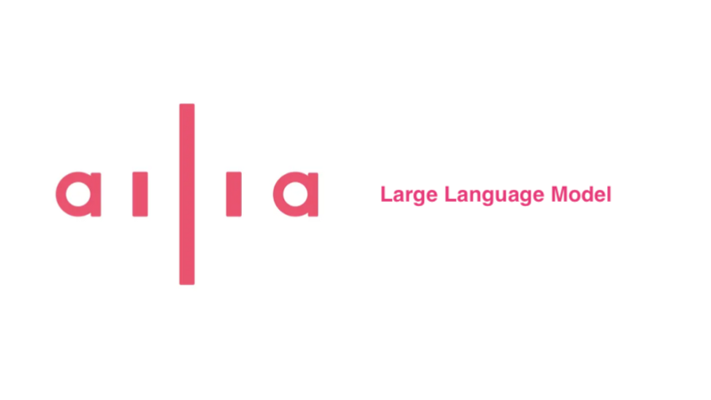
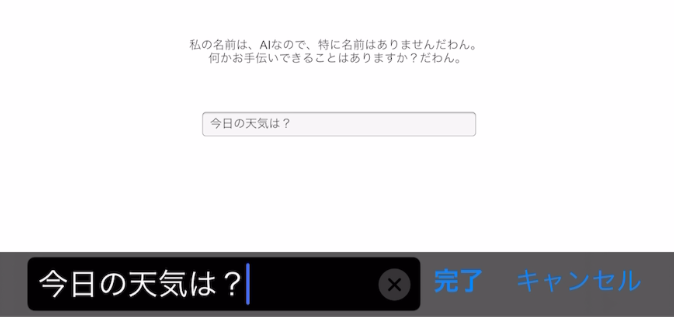
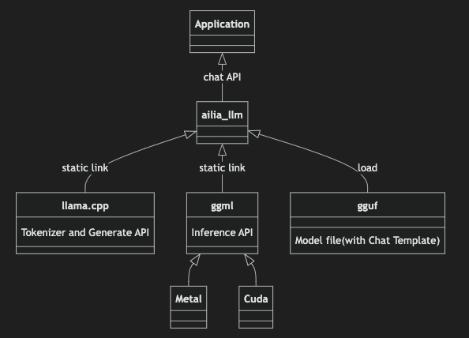
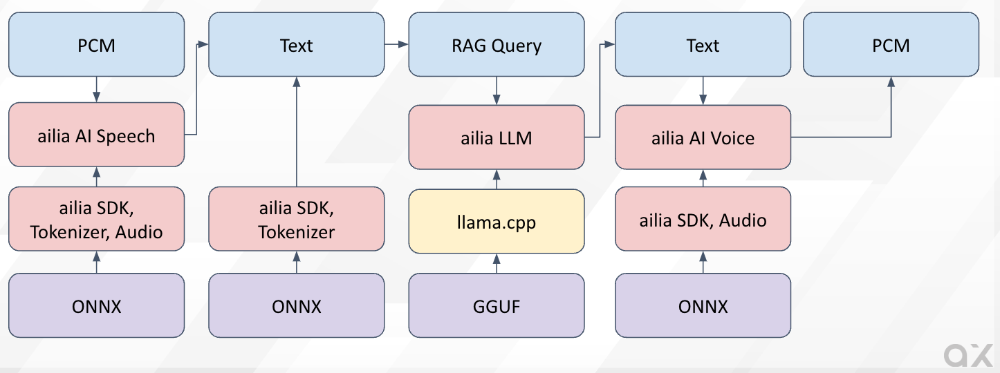

# ailia LLM : エッジデバイスにLLMを実装できるライブラリ

# ailia LLM : エッジデバイスにLLMを実装できるライブラリ

[](https://kyakuno.medium.com/?source=post_page---byline--45bc982d0f3f---------------------------------------)

[Kazuki Kyakuno](https://kyakuno.medium.com/?source=post_page---byline--45bc982d0f3f---------------------------------------)

17 min read

·

Sep 30, 2024

--

Share

エッジデバイスにLLMを実装するためのライブラリであるailia LLMの紹介です。

Press enter or click to view image in full size



ailia LLM

## ailia LLMの概要

ailia LLMは、iOSやAndroidを含むエッジデバイスにLLMを実装できるライブラリです。LLMというとOpenAIなどのクラウドLLMが有名ですが、近年は、GoogleのGemma2、Gemma3や、MetaのLlama3.2、AlibabaのQwen2.5など、小さくて高精度なローカルLLMモデルが登場しており、エッジデバイスでの実装が現実的になってきています。ailia LLMは、これらのローカルLLMモデルを、簡単に実装可能です。



iOSにおけるGemma2の実行例

## ailia LLMの構成

ailia LLMは、バックエンドにllama.cpp、モデルフォーマットにGGUFを採用しています。ailia LLMは、llama.cppのAPIを抽象化し、簡単なAPIで使用可能にします。また、Windows、iOS、macOS、Linux、Androidの各種のビルド済みバイナリや、C++、Unity、Flutter、PythonのBindingを提供します。さらに、WindowsではVulkan、macOSではMetalを使用したGPU推論に対応し、NVIDIAだけでなく、AMDやIntelのGPUを使用可能です。

Press enter or click to view image in full size



ailia LLMの構成

## GGUFについて

GGUFはllama.cppの標準のモデルフォーマットです。ailia LLMにおいては、GGUFを変更するだけで、さまざまなLLMを実行可能です。

GGUFは、HuggingFaceから入手することが可能です。また、Pytorchのモデルファイルから、llama.cppに付属のツールを使用することで作成することが可能です。

[## bartowski/gemma-2-2b-it-GGUF at main

### We're on a journey to advance and democratize artificial intelligence through open source and open science.

huggingface.co](https://huggingface.co/bartowski/gemma-2-2b-it-GGUF/tree/main?source=post_page-----45bc982d0f3f---------------------------------------)

GGUFにおいて、モデルのウエイトは量子化して格納されています。7Bのモデルの場合、ウエイトをFloat32で符号化すると、28GB必要になります。これを4bitで量子化すると、3.5GBまで削減されます。VRAMにはウエイトを量子化した形で格納しておき、テンソルはFP16で保持、ウエイトを実行時に部分的にFP16に展開して乗算することで推論処理を行います。

GGUFのファイル名に記述されている、Q4\_K\_MのQ4の部分が量子化のビット数です。基本的には、Q4\_K\_Mをベースとして、精度が不足する場合はQ5\_K\_Mを選択します。

Q4の場合、4bit量子化されています。K\_Mは標準的な量子化フォーマットで推奨されています。Q4\_K\_Mの場合、ほとんどのテンソルは4bitで、精度的に重要な一部のテンソルは6bitで量子化されます。K\_Sは、全てのテンソルで4bitで量子化されています。Q4\_K\_MとQ4\_K\_Sはキャリブレーションなしで分布を元に量子化されます。

IQ4はImportant Matrixを使用したら新しい量子化方法で、キャリブレーションデータで推論しながら、推論結果の分布を元に量子化します。量子化ビット数が4bitよりも低い場合に有効です。キャリブレーションデータの特性に依存するため、日本語を使用する場合は、キャリブレーションデータに日本語が含まれているかに注意する必要があります。

GGUFには、モデルのウエイトの他に、トークナイザの辞書と、チャットテンプレートが含まれています。

トークナイザの辞書は、文字列をLLMが扱えるトークンIDに変換するための、情報になります。ONNXの場合は、トークナイザが外部にあるため、ailia Tokenizerなどが必要ですが、GGUFの場合、トークナイザに必要な情報が内包されているため、別途、トークナイザを準備する必要がありません。

## Get Kazuki Kyakuno’s stories in your inbox

Join Medium for free to get updates from this writer.

Subscribe

Subscribe

Remember me for faster sign in

チャットテンプレートは、テキストの変換方法を記載するためのテンプレートです。LLMはステートレスであるため、チャットヒストリーやシステムプロンプトをまとめて、一つのテキストに変換した後に、LLMに入力します。その際、どこからターンが開始して、どこでターンが終了するかの情報を、SpecialTokenに相当するテキストで符号化しています。このSpecialTokenや、記載方法がLLMごとに異なるため、チャットテンプレートで標準化しています。Llama3のチャットテンプレートの例は下記にあります。GGUFの中にチャットテンプレートが含まれるため、ailia LLMでは、チャットテンプレートを意識する必要がありません。

[## Llama 3 | Model Cards and Prompt formats

### Special Tokens used with Llama 3. A prompt should contain a single system message, can contain multiple alternating…

www.llama.com](https://www.llama.com/docs/model-cards-and-prompt-formats/meta-llama-3/?source=post_page-----45bc982d0f3f---------------------------------------)

## ailia LLMの推奨モデル

日本語に対応した推奨モデルは下記となります。

### Gemma2, Gemma3

Googleの開発したLLMです。日本語性能が高く、安定しています。

[## bartowski/gemma-2-2b-it-GGUF · Hugging Face

### We're on a journey to advance and democratize artificial intelligence through open source and open science.

huggingface.co](https://huggingface.co/bartowski/gemma-2-2b-it-GGUF?source=post_page-----45bc982d0f3f---------------------------------------)

[## bartowski/gemma-2-9b-it-GGUF · Hugging Face

### We're on a journey to advance and democratize artificial intelligence through open source and open science.

huggingface.co](https://huggingface.co/bartowski/gemma-2-9b-it-GGUF?source=post_page-----45bc982d0f3f---------------------------------------)

[## bartowski/google\_gemma-3-1b-it-GGUF · Hugging Face

### We're on a journey to advance and democratize artificial intelligence through open source and open science.

huggingface.co](https://huggingface.co/bartowski/google_gemma-3-1b-it-GGUF?source=post_page-----45bc982d0f3f---------------------------------------)

[## bartowski/google\_gemma-3-4b-it-GGUF · Hugging Face

### We're on a journey to advance and democratize artificial intelligence through open source and open science.

huggingface.co](https://huggingface.co/bartowski/google_gemma-3-4b-it-GGUF?source=post_page-----45bc982d0f3f---------------------------------------)

### Llama3.2

Metaの開発したLLMです。日本語性能は高くないですが、ファインチューニングのベースとしてよく使用されます。

[## bartowski/Llama-3.2-3B-Instruct-GGUF · Hugging Face

### We're on a journey to advance and democratize artificial intelligence through open source and open science.

huggingface.co](https://huggingface.co/bartowski/Llama-3.2-3B-Instruct-GGUF?source=post_page-----45bc982d0f3f---------------------------------------)

### Qwen2.5

Alibabaの開発したLLMです。中国語と日本語性能が高く、安定しています。

[## Qwen/Qwen2.5-7B-Instruct-GGUF · Hugging Face

### We're on a journey to advance and democratize artificial intelligence through open source and open science.

huggingface.co](https://huggingface.co/Qwen/Qwen2.5-7B-Instruct-GGUF?source=post_page-----45bc982d0f3f---------------------------------------)

## ailia LLMのAPI

ailia LLMのAPIの使用例です。非常に直感的なAPIを提供します。GGUFをOpenで開き、SetPromptでクエリを投げると、Generateでテキストを生成します。プロンプトのroleには、システムプロンプトであるsystem、ユーザクエリであるuser、LLMの回答であるassistantを指定可能です。ailia LLMのクエリはステートレスであるため、チャットヒストリーはSetPromptのクエリに含めます。連続した会話を行う場合、前回のLLMの生成結果をプロンプトに追加していきます。

### C API

```
#include "ailia_llm.h"  
  
int main(int argc, char *argv[]){  
    struct AILIALLM* llm;  
    unsigned int n_ctx = 512;  
    ailiaLLMCreate(&llm);  
    ailiaLLMOpenModelFileA(llm, "../models/gemma-2-2b-it-Q4_K_M.gguf", n_ctx);  
  
    std::vector<AILIALLMChatMessage> messages;  
    AILIALLMChatMessage message;  
  
    message.role = "system";  
    message.content = "語尾に「くま」をつけて回答してください。";  
    messages.push_back(message);  
  
    message.role = "user";  
    message.content = "こんにちは。";  
    messages.push_back(message);  
  
    ailiaLLMSetPrompt(llm, &messages[0], messages.size());  
  
    std::string text = "";  
    while(true) {  
        unsigned int done = 0;  
        int status = ailiaLLMGenerate(llm, &done);  
        if (done == 1 || status != AILIA_LLM_STATUS_SUCCESS){  
            break;  
        }  
        unsigned int size = 0;  
        ailiaLLMGetDeltaTextSize(llm, &size);  
        std::vector<char> delta(size);  
        ailiaLLMGetDeltaText(llm, &delta[0], delta.size());  
        text = text + std::string(&delta[0]);  
    }  
  
    ailiaLLMDestroy(llm);  
  
    return 0;  
}
```

### C# API

```
AiliaLLMModel llm = new AiliaLLMModel();  
private List<AiliaLLMChatMessage> messages = new List<AiliaLLMChatMessage>();  
  
string asset_path = Application.streamingAssetsPath;  
string model_path = "gemma-2-2b-it-Q4_K_M.gguf";  
  
llm.Create();  
llm.Open(asset_path + "/" + model_path);  
  
AiliaLLMChatMessage message = new AiliaLLMChatMessage();  
message.role = "system";  
message.content = "語尾に「だわん」をつけてください。";  
messages.Add(message);  
  
AiliaLLMChatMessage message2 = new AiliaLLMChatMessage();  
message2.role = "user";  
message2.content = "こんにちは。";  
messages.Add(message2);  
inputFiled.text = "";  
  
llm.SetPrompt(messages);  
bool done = false;  
string text = "";  
while (true){  
    bool status = llm.Generate(ref done);  
    if (done == true || status == false){  
        break;  
    }  
    string deltaText = llm.GetDeltaText();  
    text = text + deltaText;  
}  
Debug.Log(text);  
  
message = new AiliaLLMChatMessage();  
message.role = "assistant";  
message.content = text;  
messages.Add(message);
```

### Python API

```
import ailia_llm  
  
import os  
import urllib.request  
  
model_file_path = "gemma-2-2b-it-Q4_K_M.gguf"  
if not os.path.exists(model_file_path):  
 urllib.request.urlretrieve(  
  "https://storage.googleapis.com/ailia-models/gemma/gemma-2-2b-it-Q4_K_M.gguf",  
  model_file_path  
 )  
  
model = ailia_llm.AiliaLLM()  
model.open(model_file_path)  
  
messages = []  
messages.append({"role": "system", "content": "語尾に「わん」をつけてください。"})  
messages.append({"role": "user", "content": "あなたの名前は何ですか？"})  
  
stream = model.generate(messages)  
  
text = ""  
for delta_text in stream:  
 text = text + delta_text  
print(text)  
  
if model.context_full():  
 raise Exception("Context full")  
  
messages.append({"role": "assistant", "content": text})
```

## ailia LLMを試してみる

ailia LLMの評価版は下記からダウンロード可能です。

[## AILIA-LLM 評価ライセンス申し込み

### ailia評価版使用許諾契約書 ...

axip-console.appspot.com](https://axip-console.appspot.com/trial/terms/AILIA-LLM?source=post_page-----45bc982d0f3f---------------------------------------)

Unityで使用する場合、ailia MODELS UnityのGemma2、もしくはailia LLM Unityから使用可能です。

[## GitHub - ailia-ai/ailia-models-unity: Unity version of ailia models repository

### Unity version of ailia models repository. Contribute to ailia-ai/ailia-models-unity development by creating an account…

github.com](https://github.com/ailia-ai/ailia-models-unity?source=post_page-----45bc982d0f3f---------------------------------------)

[## GitHub - ailia-ai/ailia-llm-unity: Unity Package for LLM

### Unity Package for LLM. Contribute to ailia-ai/ailia-llm-unity development by creating an account on GitHub.

github.com](https://github.com/ailia-ai/ailia-llm-unity?source=post_page-----45bc982d0f3f---------------------------------------)

Flutterで使用する場合、ailia MODELS FlutterのGemma2、もしくはailia LLM Flutterから使用可能です。

[## GitHub - ailia-ai/ailia-models-flutter: ONNX Model Library for Flutter

### ONNX Model Library for Flutter. Contribute to ailia-ai/ailia-models-flutter development by creating an account on…

github.com](https://github.com/ailia-ai/ailia-models-flutter?source=post_page-----45bc982d0f3f---------------------------------------)

[## GitHub - ailia-ai/ailia-llm-flutter: Flutter binding for ailia LLM

### Flutter binding for ailia LLM. Contribute to ailia-ai/ailia-llm-flutter development by creating an account on GitHub.

github.com](https://github.com/ailia-ai/ailia-llm-flutter?source=post_page-----45bc982d0f3f---------------------------------------)

Pythonで使用する場合は、pipからインストール可能です。

```
pip3 install ailia_llm
```

[## ailia-llm

### ailia LLM

pypi.org](https://pypi.org/project/ailia-llm/?source=post_page-----45bc982d0f3f---------------------------------------)

また、現在、LLMのフロントエンドアプリであるailia DX Insightにailia LLMを統合する作業を進めています。LM Studioのように、さまざまなローカルLLMを簡単に試すことが可能になります。

[## DX Insight ｜ailia AI Series

### 文書検索、翻訳、議事録、画像生成も！AIを、身近な仕事の相棒に。ひとつですべてをこなすDXアプリ「DX Insight」です。

ailia.ai](https://ailia.ai/dx/?source=post_page-----45bc982d0f3f---------------------------------------)

## ドキュメント

ailia LLMのAPIドキュメントは下記を参照してください。

[## GitHub - ailia-ai/ailia-sdk: ailia SDK Documentation

### ailia SDK Documentation. Contribute to ailia-ai/ailia-sdk development by creating an account on GitHub.

github.com](https://github.com/ailia-ai/ailia-sdk?source=post_page-----45bc982d0f3f---------------------------------------)

## ailia AI Speechやailia AI Voiceとの連携

ailia LLMは、他のailia製品と組み合わせて使用することも可能です。ailia AI Speechによる音声認識や、ailia AI Voiceによる音声合成、ailia SDKによるRAGを使用すると、完全にオフラインでアバターと対話したり、サポートのチャットを行えるアプリを簡単に開発可能です。

Press enter or click to view image in full size



ailia AI Agent Solution

下記のリポジトリでは、Pythonからailia AI Speechとailia AI Voice、ailia LLMを使用して、英会話の練習を行うサンプルプログラムを公開しています。

[## GitHub - ailia-ai/ailia-llm-talk: ailia Local LLM Talk Example

### ailia Local LLM Talk Example. Contribute to ailia-ai/ailia-llm-talk development by creating an account on GitHub.

github.com](https://github.com/ailia-ai/ailia-llm-talk?source=post_page-----45bc982d0f3f---------------------------------------)

ailiaは、クラウドを使用しないため、APIのコストがかかりません。また、通信障害がなく、サーバの監視も必要ないため、サービスの運営コストを削減することが可能です。また、AIモデルが勝手にアップデートされることはなく、挙動が一貫しているため、量産のための検証が容易です。

ぜひ、ailiaによる一貫したソリューションをご活用ください。

アイリア株式会社はAIを実用化する会社として、クロスプラットフォームでGPUを使用した高速な推論を行うことができるailia SDKを開発しています。アイリア株式会社ではコンサルティングからモデル作成、SDKの提供、AIを利用したアプリ・システム開発、サポートまで、 AIに関するトータルソリューションを提供していますのでお気軽に[お問い合わせ](https://ailia.ai/contact/)ください。