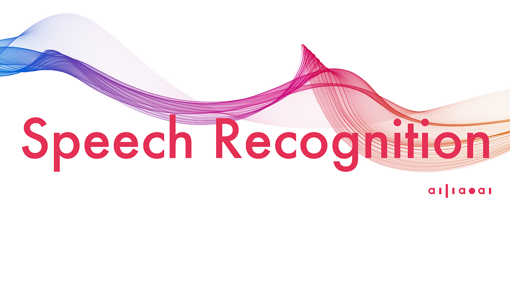
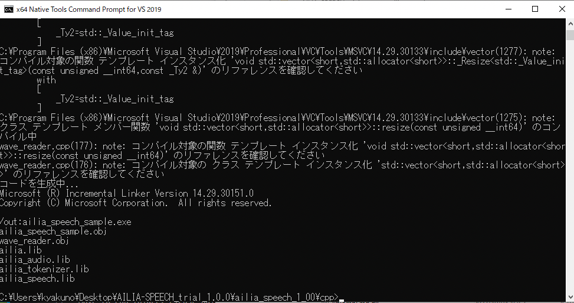

# ailia AI Speech : UnityやC++から使用できるAI音声認識ライブラリ

# ailia AI Speech : UnityやC++から使用できるAI音声認識ライブラリ

[](https://kyakuno.medium.com/?source=post_page---byline--16a05b5280d2---------------------------------------)

[Kazuki Kyakuno](https://kyakuno.medium.com/?source=post_page---byline--16a05b5280d2---------------------------------------)

30 min read

·

Mar 16, 2023

--

Share

UnityやC++から使用できるAI音声認識ライブラリであるailia AI Speechのご紹介です。ailia AI Speechを使用することで、簡単にアプリケーションにAI音声認識を実装することが可能です。

## ailia AI Speechの概要

ailia AI Speechは、AIを使用した音声認識を行うためのライブラリです。Unity向けのC#のAPIと、ネイティブアプリ向けのCおよびFlutterのAPI、PC向けのPython APIを提供します。ailia AI Speechを使用することで、AIを使用した音声認識を簡単にアプリケーションに実装することが可能です。

Press enter or click to view image in full size



ailia AI Speech : AI Speech Recognition Library by ailia SDK

[## AI Speech ｜ailia AI Series

### オフラインでも動く！どんなプラットフォームにも対応する、リアルタイム音声認識機能「AI Speech」です。

www.ailia.ai](https://www.ailia.ai/speech?source=post_page-----16a05b5280d2---------------------------------------)

## ailia AI Speechの特徴

### 日本語を含む99言語の音声認識に対応

マルチリンガルのAIモデルを使用しており、日本語・中国語・英語を含む99言語の認識が可能です。

### オフラインで動作

クラウド不要で端末だけで音声認識を実行可能です。また、CPUだけでも推論が可能です。

### モバイルデバイス対応

PCだけでなく、iOSやAndroidのモバイルデバイスでも音声認識が実行可能です。

### UnityおよびFlutter対応

C APIに加えて、Unity PluginとFlutter Bindingを提供しているため、UnityやFlutterを使用したアプリケーションに簡単に音声認識を実装可能です。

### 英語への翻訳に対応

音声認識と同時に英語への翻訳を行うことができます。日本語や中国語の英語へのリアルタイム翻訳を実現可能です。

### 話者分離に対応

PyannoteAudioを使用した話者分離に対応しています。

## ailia AI Speechの応用例

### 会議の議事録作成

オフラインで動作するため、重要な会議の議事録作成にご利用いただけます。オフライン型なため、制限時間なく、常時、音声認識可能です。

### タッチレスの音声メモ

タッチレスのテキスト入力方法として音声メモや日報にご利用いただけます。

### 音声からの動画検索

動画ファイルの音声からテキストを抽出して、特定のシーンを単語で検索することにご利用いただけます。

### 音声のセリフごとの分割

音声ファイルからテキストを抽出して、セリフごとにファイル分割することにご利用いただけます。

### コールセンターの音声分析

コールセンターで現在の通話内容から最適な回答案を検索するための入力方法としてご利用いただけます。

### アバターとの会話

アバターとの会話の入力方法としてご利用いただけます。

## ailia AI Speechのデモ

音声ファイルやマイクからリアルタイムに音声認識するデモを提供しています。このデモはUnityを使用して開発しています。デモでは、音声認識、ライブ変換、翻訳を試すことが可能です。

認識デモの実行例（macOS）

Windows版のデモアプリは下記のダウンロードURLからデモをダウンロード可能です。必要なライセンスファイルは自動的にダウンロードされます。

[## AILIA-SPEECH-WIN 評価ライセンス申し込み

### Edit description

axip-console.appspot.com](https://axip-console.appspot.com/trial/terms/AILIA-SPEECH-WIN?source=post_page-----16a05b5280d2---------------------------------------)

macOS版のデモアプリは下記のダウンロードURLからダウンロード可能です。必要なライセンスファイルは自動的にダウンロードされます。

[## AILIA-SPEECH-MAC 評価ライセンス申し込み

### Edit description

axip-console.appspot.com](https://axip-console.appspot.com/trial/terms/AILIA-SPEECH-MAC?source=post_page-----16a05b5280d2---------------------------------------)

音声認識においては、マイクの性能が非常に重要です。MacBookのマイクは比較的良好に音声認識が可能です。Windows PCを使用する場合は、指向性の高い外付けマイクを使用してください。

iOSとAndroidではアプリストアに公開しているailia AI Showcaseで音声認識を評価することが可能です。[iOS版はAppStore](https://apps.apple.com/jp/app/ailia-ai-showcase/id1522828798)から、[Android版はGooglePlay](https://play.google.com/store/apps/details?id=jp.axinc.ailia_ai_showcase)からダウンロード可能です。

## ailia AI Speechが解決する課題

従来、AIを使用した音声認識を行う場合、Pythonを使用する必要がありました。また、音声の前処理と、テキスト化の後処理で外部の依存ライブラリが必要でした。そのため、ネイティブアプリにAIを使用した音声認識を実装することが難しく、サーバで音声認識を行なうことが一般的でした。

ailia AI Speechは、音声の前処理や、テキスト化の後処理を含む、AI音声認識全体をライブラリ化することで、この問題を解決します。

ailia AI Speechを使用すると、Python不要、サーバ不要で、オフラインでAIを使用した音声認識を実装可能です。そのため、会議の議事録など、セキュリティ的にサーバにアップロードできない音声のテキスト化が可能です。

また、独自機能としてライブ変換を実装しており、マイクからリアルタイムの音声入力が可能です。

## ailia AI Speechのテクノロジー

### アーキテクチャ

ailia AI Speechでは、音声の前処理にailia.audio、AIの高速推論にailia SDK、推論結果のテキスト化にailia.tokenizerを使用しています。それらをailia.speechでCのAPI化し、UnityにBindingしています。


ailia AI Speechのアーキテクチャ

### 対応プラットフォーム

ailia AI SpeechはWindows、macOS、iOS、Android、Linuxで動作します。

### AIモデル

ailia AI SpeechのAIモデルには、Open AIの開発したWhisperを使用しています。Whisperは99言語に対応しています。

[## Whisper : 日本語を含む99言語を認識できる音声認識モデル

### ailia SDKで使用できる機械学習モデルである「Whisper」のご紹介です。「Whisper」を使用することで、音声からの高精度な文字起こしが可能です。

medium.com](https://medium.com/axinc/whisper-%E6%97%A5%E6%9C%AC%E8%AA%9E%E3%82%92%E5%90%AB%E3%82%8099%E8%A8%80%E8%AA%9E%E3%82%92%E8%AA%8D%E8%AD%98%E3%81%A7%E3%81%8D%E3%82%8B%E9%9F%B3%E5%A3%B0%E8%AA%8D%E8%AD%98%E3%83%A2%E3%83%87%E3%83%AB-b6e578f55c87?source=post_page-----16a05b5280d2---------------------------------------)

ailia AI Speech 1.5以降ではAlibabaの開発したSenseVoiceにも対応しています。SenseVoiceは中国語、英語、日本語、韓国語の4言語に対応しています。

[## SenseVoice : 日本語にも対応した高速な音声認識モデル

### Alibabaの開発した高速な音声認識モデルであるSenseVoiceの紹介です。

medium.com](https://medium.com/axinc/sensevoice-%E6%97%A5%E6%9C%AC%E8%AA%9E%E3%81%AB%E3%82%82%E5%AF%BE%E5%BF%9C%E3%81%97%E3%81%9F%E9%AB%98%E9%80%9F%E3%81%AA%E9%9F%B3%E5%A3%B0%E8%AA%8D%E8%AD%98%E3%83%A2%E3%83%87%E3%83%AB-3721c79e0592?source=post_page-----16a05b5280d2---------------------------------------)

### AIモデルの最適化

WhisperのAIモデルの推論においては、Beam Sizeをリアルタイム認識向けに小さく設定することで高速化を行なっています。また、ONNXの変換時に、kv\_cacheのShapeを固定化することで、推論間でメモリの再確保が発生しないようにしています。

また、Pytorchから出力したONNXに対して、 ailiaのONNX Optimizerを通すことで、ReduceMean -> Sub -> Pow -> ReduceMean -> Add -> Sqrt -> DivをMeanVarianceNormalizationに統合しています。

### ライブ変換

公式のWhisperには存在しない機能として、ライブ変換に対応しています。これは、30秒の音声の到着を待たずに、現在のバッファの内容で投機的に推論を行い、プレビューを行う機能となります。

## Get Kazuki Kyakuno’s stories in your inbox

Join Medium for free to get updates from this writer.

Subscribe

Subscribe

Remember me for faster sign in

ライブ変換を有効にするには、ailiaSpeechCreateの引数にAILIA\_SPEECH\_FLAG\_LIVEを与えます。

```
ailiaSpeechCreate(&net, AILIA_ENVIRONMENT_ID_AUTO, AILIA_MULTITHREAD_AUTO, memory_mode, AILIA_SPEECH_TASK_TRANSCRIBE, AILIA_SPEECH_FLAG_LIVE, callback, AILIA_SPEECH_API_CALLBACK_VERSION);
```

プレビューは、IntermediateCallbackに通知されます。IntermediateCallbackでは、返り値に1を与えることで、音声認識を中断することも可能です。

```
int intermediate_callback(void *handle, const char *text){  
 printf("%s\n", text);  
 return 0; // 1で中断  
}  
  
ailiaSpeechSetIntermediateCallback(net, &intermediate_callback, NULL);
```

ライブモードでは発言の繰り返し検知も有効になります。同じ単語がN回連続した場合に、新しい音声が来るまで待機します。

音声ファイルから入力する際は通常モード、マイクから入力するときはライブモードを推奨しています。

### 言語判定

ailiaSpeechSetLanguage APIを呼び出さない場合、セグメントごとに言語判定が呼び出されます。ailiaSpeechSetLanguage APIを呼び出した場合、指定した言語で処理を固定します。言語判定は短い音声では間違う可能性もあるため、言語が明確な場合はailiaSpeechSetLanguage APIを呼び出してください。

### 翻訳

ailiaSpeechCreateにAILIA\_SPEECH\_TASK\_TRANSLATEを与えることで、英語への翻訳を行うことができます。

### 話者分離

ailiaSpeechOpenDiarizationFile APIを呼び出すことで、話者分離を行うことができます。話者分離の結果はspeaker\_idに反映されます。

```
ailiaSpeechOpenDiarizationFileA(net, "segmentation.onnx", "speaker-embedding.onnx", AILIA_SPEECH_DIARIZATION_TYPE_PYANNOTE_AUDIO);高速化
```

### 高速化

ailia AI SpeechはバックエンドとしてCPUとGPUが選択可能です。CPUの場合、WindwosではIntelMKL、macOSではAccelerate.frameworkを使用した高速化を行っています。また、GPUの場合、WindowsではcuDNN、macOSではMetalを使用うた高速化を行なっています。

## ailia AI SpeechのAPI

### API

ailia AI SpeechのAPIリファレンスは下記に公開しています。

[## GitHub - ailia-ai/ailia-sdk: ailia SDK Documentation

### ailia SDK Documentation. Contribute to ailia-ai/ailia-sdk development by creating an account on GitHub.

github.com](https://github.com/ailia-ai/ailia-sdk?source=post_page-----16a05b5280d2---------------------------------------)

### APIの呼び出しの流れ

ailia AI Speechでは、ailiaSpeechCreateでインスタンスを作成、ailiaSpeechOpenModelFileでモデルを開き、ailiaSpeechPushInputDataでPCMを入力、ailiaSpeechBufferedで十分なPCMが入力されたか確認、ailiaSpeechTranscribeでテキスト化、ailiaSpeechGetTextで認識結果を取得可能です。

ailiaSpeechPushInputDataは音声全体を入力する必要はなく、少しずつ音声を供給することが可能であり、マイクからのリアルタイム入力を受けることができます。

また、ailiaSetSilentThresholdを使用することで、一定時間、無音が続いた段階でテキスト化を実行することが可能です。

### C++での実装例

C++での実装例は下記です。

```
#include "ailia.h"  
#include "ailia_audio.h"  
#include "ailia_speech.h"  
#include "ailia_speech_util.h"  
  
void main(void){  
 // インスタンス作成  
 struct AILIASpeech* net;  
 AILIASpeechApiCallback callback = ailiaSpeechUtilGetCallback();  
 int memory_mode = AILIA_MEMORY_REDUCE_CONSTANT | AILIA_MEMORY_REDUCE_CONSTANT_WITH_INPUT_INITIALIZER | AILIA_MEMORY_REUSE_INTERSTAGE;  
 ailiaSpeechCreate(&net, AILIA_ENVIRONMENT_ID_AUTO, AILIA_MULTITHREAD_AUTO, memory_mode, AILIA_SPEECH_TASK_TRANSCRIBE, AILIA_SPEECH_FLAG_NONE, callback, AILIA_SPEECH_API_CALLBACK_VERSION);  
  
 // モデルファイル読み込み  
 ailiaSpeechOpenModelFileA(net, "encoder_small.onnx", "decoder_small_fix_kv_cache.onnx", AILIA_SPEECH_MODEL_TYPE_WHISPER_MULTILINGUAL_SMALL);  
  
 // 言語設定  
 ailiaSpeechSetLanguage(net, "ja");  
  
 // PCMをまとめて供給  
 ailiaSpeechPushInputData(net, pPcm, nChannels, nSamples, sampleRate);  
  
 // テキスト化  
 while(true){  
  // テキスト化するための十分なPCMが供給されたか  
  unsigned int buffered = 0;  
  ailiaSpeechBuffered(net, &buffered);  
  if (buffered == 1){  
   // テキスト化の実行  
   ailiaSpeechTranscribe(net);  
  
   // 取得できたテキストの数を取得  
   unsigned int count = 0;  
   ailiaSpeechGetTextCount(net, &count);  
  
   // テキストの取得  
   for (unsigned int idx = 0; idx < count; idx++){  
    AILIASpeechText text;  
    ailiaSpeechGetText(net, &text, AILIA_SPEECH_TEXT_VERSION, idx);  
  
    float cur_time = text.time_stamp_begin;  
    float next_time = text.time_stamp_end;  
    printf("[%02d:%02d.%03d --> %02d:%02d.%03d] ", (int)cur_time/60%60,(int)cur_time%60, (int)(cur_time*1000)%1000, (int)next_time/60%60,(int)next_time%60, (int)(next_time*1000)%1000);  
    printf("%s\n", text.text);  
   }  
  }  
  
  // 全てのPCMの処理が終わったかどうか  
  unsigned int complete = 0;  
  ailiaSpeechComplete(net, &complete);  
  if (complete == 1){  
   break;  
  }  
 }  
  
 // インスタンス解放  
 ailiaSpeechDestroy(net);  
}
```

[## ailia-models-cpp/audio\_processing/whisper/whisper.cpp at master · ailia-ai/ailia-models-cpp

### C++ version of ailia models repository. Contribute to ailia-ai/ailia-models-cpp development by creating an account on…

github.com](https://github.com/ailia-ai/ailia-models-cpp/blob/master/audio_processing/whisper/whisper.cpp?source=post_page-----16a05b5280d2---------------------------------------)

### C#での実装例

C#での実装例は下記です。

```
// インスタンス作成  
IntPtr net = IntPtr.Zero;  
AiliaSpeech.AILIASpeechApiCallback callback = AiliaSpeech.GetCallback();  
int memory_mode = Ailia.AILIA_MEMORY_REDUCE_CONSTANT | Ailia.AILIA_MEMORY_REDUCE_CONSTANT_WITH_INPUT_INITIALIZER | Ailia.AILIA_MEMORY_REUSE_INTERSTAGE;  
AiliaSpeech.ailiaSpeechCreate(ref net, env_id, Ailia.AILIA_MULTITHREAD_AUTO, memory_mode, AiliaSpeech.AILIA_SPEECH_TASK_TRANSCRIBE, AiliaSpeech.AILIA_SPEECH_FLAG_NONE, callback, AiliaSpeech.AILIA_SPEECH_API_CALLBACK_VERSION);  
string base_path = Application.streamingAssetsPath+"/";  
AiliaSpeech.ailiaSpeechOpenModelFile(net, base_path + "encoder_small.onnx", base_path + "decoder_small_fix_kv_cache.onnx", AiliaSpeech.AILIA_SPEECH_MODEL_TYPE_WHISPER_MULTILINGUAL_SMALL);  
  
// 言語設定  
AiliaSpeech.ailiaSpeechSetLanguage(net, "ja");  
  
// PCMをまとめて供給  
AiliaSpeech.ailiaSpeechPushInputData(net, samples_buf, threadChannels, (uint)samples_buf.Length / threadChannels, threadFrequency);  
  
// テキスト化するための十分なPCMがあるか  
while (true){  
  // テキスト化するための十分なPCMが供給されたか  
  uint buffered = 0;  
  AiliaSpeech.ailiaSpeechBuffered(net, ref buffered);  
  
  if (buffered == 1){  
      // テキスト化の実行  
      AiliaSpeech.ailiaSpeechTranscribe(net);  
  
      // 取得できたテキストの数を取得  
      uint count = 0;  
      AiliaSpeech.ailiaSpeechGetTextCount(net, ref count);  
  
      // テキストの取得  
      for (uint idx = 0; idx < count; idx++){  
          AiliaSpeech.AILIASpeechText text = new AiliaSpeech.AILIASpeechText();  
          AiliaSpeech.ailiaSpeechGetText(net, text, AiliaSpeech.AILIA_SPEECH_TEXT_VERSION, idx);  
          float cur_time = text.time_stamp_begin;  
          float next_time = text.time_stamp_end;  
          Debug.Log(Marshal.PtrToStringAnsi(text.text));  
      }  
  }  
  
  // 全てのPCMの処理が終わったかどうか  
  uint complete = 0;  
  AiliaSpeech.ailiaSpeechComplete(net, ref complete);  
  if (complete == 1){  
    break;  
  }  
}  
  
// インスタンス解放  
AiliaSpeech.ailiaSpeechDestroy(net);
```

Unityでは、AiliaSpeech APIを抽象化したAiliaSpeechModelも使用可能です。AiliaSpeechModelはマルチスレッドでテキスト化を行う設計となっています。

```
void OnEnable(){  
  // インスタンス作成  
  AiliaSpeechModel ailia_speech = new AiliaSpeechModel();  
  ailia_speech.Open(asset_path + "/" + encoder_path, asset_path + "/" + decoder_path, env_id, api_model_type, task, flag, language);  
}  
  
void Update(){  
  // マイクから波形の取得  
  float [] waveData = GetMicInput();  
  
  // サブスレッドが推論中であればキューに積む  
  if (ailia_speech.IsProcessing()){  
    waveQueue.Add(waveData); // キューに積む  
    return;  
  }  
  
  // マルチスレッドの処理結果を取得  
  List<string> results = ailia_speech.GetResults();  
  for (uint idx = 0; idx < results.Count; idx++){  
      string text = results[(int)idx];  
      string display_text = text + "\n";  
      content_text = content_text + display_text;  
  }  
  
  // 推論が終わっていたら新規推論をリクエスト  
  ailia_speech.Transcribe(waveQueue, frequency, channels, complete);  
  waveQueue = new List<float[]>(); // キューを初期化  
}  
  
void OnDisable(){  
  // インスタンス解放  
  ailia_speech.Close();  
}
```

[## ailia-models-unity/Assets/AXIP/AILIA-MODELS/SpeechToText/AiliaSpeechToTextSample.cs at master ·…

### Unity version of ailia models repository. Contribute to ailia-ai/ailia-models-unity development by creating an account…

github.com](https://github.com/ailia-ai/ailia-models-unity/blob/master/Assets/AXIP/AILIA-MODELS/SpeechToText/AiliaSpeechToTextSample.cs?source=post_page-----16a05b5280d2---------------------------------------)

### Flutterでの実装例

Flutterでの実装例は下記です。

```
  String _transcribeStep(Wav wav){  
      String transcribeResult = "";  
      int chunkSize = wav.samplesPerSecond;  
      for (int t = 0; t < wav.channels[0].length; t += chunkSize){  
        List<double> pcm = List<double>.empty(growable: true);  
  
        for (int i = t; i < min(t + chunkSize, wav.channels[0].length); ++i) {  
          for (int j = 0; j < wav.channels.length; ++j){  
            pcm.add(wav.channels[j][i]);  
          }  
        }  
  
        _ailiaSpeechModel.pushInputData(pcm, wav.samplesPerSecond, wav.channels.length);  
        if (t + chunkSize >= wav.channels[0].length){  
          _ailiaSpeechModel.finalizeInputData();  
        }  
  
        List<SpeechText> texts = _ailiaSpeechModel.transcribeBatch();  
        for (int i = 0; i < texts.length; i++){  
          transcribeResult = transcribeResult + texts[i].text;  
        }  
      }  
  
      return transcribeResult;  
  }  
  
  Future<String> transcribe(Wav wav, File onnx_encoder_file, File onnx_decoder_file, File vad_file, int env_id, String type) async{  
    bool virtualMemory = false;  
    _ailiaSpeechModel.create(false, false, env_id, virtualMemory:virtualMemory);  
    int typeId = 0;  
    if (type == "whisper_tiny"){  
      typeId = ailia_speech_dart.AILIA_SPEECH_MODEL_TYPE_WHISPER_MULTILINGUAL_TINY;  
    }  
    if (type == "whisper_small"){  
      typeId = ailia_speech_dart.AILIA_SPEECH_MODEL_TYPE_WHISPER_MULTILINGUAL_SMALL;  
    }  
    if (type == "whisper_medium"){  
      // Please add com.apple.developer.kernel.increased-memory-limit for iOS  
      typeId = ailia_speech_dart.AILIA_SPEECH_MODEL_TYPE_WHISPER_MULTILINGUAL_MEDIUM;  
    }  
    if (type == "whisper_large_v3_turbo" || type == "whisper_large_v3_turbo_with_virtual_memory"){  
      // Please add com.apple.developer.kernel.increased-memory-limit for iOS  
      typeId = ailia_speech_dart.AILIA_SPEECH_MODEL_TYPE_WHISPER_MULTILINGUAL_LARGE_V3;  
    }  
    if (type == "whisper_large_v3_turbo_with_virtual_memory"){  
      virtualMemory = true;  
    }  
    if (virtualMemory){  
      Directory path = await getTemporaryDirectory();  
      AiliaModel.setTemporaryCachePath(path.path);  
    }  
    String lang = "auto"; // auto or ja  
    _ailiaSpeechModel.open(onnx_encoder_file, onnx_decoder_file, vad_file, lang, typeId);  
  
    String transcribeResult = "";  
  
    int startTime = DateTime.now().millisecondsSinceEpoch;  
    transcribeResult = _transcribeStep(wav);  
  
    int endTime = DateTime.now().millisecondsSinceEpoch;  
  
    transcribeResult = transcribeResult + "\nprocessing time : ${(endTime - startTime) / 1000} sec for ${(wav.channels[0].length / wav.samplesPerSecond)} sec audio.";  
  
    _ailiaSpeechModel.close();  
  
    return transcribeResult;  
  }
```

[## ailia-models-flutter/lib/audio\_processing/whisper.dart at main · ailia-ai/ailia-models-flutter

### ONNX Model Library for Flutter. Contribute to ailia-ai/ailia-models-flutter development by creating an account on…

github.com](https://github.com/ailia-ai/ailia-models-flutter/blob/main/lib/audio_processing/whisper.dart?source=post_page-----16a05b5280d2---------------------------------------)

### Pythonでの実装例

Pythonから使用する場合は、pipでライブラリをインストールします。

```
pip3 install ailia_speech
```

Pythonでの実装例は下記です。

```
import ailia_speech  
  
import librosa  
  
import os  
import urllib.request  
  
# Load target audio  
input_file_path = "demo.wav"  
if not os.path.exists(input_file_path):  
 urllib.request.urlretrieve(  
  "https://github.com/ailia-ai/ailia-models/raw/refs/heads/master/audio_processing/whisper/demo.wav",  
  "demo.wav"  
 )  
audio_waveform, sampling_rate = librosa.load(input_file_path, mono=True)  
  
# Infer  
speech = ailia_speech.Whisper()  
speech.initialize_model(model_path = "./models/", model_type = ailia_speech.AILIA_SPEECH_MODEL_TYPE_WHISPER_MULTILINGUAL_SMALL)  
recognized_text = speech.transcribe(audio_waveform, sampling_rate)  
for text in recognized_text:  
  print(text)
```

[## ailia-models/audio\_processing/whisper/example\_ailia\_speech.py at master · ailia-ai/ailia-models

### The collection of pre-trained, state-of-the-art AI models for ailia SDK …

github.com](https://github.com/ailia-ai/ailia-models/blob/master/audio_processing/whisper/example_ailia_speech.py?source=post_page-----16a05b5280d2---------------------------------------)

### ビルドの注意点

Unity Pluginのサンプルでは、ファイルダイアログにStandaloneFileBrowserアセットを使用しています。StandaloneFileBrowserの制約で、Windows環境でil2cppでビルドするとエラーが発生するため、monoでビルドしてください。これはailia AI Speechの制約ではないため、ファイルダイアログを使用しない場合はil2cppを使用可能です。

iOSで動作させる場合は、CapabilityにIncreased Memory Limitを指定してください。Smallモデルで1.82GB程度のメモリが必要なためです。


Increased Memory Limit

## ailia AI Speechの評価版のダウンロード

ailia AI Speechの1ヶ月の無償評価版は下記のURLからダウンロード可能です。評価版にはライブラリとサンプルプログラム、Unity Packageが含まれます。

[## AILIA-SPEECH 評価ライセンス申し込み

### Edit description

axip-console.appspot.com](https://axip-console.appspot.com/trial/terms/AILIA-SPEECH?source=post_page-----16a05b5280d2---------------------------------------)

評価ライセンス申し込みで送付されるライセンスファイルは、Windowsの場合はailia\_speech.dllと同じフォルダに配置してください。macOSの場合は、~/Library/SHALO/に配置してください。Linuxの場合は、~/.shalo/に配置してください。

## ailia AI Speechの評価版のC++でのビルド

Windowsの場合は、x64 Native Tools Command Prompt for VS 2019を使用してビルドを行います。SDKをダウンロードして、cppフォルダに移動し、下記のコマンドを実行します。

```
cl ailia_speech_sample.cpp wave_reader.cpp ailia.lib ailia_audio.lib ailia_tokenizer.lib ailia_speech.lib
```

Press enter or click to view image in full size



ビルドの実行例

ビルドが完了すると、ailia\_speech\_sample.exeが生成されますので、ライセンスファイルをcppフォルダに配置後、実行します。demo.wavを入力として、音声認識したテキストが出力されます。

Press enter or click to view image in full size


サンプルの実行例

macOSとLinuxのセットアップ方法は下記のドキュメントを参照してください。

[## ailia\_speech: セットアップ

### VisualStudio 2019以降が必要です。 Xcode 14.2以降が必要です。 clangが必要です。 ~/Library/SHALO/にailia.licを配置します。 ~/.shalo/にailia.licを配置します。…

ailia-ai.github.io](https://ailia-ai.github.io/ailia-sdk/supplemental/speech/cpp/jp/setup.html?source=post_page-----16a05b5280d2---------------------------------------)

macOSの場合、ダウンロードしたファイルにダウンロード属性が付与され、dylibを実行できない場合があります。その場合、下記のコマンドで、ファイルからダウンロード属性を除去してください。

```
xattr -d com.apple.quarantine ./*.dylib
```

アイリア株式会社はAIを実用化する会社として、クロスプラットフォームでGPUを使用した高速な推論を行うことができるailia SDKを開発しています。アイリア株式会社ではコンサルティングからモデル作成、SDKの提供、AIを利用したアプリ・システム開発、サポートまで、 AIに関するトータルソリューションを提供していますのでお気軽に[お問い合わせ](https://ailia.ai/contact/)ください。