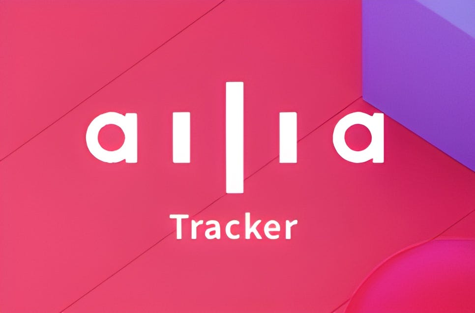
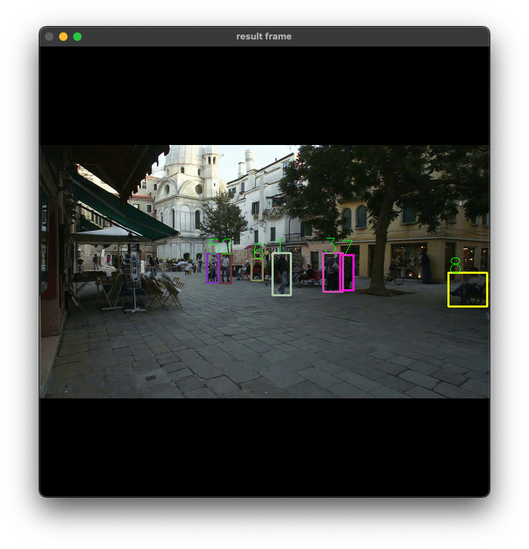
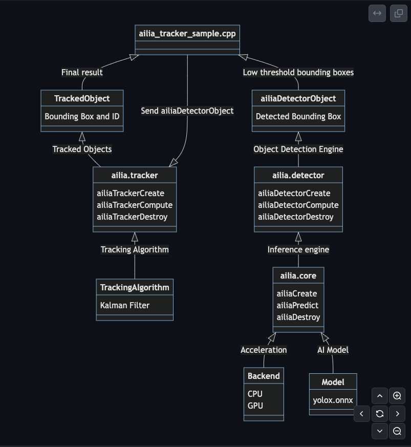
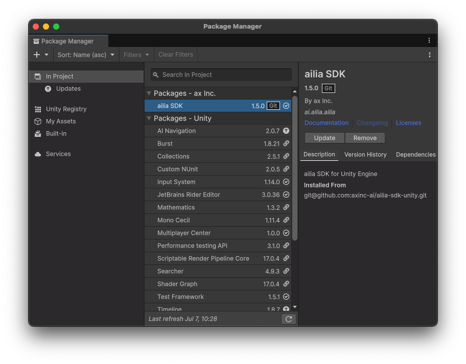
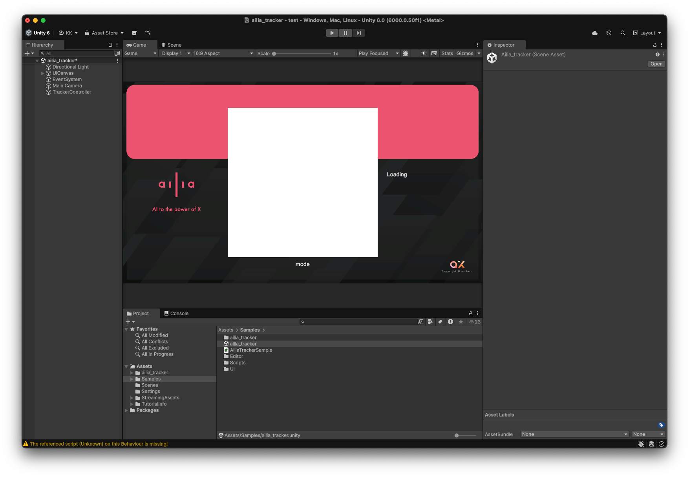
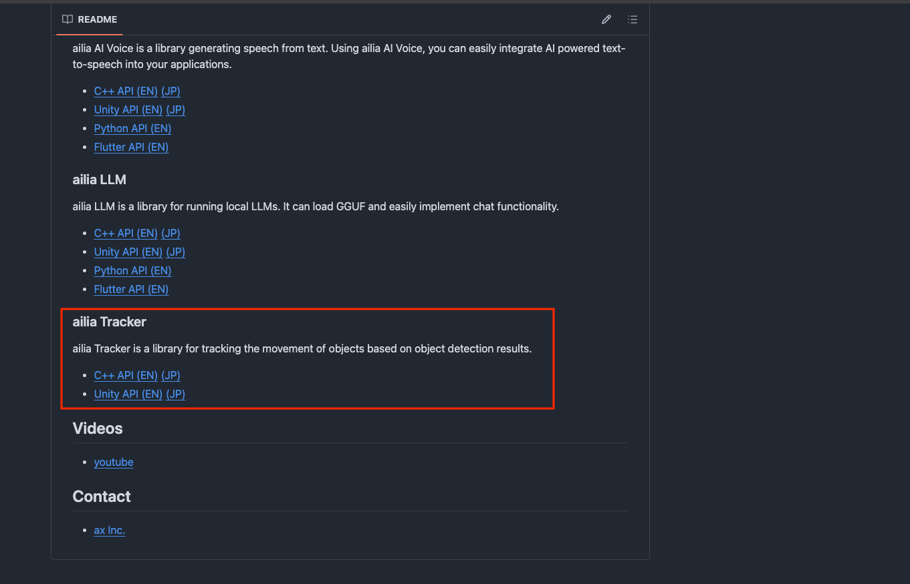

# ailia Tracker : UnityやC++から使用できる物体追跡ライブラリ

# ailia Tracker : UnityやC++から使用できる物体追跡ライブラリ

[](https://kyakuno.medium.com/?source=post_page---byline--980052ea0156---------------------------------------)

[Kazuki Kyakuno](https://kyakuno.medium.com/?source=post_page---byline--980052ea0156---------------------------------------)

18 min read

·

Jul 7, 2025

--

Share

UnityやC++から使用できる物体追跡ライブラリのailia Trackerのご紹介です。

## ailia Trackerの概要

ailia Trackerは物体追跡を行うためのライブラリです。

Press enter or click to view image in full size



ailia Tracker

ailia SDKとYOLOXを使用することで、物体検出を行うことは可能ですが、人数カウントなどの用途では、同じ人物をカウントしないように、トラッキングしてIDを付与する必要があります。

しかし、トラッキングの実装にはカルマンフィルタなどのアルゴリズムの実装が必要であり、PythonではなくC++やC#で実装するのが難しいという課題がありました。

ailia Trackerでは、カルマンフィルタを使用した追跡アルゴリズムであるByteTrackをライブラリとして提供することで、C++やC#、Kotlinのアプリケーションに簡単にトラッキングを実装可能にします。

ByteTrackの詳細は下記を参照してください。

[## ByteTrack : 低い確度のBoundingBoxも考慮するトラッキングモデル

### ailia SDKで使用できる機械学習モデルである「ByteTrack」のご紹介です。「ByteTrack」を使用することで高精度のトラッキングを行うことができます。

medium.com](https://medium.com/axinc/bytetrack-%E4%BD%8E%E3%81%84%E7%A2%BA%E5%BA%A6%E3%81%AEboundingbox%E3%82%82%E8%80%83%E6%85%AE%E3%81%99%E3%82%8B%E3%83%88%E3%83%A9%E3%83%83%E3%82%AD%E3%83%B3%E3%82%B0%E3%83%A2%E3%83%87%E3%83%AB-244b994d5afb?source=post_page-----980052ea0156---------------------------------------)

## ailia Trackerの実行例

ailia Trackerの実行例です。動画ファイルを読み込み、人物をトラッキングしてIDを付与することが可能です。

```
./ailia_tracker_sample demo.mp4
```

Press enter or click to view image in full size



テスト画像の出典：MOT17

## ailia Trackerのアーキテクチャ

ailia Trackerを使用したトラッキングでは、まず、ailia SDKで提供されるailia Detectorを使用してフレーム単位で物体検出を行います。AIモデルとしてはYOLOXを使用します。次に、検出した物体をailia Trackerにフレーム単位で供給することで、ByteTrackによるトラッキングを行い、トラッキングIDを取得可能です。

Press enter or click to view image in full size



ailia Trackerのアーキテクチャ

## C++から使用する

ailia Trackerは、ailia Detectorで検出した物体の情報であるAILIADetectorObjectを、フレーム単位でailia TrackerにAddTargetし、Computeすることで動作します。Computeした結果は、GetObjectCountとGetObjectで取得することができます。AILIATrackerObjectには、AILIADetectorObjectの情報に加えて、idが付与されます。このidがトラッキングのIDとなります。

```
    AILIATracker *ailiaTracker = nullptr;  
    AILIATrackerSettings settings;  
    settings.score_threshold = 0.1f;  
    settings.nms_threshold = 0.7f;  
    settings.track_threshold = 0.5f;  
    settings.track_buffer = 30;  
    settings.match_threshold = 0.8f;  
    status = ailiaTrackerCreate(&ailiaTracker,  
                                AILIA_TRACKER_ALGORITHM_BYTE_TRACK, &settings, AILIA_TRACKER_SETTINGS_VERSION);  
  
    cv::VideoCapture capture;  
    if (useWebCamera) {  
        PRINT_OUT("[INFO] webcamera mode is activated\n");  
        capture = cv::VideoCapture(atoi(inputVideoPath.c_str()));  
        if (!capture.isOpened()) {  
            PRINT_ERR("[ERROR] webcamera not found\n");  
            return -1;  
        }  
    } else {  
        if (check_file_existance(inputVideoPath.c_str())) {  
            capture = cv::VideoCapture(inputVideoPath.c_str());  
        } else {  
            PRINT_ERR("[ERROR] \"%s\" not found\n", inputVideoPath.c_str());  
            return -1;  
        }  
    }  
     
    std::map<unsigned int, cv::Scalar> id2Color;  
  
   while (1) {  
        cv::Mat frame, resized_img, img;  
        capture >> frame;  
        if ((char)cv::waitKey(1) == 'q' || frame.empty()) {  
            break;  
        }  
        adjust_frame_size(frame, resized_img, IMAGE_WIDTH, IMAGE_HEIGHT);  
        cv::cvtColor(resized_img, img, cv::COLOR_BGR2BGRA);  
        status = ailiaDetectorCompute(detector, img.data, MODEL_INPUT_WIDTH * 4,  
                                      MODEL_INPUT_WIDTH, MODEL_INPUT_HEIGHT,  
                                      AILIA_IMAGE_FORMAT_BGRA, THRESHOLD, IOU);  
  
  
        unsigned int objCounts;  
        ailiaDetectorGetObjectCount(detector, &objCounts);  
        AILIADetectorObject *ailiaDetectorObject = new AILIADetectorObject[objCounts];  
        for (int i = 0; i < objCounts; i++) {  
            status =   
                ailiaDetectorGetObject(detector, &ailiaDetectorObject[i], i,  
                                       AILIA_DETECTOR_OBJECT_VERSION);  
        }  
        for(int i=0; i<objCounts; i++){  
            status = ailiaTrackerAddTarget(ailiaTracker, &ailiaDetectorObject[i], AILIA_DETECTOR_OBJECT_VERSION);  
        }  
        delete[] ailiaDetectorObject;  
        status = ailiaTrackerCompute(ailiaTracker);  
  
        unsigned int onlineSize;  
        status = ailiaTrackerGetObjectCount(  
            ailiaTracker,  
            &onlineSize  
        );  
  
        AILIATrackerObject *ailiaTrackerObject = new AILIATrackerObject[onlineSize];  
  
        for(int i=0; i<onlineSize; i++){  
            status = ailiaTrackerGetObject(  
                ailiaTracker,  
                &ailiaTrackerObject[i],  
                i,  
                1  
            );  
        }  
  
        delete[] ailiaTrackerObject;  
    }
```

## Unityから使用する

### ailia MODELS Unityから使用する

Unityのサンプルはailia MODELS UnityのByte Trackとなります。

[## ailia-models-unity/Assets/AXIP/AILIA-MODELS/ObjectTracking at master · ailia-ai/ailia-models-unity

### Unity version of ailia models repository. Contribute to ailia-ai/ailia-models-unity development by creating an account…

github.com](https://github.com/ailia-ai/ailia-models-unity/tree/master/Assets/AXIP/AILIA-MODELS/ObjectTracking?source=post_page-----980052ea0156---------------------------------------)

UnityのPackageは下記に公開しています。

[## GitHub - ailia-ai/ailia-tracker-unity: ailia Tracker Unity Binding

### ailia Tracker Unity Binding. Contribute to ailia-ai/ailia-tracker-unity development by creating an account on GitHub.

github.com](https://github.com/ailia-ai/ailia-tracker-unity?source=post_page-----980052ea0156---------------------------------------)

AiliaDetectorModelで物体検出をした結果を、AiliaTrackerModelに供給することで、トラッキングが可能です。

```
  //Initialize Detector  
  ailia_detector.Settings(AiliaFormat.AILIA_NETWORK_IMAGE_FORMAT_BGR, AiliaFormat.AILIA_NETWORK_IMAGE_CHANNEL_FIRST, AiliaFormat.AILIA_NETWORK_IMAGE_RANGE_UNSIGNED_INT8, AiliaDetector.AILIA_DETECTOR_ALGORITHM_YOLOX, category_n, AiliaDetector.AILIA_DETECTOR_FLAG_NORMAL);  
  ailia_detector.OpenFile(asset_path + "/yolox_s.opt.onnx.prototxt", asset_path + "/yolox_s.opt.onnx");  
  
  //Initialize Tracker  
  AiliaTracker.AILIATrackerSettings settings = new AiliaTracker.AILIATrackerSettings();  
  settings.score_threshold = 0.1f;  
  settings.nms_threshold = 0.7f;  
  settings.track_threshold = 0.5f;  
  settings.track_buffer = 30;  
  settings.match_threshold = 0.8f;  
  ailia_tracker.Create(AiliaTracker.AILIA_TRACKER_ALGORITHM_BYTE_TRACK, settings);  
  
  //Get camera image  
  int tex_width = ailia_camera.GetWidth();  
  int tex_height = ailia_camera.GetHeight();  
  if (preview_texture == null)  
  {  
   preview_texture = new Texture2D(tex_width, tex_height);  
   raw_image.texture = preview_texture;  
  }  
  Color32[] camera = ailia_camera.GetPixels32();  
  
  //Detection  
  float threshold = 0.2f;  
  float iou = 0.25f;  
  long start_time = DateTime.UtcNow.Ticks / TimeSpan.TicksPerMillisecond;  
  List<AiliaDetector.AILIADetectorObject> list = ailia_detector.ComputeFromImageB2T(camera, tex_width, tex_height, threshold, iou);  
  List<AiliaTracker.AILIATrackerObject> list2 = ailia_tracker.Compute(list);  
  long end_time = DateTime.UtcNow.Ticks / TimeSpan.TicksPerMillisecond;  
  
  //Display detected object  
  string result = "";  
  foreach (AiliaTracker.AILIATrackerObject obj in list2)  
  {  
   DisplayDetectedObject(obj, camera, tex_width, tex_height);  
  }
```

### Unity Packageから使用する

Unity Packageを使用する場合、SDKに同梱のUnity Packageをインポートした後、Package ManagerのPlusからInstall package from git urlでailia SDKを登録します。

```
https://github.com/ailia-ai/ailia-sdk-unity
```

Press enter or click to view image in full size



Package Managerからailia SDKをインストール

Samplesにあるailia\_tracker.sceneを起動して実行します。

Press enter or click to view image in full size



ailia Trackerの実行

## Kotlinから使用する

JNIのサンプルプログラムは下記となります。

[## ailia-models-kotlin/app/src/main/java/jp/axinc/ailia\_kotlin/AiliaTrackerSample.kt at main ·…

### ailia android studio example (kotlin). Contribute to ailia-ai/ailia-models-kotlin development by creating an account on…

github.com](https://github.com/ailia-ai/ailia-models-kotlin/blob/main/app/src/main/java/jp/axinc/ailia_kotlin/AiliaTrackerSample.kt?source=post_page-----980052ea0156---------------------------------------)

物体検出した結果のdetectionResultsを受け取り、addTargetで追加、computeで追跡、getObjectCountとgetObjectでトラッキングした結果を取得可能です。

```
var settings: AiliaTrackerSettings = AiliaTrackerSettings(score_threshold = 0.1f, nms_threshold = 0.7f, track_threshold = 0.5f, track_buffer = 30, match_threshold = 0.8f)  
var tracker: AiliaTracker = AiliaTracker(algorithm = AiliaTracker.AILIA_TRACKER_ALGORITHM_BYTE_TRACK, settings = settings)  
  
for (detection in detectionResults) {  
    val result = tracker!!.addTarget(  
        category = detection.category,  
        prob = detection.confidence,  
        x = detection.x,  
        y = detection.y,  
        w = detection.width,  
        h = detection.height  
    )  
      
    if (result != 0) {  
        Log.e(TAG, "Failed to add target: $result")  
    }  
}  
  
val computeResult = tracker!!.compute()  
  
val objectCount = tracker!!.getObjectCount()  
Log.d(TAG, "Object count: $objectCount")  
  
var trackingInfo = "Objects: $objectCount"  
for (i in 0 until objectCount) {  
    val obj = tracker!!.getObject(i)  
    obj?.let {  
        Log.d(TAG, "Object $i: id=${it.id}, category=${it.category}, prob=${it.prob}, x=${it.x}, y=${it.y}, w=${it.w}, h=${it.h}")  
        trackingInfo += "\nID:${it.id} Cat:${it.category} Conf:${String.format("%.2f", it.prob)}"  
    }  
}
```

## パラメータについて

ailia Detectorには、下記の2つのパラメータが存在します。

```
threshold：物体の確信度のしきい値  
iou：重複判定するしきい値
```

ailia Trackerには下記の5つのパラメータが存在します。

```
score_threshold : 物体の確信度のしきい値  
nms_thresholdf : マルチクラスNMSのiou  
track_threshold : 最終的な物体の確信度のしきい値  
track_buffer : バッファの数、1秒の区間を保存しておく場合はFPSと同じ数  
match_threshold ：カルマンフィルタでどれくらい予測とマッチしていたら同一の物体と判定するかのしきい値
```

ailia Detectorのthresholdは、物体の確信度のしきい値であり、数字を大きくするほど、確信度の高い物体のみを検知します。iouは、NonMaxSuppressionの重複しきい値であり、どれくらい重なっている物体を同じ物体とみなすかを設定します。iouが0の場合、少しでも重なっていると同じ物体とみなします。iouが1の場合、完全に重なっていないと同じ物体とみなしません。

## Get Kazuki Kyakuno’s stories in your inbox

Join Medium for free to get updates from this writer.

Subscribe

Subscribe

Remember me for faster sign in

ByteTrackは、ailia Detectorには低いthresholdと、高いiouを与えて、できるだけ多くの物体を検出し、ailia Trackerには高いthresholdと、低いiouを与えて、物体を絞り込みます。

ailia DetectorのNMSは、シングルクラスのNMSであり、ailia TrackerのNMSはマルチクラスのNMSです。そのため、ailia DetectorではNMSを無効化し、ailia TrackerのNMSを有効化します。

これより、ailia Detectorの推奨の設定は下記となります。

```
threshold = 0.1f : できるだけ多くの物体を検出する  
iou = 1.0f : NMSを無効化する
```

また、ailia Trackerの推奨の設定は下記となります。

```
score_threshold = 0.1f : ailia Detectorと揃える  
nms_threshold = 0.7f : デフォルト設定  
track_threshold = 0.5f : デフォルト設定、検出が多すぎる場合は大きくする  
track_buffer = 30 : 30FPSの場合は30  
match_threshold = 0.8f ：デフォルト設定、トラッキングが外れやすい場合は小さくする
```

調整方法としては、検出が多すぎる場合はtrack\_thresholdを大きくします。また、トラッキングが外れやすい場合は、match\_thresholdを小さくします。FPSが高い場合は、track\_bufferを大きくします。

## 評価版のダウンロード

ailia Trackerの評価版は下記のURLからダウンロード可能です。

[## AILIA-TRACKER 評価ライセンス申し込み

### Edit description

axip-console.appspot.com](https://axip-console.appspot.com/trial/terms/AILIA-TRACKER?source=post_page-----980052ea0156---------------------------------------)

## マニュアル

ailia SDKのマニュアルページにailia Trackerへのマニュアルが含まれます。

[## GitHub - ailia-ai/ailia-sdk: ailia SDK Documentation

### ailia SDK Documentation. Contribute to ailia-ai/ailia-sdk development by creating an account on GitHub.

github.com](https://github.com/ailia-ai/ailia-sdk?source=post_page-----980052ea0156---------------------------------------)

Press enter or click to view image in full size



ailia Trackerのマニュアル

## まとめ

ailia Trackerを使用することで、アプリケーションに簡単に物体追跡を実装可能です。ぜひ、ailia SDKと一緒にご利用ください。

[アイリア株式会社](https://ailia.ai/)はAIを実用化する会社として、クロスプラットフォームでGPUを使用した高速な推論を行うことができるailia SDKを開発しています。アイリア株式会社ではコンサルティングからモデル作成、SDKの提供、AIを利用したアプリ・システム開発、サポートまで、 AIに関するトータルソリューションを提供していますのでお気軽に[お問い合わせ](https://ailia.ai/contact/)ください。