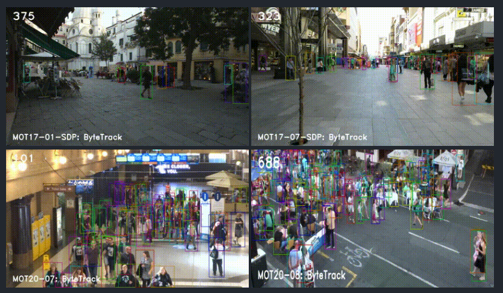
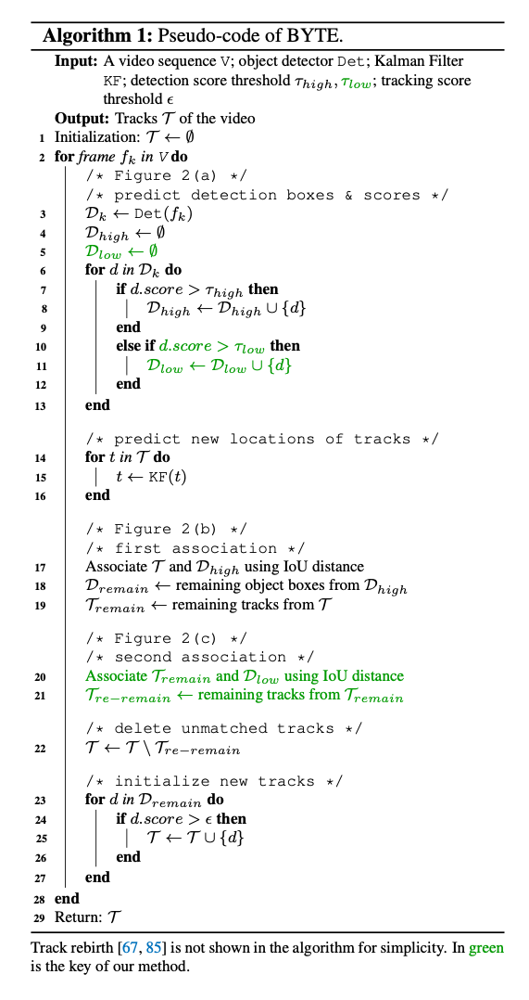
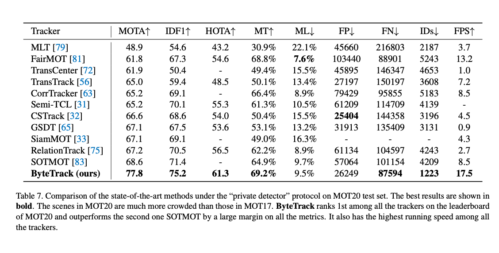

# ByteTrack : 低い確度のBoundingBoxも考慮するトラッキングモデル

# ByteTrack : 低い確度のBoundingBoxも考慮するトラッキングモデル

[](https://kyakuno.medium.com/?source=post_page---byline--244b994d5afb---------------------------------------)

[Kazuki Kyakuno](https://kyakuno.medium.com/?source=post_page---byline--244b994d5afb---------------------------------------)

8 min read

·

Oct 25, 2021

--

Share

[ailia SDK](https://ailia.jp/)で使用できる機械学習モデルである「ByteTrack」のご紹介です。エッジ向け推論フレームワークである[ailia SDK](https://ailia.jp/)と[ailia MODELS](https://github.com/axinc-ai/ailia-models)に公開されている機械学習モデルを使用することで、簡単にAIの機能をアプリケーションに実装することができます。

## ByteTrackについて

ByteTrackは2021年10月に公開されたオブジェクトトラッキングのモデルです。YOLOXで検出した人のBoundingBoxにByteTrackを適用することで、人にIDを付与することができます。SiamMOTやTransformerベースのトラッキングモデルを超えて、SoTAを達成しています。

Press enter or click to view image in full size



出典：<https://github.com/ifzhang/ByteTrack>

[## ByteTrack: Multi-Object Tracking by Associating Every Detection Box

### Multi-object tracking (MOT) aims at estimating bounding boxes and identities of objects in videos. Most methods obtain…

arxiv.org](https://arxiv.org/abs/2110.06864?source=post_page-----244b994d5afb---------------------------------------)

[## GitHub - ifzhang/ByteTrack: ByteTrack: Multi-Object Tracking by Associating Every Detection Box

### ByteTrack is a simple, fast and strong multi-object tracker. ByteTrack: Multi-Object Tracking by Associating Every…

github.com](https://github.com/ifzhang/ByteTrack?source=post_page-----244b994d5afb---------------------------------------)

## ByteTrackのアーキテクチャ

Multi-object tracking (MOT)においては、YOLOXなどでObject Detectionを行った後、トラッキングアルゴリズムでフレーム間の追跡を行います。しかし、現実のアプリケーションでは、Detectionの結果が不完全であり、物体の不検知が発生するという問題があります。

具体的に、従来の方法では、Object Detectionの段階で、低いConfidence値のBounding Boxを削除します。低いConfidence値のBounding Boxを採用するとTrue Positive（検知率）は改善するものの、False Positive（誤検知）が発生するという、トレードオフが存在するためです。

しかし、低いConfidence値のBounding Boxを全て削除すべきかという疑問があります。低いConfidence値であっても、場合によってはそこにオブジェクトが実在している場合があります。このオブジェクトを削除してしまうために、トラッキングの性能が低下しています。

下記の図で、この問題を説明しています。t1フレームでは、0.5以上のConfidence値を持つ4つの物体を追跡します。しかし、t2とt3では、遮蔽が発生した結果、赤いオブジェクトのスコアが0.8から0.4、0.4から0.1に低下します。その結果、このオブジェクトが無視され、不検知が発生します。


出典：<https://arxiv.org/pdf/2110.06864.pdf>

ByteTrackでは、この問題を解決するため、トラッキング中の物体を示すtrackletsというqueueを使用したMotion Modelによって、低いConfidence値のBounding Boxも考慮することで、低いConfidence値のBounding Boxとマッチングし、不検知の問題を解消します。

マッチングプロセスにおいては、BYTEというアルゴリズムを使用します。最初に、trackletsに含まれる物体の次のフレームの位置を、Kalman Filterを使用して予測し、Motion Similalityにより、高いスコアのDetection Boxesとマッチングします。Motion Similalityでは、物体の重なりを示すIoUでスコアを計算します。上記の図では(2)が相当します。

次に、2段階目のマッチングを行います。マッチングできなかったtracklets中のオブジェクト（上記の図では赤いボックス）に対して、低いConfidence値のDetection Boxesとマッチングします。上記の図では(3)が相当します。

## Get Kazuki Kyakuno’s stories in your inbox

Join Medium for free to get updates from this writer.

Subscribe

Subscribe

Remember me for faster sign in

アルゴリズムの詳細は下記となります。カルマンフィルタによるシンプルなトラッキングアルゴリズムであるため、高速に動作します。



出典：<https://arxiv.org/pdf/2110.06864.pdf>

このようなシンプルな方法でありながら、ByteTrackはSoTAを達成しています。


出典：<https://arxiv.org/pdf/2110.06864.pdf>

各ベンチマークでの検出例です。

Press enter or click to view image in full size


出典：<https://arxiv.org/pdf/2110.06864.pdf>

従来手法との性能比較です。

Press enter or click to view image in full size



出典：<https://arxiv.org/pdf/2110.06864.pdf>

物体検出モデルは、YOLOXをMOT17とMOT20のデータセットで学習したものを使用しています。YOLOXの認識解像度はMOT17で1440x800、MOT20で1600x896です。そのため、ByteTrack自体は高速に動作しますが、物体検出の負荷は高くなっています。

## DeepSortとの比較

DeepSortでは、ReIDモデルを使用して、フレーム間の人の紐付けを行い、紐付けできなかった人に対してSortでカルマンフィルタで計算したBoundingBoxの移動予測でフレーム間の紐付けを行います。しかし、紐付けはConfidence値が大きなBoundingBoxに対してのみ行われます。

ByteTrackでは、ReIDは使用せず、カルマンフィルタで計算したBoundingBoxの移動予測のみでフレーム間の人の紐付けを行います。そのため、技術的にはDeepSortの前のSortに近いです。しかし、紐付けを2段階で行い、最初に高いConfidence値のBoundingBoxに対して、次に低いConfidence値のBoundingBoxに対して紐付けを行うことで、性能を改善しています。

## ByteTrackの使用方法

ailia SDKでByteTrackを使用するには下記のコマンドを使用します。

```
$ python3 bytetrack.py -v 0
```

依存ライブラリとしてlapが必要ですので、インストールしてください。

```
pip3 install lap
```

より高速に動作させるため、物体検出モデルを変更するには-mオプションを使用します。

```
$ python3 bytetrack.py -v 0 -m yolox_s
```

[## ailia-models/object\_tracking/bytetrack at master · axinc-ai/ailia-models

### (Video from https://vimeo.com/60139361) This model requires additional module. Automatically downloads the onnx and…

github.com](https://github.com/axinc-ai/ailia-models/tree/master/object_tracking/bytetrack?source=post_page-----244b994d5afb---------------------------------------)

## ailia Tracker

アイリア株式会社では、簡単にアプリケーションにByteTrackを実装可能なライブラリを提供しています。

[## ailia Tracker : UnityやC++から使用できる物体追跡ライブラリ

### UnityやC++から使用できる物体追跡ライブラリのailia Trackerのご紹介です。

medium.com](https://medium.com/axinc/ailia-tracker-unity%E3%82%84c-%E3%81%8B%E3%82%89%E4%BD%BF%E7%94%A8%E3%81%A7%E3%81%8D%E3%82%8B%E7%89%A9%E4%BD%93%E8%BF%BD%E8%B7%A1%E3%83%A9%E3%82%A4%E3%83%96%E3%83%A9%E3%83%AA-980052ea0156?source=post_page-----244b994d5afb---------------------------------------)

アイリア株式会社はAIを実用化する会社として、クロスプラットフォームでGPUを使用した高速な推論を行うことができるailia SDKを開発しています。アイリア株式会社ではコンサルティングからモデル作成、SDKの提供、AIを利用したアプリ・システム開発、サポートまで、 AIに関するトータルソリューションを提供していますのでお気軽に[お問い合わせ](https://ailia.ai/contact/)ください。