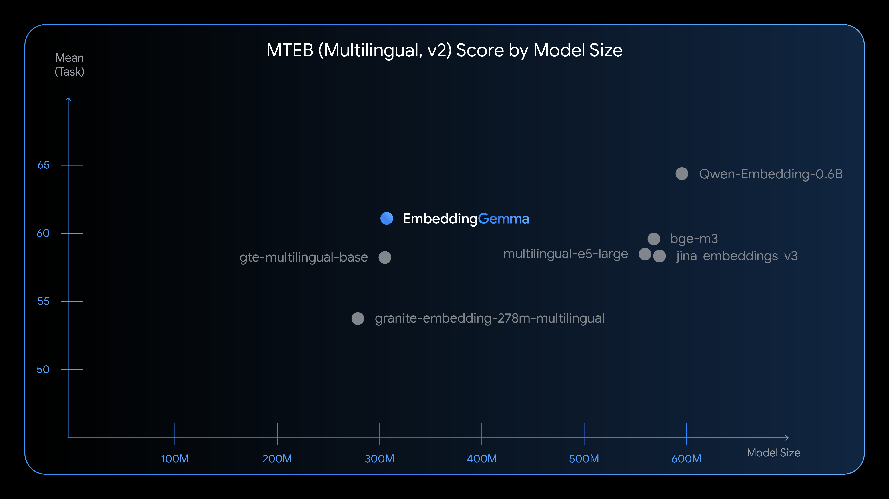

# Embedding Gemma : Googleの開発した軽量で高精度なEmbeddingモデル

# Embedding Gemma : Googleの開発した軽量で高精度なEmbeddingモデル

[](https://kyakuno.medium.com/?source=post_page---byline--9ec139ddfde9---------------------------------------)

[Kazuki Kyakuno](https://kyakuno.medium.com/?source=post_page---byline--9ec139ddfde9---------------------------------------)

11 min read

·

Jan 20, 2026

--

Share

Googleの開発した軽量で高精度なEmbeddingモデルであるEmbedding Gemmaの紹介です。

## Embedding Gemmaの概要

Embedding Gemmaは2025年9月にGoogleが公開したマルチリンガルのEmbeddingモデルです。テキストから埋め込みベクトルを計算することができるため、RAGなどのテキストのセマンティック検索に使用可能です。また、タスクごとに異なるプロンプトを指定する機能が追加されており、高精度な埋め込みベクトルを計算することが可能です。

[## EmbeddingGemma の概要: オンデバイス埋め込み処理向けの最高水準オープンモデル

### Discover EmbeddingGemma, Google's new on-device embedding model designed for efficient on-device AI, enabling features…

developers.googleblog.com](https://developers.googleblog.com/ja/introducing-embeddinggemma/?source=post_page-----9ec139ddfde9---------------------------------------)

[## google/embeddinggemma-300m · Hugging Face

### We're on a journey to advance and democratize artificial intelligence through open source and open science.

huggingface.co](https://huggingface.co/google/embeddinggemma-300m?source=post_page-----9ec139ddfde9---------------------------------------)

## Embedding Gemmaの特徴

横軸がパラメータ数で左に行くほど軽量なモデルになります。縦軸が精度で上に行くほど高精度なモデルになります。Embedding Gemmaは、Multilingual e5 largeよりも少ないパラメータで、Multilingual e5 largeより高精度なEmbeddingを実現します。

Press enter or click to view image in full size



出典：<https://developers.googleblog.com/ja/introducing-embeddinggemma/>

EmbeddingGemmaは、100以上の言語で学習されていて、日本語にも対応しています。コンテキスト長は2Kトークンです。Multilingual e5 largeの512トークンよりも大きくなっています。Embeddingの次元数は768次元です。

## Embeddingの例

Embedding Gemmaは、文ごとに768次元の数値ベクトルを出力します。これらのベクトルを多次元空間にプロットすると、apple と banana のベクトルは非常に近い位置に配置されます。car のベクトルは他の 2 つのベクトルから離れています。距離にはCos距離（L2正規化して内積）を使用します。

```
words = ["apple", "banana", "car"]  
  
# Calculate embeddings by calling model.encode()  
embeddings = model.encode(words)  
  
print(embeddings)  
for idx, embedding in enumerate(embeddings):  
  print(f"Embedding {idx+1} (shape): {embedding.shape}")  
  
[[-0.18476306  0.00167681  0.03773484 ... -0.07996225 -0.02348064  
   0.00976741]  
 [-0.21189538 -0.02657359  0.02513712 ... -0.08042689 -0.01999852  
   0.00512146]  
 [-0.18924113 -0.02551468  0.04486253 ... -0.06377774 -0.03699806  
   0.03973572]]  
Embedding 1: (768,)  
Embedding 2: (768,)  
Embedding 3: (768,)
```

## プロンプト

Embeddingする際、ヘッダに「指示プロンプト」もしくは「タスク」を追加することで、最適なエンべディングを生成可能です。RAGで使用する場合、クエリには「task: search result」、プロンプトには「title: none」を使用します。タイトルがあるドキュメントは、タイトルを明示することで精度が改善します。

```
query_embeddings = encode(models, query, prompt="task: search result | query: ")  
document_embeddings = encode(models, documents, prompt="title: none | text: ")
```

推奨プロンプトは下記のモデルカードに記載されています。

[## EmbeddingGemma モデルカード | Google AI for Developers

### モデルページ: EmbeddingGemma リソースと技術ドキュメント: 作成者: Google DeepMind 入力と出力の概要と簡単な定義。 EmbeddingGemma は、3…

ai.google.dev](https://ai.google.dev/gemma/docs/embeddinggemma/model_card?hl=ja&source=post_page-----9ec139ddfde9---------------------------------------#prompt_instructions)

### RAG

Retrieval (Query)   
ドキュメント検索や情報検索に最適化された埋め込みを生成するために使用されます。カスタム検索など、一般的な検索クエリ用に最適化されたエンベディングです。

```
task: search result | query: {content}
```

Retrieval (Document)   
ドキュメント検索用に最適化されたエンベディング（検索用に記事、書籍、ウェブページをインデックス登録するなど）です。

```
title: {title | "none"} | text: {content}
```

Question Answering   
質問応答システム内の質問のエンベディングです。質問に回答するドキュメント（チャットボックスなど）を見つけるために最適化されています。

```
task: question answering | query: {content}
```

Fact Verification   
検証が必要なステートメントのエンベディングです。ステートメントを裏付ける証拠または反論する証拠を含むドキュメントの取得に最適化されています（自動ファクト チェック システムなど）。

```
task: fact checking | query: {content}
```

## Get Kazuki Kyakuno’s stories in your inbox

Join Medium for free to get updates from this writer.

Subscribe

Subscribe

Remember me for faster sign in

### Classification

あらかじめ設定されたラベルに従ってテキストを分類するよう最適化された埋め込みを生成するために使用されます。感情分析やスパム検出など、事前設定されたラベルに従ってテキストを分類するように最適化されたエンベディングです。

```
task: classification | query: {content}
```

### Clustering

テキストの類似性に基づいてクラスタリングするよう最適化された埋め込みを生成するために使用されます。ドキュメントの整理、市場調査、異常検出など、類似性に基づいてテキストをクラスタ化するように最適化されたエンベディングです。

```
task: clustering | query: {content}
```

### Semantic Similarity

テキストの類似性を評価するよう最適化された埋め込みを生成するために使用されます。これは検索用途を目的としたものではありません。レコメンデーション システムや重複検出など、テキストの類似性を評価するように最適化されたエンベディングです。

```
task: sentence similarity | query: {content}
```

### Code Retrieval

配列のソートやリンクリストの反転などの自然言語クエリに基づいてコードブロックを検索するために使用されます。コードブロックの埋め込みは retrieval\_document を使用して計算されます。 コードの候補や検索など、自然言語クエリに基づいてコードブロックを取得するために最適化されたエンベディングです。

```
task: code retrieval | query: {content}
```

## Torchから使用する場合の注意事項

Torchから使用する場合、Transformers 4.56 previewを使用する必要があります。それ未満のバージョンでは、bidirectional attentionが使用されずに精度が低下します。

[## google/embeddinggemma-300m · Very bad performances (not gpu time, score)

### Hello, We evaluate embeddings in a needle in the haystack challenge, which is pretty much

huggingface.co](https://huggingface.co/google/embeddinggemma-300m/discussions/3?source=post_page-----9ec139ddfde9---------------------------------------#68baf8490495f751dd1a654b)

## Embedding Gemmaの使用方法

ailia SDKでEmbedding Gemmaを使用するには、下記のコマンドを使用します。ailia Tokenizerは1.6.0以降が必要です。queryとdocumentsを与え、queryとdocumentの関連度スコアを計算します。

```
$ python3 embeddinggemma.py \  
	--query "What is the Red Planet?" \  
	--documents "Mercury is closest to the Sun" "Mars is called the Red Planet" "Saturn has rings"
```

出力の例です。

```
Search Results (ranked by similarity):  
  
Rank 1: Similarity = 0.6361 (63.61%)  
  Document: Mars, known for its reddish appearance, is often referred to as the Red Planet.  
  
Rank 2: Similarity = 0.4927 (49.27%)  
  Document: Jupiter, the largest planet in our solar system, has a prominent red spot.  
  
Rank 3: Similarity = 0.4889 (48.89%)  
  Document: Saturn, famous for its rings, is sometimes mistaken for the Red Planet.  
  
Rank 4: Similarity = 0.3008 (30.08%)  
  Document: Venus is often called Earth's twin because of its similar size and proximity.
```

Gemmaはマルチリンガルモデルであるため、日本語でも動作します。

```
$ python3 embeddinggemma.py \  
 --query "赤い惑星とは何ですか？" \  
 --documents "水星は太陽に最も近い" "火星は赤い惑星と呼ばれる" "土星には環がある"
```

```
Search Results (ranked by similarity):  
  
Rank 1: Similarity = 0.5860 (58.60%)  
  Document: 火星は赤い惑星と呼ばれる  
  
Rank 2: Similarity = 0.2681 (26.81%)  
  Document: 土星には環がある  
  
Rank 3: Similarity = 0.2554 (25.54%)  
  Document: 水星は太陽に最も近い
```

[## ailia-models/natural\_language\_processing/embeddinggemma at master · ailia-ai/ailia-models

### The collection of pre-trained, state-of-the-art AI models for ailia SDK …

github.com](https://github.com/ailia-ai/ailia-models/tree/master/natural_language_processing/embeddinggemma?source=post_page-----9ec139ddfde9---------------------------------------)

上記のサンプルはPythonでの実装例ですが、ailia MODELS Unityを使用することで、Unityからも簡単にEmbeddingGemmaを使用することが可能です。

[## ailia-models-unity/Assets/AXIP/AILIA-MODELS/NaturalLanguageProcessing/AiliaNaturalLanguageProcessing…

### Unity version of ailia models repository. Contribute to ailia-ai/ailia-models-unity development by creating an account…

github.com](https://github.com/ailia-ai/ailia-models-unity/blob/master/Assets/AXIP/AILIA-MODELS/NaturalLanguageProcessing/AiliaNaturalLanguageProcessingSample.cs?source=post_page-----9ec139ddfde9---------------------------------------)

[アイリア株式会社](https://ailia.ai/)はAIを実用化する会社として、クロスプラットフォームでGPUを使用した高速な推論を行うことができるailia SDKを開発しています。アイリア株式会社ではコンサルティングからモデル作成、SDKの提供、AIを利用したアプリ・システム開発、サポートまで、 AIに関するトータルソリューションを提供していますのでお気軽に[お問い合わせ](https://ailia.ai/contact/)ください。