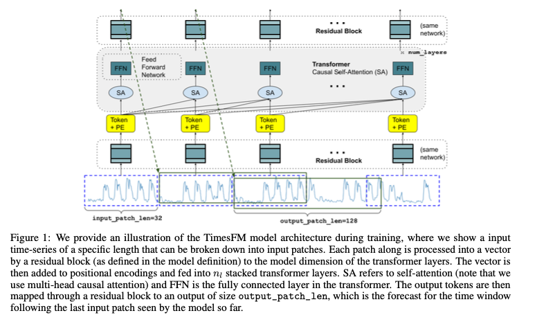
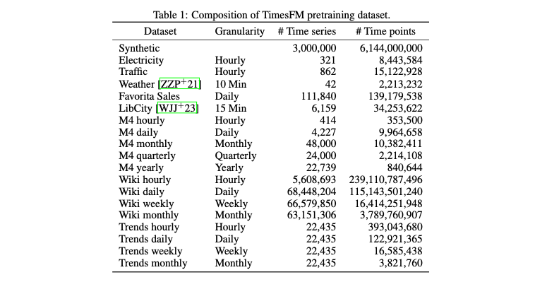
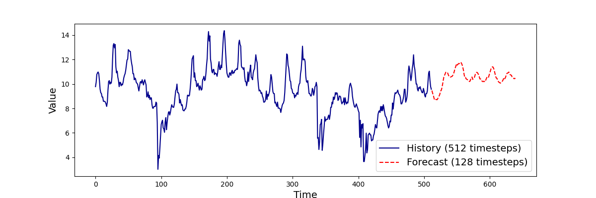

# TimesFM : 時系列予測の基盤モデル

# TimesFM : 時系列予測の基盤モデル

[](https://kyakuno.medium.com/?source=post_page---byline--0a11fdefa319---------------------------------------)

[Kazuki Kyakuno](https://kyakuno.medium.com/?source=post_page---byline--0a11fdefa319---------------------------------------)

Feb 6, 2026

--

Share

Googleの開発した時系列予測の基盤モデルであるTimesFMの紹介です。BigQuery MLに組み込まれています。

## TimesFMの概要

TimesFMはGoogleが2023年10月に公開した、時系列予測の基盤モデルです。様々な時系列データセットで事前学習することで、0ショットで時系列予測を行います。BigQuery MLに組み込まれています。

[## GitHub - google-research/timesfm: TimesFM (Time Series Foundation Model) is a pretrained…

### TimesFM (Time Series Foundation Model) is a pretrained time-series foundation model developed by Google Research for…

github.com](https://github.com/google-research/timesfm?source=post_page-----0a11fdefa319---------------------------------------)

[## A decoder-only foundation model for time-series forecasting

### Motivated by recent advances in large language models for Natural Language Processing (NLP), we design a time-series…

arxiv.org](https://arxiv.org/abs/2310.10688?source=post_page-----0a11fdefa319---------------------------------------)

## TimesFMの利用例

TimesFMモデルは、多くの実世界のデータセットから数十億のタイムポイントで事前にトレーニングされた時系列予測用の基盤モデルです。そのため、多くのドメインにわたる新しい予測データセットに適用できます。独自のモデルを作成してトレーニングすることなく予測を実行することができます。

[## TimesFM モデル | BigQuery | Google Cloud Documentation

### フィードバックを送信 コレクションでコンテンツを整理 必要に応じて、コンテンツの保存と分類を行います。 このドキュメントでは、BigQuery ML の組み込み TimesFM 時系列予測モデルについて説明します。 組み込みの…

docs.cloud.google.com](https://docs.cloud.google.com/bigquery/docs/timesfm-model?hl=ja&source=post_page-----0a11fdefa319---------------------------------------)

TimesFMを予測値として、差分を計算することで、異常検知に使用することも可能です。

[## The AI.DETECT\_ANOMALIES function | BigQuery | Google Cloud Documentation

### Edit description

docs.cloud.google.com](https://docs.cloud.google.com/bigquery/docs/reference/standard-sql/bigqueryml-syntax-ai-detect-anomalies?source=post_page-----0a11fdefa319---------------------------------------)

## TimesFMのアーキテクチャ

TimesFMは、Decoder-onlyのTransformerを使用しています。時系列データをパッチに分解して、トークン化します。

Press enter or click to view image in full size



TimesFMの学習に使用されたデータセットの一覧です。非常に大規模なデータで学習されており、汎用的な時系列予測を獲得しています。

Press enter or click to view image in full size



## TimesFMを使用する

ailia SDKでTimesFMを使用するには、下記のコマンドを使用します。csvのデータを読み込み、予測結果を画像ファイルに保存します。csvは行方向に時間方向のデータを格納し、列の名前はtargetオプションで指定します。

```
python3 timesfm.py --input ETTh1.csv --savepath output.png --target OT
```

出力例は下記となります。

Press enter or click to view image in full size



[## ailia-models/time\_series\_forecasting/timesfm at master · axinc-ai/ailia-models

### The collection of pre-trained, state-of-the-art AI models for ailia SDK - ailia-models/time\_series\_forecasting/timesfm…

github.com](https://github.com/axinc-ai/ailia-models/tree/master/time_series_forecasting/timesfm?source=post_page-----0a11fdefa319---------------------------------------)

アイリア株式会社はAIを実用化する会社として、クロスプラットフォームでGPUを使用した高速な推論を行うことができるailia SDKを開発しています。アイリア株式会社ではコンサルティングからモデル作成、SDKの提供、AIを利用したアプリ・システム開発、サポートまで、 AIに関するトータルソリューションを提供していますのでお気軽に[お問い合わせ](https://ailia.ai/contact/)ください。

## Get Kazuki Kyakuno’s stories in your inbox

Join Medium for free to get updates from this writer.

Subscribe

Subscribe

Remember me for faster sign in

AIで、しごとするなら『[ailia.ai（アイリア ドット エーアイ](https://blog.ailia.ai/)）』は、AIの開発を行う企業、株式会社アクセルおよびax株式会社が展開するAI専門メディアです。ビジネスやライフスタイルを取り巻く最新のAI関連製品やサービスを深く読み解くとともに、ailiaブランドが展開する最新のサービスや、AIの活用・開発・導入を加速させるための情報を幅広く網羅。  
近い未来、AIが私たちにもたらすであろう“本質的な自由“について、さまざまな角度から情報を発信します。