# Windows PCにCUDA ToolkitとcuDNNを導入する

# Windows PCにCUDA ToolkitとcuDNNを導入する

[](https://kyakuno.medium.com/?source=post_page---byline--2018c8edb2db---------------------------------------)

[Kazuki Kyakuno](https://kyakuno.medium.com/?source=post_page---byline--2018c8edb2db---------------------------------------)

8 min read

·

Nov 6, 2023

--

Share

Windows PCにCUDA ToolkitとcuDNNを導入する方法を解説します。

## CUDA ToolkitとcuDNNの概要

CUDA ToolkitはNVIDIAの提供するGPGPUのためのプラットフォームです。cuDNNはNVIDIAの提供するDNNのためのライブラリです。

ailia SDKは単独でもCPUやGPU（Vulkan）を使用した推論が可能ですが、NVIDIA GPUでは、CUDA ToolkitとcuDNNを導入することで、より高速な推論が可能になります。

## CUDA Toolkitのインストール

下記のページのDownload Nowからインストールします。

[## CUDA Toolkit - Free Tools and Training

### Get exclusive access to hundreds of SDKs, technical trainings, and opportunities to connect with millions of…

developer.nvidia.com](https://developer.nvidia.com/cuda-toolkit?source=post_page-----2018c8edb2db---------------------------------------)

今回はCUDA Toolkit 12.3を導入します。ailia SDK 1.2.15以降ではCUDA Toolkit 12に対応しています。CUDA Toolkit 13は未対応で、ailia SDK 1.7で対応予定です。Windows、x86\_64を選択して、Base Installerのexeをダウンロードします。

Press enter or click to view image in full size

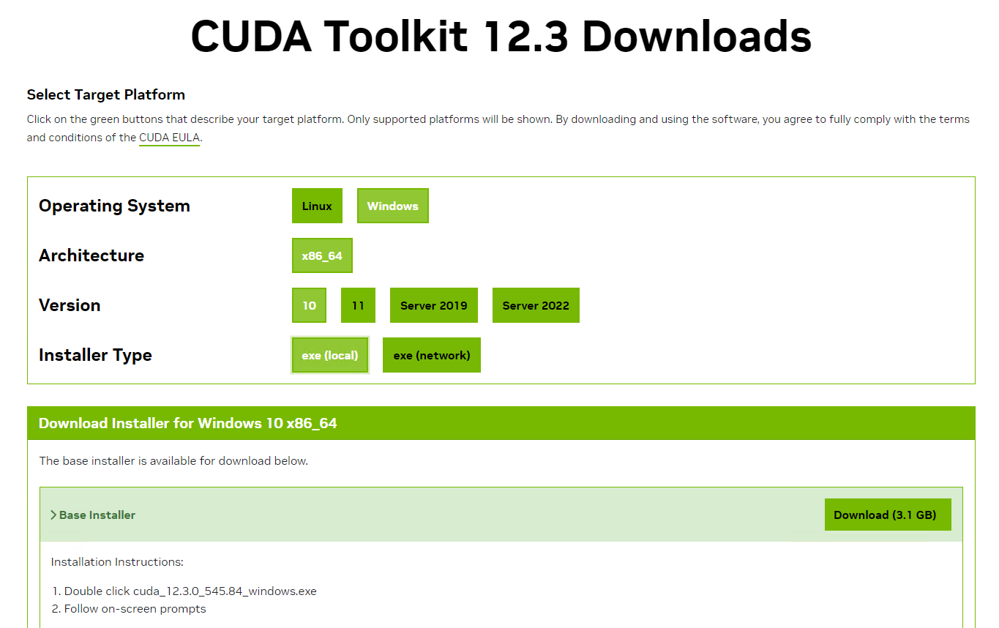

ワークディレクトリはデフォルトで問題ありません。

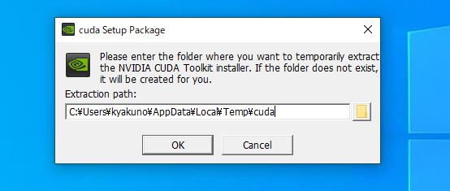

インストールを行います。

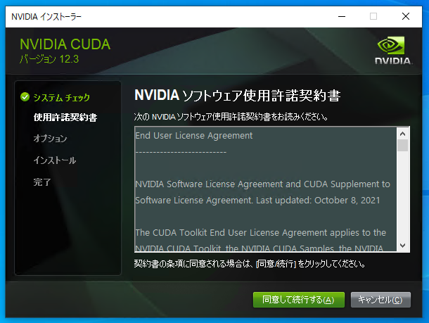

12.3のインストーラには不具合があり、標準インストールだとインストールエラーになるため、オプションでCUDAのRuntime、Documentation、Development、CUDAと同じ階層にあるDriver componentsだけを有効にします。

[## Nvidia installer failed CUDA 12.3.0

### I need help idk why the installer fails here is what I tried so far Installing the exact Nvidia drivers from the…

forums.developer.nvidia.com](https://forums.developer.nvidia.com/t/nvidia-installer-failed-cuda-12-3-0/270307?source=post_page-----2018c8edb2db---------------------------------------)

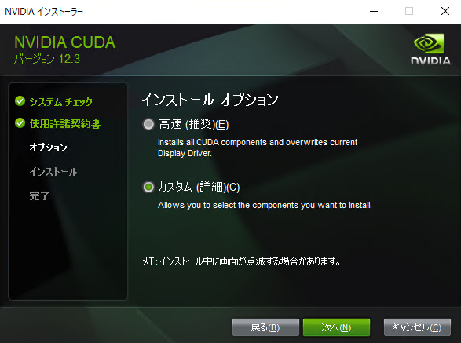

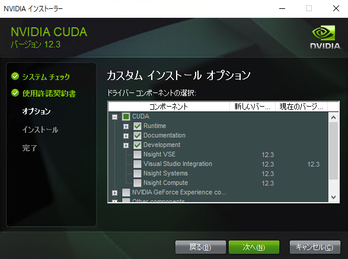

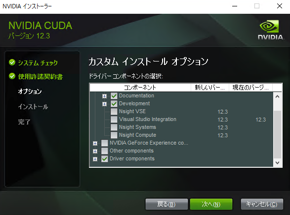

インストールに成功すると、下記の画面になります。

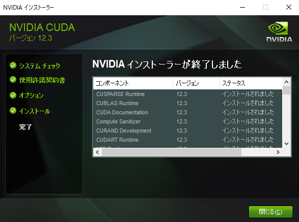

## cuDNNのインストール

下記のページのDownload cuDNN Libraryからインストールします。インストールには、NVIDIAのDevloper IDの登録が必要です。

[## CUDA Deep Neural Network

### cuDNN provides highly tuned implementations for standard routines such as forward and backward convolution, pooling…

developer.nvidia.com](https://developer.nvidia.com/cudnn?source=post_page-----2018c8edb2db---------------------------------------)

Press enter or click to view image in full size

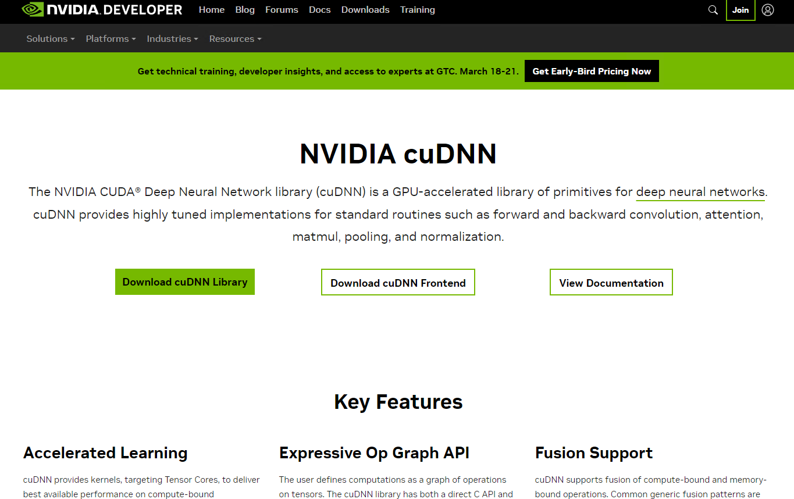

デベロッパーアカウントが要求されます。

Press enter or click to view image in full size

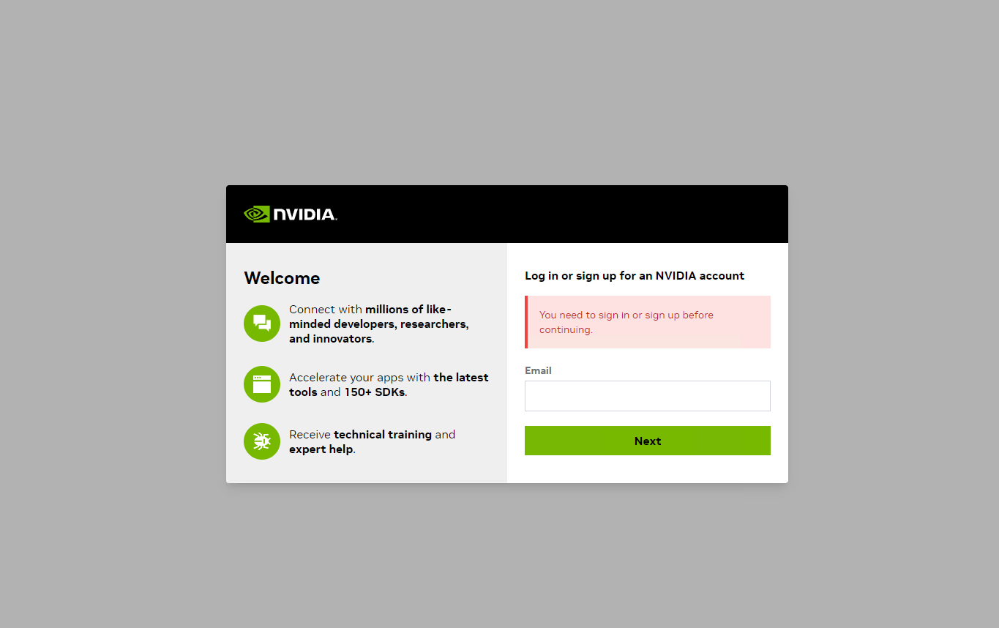

ログインすると、cuDNNがダウンロードすることができます。Local Installer for Windows (Zip)をダウンロードします。CUDA ToolkitのバージョンとcuDNNのバージョン（CUDA 12.xなど）は合わせる必要があります。cuDNN v9を使用するには、ailia SDK 1.4.0以降が必要です。ailia SDK 1.3.0以前の場合はcuDNN v9には未対応ですので、cuDNN v8をダウンロードしてください。cuDNN v10には未対応で、ailia SDK 1.7で対応予定です。

Press enter or click to view image in full size

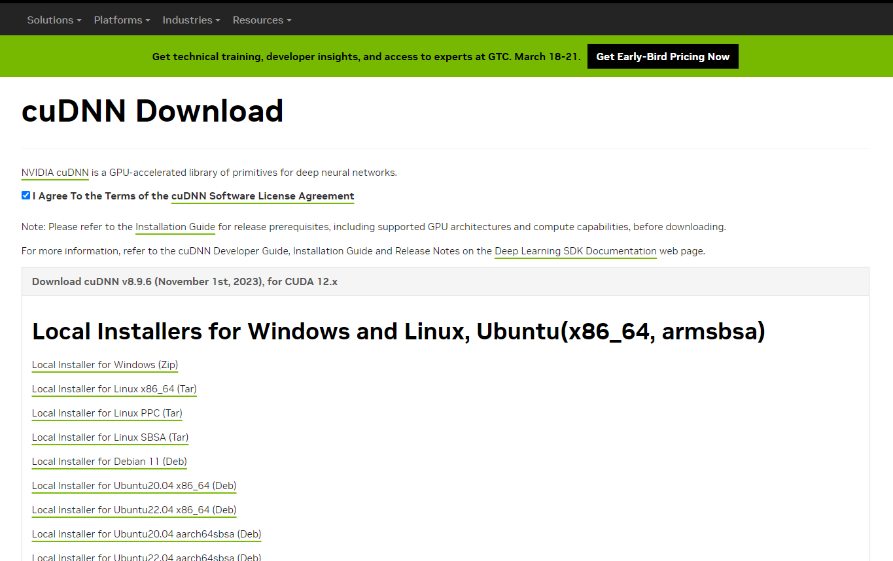

ダウンロードしたzipを回答し、c:/nvidia/などに配置します。

Press enter or click to view image in full size

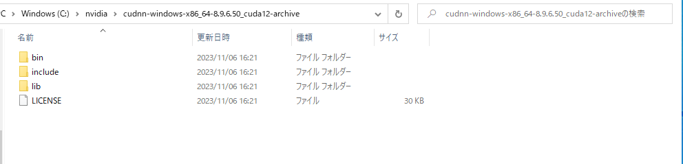

環境変数を設定します。Windowsの設定、詳細情報、システムの詳細設定から、環境変数を選択します。

Press enter or click to view image in full size

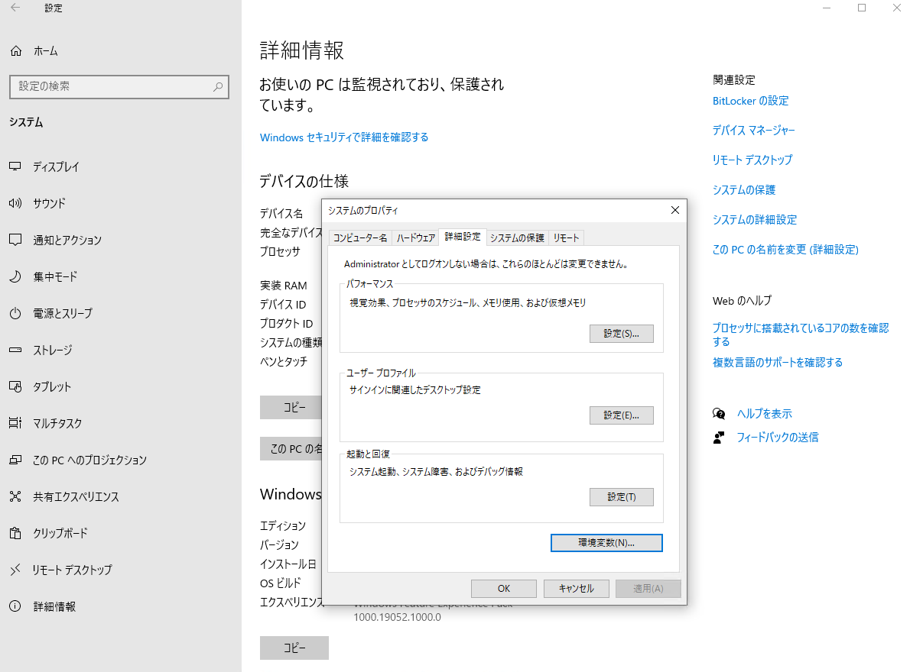

Pathの環境変数名の編集に、先ほどダウンロードした「C:\nvidia\cudnn-windows-x86\_64–8.9.6.50\_cuda12-archive\bin」を指定します。

Press enter or click to view image in full size

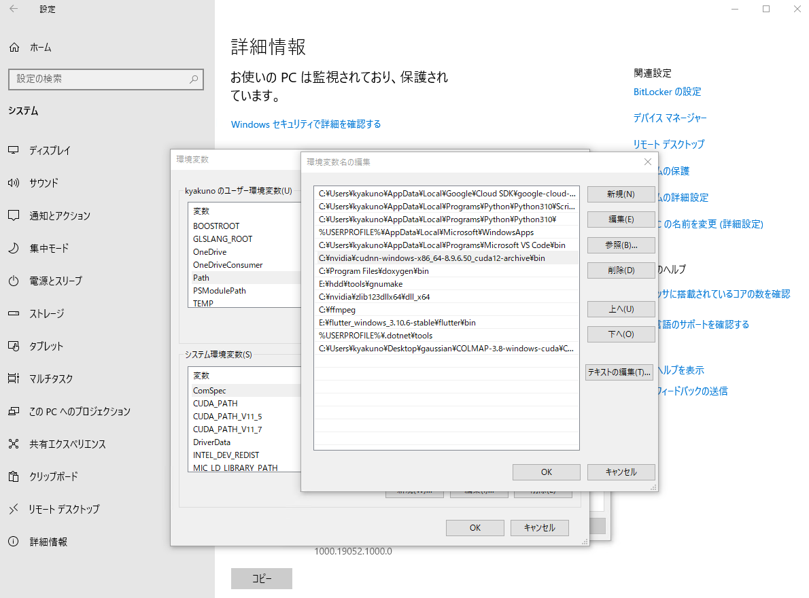

## zlibのインストール

Windows版のcuDNN 8.3以上の利用にはzlibが必要です。昔はNVIDIAのインストールガイドにダウンロードリンクの記載があったのですが、最新のドキュメントからは記載が消えています。しかし、インストールしないとcuDNNを使用することはできません。

## Get Kazuki Kyakuno’s stories in your inbox

Join Medium for free to get updates from this writer.

Subscribe

Subscribe

Remember me for faster sign in

下記のZLIBのホームページのダウンロードリンクからx64版の[zlib123dllx64.zip](https://www.winimage.com/zLibDll/zlib123dllx64.zip)をダウンロードします。

[## ZLIB DLL Home Page

### ZLIB is a compression library compatible with the gzip format. It has been written by Jean-Loup Gailly and Mark Adler…

www.winimage.com](https://www.winimage.com/zLibDll/index.html?source=post_page-----2018c8edb2db---------------------------------------)

Press enter or click to view image in full size

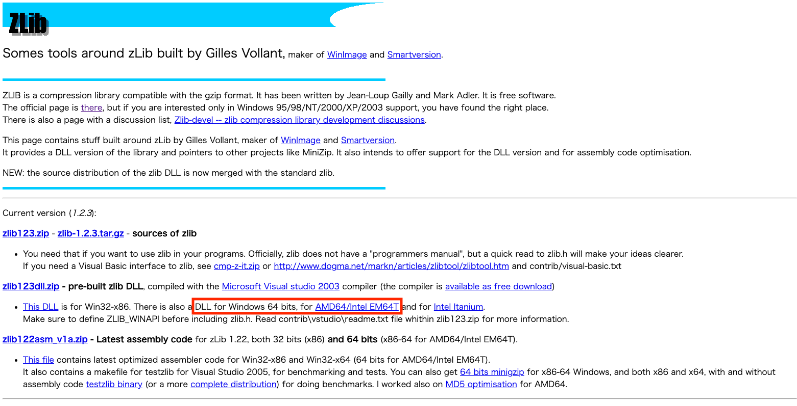

ダウンロードしたzipを展開したあと、zlibwapi.dllをパスの通った場所にコピーします。例えば、「C:\nvidia\cudnn-windows-x86\_64–8.9.6.50\_cuda12-archive\bin」などです。

## インストールの確認

ailia SDKのPython APIとailia MODELSを使用している場合は、各モデルのenv\_listコマンドでデバイスを列挙可能です。CUDAが表示されていれば成功です。

```
cd ailia-models/image_classification/resnet50  
python3 resnet50.py --env_list
```

出力例です。

```
E:\git\ailia-models\image_classification\resnet50>python resnet50.py --env_list  
 INFO arg_utils.py (13) : Start!  
 INFO arg_utils.py (153) :   env[0]=Environment(id=0, type='CPU', name='CPU', backend='NONE', props=[])  
 INFO arg_utils.py (153) :   env[1]=Environment(id=1, type='BLAS', name='CPU-IntelMKL', backend='NONE', props=[])  
 INFO arg_utils.py (153) :   env[2]=Environment(id=2, type='GPU', name='cuDNN-NVIDIA GeForce RTX 3080 (8.6, FP32)', backend='CUDA', props=[])  
 INFO arg_utils.py (153) :   env[3]=Environment(id=3, type='GPU', name='cuDNN-NVIDIA GeForce RTX 3080 (8.6, FP16)', backend='CUDA', props=['FP16'])  
 INFO arg_utils.py (163) : env_id: 2  
 INFO arg_utils.py (166) : cuDNN-NVIDIA GeForce RTX 3080 (8.6, FP32)
```

ailia SDKのUnity Pluginとailia MODELS Unityを使用している場合は、GPUの名称にCUDAが表示されていれば成功です。

ax株式会社はAIを実用化する会社として、クロスプラットフォームでGPUを使用した高速な推論を行うことができるailia SDKを開発しています。ax株式会社ではコンサルティングからモデル作成、SDKの提供、AIを利用したアプリ・システム開発、サポートまで、 AIに関するトータルソリューションを提供していますのでお気軽に[お問い合わせ](https://axinc.jp/)ください。