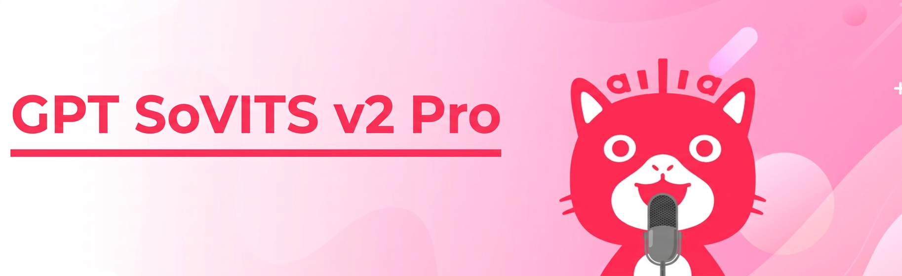
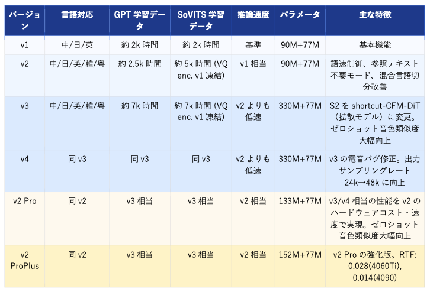
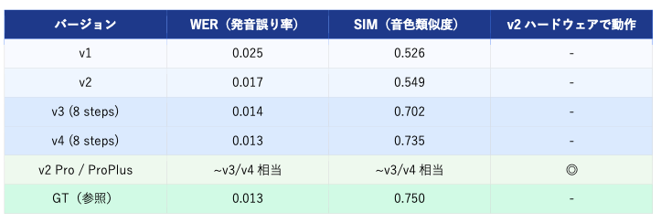

# GPT SoVITS v2 Pro : 高速かつ高精度な音声合成モデル

# GPT SoVITS v2 Pro : 高速かつ高精度な音声合成モデル

[](https://kyakuno.medium.com/?source=post_page---byline--81f2156366cd---------------------------------------)

[Kazuki Kyakuno](https://kyakuno.medium.com/?source=post_page---byline--81f2156366cd---------------------------------------)

11 min read

·

Mar 12, 2026

--

Share

GPT SoVITSの最新版であるv2 Proの紹介です。v4の精度を、v2の速度で実現します。

## GPT SoVITS v2 Proの概要

GPT SoVITS v2 Pro は、わずかな参照音声から高品質な音声合成（TTS）を実現する2025年6月に公開された最新モデルです。GPT SoVITSは v1 から v4、そして v2 Pro / v2 ProPlus まで継続的に進化しており、アーキテクチャや学習データセット、対応言語の観点でバージョンごとに大きな違いがあります。

Press enter or click to view image in full size



本記事では、GitHubリポジトリの公式 Wiki 情報をもとに、各バージョンの技術的差異を解説します。

[## GitHub - RVC-Boss/GPT-SoVITS: 1 min voice data can also be used to train a good TTS model! (few…

### 1 min voice data can also be used to train a good TTS model! (few shot voice cloning) - RVC-Boss/GPT-SoVITS

github.com](https://github.com/RVC-Boss/GPT-SoVITS?source=post_page-----81f2156366cd---------------------------------------)

## GPT SoVITSについて

GPT SoVITS は、GPT ベースのテキスト処理と VITS（Variational Inference with adversarial learning for end-to-end Text-to-Speech）由来の音声合成技術を組み合わせたシステムです。トークンベースの音声合成パイプラインを採用しており、seq2seq モデルで音響トークンを生成し、ボコーダーで波形に変換します。

テキストは g2p（Grapheme to Phoneme）変換によって音素列に変換され、参照音声は cnhubert によって SSL 特徴ベクトルに変換されます。中国語では BERT 埋め込みが追加で使用されますが、日本語・英語では zero-padding が適用されます。

・ 0ショット音声クローニング：5秒程度の参照音声から話者特性を即座に抽出  
・ ファインチューニング対応：1分程度の音声データで話者特化モデルを構築  
・ クロス言語合成：学習データと異なる言語での音声合成が可能

[## GPT-SoVITS : ファインチューニングできる0ショットの音声合成モデル

### ファインチューニングできる0ショットの音声合成モデルであるGPT-SoVITSの紹介です。GPT-SoVITSを使用することで、高品質な日本語音声合成が可能です。

medium.com](https://medium.com/axinc/gpt-sovits-%E3%83%95%E3%82%A1%E3%82%A4%E3%83%B3%E3%83%81%E3%83%A5%E3%83%BC%E3%83%8B%E3%83%B3%E3%82%B0%E3%81%A7%E3%81%8D%E3%82%8B0%E3%82%B7%E3%83%A7%E3%83%83%E3%83%88%E3%81%AE%E9%9F%B3%E5%A3%B0%E5%90%88%E6%88%90%E3%83%A2%E3%83%87%E3%83%AB-2212eeb5ad20?source=post_page-----81f2156366cd---------------------------------------)

## GPT SoVITSのバージョンごとの比較

以下は GitHub 公式 Wiki に掲載されているバージョン比較表をもとに整理したものです。v1とv2、v3とv4はほぼ同じアーキテクチャです。v1とv2は高速、v3とv4は低速だが高精度、と言う特徴があります。v2proは、v2のモデルアーキテクチャに、v4の学習ノウハウを付加した、高速・高精度の最新版です。

Press enter or click to view image in full size



上記の表は、[公式のWikiからの引用](https://github.com/RVC-Boss/GPT-SoVITS/wiki/GPT%E2%80%90SoVITS%E2%80%90features-(%E5%90%84%E7%89%88%E6%9C%AC%E7%89%B9%E6%80%A7))ですが、推論速度を修正しています。公式では推論速度について、v1とv2で2倍と記載されていますが、モデルアーキテクチャが同じなため、これは誤りではないかと考えています。また、v2とv3で速度が同じと記載されていますが、拡散モデルの追加があるため、v2よりもv3は低速になっています。

## 各バージョンの主要な変更点

### v1 → v2 : データ拡張と日本語にアクセントを追加

v1 から v2 への移行で最も大きな変化はデータ拡張です。GPT の学習データは約2k時間から約2.5k時間に、SoVITS は合計約5k時間に拡張されました。対応言語も中英日の3言語から、韓国語・広東語を加えた5言語に拡大。加えて語速調節機能、参照テキスト不要モード、混合言語切り分けの改善が追加されています。

また、v1 では日本語の g2p 変換にアクセント記号が付与されない仕様であったため、合成音声のイントネーションが不自然になるケースがありました。v2 以降ではテキストフロントエンドが改善され、日本語アクセントへの対応が強化されています。ユーザ辞書などで単語を追加した際も、アクセントが反映されるようになります。

### v3 : 拡散モデル導入と音色類似度の飛躍的向上

v3 は GPT SoVITS シリーズの中で最も大きなアーキテクチャ変更を伴うバージョンです。SoVITS の S2 コンポーネントが従来の VITS ベースから shortcut Conditional Flow Matching Diffusion Transformers（shortcut-CFM-DiT）に刷新されました。拡散モデルの採用により、参照音声への忠実度（ゼロショット音色類似度）が大幅に向上しています。

学習データも GPT・SoVITS ともに約7k時間に増強（MOS スコアによる音質フィルタリングおよび句読点停止検証を適用）。パラメータ数は v1/v2 の 90M+77M から 330M+77M へと約3.7倍に増加しています。

## Get Kazuki Kyakuno’s stories in your inbox

Join Medium for free to get updates from this writer.

Subscribe

Subscribe

Remember me for faster sign in

一方、v3/v4 は参照音声への追従性が高い分、学習セットの音質が低い場合に v2 系よりも合成品質が低下しやすい特性があります。訓練データの品質に課題がある場合は v2 系が適しています。

### v4 : v3 の電子音バグ修正と 48kHz 出力

v4 は v3 のアーキテクチャを継承しつつ、非整数倍アップサンプリングに起因する電子音（metallic artifacts）バグを修正しています。v3 では BigVGANv2 のホップサイズに合わせた際に SSL との整合で非整数倍アップサンプリングが発生し、少量サンプルでの大量ファインチューニング時などに電音が生じることがありました。v4 では開発者が独自に学習したボコーダーを採用し、出力サンプリングレートを v3 の 24kHz から 48kHz に向上させています。

### v2 Pro / v2 ProPlus : v2 のコストで v3/v4 を超える

v2 Pro は v3/v4 と同じ規模の学習データセット（GPT 約7k時間、SoVITS 約7k時間）を使用しながら、VITS ベースのアーキテクチャを維持することで v2 と同等のハードウェアコストと推論速度を実現したモデルです。パラメータ数は v2 Pro が 133M+77M、v2 ProPlus が 152M+77M と、v3/v4 の 330M+77M より大幅に軽量です。

ベンチマーク結果では v3/v4 と同水準のゼロショット音色類似度を達成しており、公式 Wiki では「v3/v4 を使い続ける必要はない」と明示されています。v2 ProPlus の実測 RTF（Real-Time Factor）は RTX 4060Ti で 0.028、RTX 4090 で 0.014 であり（1400文字≒4分の音声を 3.36 秒で推論）、Apple M4 CPU でも 0.526 を記録しています。

v2Proは、v3/v4 と同等の学習データ規模・ゼロショット性能を持ちながら、v2 と同等のハードウェアコスト・速度（VITS ベース）で動作します。v3/v4 より軽量かつ高速で、低品質データでも安定した合成が可能です。

## SeedTTS ベンチマーク評価

ByteDance Seed チームが公開した SeedTTS 論文の中国語テストセットを用いた評価結果が[公式 Wiki](https://github.com/RVC-Boss/GPT-SoVITS/wiki/GPT%E2%80%90SoVITS%E2%80%90v3v4%E2%80%90features-(%E6%96%B0%E7%89%B9%E6%80%A7)) に公開されています。WER（Word Error Rate：発音誤り率）と SIM（Timbre Similarity：音色類似度）で比較したものです。v3の8stepsは、拡散モデルであるCFMの繰り返し回数です。

Press enter or click to view image in full size



## ailia SDKからの活用

ailia SDKからGPT SoVITS v2 Proを使用するには、下記を使用します。

```
python3 gpt-sovits-v2-pro.py -i "ax株式会社ではAIの実用化のための技術を開発しています。" --ref_audio reference_audio_captured_by_ax.wav --ref_text "水をマレーシアから買わなくてはならない。"  
python3 gpt-sovits-v2-pro.py -i "你好世界。我们正在测试语音合成。" --text_language zh --ref_audio reference_audio_captured_by_ax.wav --ref_text "水をマレーシアから買わなくてはならない。"
```

[## ailia-models/audio\_processing/gpt-sovits-v2-pro at master · ailia-ai/ailia-models

### The collection of pre-trained, state-of-the-art AI models for ailia SDK …

github.com](https://github.com/ailia-ai/ailia-models/blob/master/audio_processing/gpt-sovits-v2-pro?source=post_page-----81f2156366cd---------------------------------------)

ailia AI Voiceも1.5からGPT SoVITS v2 Proに対応しており、Unityからも使用可能です。また、1.5から中国語にも対応しました。

[## AI Voice ｜ailia AI Series

### 日本語にも対応する、リアルタイム音声合成機能。あなたのAIエージェントに、音声合成機能をプラス。簡単にAIに喋らせることが可能。「AI Voice」です。

www.ailia.ai](https://www.ailia.ai/voice?source=post_page-----81f2156366cd---------------------------------------)

## 蒸留による高速化

アイリア株式会社では、GPT SoVITS v2 Proを蒸留することで、高速化する取り組みを進めています。

ailia SDKによる推論の高速化に加え、蒸留によるモデル高速化により、エッジデバイスでもGPT SoVITS v2 Proを使用した推論が現実的になります。

蒸留版を使用するには、gpt-sovits-v2-proで — distillオプションを付与します。1.80倍高速に推論可能です。現在はアルファ版で、今後、より高精度なモデルに更新予定です。

```
# 通常版  
python3 gpt-sovits-v2-pro.py -e 1 -b  
total processing time 5944 ms  
  
# 蒸留版  
python3 gpt-sovits-v2-pro.py -e 1 -b --distill small  
total processing time 3823 ms  
  
python3 gpt-sovits-v2-pro.py -e 1 -b --distill base  
total processing time 3294 ms
```

[## ailia-models/audio\_processing/gpt-sovits-v2-pro at master · ailia-ai/ailia-models

### The collection of pre-trained, state-of-the-art AI models for ailia SDK …

github.com](https://github.com/ailia-ai/ailia-models/blob/master/audio_processing/gpt-sovits-v2-pro?source=post_page-----81f2156366cd---------------------------------------)

## まとめ

GPT SoVITS v2 Pro は、v1〜v4 の進化の中で「実用コストと高品質の両立」という課題に応えたモデルです。v3/v4 が拡散モデル（shortcut-CFM-DiT）の導入と 7k 時間規模の学習データ拡張によって音色類似度を大幅に向上させた一方、v2 Pro は同等の学習データを使いながら VITS ベースの軽量設計を維持し、v2 と同等のハードウェアコストで v3/v4 を上回るコストパフォーマンスを実現しています。

また、 v1 では課題だった日本語アクセントの不自然さも v2 以降のテキストフロントエンド改善により対処されており、日本語 TTS 用途においても v2 Pro は有力な選択肢となっています。

ailia SDK とailia AI Voiceとの連携により、クロスプラットフォームかつ高速な音声合成パイプラインの構築が実現可能です。AIを活用したアプリケーション開発やモデルのアプリへの組み込みをご検討の際は、ぜひアイリア株式会社にご相談ください。

アイリア株式会社はAIを実用化する会社として、クロスプラットフォームでGPUを使用した高速な推論を行うことができるailia SDKを開発しています。アイリア株式会社ではコンサルティングからモデル作成、SDKの提供、AIを利用したアプリ・システム開発、サポートまで、 AIに関するトータルソリューションを提供していますのでお気軽に[お問い合わせ](https://ailia.ai/contact/)ください。