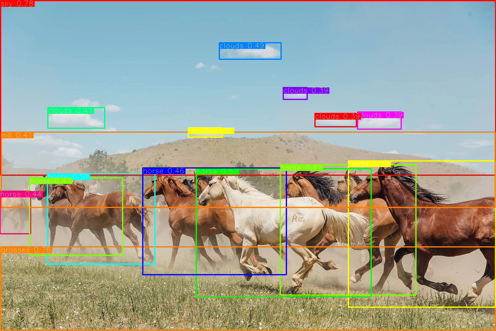
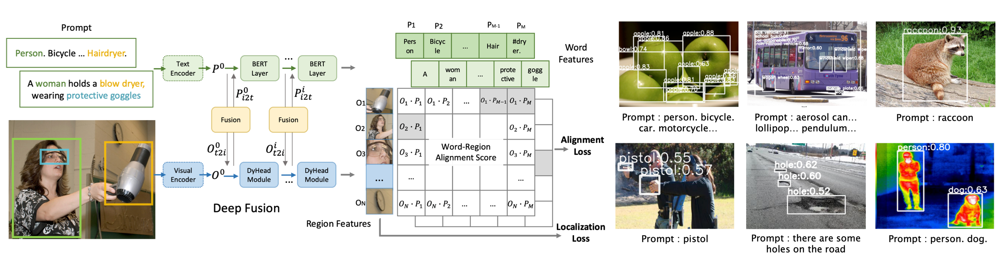
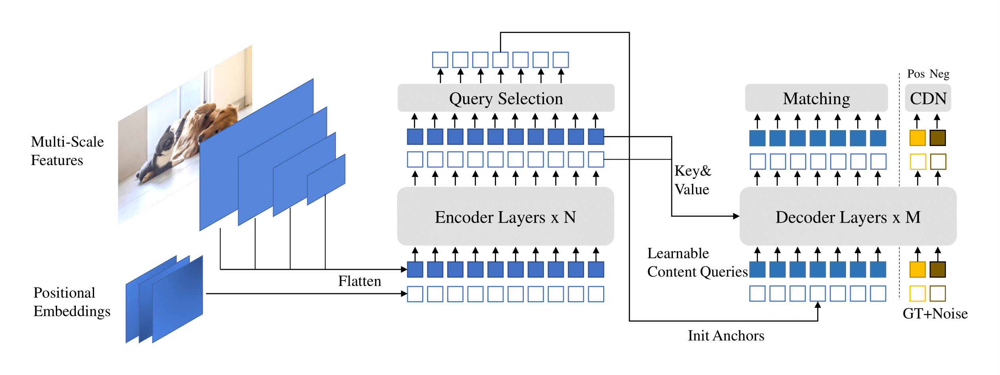
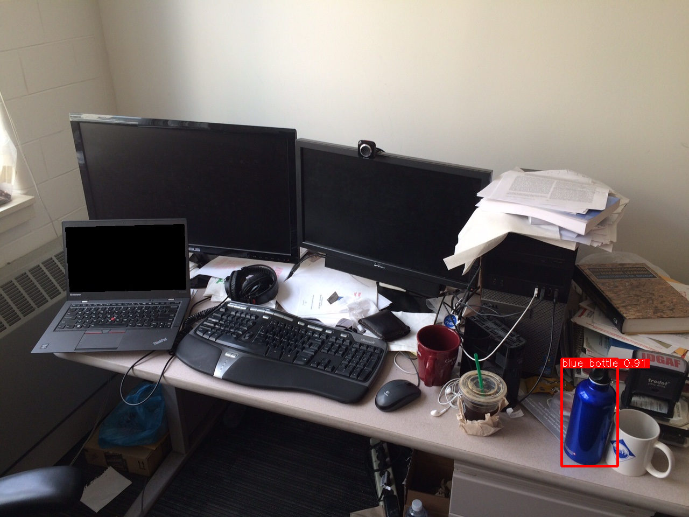
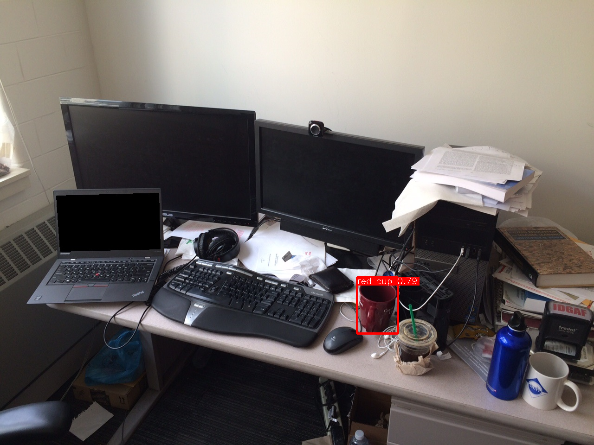
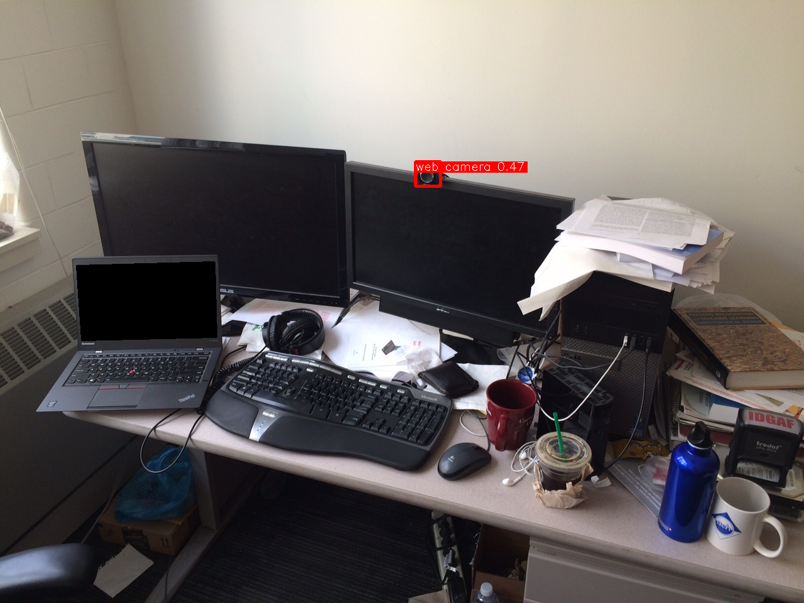

# Grounding DINO : 任意の物体を検出できる物体検出モデル

# Grounding DINO : 任意の物体を検出できる物体検出モデル

[](https://kyakuno.medium.com/?source=post_page---byline--3cc87db64f0c---------------------------------------)

[Kazuki Kyakuno](https://kyakuno.medium.com/?source=post_page---byline--3cc87db64f0c---------------------------------------)

Jul 9, 2024

--

Share

任意の物体を検出できる物体検出モデルであるGrounding DINOのご紹介です。検出したい物体をテキストで指定すると、指定した物体のBounding Boxを取得可能です。

## Grounding DINOの概要

Grounding DINOは、任意の物体を検出できる物体検出モデルです。画像に対して、テキストで検知したい物体を入力すると、その物体のBounding Boxを取得可能です。

Press enter or click to view image in full size



Grounding DINOの出力（出典：<https://github.com/IDEA-Research/Grounded-Segment-Anything/blob/main/assets/demo7.jpg>）

[## GitHub - IDEA-Research/GroundingDINO: [ECCV 2024] Official implementation of the paper "Grounding…

### ECCV 2024] Official implementation of the paper "Grounding DINO: Marrying DINO with Grounded Pre-Training for Open-Set…

github.com](https://github.com/IDEA-Research/GroundingDINO?source=post_page-----3cc87db64f0c---------------------------------------)

## Grounding DINOのアーキテクチャ

CLIPの物体検出バージョンとして、GLIPが提案されています。GLIPは、Visual Encoderで物体の候補領域とEmbeddingを、Text EncoderでテキストのEmbeddingを計算し、その内積でWord-Region Alignment Scoreを計算します。これにより、任意のテキストでの物体検出を実現しています。

Press enter or click to view image in full size



GLIPのアーキテクチャ（出典：<https://github.com/microsoft/GLIP>）

また、Transformerを使用した物体検出器としてDINOが提案されています。DINOは、DETRからNMS（Non Max Suppression）などの固定的なアルゴリズムを除去し、End2Endで最適化を行えるようにしたアルゴリズムです。

Press enter or click to view image in full size



DINOのアーキテクチャ（出典：<https://github.com/IDEA-Research/DINO>）

Grounding DINOは、GLIPの物体検出部分をDINOにしたモデルアーキテクチャとなります。

Press enter or click to view image in full size


Grounding DINOのアーキテクチャ（出典：<https://arxiv.org/abs/2303.05499>）

## Get Kazuki Kyakuno’s stories in your inbox

Join Medium for free to get updates from this writer.

Subscribe

Subscribe

Remember me for faster sign in

テキストのトークナイズには、GLIPと同様のBERT-baseを使用しています。

## Grounding DINOの使用方法

ailia SDKでGroundind DINOを使用するには、下記のコマンドを使用します。入力画像と、検知したい物体のラベルを指定します。

```
python3 groundingdino.py -i input.jpg --caption "Horse. Clouds. Grasses. Sky. Hill."
```

[## ailia-models/object\_detection/groundingdino at master · ailia-ai/ailia-models

### The collection of pre-trained, state-of-the-art AI models for ailia SDK - ailia-models/object\_detection/groundingdino…

github.com](https://github.com/ailia-ai/ailia-models/tree/master/object_detection/groundingdino?source=post_page-----3cc87db64f0c---------------------------------------)

## Grounding DINOの使用例

Deticのサンプル画像に対して、検出をしてみます。どの物体も、指定した通りに取得可能できました。

### blue bottle

Press enter or click to view image in full size



（画像の出典：<https://web.eecs.umich.edu/~fouhey/fun/desk/desk.jpg>）

### red cup

Press enter or click to view image in full size



（画像の出典：<https://web.eecs.umich.edu/~fouhey/fun/desk/desk.jpg>）

### web camera

Press enter or click to view image in full size



（画像の出典：<https://web.eecs.umich.edu/~fouhey/fun/desk/desk.jpg>）

アイリア株式会社はAIを実用化する会社として、クロスプラットフォームでGPUを使用した高速な推論を行うことができるailia SDKを開発しています。アイリア株式会社ではコンサルティングからモデル作成、SDKの提供、AIを利用したアプリ・システム開発、サポートまで、 AIに関するトータルソリューションを提供していますのでお気軽に[お問い合わせ](https://ailia.ai/contact/)ください。