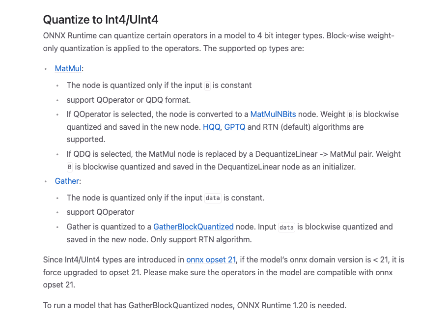
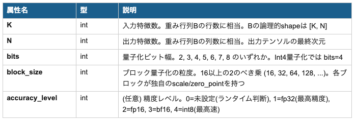
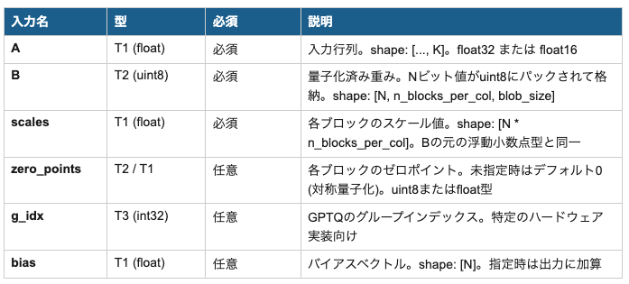
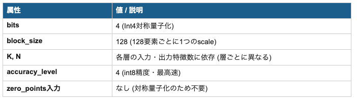

# MatMulNBits : LLM/VLMをONNXで動かすための4bit量子化

# MatMulNBits : LLM/VLMをONNXで動かすための4bit量子化

[](https://kyakuno.medium.com/?source=post_page---byline--6cb572b43c19---------------------------------------)

[Kazuki Kyakuno](https://kyakuno.medium.com/?source=post_page---byline--6cb572b43c19---------------------------------------)

21 min read

·

Mar 23, 2026

--

Share

MatMulNBitsを使用することで、ONNXでも4bit量子化を実現し、LLM/VLMを少ないVRAMで動作させることが可能になります。

## 1. LLMの量子化

大規模言語モデル (LLM) やビジョン言語モデル (VLM) をエッジデバイスで実行するには、メモリと計算コストの削減が不可欠です。そのための中核技術が**Weight-Only量子化**であり、モデルの重みを32bitの浮動小数点から4bitや8bitの整数に圧縮することで、モデルサイズを劇的に縮小します。

本記事では、この量子化を実現するための2つの技術要素を中心に解説します。

1. **MatMulNBitsQuantizer** — ONNX Runtimeに含まれる量子化ツール。
2. **com.microsoft:MatMulNBits** — ONNX Runtimeの拡張オペレータ。Nビット量子化された重みで行列乗算を効率的に実行する。

後半では、これらの技術を実際に適用した**ケーススタディ**として、マルチモーダルAIモデル Qwen2-VL-2B の4bit量子化の実践事例を紹介します。

## 2. llama.cpp と ONNX の4bit量子化ギャップ

### 2.1 LLM推論における llama.cpp の台頭

LLMの推論エンジンとして、**llama.cpp**は極めて高いシェアを獲得しています。その最大の理由の一つが、**早期から4bit量子化 (Weight Quantization) に対応していた**ことです。llama.cppはGGML/GGUF形式を独自に定義し、2bit、4bit、5bit、6bit、8bitといった多様なビット幅でモデルの重みを量子化する仕組みをランタイム自体に組み込みました。

llama.cppが実現したのは、本質的に**Weight Quantization (重み量子化)** です。活性化 (Activation) は浮動小数点のまま保持し、重み (Weight) のみを低ビット整数に量子化します。推論時には、量子化された重みを逆量子化しながら行列乗算を行います。この手法により、モデルサイズを大幅に削減しつつ、精度の低下を最小限に抑えることに成功しました。

### 2.2 ONNX Runtime における4bit量子化の不在

一方、**ONNX Runtime**は長らく8bit量子化 (INT8) には対応していたものの、**4bit量子化には対応していませんでした。**ONNXの標準演算子仕様にはそもそも4bitの整数データ型が定義されておらず、4bit重み量子化を表現する手段がなかったのです。

この制約は、LLMの実用的な推論において大きなハンディキャップとなりました。FP32のLLMは数GB〜数十GBのメモリを要求しますが、4bit量子化すればそのサイズを約1/8に圧縮できます。llama.cppがこの圧縮を提供する一方で、ONNXエコシステムでは同等の軽量化が不可能だったため、エッジデバイスでのLLM推論においてllama.cppが事実上の第一選択肢となっていました。

### 2.3 MatMulNBits

このギャップを埋めたのが、ONNX Runtimeに2024年2月のv1.17.0で追加されたMicrosoft独自拡張オペレータ **com.microsoft:MatMulNBits** です。

Press enter or click to view image in full size



出典：<https://onnxruntime.ai/docs/performance/model-optimizations/quantization.html#quantize-to-int4uint4>

llama.cppが独自ランタイム全体で実現していたWeight Quantizationは、ONNXの世界では**1つのオペレータの追加**で同等の推論が可能になりました。MatMulNBitsオペレータは「量子化された重みの逆量子化」と「行列乗算」を融合した単一の演算子であり、これがモデルグラフ内のMatMulノードを置換するだけで、4bit量子化推論が実現します。

そして、この MatMulNBits オペレータを利用した4bit量子化モデルの生成を、簡単に行えるようにしたのが **MatMulNBitsQuantizer** です。

**MatMulNBitsQuantizer**は既存のFP32 ONNXモデルを入力として、MatMulNBitsを含むInt4量子化モデルを自動的に出力します。

ONNXはクロスプラットフォームの業界標準フォーマットであるため、MatMulNBitsの追加による4bit対応は、Windows, Linux, macOS, iOS, Androidなどあらゆるプラットフォームでの4bit LLM推論を一挙に可能にした点で、エコシステム全体への波及効果は非常に大きいと言えます。

### 2.4 VLM (ビジョン言語モデル) における ONNX の優位性

テキストのみのLLMに加え、画像や動画を理解できる**VLM (Vision-Language Model)** の分野では、ONNXの優位性がさらに顕著になります。

llama.cppは2025年にマルチモーダルライブラリ libmtmd を導入し、VLMへの対応を進めています。しかし、llama.cppのVLM対応は公式ドキュメントで「非常に活発な開発中 (under very heavy development)」と記されており、各モデルアーキテクチャごとに個別のProjector実装が必要です。

llama.cppのマルチモーダルロードマップ ([Issue #8010)](https://github.com/ggml-org/llama.cpp/issues/8010) によると、当初はLLaVAのみがサポートされていましたが、段階的にGemma 3、MiniCPM-Vへの対応が追加されました。Qwen2-VLおよびQwen2.5-VLについては、M-RoPE (Multi-dimensional Rotary Position Embedding) という特殊な位置エンコーディングへの対応が必要であり、[PR #13141](https://github.com/ggml-org/llama.cpp/pull/13141)で後から追加されました。

つまり、llama.cppでVLMモデルを動かすには、**Projector (プロジェクター) の実装をモデルアーキテクチャごとに個別に追加**する必要があり、新しいVLMが登場するたびに、llama.cppのランタイム自体を拡張する開発コストが発生するのです。

一方、**ONNX Runtime + MatMulNBitsQuantizer**のアプローチでは、VLMのモデルアーキテクチャに依存しない形で4bit量子化が実現できます。ONNXはllama.cppよりも多くのオペレータに標準で対応しており、Vision Encoderが標準的な計算グラフとして表現されるため、ランタイム側にモデル固有のProjector実装を追加する必要がありません。

**MatMulNBitsQuantizer**の量子化プロセスは、グラフ内のMatMulノードをMatMulNBitsノードに機械的に置換するだけです。これはモデルの内部アーキテクチャ (Projector構造、位置エンコーディング方式、Attention機構) に全く依存しません。したがって、Qwen2-VLに限らず、**今後登場する任意のVLMアーキテクチャ**に対しても、ONNXグラフに変換さえすれば即座に4bit量子化を適用できます。

### 2.5 QOperator形式とQDQ形式

ONNX Runtimeの量子化出力には2つの形式があります。Weight-Only Int4量子化では通常QOperator形式が使われます。


QOperator形式を選択すると、モデル内のMatMulノードが com.microsoft:MatMulNBits ノードに直接置換されます。次章でこのオペレータの仕様を詳しく見ていきます。

## 3. com.microsoft:MatMulNBits オペレータ詳細

MatMulNBitsは、ONNX Runtimeの拡張オペレータドメイン com.microsoft に属するContribオペレータです。標準のMatMulオペレータを拡張し、Nビット (2–8bit) に量子化された重みで行列乗算を実行します。ONNX Runtime GenAI Model BuilderやIntel Neural Compressorなどの主要ツールで広く採用されており、LLMのInt4量子化における事実上の標準オペレータとなっています。

### 3.1 動作原理

MatMulNBitsは推論時に以下の2ステップを実行します。

**ステップ1: 逆量子化 (Linear Dequantization)**

```
dequantized_weight = (quantized_weight - zero_point) × scale
```

量子化された整数値 (quantized\_weight) からゼロポイントを引き、ブロックごとのスケール値を乗じて浮動小数点に復元します。

**ステップ2: 行列乗算**

```
Y = A × dequantized_weight + bias
```

元された重み行列と入力行列Aの積を計算します。バイアスが指定されている場合は加算されます。

**▶ ポイント:** 逆量子化と行列乗算が単一のオペレータ内で融合されているため、中間テンソルの生成が不要になり、メモリ帯域の使用が最適化されます。

### 3.2 属性 (Attributes)

MatMulNBitsノードに設定される属性は以下の5つです。K, N, bits, block\_sizeは必須属性です。accuracy\_levelは演算の精度を定義します。1の場合は、入力精度fp32、アキュムレータfp32で、fp32で行列積を実行します。4の場合は、入力精度int8、アキュムレータint32で、入力テンソルのAをDynamic Quantizationしてint8で行列積を実行します。そのため、1よりも4の方が高速になります。0は、ランタイム判断ですが、ONNX Runtimeでは1として扱われます。



### 3.3 入力テンソル (Inputs)



### 3.4 出力テンソル (Outputs)


### 3.5 重みのビットパッキング形式

量子化された重みはuint8配列にビットパックされて格納されます。パッキングのルールはbits値によって異なります。

**4bitの場合 (最も一般的)**

1バイトに2つの4bit値を格納します。下位4ビットが前のデータ、上位4ビットが後のデータです。

```
// パッキング例 (bits=4)  
// 値 A=3 (0011), B=5 (0101) の場合:  
// packed_byte = (B << 4) | A = 0101_0011 = 0x53  
// blob_size (1ブロックのバイト数):  
// blob_size = ceil(block_size * bits / 8)  
// block_size=128, bits=4 → blob_size = 64 bytes  
// 重み全体のshape:  
// B[N][n_blocks_per_col][blob_size]  
// n_blocks_per_col = ceil(K / block_size)
```

**その他のビット幅**

## Get Kazuki Kyakuno’s stories in your inbox

Join Medium for free to get updates from this writer.

Subscribe

Subscribe

Remember me for faster sign in

3, 5, 6, 7bitの場合は異なるパッキング方式が使われます。たとえば3bitでは32個の値が12バイトに、5bitでは32個の値が20バイトにそれぞれパックされ、ビットの無駄がないように設計されています。

### 3.6 ONNX標準化の動向

MatMulNBitsは現在、ONNX Runtimeのcom.microsoftドメインに属するContribオペレータですが、ONNX標準への組み込みが提案されています ([onnx/onnx PR #6500](https://github.com/onnx/onnx/issues/7691))。標準化にあたってはK, N属性の推論による省略、g\_idx入力の削除、int32型の削除などの変更が議論されています。

## 4. ケーススタディ: Qwen2-VL-2B の Int4量子化

ここからは、前章までに解説した**MatMulNBitsQuantizer**とMatMulNBitsを実際に適用した事例として、ailia-models (PR [#1825](https://github.com/ailia-ai/ailia-models/pull/1825) , [#1827](https://github.com/ailia-ai/ailia-models/pull/1827)) で実施された**Qwen2-VL-2BのInt4量子化**を紹介します。

### 4.1 Qwen2-VL-2Bの概要

Qwen2-VLはAlibabaグループのQwenチームが開発したマルチモーダルAIモデルで、画像・動画の理解とテキスト生成を統合的に行えます。「2B」はパラメータ数が約20億であることを示しています。モデルは2つのコンポーネントで構成されます。

- **Vision Encoder**: 画像や動画フレームを特徴ベクトルに変換する視覚処理部分
- **LLM Decoder**: 視覚特徴とテキストプロンプトを受け取り、テキストを生成する言語モデル部分

### 4.2 モデルのバリアント構成

ailia-modelsでは3つの精度バリアントを提供しています。

- FP32 : 基準モデル
- FP16 : 従来から提供（FP32からONNX Converter Commonで生成）
- Int4 : 今回新たに追加（FP32からMatMulNBitsQuantizerで生成）

### 4.3 量子化スクリプトの実装

量子化スクリプト [export/export\_decoder\_int4.py](https://github.com/ailia-ai/ailia-models/blob/master/vision_language_model/qwen2_vl/export/export_decoder_int4.py) は3つのステップで構成されています。

**Step 1: FP32モデルのダウンロード**

```
original_model = "Qwen2-VL-2B.onnx"  
original_pb = "Qwen2-VL-2B_weights.pb"  
download_model(original_model, remote_path)  
download_model(original_pb, remote_path)
```

MatMulNBitsQuantizerはFP32のONNXを入力としてInt4のONNXを出力します。FP16のONNXから変換すると、MatMulNBitsの出力型がFP32となりデータ型不一致が発生するため、必ずFP32モデルから変換してください。

**Step 2: MatMulNBitsQuantizerによるInt4量子化**

```
from onnxruntime.quantization.matmul_nbits_quantizer \  
import MatMulNBitsQuantizer  
from onnxruntime.quantization.quant_utils import QuantFormat  
quant = MatMulNBitsQuantizer(  
  model=input_model_path,  
  bits=4, # 4bit量子化  
  block_size=128, # ブロックサイズ 128  
  is_symmetric=True, # 対称量子化 (Int4)  
  accuracy_level=4, # 最高精度レベル  
  quant_format=QuantFormat.QOperator,  
  op_types_to_quantize=("MatMul",),  
)  
quant.process()  
onnx.save(quant.model.model, output_model_path)
```

### 4.4 使用されたMS拡張オペレータ

量子化後のInt4モデルで使用されているMS拡張オペレータは、**MatMulNBitsの1種類のみ**です。モデル内の全MatMulノードがMatMulNBitsに置換され、重みがブロック単位で4bitにパックされています。属性値は以下の設定です。accuracy\_level = 4で、Int8演算に指定しています。

Press enter or click to view image in full size



### 4.5 Vision Encoderの量子化

Vision Encoderは、MatMulではなく、Transpose + Gemmが使用されています。MatMulNBitsQuantizerはMatMulのみを量子化するため、Transpose + Gemmが使用されている場合、量子化できません。そのため、ONNXのグラフ変換でTranspose + GemmをMatMulに置き換える必要があります。実際のコード例は、下記のリンクを参照してください。

[## ailia-models/vision\_language\_model/qwen2\_vl/export/export\_encoder\_int4.py at master ·…

### The collection of pre-trained, state-of-the-art AI models for ailia SDK …

github.com](https://github.com/ailia-ai/ailia-models/blob/master/vision_language_model/qwen2_vl/export/export_encoder_int4.py?source=post_page-----6cb572b43c19---------------------------------------)

### 4.6 推論時の注意点

Int4モデルの推論では、ONNX Runtimeの**グラフ最適化を無効にする**必要があります。MatMulNBitsオペレータは一部の最適化パスと互換性がないためです。

```
import onnxruntime  
sess_options = onnxruntime.SessionOptions()  
sess_options.graph_optimization_level = (  
onnxruntime.GraphOptimizationLevel.ORT_DISABLE_ALL  
)  
net = onnxruntime.InferenceSession(  
  WEIGHT_PATH,  
  sess_options=sess_options,  
  providers=providers  
)
```

[## ORT would be crashed while loading the specific INT4 model · Issue #22284 · microsoft/onnxruntime

### Describe the issue ORT would be crashed while loading the specific INT4 model. We can observe the issue on DML EP and…

github.com](https://github.com/microsoft/onnxruntime/issues/22284?source=post_page-----6cb572b43c19---------------------------------------)

### 4.7 モデルの使い方

量子化されたモデルは — quantize オプションで切り替えて利用できます。 — onnxを指定すると、ONNX Runtimeで推論します。ailia SDKは1.6.1では非対応で、1.7からInt4モデルに対応予定です。

```
# FP32モデル (デフォルト)  
python3 qwen2_vl.py --onnx  
# FP16モデル  
python3 qwen2_vl.py --fp16 --onnx  
# Int4モデル (今回追加)  
python3 qwen2_vl.py --quantize int4 --onnx
```

[## ailia-models/vision\_language\_model/qwen2\_vl at master · ailia-ai/ailia-models

### The collection of pre-trained, state-of-the-art AI models for ailia SDK - ailia-models/vision\_language\_model/qwen2\_vl…

github.com](https://github.com/ailia-ai/ailia-models/tree/master/vision_language_model/qwen2_vl?source=post_page-----6cb572b43c19---------------------------------------)

### 4.8 ベンチマーク

M2 MacでのFP32とInt4のベンチマークです。1024x683の画像を使用し、画像トークンとプロンプトトークンを合わせて、prefillは908トークンです。画像のエンコードは24474msから18932msに、prefillは9533msから5831msに、トークンのデコードは144msから40msに、大幅に高速化されます。これは、accuracy\_level = 4でInt8 x Int8で行列積が実行され、Arm v8.4から標準化されたvdotq\_s32命令によって高速化されるためです。

```
python3 qwen2_vl.py -b --onnx
```

```
 INFO qwen2_vl.py (640) :  encode time 24474 ms  
 INFO qwen2_vl.py (691) :  decode time 9533 ms  
 INFO qwen2_vl.py (691) :  decode time 238 ms  
 INFO qwen2_vl.py (691) :  decode time 144 ms  
 INFO qwen2_vl.py (691) :  decode time 136 ms
```

```
python3 qwen2_vl.py -b --quantize int4 --onnx
```

```
 INFO qwen2_vl.py (640) :  encode time 18932 ms  
 INFO qwen2_vl.py (691) :  decode time 5831 ms  
 INFO qwen2_vl.py (691) :  decode time 39 ms  
 INFO qwen2_vl.py (691) :  decode time 40 ms  
 INFO qwen2_vl.py (691) :  decode time 38 ms
```

### 4.9 モデルサイズ

Vision Encoderは3.59GB (FP32)から1.31GB (Int4)に、Decoderは7.11GB (FP32)から1.76GB (Int4)に削減されます。MatMulNBitsでは、VRAM上に4bitでウエイトを持つため、必要なVRAMも同様に削減されます。

### 4.10 テスト環境

動作確認は以下の環境で実施されています。

- onnxruntime 1.24.4
- onnx 1.20.1

## 6. まとめ

本記事では、llama.cppが先行していた4bit Weight Quantizationの領域において、ONNXエコシステムがいかにしてそのギャップを埋めたかを解説しました。

### llama.cpp vs ONNX: 4bit量子化のアプローチ

- llama.cppは独自ランタイム全体を設計することで4bit Weight Quantizationを実現し、LLM推論で高いシェアを獲得した
- ONNX Runtimeは MatMulNBits というたった1つのMS拡張オペレータを追加するだけで、llama.cppと同等の4bit Weight Quantization推論を実現した
- VLMの分野では、llama.cppがモデルごとにProjector実装を個別追加する必要があるのに対し、ONNX + MatMulNBitsQuantizerはアーキテクチャ非依存で量子化が適用でき、Qwen2-VL等の新しいVLMにも安定した4bit推論を提供できる
- ONNXは業界標準フォーマットであるため、この1オペレータの追加によりマルチプラットフォームでの4bit LLM/VLM推論が一挙に可能になった

### com.microsoft:MatMulNBitsについて

- Nビット量子化された重みでの行列乗算を効率的に実行するONNX Runtime拡張オペレータ
- 逆量子化と行列乗算の融合により、メモリ帯域の最適化を実現
- ブロック量子化、対称/非対称量子化、2–8bitの幅広いビット幅をサポート
- ONNX標準への組み込みが進行中であり、エコシステム全体での採用が拡大

### ケーススタディの知見

- FP32モデルを入力ソースとして使用することが必須 (FP16からの変換は型不一致の原因)
- Vision EncoderとLLM Decoderの選択的量子化により精度とサイズのバランスを最適化
- Int4推論時にはグラフ最適化の無効化が必要
- MS拡張オペレータはMatMulNBitsの1種類のみで実装がシンプル

llama.cppがランタイム全体の再設計で切り拓いた4bit量子化の道を、ONNX Runtimeはわずか1オペレータの追加で追随しました。特にVLMの分野では、モデルアーキテクチャごとにランタイムを拡張する必要がないONNXのアプローチは、急速に多様化するVLMモデルへの対応において大きな優位性を持っています。

MatMulNBitsQuantizerとMatMulNBitsの組み合わせにより、最小限のコードで実用的な量子化モデルを生成でき、ONNX標準に基づくクロスプラットフォームな4bit LLM/VLM推論が現実のものとなっています。

アイリア株式会社はAIを実用化する会社として、クロスプラットフォームでGPUを使用した高速な推論を行うことができるailia SDKを開発しています。アイリア株式会社ではコンサルティングからモデル作成、SDKの提供、AIを利用したアプリ・システム開発、サポートまで、 AIに関するトータルソリューションを提供していますのでお気軽に[お問い合わせ](https://ailia.ai/contact/)ください。