# Moirai : Salesforceが開発した時系列予測の基盤モデル

# Moirai : Salesforceが開発した時系列予測の基盤モデル

[](https://kyakuno.medium.com/?source=post_page---byline--cad4a857f142---------------------------------------)

[Kazuki Kyakuno](https://kyakuno.medium.com/?source=post_page---byline--cad4a857f142---------------------------------------)

34 min read

·

1 hour ago

--

Share

共変量を扱えるアーキテクチャで、需要予測に使用できる時系列予測モデルであるMoiraiの紹介です。

## 1. 時系列予測における「基盤モデル」

コンピュータビジョンや自然言語処理の世界では、CLIPやGPT、Llamaのような大規模事前学習モデル（基盤モデル）が標準的な選択肢になりました。一方、時系列予測の世界では長らく「データセットごとに専用モデルを学習する」というアプローチが支配的で、ARIMAのような統計モデルから、PatchTST、N-BEATS、TiDEなどの深層学習モデルに至るまで、ほぼすべてが「one-model-per-dataset」の枠組みでした。

この状況が大きく変わったのが2023年末から2024年にかけての時期です。Nixtla社のTimeGPT、Lag-Llama、GoogleのTimesFM、AmazonのChronos、そしてSalesforceのMoirai（およびその後継のMoirai-MoE、Moirai 2.0）が次々と公開され、「単一の事前学習モデルが、新しいデータセットに対してゼロショットで競争力のある予測を出す」時代が到来しました。

[## GitHub - SalesforceAIResearch/uni2ts: Unified Training of Universal Time Series Forecasting…

### Unified Training of Universal Time Series Forecasting Transformers - SalesforceAIResearch/uni2ts

github.com](https://github.com/SalesforceAIResearch/uni2ts?source=post_page-----cad4a857f142---------------------------------------)

そのなかでもMoiraiが際立っているのは、ドメイン・周波数（hourly/daily/monthlyなど）の違いだけでなく、ターゲット系列の数や共変量の数までも単一モデルで吸収できる「Universal（普遍的）」な設計を採用している点です。これは、需要予測のように「気温」「祝日」「キャンペーン有無」など、外部変数を強く意識しなければならないビジネス課題において決定的な強みになります。

Press enter or click to view image in full size

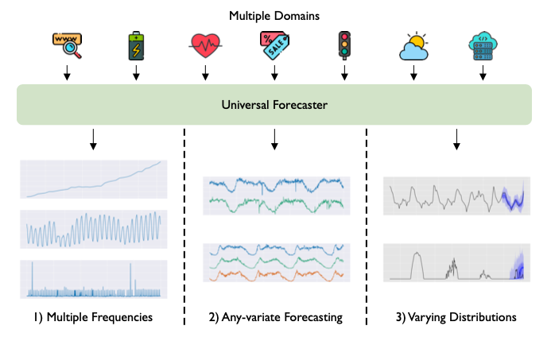

*図1：Universal Forecasterが直面する3つの課題（複数の周波数、任意の変数構成、多様な分布）。Woo et al., 2024 (arXiv:2402.02592) の Figure 1 。*

## 2. 共変量について

Moiraiの強みを理解するためには、まず時系列予測における「共変量」を押さえておく必要があります。

## 2.1 ターゲットと共変量

時系列予測は、「過去のデータから将来の値を当てる」タスクです。このとき、予測したい変数のことをターゲット（target）と呼びます。たとえば「あるコンビニ店舗の日次売上」を予測したい場合、ターゲットは「日次売上」です。

一方、ターゲット以外で予測の手がかりになる時系列のことを共変量（covariate）と呼びます。コンビニの売上予測であれば、「日次の最高気温」「祝日かどうかのフラグ」「降水量」「曜日」などが共変量にあたります。

> **直感的な理解**
>
> ターゲット（売上）は『当てたい数字』。  
> 共変量（気温・祝日など）は『その数字を当てるためのヒント』。  
> 売上が天気に影響されるなら、天気を見ながら予測した方が当然精度は上がる。

## 2.2 過去共変量と未来共変量

共変量はさらに、予測時点で「未来の値が分かるかどうか」で2種類に分かれます。これは需要予測の現場でとても重要な区別です。

• **過去共変量（past / historical covariate）**：予測時点までの値しか分からない変数。例：『実際に降った降水量』『実際の来店客数』など。

• **未来共変量（future / known covariate）**：予測対象期間においても値が事前に分かっている変数。例：『カレンダー上の祝日フラグ』『社内で確定済みのキャンペーン日程』『気象庁の気温予報』など。

コンビニの売上予測でいえば、祝日フラグはカレンダーから100%わかる「未来共変量」です。一方、気温は通常「予報」を使うので厳密には未来も推定値ですが、運用上は気象庁などの気温予報を未来共変量として与えるのが一般的です。

Moirai論文（[Woo et al., 2024 / arXiv:2402.02592](https://arxiv.org/abs/2402.02592)）では、図2のアーキテクチャ図で「Variate 0, 1がターゲット、Variate 2がdynamic covariate（予測期間の値も既知）」というケースが明示的に扱われています。つまりMoiraiは、設計段階から「未来共変量を予測に活用する」ユースケースを前提に作られているのです。

## 2.3 単変量・多変量・共変量つき予測

Press enter or click to view image in full size

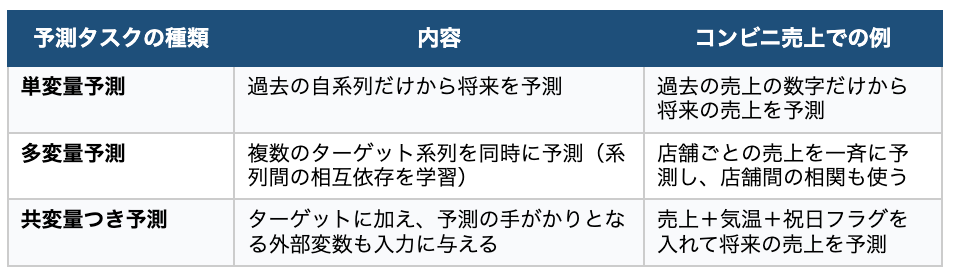

実務における需要予測の大半は、3番目の「共変量つき予測」に該当します。商品の売れ行きは、その商品自身の過去だけで決まるわけではなく、天候・暦・販促・経済指標といった外部要因に強く影響されるためです。

## 3. 既存の時系列基盤モデル：TimesFM / Chronos の立ち位置

Moiraiの新規性を語るには、同時期に登場した代表的な時系列基盤モデルとの違いを押さえる必要があります。ここではGoogleのTimesFMとAmazonのChronosを取り上げます。

## 3.1 GoogleのTimesFM：純粋な単変量モデル

[TimesFM（Das et al., 2024）](https://arxiv.org/abs/2310.10688)は、Google Researchが発表したdecoder-onlyのTransformerベース基盤モデルです。事前学習にはGoogle Trendsやウィキペディアのページビュー、合成データなど、約1,000億点以上の時系列観測値を使い、ゼロショットで強い性能を出します。

ただしTimesFMは、本質的には単変量（univariate）モデルです。1本の系列を入力として、その将来を予測することに特化しており、外部の共変量を直接モデルに組み込む仕組みは初期版では限定的でした。後継版で共変量サポートが追加されつつあるものの、原則として「自系列の過去パターンから将来を生成する」設計思想です。

## 3.2 AmazonのChronos：時系列をトークン化したLLM流アプローチ

[Chronos（Ansari et al., 2024）](https://arxiv.org/abs/2403.07815)は、AmazonがT5ベースで開発した時系列基盤モデルです。最大の特徴は、時系列の値を量子化してトークン列に変換し、自然言語のLLMと同じパラダイムで「次のトークンを予測する」タスクとして学習する点です。

Chronosは確率的予測が可能で、ベンチマークでも高い精度を示しますが、初期版は明示的に共変量を扱わない設計でした。各時系列は互いに独立として扱われ、予測対象の系列の過去だけが入力になります。

Chronos-2や後継版で共変量・多変量サポートが入りましたが、「Moiraiは設計当初から多変量・共変量に対応している」のに対し、Chronos系は『後付け』の歴史を持ちます。

## 3.3 まとめ：単変量モデルの限界

TimesFMやChronos（初期版）のような単変量モデルは、強力なゼロショット予測器ではありますが、需要予測における重要な情報源を取り込めないという根本的な制約があります。具体的には：

- 商品売上が気温に強く依存する場合、気温データを与えられない
- 祝日・キャンペーンといった『未来の予定』を予測に反映できない
- 複数SKU間の相関（カップ麺が売れた日はおにぎりも売れる、など）を活用できない

現実のビジネスでは、これらの情報を無視して『売上系列だけ眺めて将来を当てる』というのは、ビジネスドメインの知見を完全に捨てているのと同じです。ここに、Moiraiが選ばれる理由があります。

## 4. Moiraiのアーキテクチャ：4つの技術的ブレイクスルー

Moiraiの正式名称は「Masked Encoder-based Universal Time Series Forecasting Transformer」で、Salesforce AI Researchの Gerald Woo, Chenghao Liu らによって2024年に発表されました（論文：[Unified Training of Universal Time Series Forecasting Transformers, arXiv:2402.02592](https://arxiv.org/abs/2402.02592)）。

Moirai論文は、時系列基盤モデルが直面する4つの課題を整理し、それぞれに対して具体的なアーキテクチャ上の解を提示しています。

Press enter or click to view image in full size

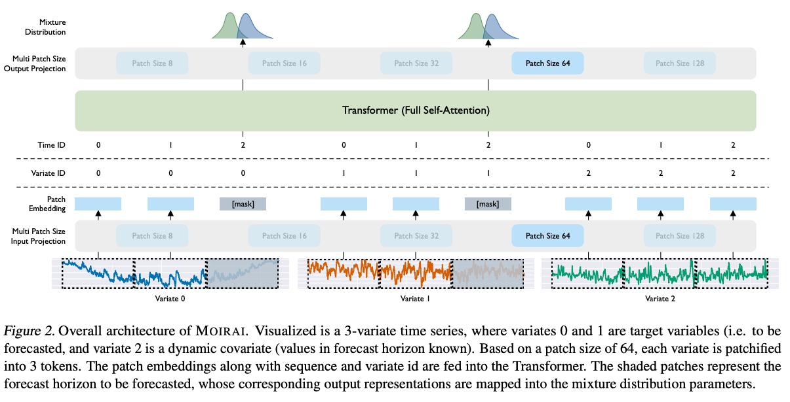

*図2：Moirai 全体アーキテクチャ。3変量時系列のうち variate 0, 1 はターゲット（予測区間に [mask] が置かれる）、variate 2 は予測時点で値が既知の動的共変量。複数のpatch\_size射影層、Transformer、混合分布出力層から構成される。Woo et al., 2024 (arXiv:2402.02592) の Figure 2 。*

## 4.1 多様な周波数への対応：Multi Patch Size Projection Layers

時系列データは、秒・分・時・日・週・月・年など実に多様な周波数で観測されます。1つのモデルで全周波数を扱うには、それぞれの粒度で意味のあるトークンを作る必要があります。

Moiraiは、Vision TransformerやPatchTSTで使われた『パッチング』の考え方を踏襲しつつ、周波数ごとに異なるパッチサイズを使い分けます。具体的には、低頻度のデータには小さなパッチサイズ、高頻度のデータには大きなパッチサイズを割り当て、パッチサイズ {8, 16, 32, 64, 128} それぞれに専用の入力／出力線形層を学習します。

これにより、月次の経済指標と分単位のIoTセンサデータの両方を、同じTransformer本体で扱えるようになります。LOTSA事前学習データセットでは5種類のパッチサイズに対応する5組の入出力プロジェクション層が学習されます。

### patch\_size は推論時に設定できる重要なハイパーパラメータ

uni2tsライブラリで Moirai をロードする際、patch\_size は明示的に指定できる主要パラメータの1つです。値として {8, 16, 32, 64, 128} のいずれか、または “auto”（周波数からヒューリスティックで自動選択）を選べます。

MoiraiForecastの主要パラメータを整理すると以下のようになります。

Press enter or click to view image in full size

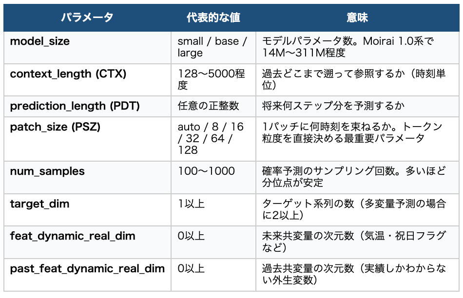

デフォルトの “auto” 設定は、入力データの周波数（pandasのfreq属性など）から論文付録に書かれているヒューリスティクスで patch\_size を自動選択します。経験則としては「低周波データには小さなパッチ、高周波データには大きなパッチ」です。これは『観測点が少ないデータでは細かく刻まないとトークン数が足りない』『観測点の多いデータは粗く刻まないとトークン数が膨大になりすぎる』という実装上の制約から来ています。

Hugging Face Hubで公開されているMoirai 1.x のチェックポイントは、モデルサイズごとに1つだけです。

- Salesforce/moirai-1.0-R-small / -base / -large（Moirai 1.0系）
- Salesforce/moirai-1.1-R-small / -base / -large（Moirai 1.1系）

ここでの small / base / large は Transformer本体のパラメータ数（14M / 91M / 311M）を表しており、patch\_size とは直交した独立軸です。実装上は、ひとつのチェックポイントの中に patch\_size {8, 16, 32, 64, 128} それぞれ専用の入力射影層と出力射影層が合計10層分まとめて格納されており、`uni2ts` の `MultiInSizeLinear` / `MultiOutSizeLinear` クラスが推論時に渡された patch\_size の値に応じて該当する射影層を動的に選択（ディスパッチ）する仕組みです。

Transformer本体（self-attention層・FFN層）は全 patch\_size で共有されており、事前学習時には LOTSA の各データセットの周波数からpatch\_sizeを割り当てて学習されているため、5種類の射影層はそれぞれ異なる粒度のパッチに対して最適化されています。

## 4.2 任意の変数構成への対応：Any-Variate Attention

Moiraiの最大の革新は、いわゆる「any-variate attention」と呼ばれるアテンション機構です。これはMoiraiが、共変量を扱う基盤モデルとして他のモデルを圧倒する根拠となる仕組みなので、少し丁寧に説明します。

### 従来の課題：多変量を扱うTransformerは『変数数』に縛られる

通常のTransformerで多変量時系列を扱おうとすると、入力の特徴次元として変数数を固定する必要があります。たとえば「ターゲット1つ＋共変量5つ＝6変数」で学習したモデルは、推論時に共変量が3つしかないデータセットには使えません。事前学習モデルとしては致命的な制約です。

PatchTSTなど多くのモデルは、この問題を「channel independence（チャネル独立）」、つまり各変数を独立に扱うことで回避してきましたが、これでは変数間の依存関係（売上と気温の関係など）を学べないという別の問題が出てきます。

### Moiraiの解決策：すべての変数をフラットな1次元シーケンスに展開

Moiraiは、多変量時系列を1本の長い系列に「フラット化（flatten）」します。すなわち、N変数 × T時刻のデータがあれば、N×T個のパッチトークンを並べた1次元のシーケンスとしてTransformerに入力します。

ただし、ただ並べるだけでは「どのトークンがどの変数に属するか」「どのトークンが同じ時刻か」がわからなくなってしまいます。そこでMoiraiは、各トークンに「Variate ID（変数ID）」と「Time ID（時刻ID）」を付与し、アテンションが正しい構造を学べるようにします。

### 時間方向と変数方向で異なる位置情報を使う

Moiraiのany-variate attentionは、時間方向と変数方向で異なる位置エンコーディングを採用しています。

• **時間方向：**RoPE（Rotary Position Embedding）を使い、トークン間の相対的な時間距離をアテンションスコアに反映させます。これは現代のLLMで標準的に使われている技法です。

• **変数方向：**binary attention bias（バイナリのアテンションバイアス）を使い、『同じ変数同士か』『異なる変数同士か』だけを区別します。変数の順序は意味を持たないため、変数IDの割り当て順を入れ替えても結果が変わらないように、permutation-equivariant（順序に対して同変）な設計になっています。

この設計により、Moiraiは推論時に変数の数が変わっても問題なく動作し、しかも変数間の真の依存関係を学習できる、という両立が達成されます。共変量を増やしても減らしてもモデルを再学習する必要がなく、これが基盤モデルとして決定的に重要なのです。

> **Any-Variate Attentionの直感的な理解**
>
> 「同じ変数か違う変数か」だけを区別し、「変数の番号」自体は無視する。  
> → 変数の順序を入れ替えても結果が変わらない（permutation equivariant）。  
> → 推論時に変数の数を自由に増減できる。  
> → 学習時に見たことのない共変量の組み合わせにもゼロショットで対応できる。

## 4.3 多様な分布への対応：Mixture Distribution

Moiraiは決定論的に1点を予測するのではなく、確率的予測を行います。具体的には、各タイムステップにおける将来値の分布として、Student’s t分布、負の二項分布、対数正規分布、低分散の正規分布の4つを混合した『混合分布（mixture distribution）』のパラメータを出力します。

なぜ単一分布ではなく混合分布なのか。時系列データはドメインによって裾の重さや非対称性が大きく異なります。たとえば交通量はピーク時に裾の重い分布、需要数はカウントデータ（負の二項が自然）、価格は対数正規が自然、というように、ドメインごとに最適な分布族が異なります。混合分布にすることで、Moiraiは事前学習データ全体に渡るこの多様性を1つのモデルで吸収します。

学習目的関数は混合分布の負の対数尤度（Negative Log-Likelihood）です。これにより、点予測だけでなく予測区間（PI）や分位点予測（quantile）といった意思決定で重要な情報を自然に提供できます。

## 4.4 大規模で多様な事前学習データ：LOTSA

基盤モデルの性能を決めるのは、結局のところ事前学習データの規模と多様性です。Moiraiの学習にあたり、Salesforceチームは LOTSA（Large-scale Open Time Series Archive）と呼ばれる時系列アーカイブを構築しました。

- 9つのドメイン（エネルギー、輸送、気候、売上、経済、Web、ヘルス、自然、CloudOpsなど）
- 約27B（270億）の観測点（後続のMoirai 2.0では36M系列・約2950億観測へさらに拡張）
- 105個のオープンデータセットを統合
- 1秒〜年次までの幅広い周波数をカバー

これは公開されている時系列データとして当時最大規模で、自然言語におけるThe Pileに近い役割を果たしています。Moiraiの汎化性能の源泉は、このデータの多様性にあるといえます。

Press enter or click to view image in full size

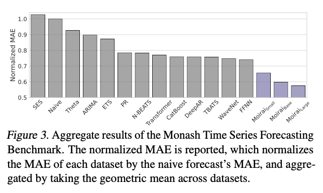

*図3：Monash時系列予測ベンチマークでの正規化MAE集計結果。Moirai（青）はsmall/base/largeいずれも、データセットごとに専用学習された従来手法（灰）を上回るゼロショット性能を示している。Woo et al., 2024 (arXiv:2402.02592) の Figure 3。*

## 4.5 後継版：Moirai-MoEとMoirai 2.0

オリジナルのMoiraiの後、Salesforceは2つの後継版を発表しています。

• **Moirai-MoE（2024, arXiv:2410.10469）：**周波数ごとの入出力層を廃止し、Sparse Mixture of Experts（疎MoE）を導入。トークンごとに最適な専門家を選ぶことで、人手で定義したヒューリスティクスへの依存を減らし、同サイズで最大17%の精度向上をMoirai比で達成。TimesFMやChronosをも上回る結果を報告。

## Get Kazuki Kyakuno’s stories in your inbox

Join Medium for free to get updates from this writer.

Subscribe

Subscribe

Remember me for faster sign in

• **Moirai 2.0（2025, arXiv:2511.11698）：**decoder-onlyアーキテクチャに変更し、混合分布損失からquantile loss + multi-token predictionへ移行。Moirai 1.0-Largeに比べて約2倍高速・約30倍小型で、なお精度は向上。GIFT-Evalベンチマークで上位の成績。

## 5. Moirai vs TimesFM vs Chronos：技術的比較

ここまでの内容を、需要予測の観点から表形式で整理します。

Press enter or click to view image in full size

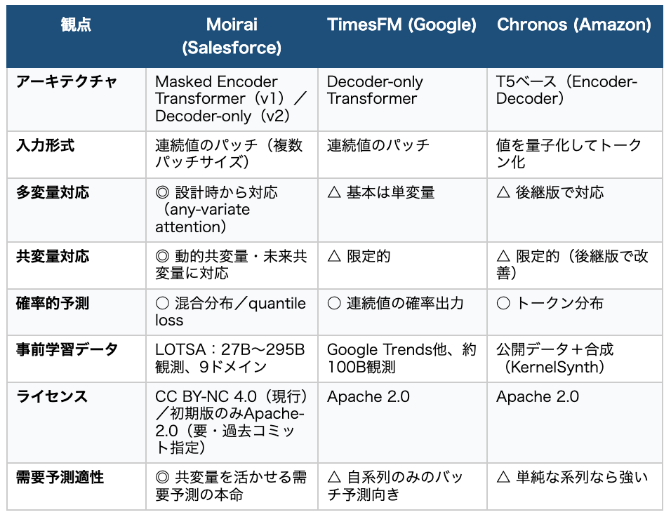

Towards Data Science の比較記事や近年の論文（[Evaluating Spatio-Temporal Forecasting Trade-offs, arXiv:2511.05179](https://arxiv.org/abs/2511.05179)）でも、共変量・多変量を活かせる場面ではMoiraiが他の単変量基盤モデルを上回る傾向が報告されています。特に「Moiraiのany-variate attentionは、単純な共変量挿入よりも本質的に効果的」という結論が示されています。

## 6. 具体例：コンビニの売上を、気温と祝日で予測する

ここまでの議論を、具体的なビジネスシナリオに落とし込んでみましょう。題材として、日本で多くの読者にとって身近なコンビニエンスストアの日次売上予測を取り上げます。

## 6.1 想定シナリオ

東京都心にある架空のコンビニ店舗『アイリアGO渋谷店』を想定します。本部のデマンドプランナーは、過去2年（730日）の日次売上データを持っており、向こう2週間（14日）の売上を毎日予測したいと考えています。気象庁から気温予報、自社カレンダーから祝日情報が利用可能です。

## 6.2 入力データの設計

Moiraiに与える入力は、3つの時系列を1つの『多変量データフレーム』にまとめたものです。

- **ターゲット系列：**daily\_sales（日次売上、円）
- **未来共変量1：**max\_temp（日次最高気温、℃）。過去は実績、未来は気象庁の14日先予報。
- **未来共変量2：**is\_holiday（その日が日曜・祝日であれば1、平日なら0のバイナリフラグ）

## 6.3 ビジネスロジックとモデルの関係

コンビニ・スーパーで扱う多くの品目について「気温の変化と販売数の増減に明確な関係がある」ことが報告されており、たとえばアイスは平均気温25℃を超えると販売数が急増する『基準温度』が知られています。一方で、おでんやホット飲料は寒冷時期に販売が伸びます。店舗全体の売上をマクロに見ると、夏は冷たい飲料・アイス、冬はホット飲料・おでんへと売れ筋が入れ替わりつつ、トータル売上は気温と非線形に関係します。

祝日も重要です。オフィス街の店舗では平日昼の弁当需要が大きく、祝日は売上が落ちる傾向があります。逆に住宅街・観光地立地では祝日に売上が伸びる傾向があります。つまり、is\_holidayと売上の関係は店舗ごとに符号が変わる可能性があるパターンです。

ここで重要なのは、これらのパターンを人手でルール化するのは大変だということです。人間が書ける『気温20℃以下になったらおでんを増やす』のようなルールは、店舗特性・商品特性・年・天候の組み合わせの数だけ存在し、しかも年を経るごとに変化していきます。Moiraiのような基盤モデルは、共変量を入力するだけで、これらの非線形関係をデータから学習してくれます。

## 6.4 サンプルコード（uni2tsライブラリ）

MoiraiはSalesforceが公開しているオープンソースライブラリ uni2ts（GitHub: [SalesforceAIResearch/uni2ts](https://github.com/SalesforceAIResearch/uni2ts)）から、Hugging Face Hubのモデルとあわせて使えます。先ほどのコンビニ売上予測の擬似コードを示します。

```
import pandas as pd  
import torch  
from gluonts.dataset.pandas import PandasDataset  
from gluonts.dataset.split import split  
from uni2ts.model.moirai import MoiraiForecast, MoiraiModule  
   
  
# ---- データ準備 ----  
# df は次の3列を持つ日次のwide-formatのDataFrame  
#   daily_sales (target), max_temp (covariate), is_holiday (covariate)  
df = pd.read_csv('lawrence_shibuya.csv', index_col='date', parse_dates=True)  
  
PDT = 14   # 予測ホライズン（14日先まで）  
CTX = 365  # コンテキスト長（過去365日を参照）  
PSZ = 'auto'  # patch_size。まずは auto から始め、必要に応じて 8/16 に下げる  
             # （この後の 6.7 節で詳述）  
  
ds = PandasDataset(  
    dict(df),  
    target='daily_sales',  
    feat_dynamic_real=['max_temp', 'is_holiday']  # 未来共変量として扱う  
)  
  
train, test_template = split(ds, offset=-PDT)  
test = test_template.generate_instances(prediction_length=PDT, windows=1)  
  
# ---- ゼロショットで予測 ----  
model = MoiraiForecast(  
    module=MoiraiModule.from_pretrained('Salesforce/moirai-1.1-R-large'),  
    prediction_length=PDT,  
    context_length=CTX,  
    patch_size=PSZ,  
    num_samples=100,        # 確率的予測のサンプル数  
    target_dim=1,            # ターゲットは1系列（売上）  
    feat_dynamic_real_dim=2, # 共変量を2つ与える（気温・祝日フラグ）  
    past_feat_dynamic_real_dim=0,  
)  
   
predictor = model.create_predictor(batch_size=32)  
forecasts = list(predictor.predict(test.input))  
   
# forecasts[0].mean: 14日分の平均予測  
# forecasts[0].quantile(0.1) / quantile(0.9): 80%予測区間
```

ポイントは、feat\_dynamic\_real引数で気温と祝日フラグを未来共変量として渡しているところです。Moirai側はこれらを内部で『追加の変数』として扱い、any-variate attentionによって売上系列との関係を捉えながら予測します。重要なのは、ファインチューニングを一切していない点です。Moiraiはゼロショットで動作します。

## 6.5 期待される効果（直感的説明）

このモデルが学習済みパラメータから引き出してくれる『振る舞い』を、ビジネス側の視点で書き下してみましょう。

• **週末・祝日効果：**is\_holiday=1のときに売上水準が変わるパターンを学習。例えば渋谷店なら祝日に売上が上がる方向の補正がかかる。

• **気温の非線形効果：**夏の高温日には冷飲料・アイス需要、冬の低温日にはホット飲料・おでん需要が伸びるパターンを学習。気温が中庸（15〜20℃）の日が売上ボトムになるU字カーブも自然に表現される。

• **週次季節性：**曜日効果は明示的に与えていなくても、is\_holidayと過去365日のコンテキストから自動で抽出される。

• **予測区間の活用：**Moiraiは混合分布による確率予測を出すので、80%・95%予測区間を在庫の安全在庫設計に直接使える。点予測のみのモデルではこれは難しい。

## 6.6 単変量モデルとの比較

もしこの問題を、Chronos（初期版）やTimesFMのような単変量モデルで解こうとすると、入力できるのは過去の売上系列だけになります。すると以下のような問題が起きます。

- 『来週の月曜は祝日』という決定的に重要な情報が予測に反映されない（売上が落ちることを予測できない）
- 猛暑が予報されている週でも、過去の同時期の平均的な気温パターンが暗黙に仮定される
- 結果として、人間のプランナーがあとから『これは祝日だから補正』『気温が異常に高いので補正』と手作業を強いられる

Moiraiであれば、これらの情報を共変量としてそのまま渡すだけで、モデルが自動的に補正してくれます。これは需要予測の運用負荷を大きく下げる効果があります。

## ライセンスと精度のトレードオフ表

MoiraiがApache-2.0 ライセンスで取得可能なのは初期コミットの重みに限定されます。

Moirai 1.0-R は2024年3月の初回公開時、Hugging Faceの README YAML ヘッダで `license: apache-2.0` として配布されていました。Apache-2.0は商用利用・再配布・改変を広く認める寛容なライセンスです。この時点で重みを取得していれば、商用プロダクトに組み込むことが可能でした。

ところが、2024年3月下旬にSalesforceは方針を転換し、重みのライセンスを CC BY-NC 4.0（Creative Commons 表示-非営利 4.0国際）に変更しました。CC BY-NC は名前のとおり『非営利のみ』というライセンスで、これ以降に取得した重みは商用利用できません。Hugging Face のコミット履歴からは、moirai-1.0-R-large が [commit `001acc2`](https://huggingface.co/Salesforce/moirai-1.0-R-large/commit/001acc2aca5fb1d5023e2664bbe45471d8baf21a)（2024年3月28日、コメントは『Update license』）でライセンス変更されたことが確認できます。

この変更はオープンソース・コミュニティで議論を呼びました。sktimeプロジェクトでも GitHub Issue #6161 で『[The License of the model has been changed from Apache to CC BY-NC 4.0](https://github.com/sktime/sktime/issues/6161)』と問題提起され、結果として PR #6746 で『[Apache-2.0時代の旧重みもロードできる](https://github.com/sktime/sktime/pull/6746)』対応が入っています。

Moiraiは2024年に最初に共変量に対応した基盤モデルですが、商用利用する場合、ライセンスの観点でChronos-2の方が望ましい場合もあるかと思います。

## 7. なぜ需要予測にはMoiraiが最適なのか

ここまでの議論をまとめると、需要予測領域でMoiraiを選ぶべき理由は次の4点に集約されます。

### 理由1：未来共変量を自然に取り込める

気温予報・祝日カレンダー・販促予定など、需要予測の現場で『すでに分かっている将来情報』をそのままモデルに与えられる。これは単変量基盤モデルでは原理的にできないことです。

### 理由2：any-variate attentionで変数構成が柔軟

店舗ごとに使える共変量が違う、商品ごとに必要な共変量が違う、というのは現実によくある状況です。Moiraiは推論時に変数の数を自由に変えられるため、店舗ごとに別モデルを作る必要がありません。1つの事前学習済みモデルで、全店舗・全商品をカバーできます。

### 理由3：ゼロショットで強い

新規出店した店舗では、過去データが数週間しかないことがあります。Moiraiは LOTSA という巨大データセットでさまざまな小売・需要パターンを学習済みなので、データが少ない店舗でもゼロショットで合理的な予測を返せます。データが溜まったらファインチューニングで精度を伸ばす、というパスも自然に取れます。

### 理由4：確率的予測がそのまま在庫設計につながる

需要予測の最終アウトプットは、多くの場合「発注数」です。発注数の決定には欠品コストと廃棄コストのトレードオフを取る必要があり、これは点予測ではなく分位点予測でしか正しく解けません。Moiraiはネイティブに確率的予測を出すので、たとえば『欠品率5%以下を保つための90%分位点を発注数にする』といったロジックに直結します。

## 8. 実運用上の注意点

万能ではありません。Moiraiを実運用に組み込む際に押さえておきたい注意点を挙げます。

- **ライセンス：**Hugging Faceで現在配布されているMoirai 1.0-Rおよび1.1-Rの重みは CC BY-NC 4.0（非商用）です。商用利用には Salesforce との個別契約が必要、または『Apache-2.0時代の初期重み』を別途取得する必要があります。一方、TimesFM（Apache 2.0）やChronos（Apache 2.0）は商用OKなので、ライセンス条件で他モデルを選ぶ判断もあり得ます。
- **予測ホライズンが長くなると精度が劣化：**Moirai 2.0論文でも、長期予測（long-horizon）では他モデル含め精度が頭打ちになる傾向が報告されています。実務では中短期に絞ったほうが効果が出やすいです。
- **事前学習データのリーク：**GIFT-Evalのような公開ベンチマークでは、事前学習にテストセットに近い系列が含まれている可能性が指摘されています。社内データで実評価することが必須です。
- **計算リソース：**Largeサイズはそれなりにメモリを使います。Moirai 2.0は1.0-Largeより約30倍小さく約2倍速い、と報告されており、本番運用では2.0系を選ぶのが妥当です。
- **ファインチューニングの効果：**ゼロショットでも強いですが、自社データで軽くファインチューニングするとさらに精度が伸びます。uni2tsにはファインチューニング用のスクリプトも含まれています。
- **patch\_sizeのチューニング：**デフォルトの ‘auto’ に頼り切らず、データの性質に合わせて patch\_size を明示的に設定することが重要です。共変量が立つタイミング（祝日・セール日など）でスパイクが予測に反映されにくいように見える場合は、迷わず patch\_size を一段階小さく（auto→16→8）してください。
- **過去データの網羅性：**過去データのis\_holidayが周期的に発生しており、平日が祝日になるケースを過去データに含められていない場合、周期性の方を強く学習してしまいます。その結果、突発的な祝日のスパイクに対応できません。過去データに将来出現しうるパターンを十分に組み込んでください。

## 9. ailia SDKでMoiraiとChronosを評価する

ailia SDKではMoirai 1.0 / 1.1とChronos 2.0を使用可能です。 ONNX形式でエッジデバイスへの組み込みも可能です。このセクションでは、実際にMonoraiとChronosを使用して推論して評価します。

Moirai 1.0を使用するには下記のようにします。featを付与しない場合、単変量で過去のsalesだけから未来のsalesを予測します。featを付与した場合、共変量で過去のsales、過去と未来のtemperatureとis\_holidayから未来のsalesを予測します。

```
python3 moirai.py --feat "temperature,is_holiday"
```

[## ailia-models/time\_series\_forecasting/moirai at master · ailia-ai/ailia-models

### The collection of pre-trained, state-of-the-art AI models for ailia SDK - ailia-models/time\_series\_forecasting/moirai…

github.com](https://github.com/ailia-ai/ailia-models/tree/master/time_series_forecasting/moirai?source=post_page-----cad4a857f142---------------------------------------)

featを指定しない単変量では、突発的な休日に対応できていません。

Press enter or click to view image in full size

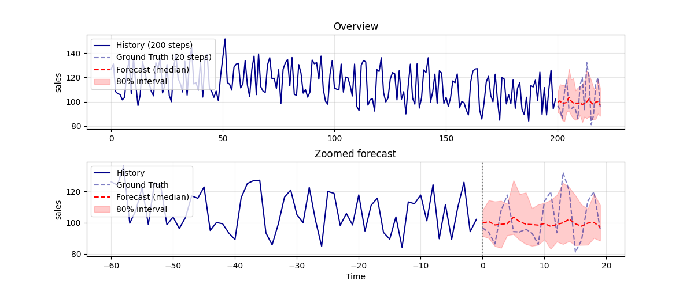

単変量

featを使用する共変量でも、突発的な休日（後ろから2番目のスパイク）に対応できていません。単変量の予測に引きづられています。

Press enter or click to view image in full size

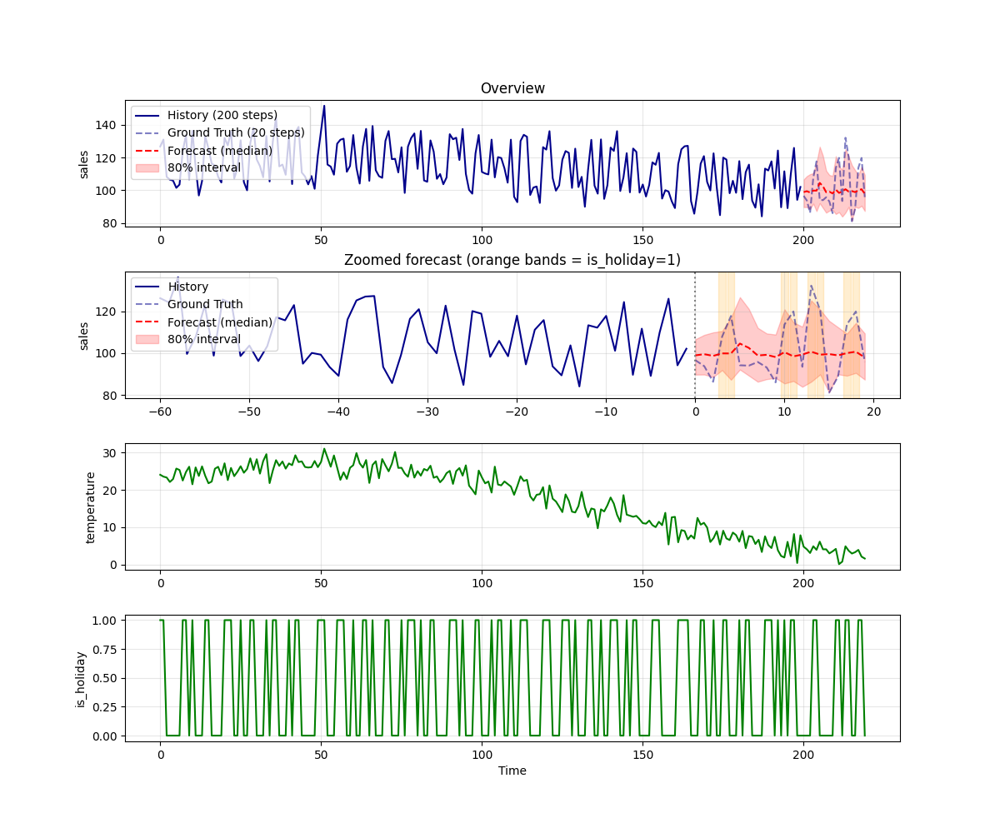

共変量

```
python3 moirai.py --feat "temperature,is_holiday" --version 1.1
```

Moirai 1.1でも、傾向は変わりません。

Press enter or click to view image in full size

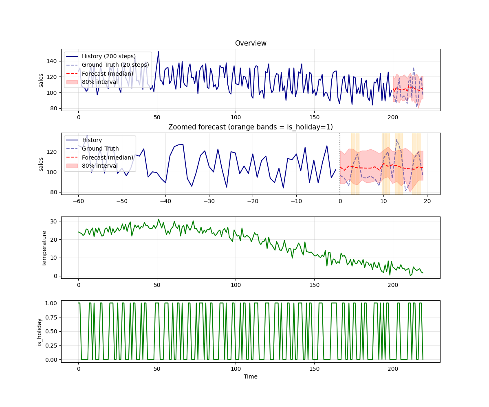

共変量

下記のBLOGでも、is\_holidayの共変量を使った場合に、あまり効果がないことが指摘されています。Moiraiの学習に使用されたデータが、小売向けには最適ではない可能性があります。

[## Hands-On with Moirai: A Foundation Forecasting Model by Salesforce

### Discover the architecture and inner workings of Moirai and apply it in a forecasting project using Python

medium.com](https://medium.com/the-forecaster/hands-on-with-moirai-a-foundation-forecasting-model-by-salesforce-c13208139ae1?source=post_page-----cad4a857f142---------------------------------------)

Chronos 2.0を使用するには下記のようにします。

```
python3 chronos2.py  
python3 chronos2.py --feat "temperature,is_holiday"
```

[## ailia-models/time\_series\_forecasting/chronos2 at master · ailia-ai/ailia-models

### The collection of pre-trained, state-of-the-art AI models for ailia SDK - ailia-models/time\_series\_forecasting/chronos2…

github.com](https://github.com/ailia-ai/ailia-models/tree/master/time_series_forecasting/chronos2?source=post_page-----cad4a857f142---------------------------------------)

featを指定しない単変量では、突発的な休日に対応できていません。

Press enter or click to view image in full size

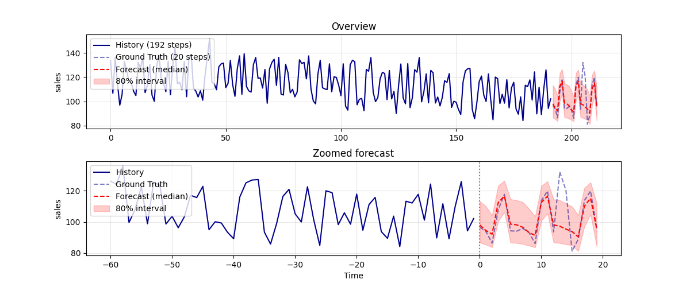

単変量

featを使用する共変量では、突発的な休日（後ろから2番目のスパイク）に対応できています。

Press enter or click to view image in full size

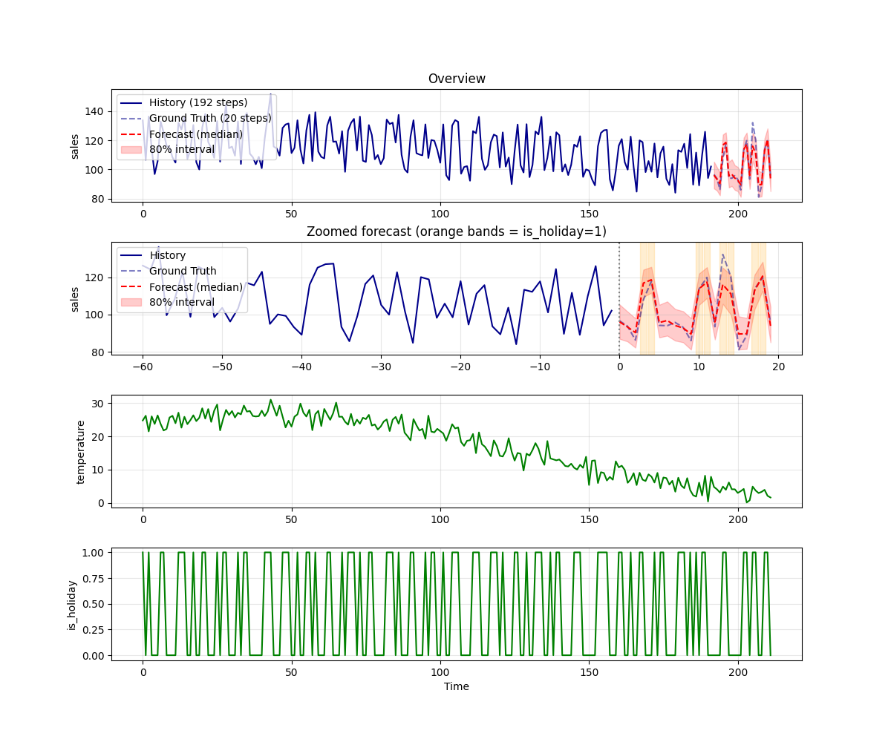

共変量

今回の実験では、Chronos 2の方が良い結果となりました。ただし、時系列予測はデータに強く依存するため、データの種類によってはMoiraiの方が良いケースもあると思います。両方を試してみて、もっとも良いモデルを選択することが望ましいと考えています。

input.csvを書き換えると、任意のデータを使用可能です。

```
date,sales,temperature,is_holiday  
2023-01-01,120.972586,4.10006,1  
2023-01-02,116.20466,2.804389,1  
2023-01-03,120.28572,4.354113,1  
2023-01-04,83.889169,6.086153,0  
2023-01-05,89.287333,2.556687,0  
2023-01-06,88.017368,2.545169,0  
2023-01-07,118.955215,6.16387,1  
2023-01-08,124.468617,4.53587,1
```

## 10. まとめ

本記事では、Salesforce AI Researchが公開した時系列基盤モデル Moirai について、その技術的な核心と需要予測における優位性を整理しました。ポイントを再掲すると以下のとおりです。

- Moiraiは、Multi Patch Size Projection、Any-Variate Attention、Mixture Distribution、LOTSAデータセットという4つの技術的ブレイクスルーを統合した普遍的時系列基盤モデルである。
- 特に Any-Variate Attention は、変数の数や構成に依存しない柔軟な多変量モデリングを可能にし、未来共変量を自然に扱える。
- GoogleのTimesFMやAmazonのChronosが基本的に単変量寄りで設計されているのに対し、Moiraiは設計の最初から多変量・共変量として扱っている。
- 売上予測のように、気温や祝日といった外部情報が決定的に重要なタスクでは、Moiraiの設計思想が直接的なビジネス価値につながる。

「データセットごとに専用モデルを作る」時代は、時系列の世界でも変わりつつあります。需要予測においてMoiraiは、共変量を活用しながら多店舗・多商品をひとつのモデルでさばけるという、ビジネス上の現実的な要件にもっとも近い基盤モデルです。これからの需要予測アーキテクチャを設計する際には、選択肢として検討する価値があるでしょう。

アイリア株式会社はAIを実用化する会社として、クロスプラットフォームでGPUを使用した高速な推論を行うことができるailia SDKを開発しています。アイリア株式会社ではコンサルティングからモデル作成、SDKの提供、AIを利用したアプリ・システム開発、サポートまで、 AIに関するトータルソリューションを提供していますのでお気軽に[お問い合わせ](https://ailia.ai/contact/)ください。