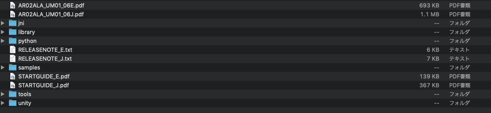
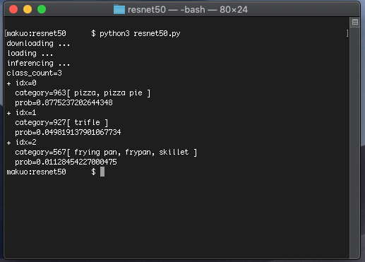

# ailia SDK Tutorial (Python)

# ailia SDK Tutorial (Python)

[](/@kyakuno?source=post_page---byline--ea29ae990cf6---------------------------------------)

[Kazuki Kyakuno](/@kyakuno?source=post_page---byline--ea29ae990cf6---------------------------------------)

5 min read

·

Dec 1, 2020

--

1

[Listen](/m/signin?actionUrl=https%3A%2F%2Fmedium.com%2Fplans%3Fdimension%3Dpost_audio_button%26postId%3Dea29ae990cf6&operation=register&redirect=https%3A%2F%2Fmedium.com%2Faxinc-ai%2Failia-sdk-tutorial-python-ea29ae990cf6&source=---header_actions--ea29ae990cf6---------------------post_audio_button------------------)

Share

Here is a tutorial on how to use ailia SDK in Python. By using ailia SDK and ailia MODELS, you can easily run various AI models.

---

## Installing Python and GPU drivers

### macOS

For macOS 12.6 Monterey or later, Python3 is installed as default.

For macOS 12.5 or earlier, Python2 is installed, so use brew to install Python3.

[## Homebrew

### The Missing Package Manager for macOS (or Linux).

brew.sh](https://brew.sh/index_ja?source=post_page-----ea29ae990cf6---------------------------------------)

After installing Brew, install Python3 with the following command

```
brew install python3
```

### Windows

For Windows, install Python 3.7 from the following site

[## Python Releases for Windows

### The official home of the Python Programming Language

www.python.org](https://www.python.org/downloads/windows/?source=post_page-----ea29ae990cf6---------------------------------------)

Open a command prompt and make sure you can type *python3* to run it. If you cannot find the command prompt, type command from the Windows 10 search bar.

In this state, GPU inference using Vulkan is possible.

On nVidia GPUs, you can also use cuDNN. cuDNN requires CUDA Toolkit 9.1 or higher and cuDNN 7.5.0 or higher to be installed. cuDNN requires registration with nVidia Developer.

[## CUDA Toolkit 11.0 Update 1 Downloads

### Select Target Platform Click on the green buttons that describe your target platform. Only supported platforms will be…

developer.nvidia.com](https://developer.nvidia.com/cuda-downloads?source=post_page-----ea29ae990cf6---------------------------------------)

[## NVIDIA cuDNN

### NVIDIA cuDNN The NVIDIA CUDA Deep Neural Network library (cuDNN) is a GPU-accelerated library of primitives for deep…

developer.nvidia.com](https://developer.nvidia.com/cudnn?source=post_page-----ea29ae990cf6---------------------------------------)

### Linux

On Ubuntu 18.04 LTS, Python3 is already installed, but the package management tool pip is not installed, so we install it.

```
apt install python3-pip
```

If you want to use Vulkan, install the Vulkan libraries.

```
apt install libvulkan1
```

The CPU and Vulkan will work in this state, but if you want to use cuDNN, you need to install CUDA Toolkit and cuDNN.

[## CUDA Toolkit 10.2 Download

### Select Target Platform Click on the green buttons that describe your target platform. Only supported platforms will be…

developer.nvidia.com](https://developer.nvidia.com/cuda-downloads?source=post_page-----ea29ae990cf6---------------------------------------)

[## NVIDIA cuDNN

### NVIDIA cuDNN The NVIDIA CUDA Deep Neural Network library (cuDNN) is a GPU-accelerated library of primitives for deep…

developer.nvidia.com](https://developer.nvidia.com/cudnn?source=post_page-----ea29ae990cf6---------------------------------------)

After downloading cuDNN, you can install it with the following command

```
sudo dpkg -i libcudnn7_7.6.5.32–1+cuda10.1_amd64.deb
```

### Jetson

Jetson comes with Jetpack and various libraries including cuDNN and OpenCV installed by default. ailia SDK 1.2.3 uses Jetpack4.2 and cuDNN7. ailia SDK 1.2.4 or later also uses Jetpack4.4 and cuDNN8. cuDNN8 are also available. Ubuntu version 18.04LTS or later is supported.

Python3 is already installed, but pip, the package management tool, is not installed, so we will install it.

```
apt install python3-pip
```

Jetpack includes opencv by default, but if you don’t have Jetpack installed and there are errors with opencv, you can install Jetpack by using the following command.

```
apt install nvidia-jetpack
```

### Raspberry Pi

Raspberry Pi OS (32-bit) with desktop and recommended software (  
August 2020) download and write using balenaEtcher.

[## Operating system images - Raspberry Pi

### Many operating systems are available for Raspberry Pi, including Raspberry Pi OS, our official supported operating…

www.raspberrypi.org](https://www.raspberrypi.org/software/operating-systems/?source=post_page-----ea29ae990cf6---------------------------------------)

Raspberry Pi OS August 2020 comes with Python 3.7.3 installed.

## Install ailia SDK

### Installation of the trial version of the ailia SDK

You can use the ailia SDK from Python with just the following command.

```
pip3 install ailia
```

The necessary license file will be automatically downloaded at runtime.

If you need more detailed documentation, you can apply for the trial version of the ailia SDK from the website of ax corporation. When you fill out the application form, the download URL and evaluation license file will be automatically sent to you by email.

[## ax Inc.

### A future in which all devices carry AI We believe such a future is on the way. To usher in that day, we will keep…

axinc.jp](https://axinc.jp/en/trial/?source=post_page-----ea29ae990cf6---------------------------------------)

### Installation of the ailia SDK production version

If you download and extract the ailia SDK, you will see the following layout.

Press enter or click to view image in full size



By copying the libraries in the python and library folders included in the SDK, you can use the ailia SDK from Python by following the steps below.

Navigate to the ailia SDK python folder and install it with the pip command.

```
cd ailia_sdk_version/python  
python3 bootstrap.py  
pip3 install .
```

## Run samples

We use ailia-models for the sample. ailia-models is supported since Python 3.6.

To use ailia MODELS, clone the following site.

```
git clone https://github.com/axinc-ai/ailia-models
```

[## axinc-ai/ailia-models

### Pretrained models for ailia SDK. Contribute to axinc-ai/ailia-models development by creating an account on GitHub.

github.com](https://github.com/axinc-ai/ailia-models?source=post_page-----ea29ae990cf6---------------------------------------)

Of course, you can also download in zip from Clone or Download.

Press enter or click to view image in full size


The sample programs use OpenCV, numpy, request, urllib, matplotlib, and scipy.

For non-Jetson users (Windows, Mac, Linux), install it with the following command

```
pip3 install -r requirements.txt
```

For Jetson and Raspberry Pi, the multiple libraries contained in requirements.txt are not available, so install them with the following command

**Jetson**

```
pip3 install cython  
pip3 install numpy  
sudo apt-get install python3-matplotlib  
sudo apt-get install python3-scipy
```

**Raspberry Pi**

```
pip3 install numpy  
pip3 install opencv-python  
pip3 install matplotlib  
pip3 install scikit-image  
sudo apt-get install libatlas-base-dev
```

Now you can use the ailia SDK from Python.

Navigate to the ailia-models/image\_classification/resnet50 folder.

Press enter or click to view image in full size


Open a command prompt or terminal in this folder and execute the following command

```
python3 resnet50.py
```

You can then use the ailia SDK to get the inference results.



Each folder in ailia-models contains different types of models, and since there are more than 300 models available, you are encouraged to experiment with them.

## Related Information

Please refer to the following tutorial if you want to use the ailia SDK from your browser.

[## Google Colab and ailia MODELS to Perform AI in the Browser

### This explains how to easily perform AI processing in the browser alone using Google Colab and ailia MODELS.

medium.com](/axinc-ai/google-colab-and-ailia-models-to-perform-ai-in-the-browser-68e4bd3bc83a?source=post_page-----ea29ae990cf6---------------------------------------)

---

[ax Inc.](https://axinc.jp/en/) has developed the ailia SDK, which enables cross-platform, GPU-based rapid inference. ax Inc. provides a wide range of services from consulting, model creation, SDK provision of SDKs, development of AI-based applications and systems, to support Please feel free to [contact us](https://docs.google.com/forms/d/e/1FAIpQLSdZNX-_Z5NJD8qNLOWsiNaPocOMUEfezwfhEusb_C83WeljwA/viewform) as we offer a total solution for.