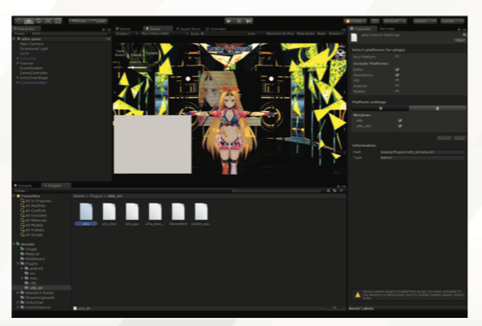
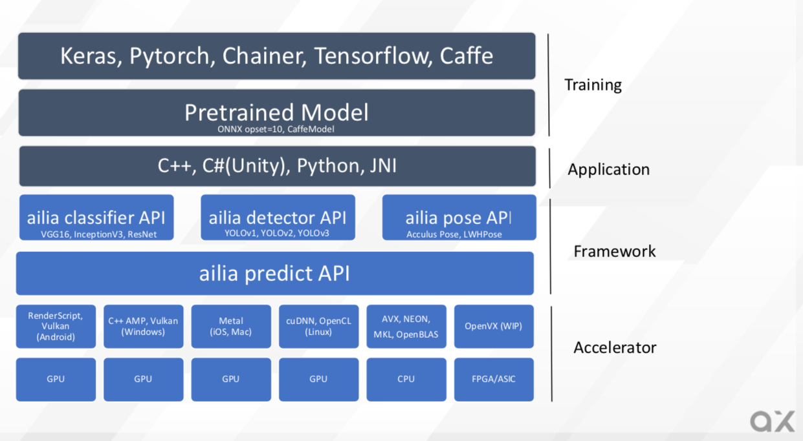

# About ailia SDK

# About ailia SDK

[Kazuki Kyakuno](/@kyakuno?source=post_page---byline--fbfdfc9d55db---------------------------------------)

5 min read

·

Dec 2, 2020

--

[Listen](/m/signin?actionUrl=https%3A%2F%2Fmedium.com%2Fplans%3Fdimension%3Dpost_audio_button%26postId%3Dfbfdfc9d55db&operation=register&redirect=https%3A%2F%2Fmedium.com%2Faxinc-ai%2Fabout-ailia-sdk-fbfdfc9d55db&source=---header_actions--fbfdfc9d55db---------------------post_audio_button------------------)

Share

Learn more about [ailia SDK](https://ailia.jp/en/), a fast GPU-enabled AI inference framework for cross-platform use.

---

## About ailia SDK

ailia SDK is an AI framework developed and provided by ax Inc. and AXELL CORPORATION, specializing in inference.

ailia SDK can load models trained by learning frameworks such as Pytorch, Keras, TensorFlow, Chainer, etc., and perform inference at the edge at high speed and offline.

With over 80 different trained models, you can easily implement AI features in your application.

Press enter or click to view image in full size

<https://ailia.jp/en/>

## Same model files available for cross-platform use

The ailia SDK is cross-platform for Windows, Mac, iOS, Android, Linux, Jetson, and RaspberryPi, and features a common model file and API for all platforms.

Common inference frameworks often convert ONNX, the format of trained models, to a proprietary format for each platform, but the ailia SDK parses the ONNX file directly at runtime.

This means that the server only needs to deliver a single ONNX file, reducing model management costs. It also eliminates the need to use different conversion tools for each platform, minimizing conversion errors and providing a consistent workflow from training to deployment.

Press enter or click to view image in full size

In addition, the ability to use a common API across all platforms means that AI applications developed on Windows or Mac can be deployed directly to all platforms, including iOS, Android, and other mobile devices.

## Providing a Unity Plugin

Although ailia SDK supports C++, C#, Python and JNI, you can take full advantage of the cross-platform benefits, especially by using Unity, a cross-platform game engine, and Unity Plugin from ailia SDK.

[## Unity — Unity

### Unity is the ultimate game development platform. Use Unity to build high-quality 3D and 2D games, deploy them across…

unity.com](https://unity.com/ja?source=post_page-----fbfdfc9d55db---------------------------------------)

AI applications developed in the Unity Editor on Windows or Mac can be deployed directly to Android, iOS, or Linux environments, so developers can use their favorite development environment without being aware of what the edge device is.

In addition, advanced UI functions of Unity and integration with 3D models can be freely implemented, such as interlocking with 3D models by AI pose estimation and extracting people from web camera images.

## Focus on Performance

The ailia SDK is also focused on speed. In particular, we have developed our own accelerator layer that governs the underbelly of Convolution and Pooling, which allows for fast inference using GPUs on any platform.

For example, we offer Metal for Mac and iOS, and Vulkan backend for Windows, Android and Linux. In addition, Jetson allows the use of CUDA + cuDNN.

In addition, we also have optimizations for the CPU, which allows for fast inference using AVX2, SSE2 and NEON.

Press enter or click to view image in full size

ailia SDK Accelerator

## Less of a dependency

Another feature of the ailia SDK is its low dependencies. Typically, inference frameworks rely on many libraries, such as ProtocolBuffer and numpy, etc. The core runtime of the ailia SDK, however, is based on in-house memory-saving ProtocolBuffer readers and its own Tensor class.

However, the core runtime of the ailia SDK does not depend on these libraries and does not need to worry about the version of these libraries, because it implements its own in-house, memory-saving ProtocolBuffer reader and its own Tensor class.

Therefore, you can guarantee stable operation over a long period of time. In addition, it does not contain any unnecessary functions and runs on its own with a library size of 2 to 8 MB, which makes it possible to deploy to serverless environments such as Google CloudFunction.

## Providing a trained model

ax Inc. is aiming to build a platform based on the ailia SDK, and we are also aiming for the most complete model store in the platform. Currently, as the first step, we have uploaded the open source models that can be used with ailia SDK to the following github, and more than 80 different models such as YOLOv3 and HumanPartSegmentation are available.

[## axinc-ai/ailia-models

### Pretrained models for ailia SDK. Contribute to axinc-ai/ailia-models development by creating an account on GitHub.

github.com](https://github.com/axinc-ai/ailia-models?source=post_page-----fbfdfc9d55db---------------------------------------)

Although there are many pre-trained models in the world, it is not easy to try out pre-trained models because the frameworks used during training are diverse, such as TensorFlow, Keras, and Pytorch, and they often change destructively between versions. First of all, just matching the versions of the frameworks can be a challenge. Furthermore, the repository contains training and inference all together, so it takes time to understand how to use it.

ailia MODELS provides converted ONNX models along with simple samples using the ailia SDK, so you can try out a wide variety of models simply by adding the ailia SDK. In the future, we plan to provide a feature that allows users to test AI functions by simply uploading an image.

## Providing a total solution for AI

ax Inc. is not only providing SDKs, but also developing applications using AI. ax Inc. will continue to develop and provide platforms centered on the ailia SDK as a company that makes AI practical.

[## ax Inc.

### Thanks to years of research and the evolution of specialized hardware, practical AI is now a reality. Innovations…

axinc.jp](https://axinc.jp/en/?source=post_page-----fbfdfc9d55db---------------------------------------)

---

[ax Inc.](https://axinc.jp/en/) has developed the ailia SDK, which enables cross-platform, GPU-based rapid inference. ax Inc. provides a wide range of services from consulting, model creation, SDK provision of SDKs, development of AI-based applications and systems, to support Please feel free to [contact us](https://docs.google.com/forms/d/e/1FAIpQLSdZNX-_Z5NJD8qNLOWsiNaPocOMUEfezwfhEusb_C83WeljwA/viewform) as we offer a total solution for.