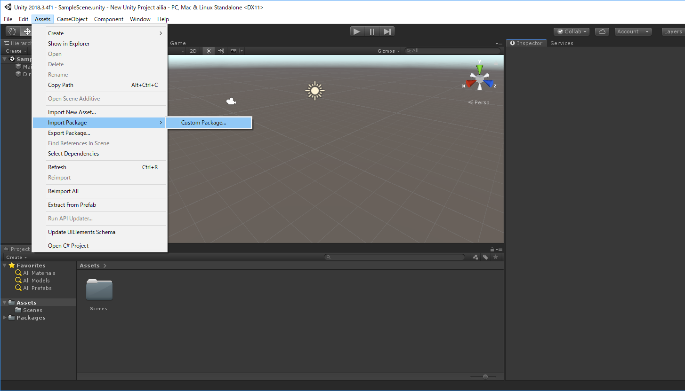
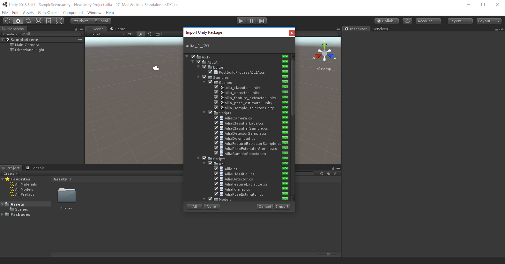
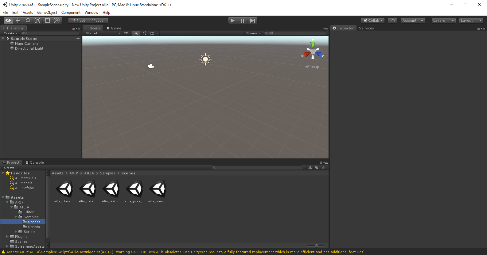
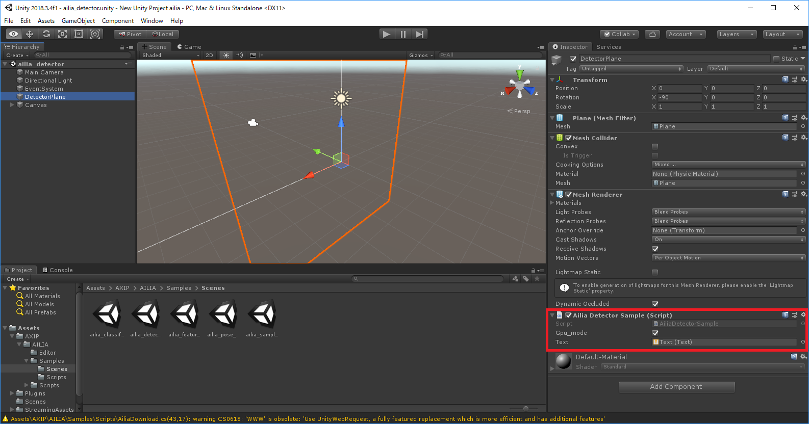
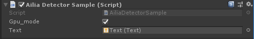
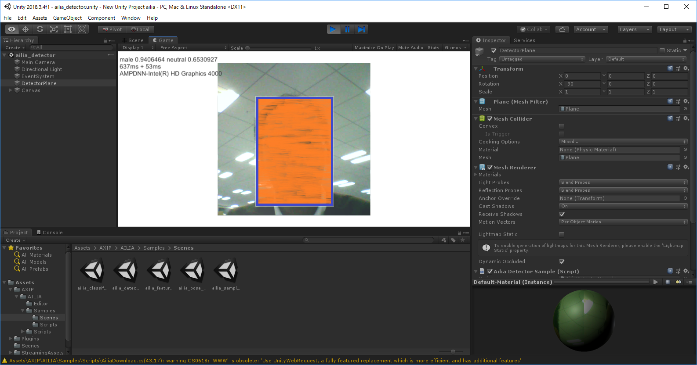
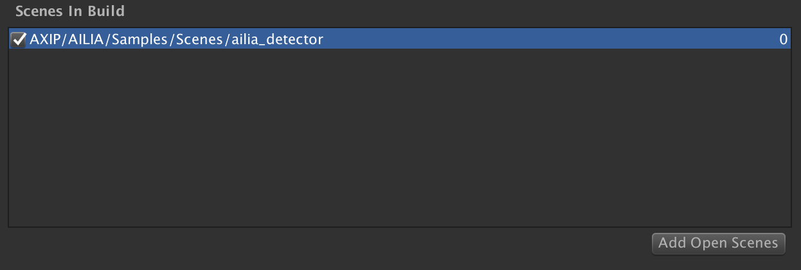
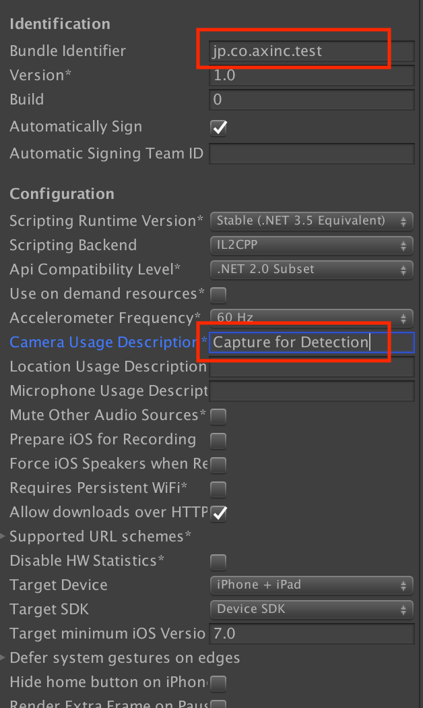

# ailia SDK Tutorial (Unity)

# ailia SDK Tutorial (Unity)

[Kazuki Kyakuno](/@kyakuno?source=post_page---byline--54f2a8155b8f---------------------------------------)

5 min read

·

Dec 2, 2020

--

[Listen](/m/signin?actionUrl=https%3A%2F%2Fmedium.com%2Fplans%3Fdimension%3Dpost_audio_button%26postId%3D54f2a8155b8f&operation=register&redirect=https%3A%2F%2Fmedium.com%2Faxinc-ai%2Failia-sdk-tutorial-unity-54f2a8155b8f&source=---header_actions--54f2a8155b8f---------------------post_audio_button------------------)

Share

Here is a tutorial on using [ailia SDK](https://ailia.jp/en/) in Unity, a fast way to perform deep learning inference using Unity with the GPU.

In this article, we’ll show you a tutorial on how to get the ailia SDK running in the Unity package sample.

---

## Unity Preparation

ailia SDK is supported since 2017.4 LTS.

If you don’t have Unity, please download and install the corresponding Unity from below. The free version also works fine.

[## Powerful 2D, 3D, VR, & AR software for cross-platform development of games and mobile apps.

### We offer a range of plans for all levels of expertise and industries. All plans are royalty-free. Learn the tools and…

store.unity.com](https://store.unity.com/?source=post_page-----54f2a8155b8f---------------------------------------#plans-individual)

---

## Importing Unity Package

The contents of ailia SDK consists of the following

The package file “ailia\_[version].unitypackage”, located directly under the “unity” folder, is the package file for Unity.

Launch the Unity launcher and create a new project from “New”.

Press enter or click to view image in full size

Select Assets>Import Package>Custom Package from the menu bar of the launched project.

Press enter or click to view image in full size

Select “ailia\_[version].unitypackage” above and import it.

Press enter or click to view image in full size

You can also import “ailia\_[version].unitypackage” directly from the Unity launcher’s startup screen as a project.

In this case, the aforementioned Import screen will appear, but depending on the version of Unity, it may not, in that case, import from the menu bar as well as the new project.

---

## Place the license file

For the evaluation version, place the license file in the same folder as ailia.dll (Plugins/x64) on Windows, or ~/Library/SHALO/ on Mac.

On a Mac, go to “Move” in the Finder menu, specify ~/Library in “Enter Folder Location”, navigate to it, create the SHALO folder, and place the license file there.

If you run the sample without a license file, an error (AILIA\_STATUS\_LICENSE\_NOT\_FOUND = -20) will occur.

---

## Sample confirmation

The sample Scene is located in the following folder.

Assets>AXIP>AILIA>Sample>Scenes

Press enter or click to view image in full size

For file access on Android, use the WWW class. By default, a Warning is displayed, but it does not affect the operation.

Samples are the following four.

- classifier
- detector
- feature extractor
- pose estimator

This time we will check the detector sample.

The sample has already been attached to the Ailia Detector Sample in SectorPlane. (inside the red box)

Press enter or click to view image in full size

If the Script and Text links are stripped, please reconfigure them as shown below.

Press the Play button at the top and the sample will run.

Press enter or click to view image in full size

Press enter or click to view image in full size

It can barely work on LowSpec laptops. It will work on a PC with a reasonable specification.

The “sample selector” is a control UI to be used when making an application.  
It is not used in Unity, but you can use it when you build an Android or iOS build and want to check it on an actual device.

In addition, axinc. has a collection of “ailia Models” that are ready to use in the ailia SDK. In the next issue, we would like to introduce importing these trained models to create samples from scratch.

[## axinc-ai/ailia-models-unity

### The collection of pre-trained, state-of-the-art models for Unity. ailia models (Python version) ailia SDK is a…

github.com](https://github.com/axinc-ai/ailia-models-unity?source=post_page-----54f2a8155b8f---------------------------------------)

---

## Publish the application

From here, it becomes a necessary setting when outputting the application.

### Common Settings

To output the scene as an application, you need to register the scene to be built. With the scene file you want to build, select File -> Build Settings and click Add Open Scenes to register it.

Press enter or click to view image in full size

### Player Settings

Settings for iOS and Android can be done by going to File -> Build Settings, selecting the platform, and then clicking on Player Settings.

Press enter or click to view image in full size

### Settings for iOS

When building on iOS, you need to set the bundle ID of your application in Player Settings. When using the camera in iOS, you need to set any text in the Camera Usage Description.

### Settings for Android

When building on Android, you need to specify the package name of your application in Player Settings. This package name will uniquely identify your application. Also, for maximum performance, choose IL2CPP for Scripting Backend.

---

[ax Inc.](https://axinc.jp/en/) has developed the ailia SDK, which enables cross-platform, GPU-based rapid inference. ax Inc. provides a wide range of services from consulting, model creation, SDK provision of SDKs, development of AI-based applications and systems, to support Please feel free to [contact us](https://docs.google.com/forms/d/e/1FAIpQLSdZNX-_Z5NJD8qNLOWsiNaPocOMUEfezwfhEusb_C83WeljwA/viewform) as we offer a total solution for.