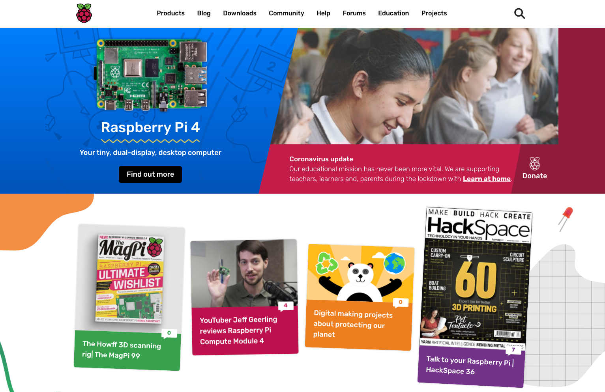

# Released ailia SDK 1.2.5

# Released ailia SDK 1.2.5

[Kazuki Kyakuno](/@kyakuno?source=post_page---byline--58aba1b4c835---------------------------------------)

2 min read

·

Dec 2, 2020

--

[Listen](/m/signin?actionUrl=https%3A%2F%2Fmedium.com%2Fplans%3Fdimension%3Dpost_audio_button%26postId%3D58aba1b4c835&operation=register&redirect=https%3A%2F%2Fmedium.com%2Faxinc-ai%2Freleased-ailia-sdk-1-2-5-58aba1b4c835&source=---header_actions--58aba1b4c835---------------------post_audio_button------------------)

Share

Introducing version 1.2.5 of [ailia SDK](https://ailia.jp/en/), a cross-platform, GPU-enabled, fast AI inference framework.

---

## Support for Raspberry Pi

Support for the Raspberry Pi, making it easy to run more than 80 machine learning models from ailia MODELS on the Raspberry Pi. ailia SDK is optimized for the NEON instructions of the Raspberry Pi, enabling fast inference using ONNX.

Press enter or click to view image in full size

出典：<https://www.raspberrypi.org/>

## Support for Apple Silicon

Mac binaries now support Apple Silicon, which is an Universal Binary for x86\_64 and arm64.

> lipo -info libailia.dylib  
> Architectures in the fat file: libailia.dylib are: x86\_64 arm64

## Support for installation using pip

You can now install the Python API using pip. You can install the ailia library automatically with the following command.

> cd ailia\_sdk\_1\_25/python  
> python3 bootstrap.py  
> pip3 install ./

## Formal response to opset=11

ONNX opset=11 is now officially supported. ailia SDK can execute over 100 different layers included in ONNX’s opset=10 and 11.

## Support for new layers

ArgMax, ArgMin, CumSum, IsNan, IsInf, LogSoftmax, Range, ReverseSequence, ScatterElements, ScatterND, and SpaceToDepth are now supported.

## Enhancements to the PoseEstimator API

You can now set the detection threshold when using OpenPose and LightWeightHumanPose. It also supports SingleScale detection using OpenPose for faster skeletal detection.

## Response to new models

The opset=11 support will support the following new models.

MMFashion: fashion segmentation  
STGCN: Action detection from the skeleton  
CrnnAudioClassification : Audio Classification  
Semantic SegmentationWithMobilenetV3 : Fast People Clipping  
ImageCaptioningPytorch : Generate captions from images  
BertMaskedLM: Proofreading of sentences  
BertSentimentAnalysis: Emotional Analysis of a Sentence  
BertNmr: Eigenextraction of sentences  
BertZeroShotClassification: sentence labeling  
BertQuestionAnswering: search for sentences that correspond to the question  
BertTweetSentiment : Twitter Sentiment Analysis

Models and samples are available from ailia MODELS.

[## axinc-ai/ailia-models

### The collection of pre-trained, state-of-the-art models. ailia SDK is a cross-platform high speed inference SDK. The…

github.com](https://github.com/axinc-ai/ailia-models?source=post_page-----58aba1b4c835---------------------------------------)

## Download an evaluation version of ailia SDK

An evaluation version of ailia SDK 1.2.5 is available for download from the official ailia page.

[## ailia SDK - Deep Learning Framework -

### Object detection, image classification, features extraction. Use trained models for your embedded applications! Get…

ailia.jp](https://ailia.jp/en/?source=post_page-----58aba1b4c835---------------------------------------)

---

[ax Inc.](https://axinc.jp/en/) has developed the ailia SDK, which enables cross-platform, GPU-based rapid inference. ax Inc. provides a wide range of services from consulting, model creation, SDK provision of SDKs, development of AI-based applications and systems, to support Please feel free to [contact us](https://docs.google.com/forms/d/e/1FAIpQLSdZNX-_Z5NJD8qNLOWsiNaPocOMUEfezwfhEusb_C83WeljwA/viewform) as we offer a total solution for.