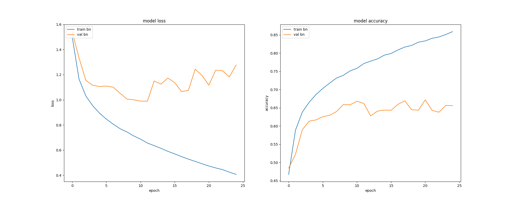
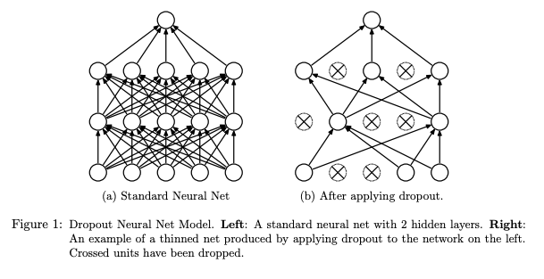
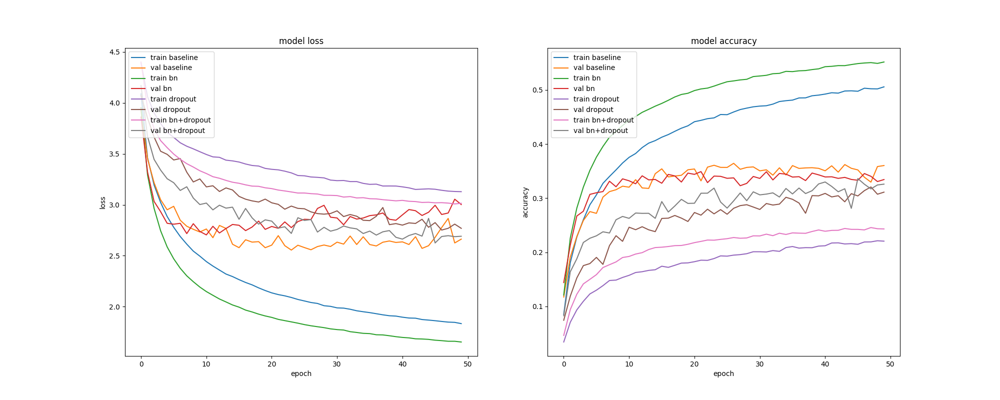
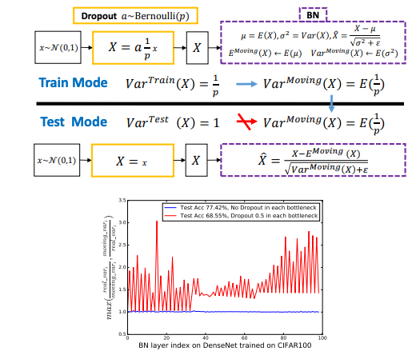

# Prevent Overfitting Using Dropout

# Prevent Overfitting Using Dropout

[David Cochard](/@cochard-dav?source=post_page---byline--53041b5a3797---------------------------------------)

5 min read

·

Dec 8, 2020

--

[Listen](/m/signin?actionUrl=https%3A%2F%2Fmedium.com%2Fplans%3Fdimension%3Dpost_audio_button%26postId%3D53041b5a3797&operation=register&redirect=https%3A%2F%2Fmedium.com%2Faxinc-ai%2Fprevent-overfitting-using-dropout-53041b5a3797&source=---header_actions--53041b5a3797---------------------post_audio_button------------------)

Share

When using Keras for training a machine learning model for real-world applications, it is important to know how to prevent overfitting. In this article, we will examine the effectiveness of Dropout in suppressing overfitting.

---

## What is overfitting?

Overfitting, sometimes referred to as overtraining, might occur when training a machine learning model. When overfitting/overtraining occurs, the accuracy on training data improves, but the accuracy on validation dataset is reduced. Therefore, although it is accurate for experimental data, it may not be able to handle irregular data when applied to real-world applications.

The following figure shows an example of overfitting on the Cifar 10 dataset. After 10 EPOCH 10, the training loss keeps decreasing, but the validation loss starts to increase, and the accuracy decreases with each training session. This shows that we have over-adapted to the training data and lost the ability to accurately apply our model to generic unknown data.

Press enter or click to view image in full size

Example of overfitting with cifar10 + BatchNormalization

## What is Dropout?

As a way to control overfitting, Dropout has been proposed. It consists in randomly drop the output of a particular layer to zero during training, so that it can be correctly recognized even if some data is missing. This prevents some local features of the image from being over-valued and improves the robustness of the model.

Source: <https://jmlr.org/papers/v15/srivastava14a.html>

The following graph shows the results of an experiment on the effectiveness of Dropout. We can see that using dropout method we are able to reduce the error rate and thus lower the risk of overfitting.

Here is the source paper giving more details about those results.

[## Dropout: A Simple Way to Prevent Neural Networks from Overfitting

### Nitish Srivastava, Geoffrey Hinton, Alex Krizhevsky, Ilya Sutskever, Ruslan Salakhutdinov ; 15(56):1929−1958, 2014…

jmlr.org](http://jmlr.org/papers/v15/srivastava14a.html?source=post_page-----53041b5a3797---------------------------------------)

## Experiment setup

Let’s build a 3-layer network, train it on Cifar10 or Cifar100, and look at the model loss and model accuracy in the 4 following cases.

・baseline : ConvNet  
・bn : ConvNet + BatchNormalization  
・dropout : ConvNet + Dropout  
・bn+dropout : ConvNet + BatchNormalization + Dropout

Dropout is inserted both after Pooling and before FC. Here is the source for the experiment.

## Experiment results

The results for Cifar10 are shown below. In the graph labelled “model loss” below, “train” curves refer to the loss relative to training data, and “val” curves refer to the loss against the validation dataset. The lower the loss, the more accurate the model.

The baseline and BatchNormalization results show a rapid increase in loss due to over-fitting as EPOCH increases. By using BatchNormalization and Dropout together, we can see that the overfitting is suppressed, although the learning rate is reduced. And as a result of the suppression of overfitting, we have achieved the lowest loss.

Press enter or click to view image in full size

Loss and accuracy on the cifar10 dataset in various experiment conditions

Now let’s look at the results on the Cifar100 dataset. BatchNormalization is able to lower the loss on the validation set fairly rapidly, but as EPOCH increases, this same loss starts to increase due to overfitting. When used in combination with Dropout, it takes longer to converge, but no overfitting occurs, and the loss on the validation dataset is reduced compared to using BatchNormalization alone.

Press enter or click to view image in full size

Loss and accuracy on the cifar100 dataset in various experiment conditions

## Only apply Dropout before FC

The following paper discusses the performance degradation when BatchNormalization and Dropout are used together, and the fact that it is deprecated to insert Dropout before BatchNormalization.

（Source：<https://arxiv.org/abs/1801.05134>）

> Theoretically, we find that Dropout would shift the variance of a specific neural unit when we transfer the state of that network from train to test. However, BN would maintain its statistical variance, which is accumulated from the entire learning procedure, in the test phase. The inconsistency of that variance (we name this scheme as “variance shift”) causes the unstable numerical behavior in inference that leads to more erroneous predictions finally, when applying Dropout before BN   
> （Source：<https://arxiv.org/abs/1801.05134>）

More details in the source paper below.

[## Understanding the Disharmony between Dropout and Batch Normalization by Variance Shift

### This paper first answers the question “why do the two most powerful techniques Dropout and Batch Normalization (BN)…

arxiv.org](https://arxiv.org/abs/1801.05134?source=post_page-----53041b5a3797---------------------------------------)

In this paper, it is shown that using the Dropout only before the FC layer improves performance. Let’s compare the case of Dropout after the traditional Pooling and before the FC layer, and the case of Dropout only before the FC layer.

> Inspired by early works that applied Dropout on the fully connected layers in (Krizhevsky et al., 2012), we add only one Dropout layer right before the softmax layer in these four architectures  
> （Source：<https://arxiv.org/abs/1801.05134>）

Here are the new experimental setup and the results.

・bn : ConvNet + BatchNormalization  
・bn+dropout : ConvNet + BatchNormalization + Dropout (pooling + fc)  
・bn+dropout : ConvNet + BatchNormalization + Dropout (fc only)

Press enter or click to view image in full size

Difference in accuracy depending on the insertion point of the dropout in Cifar100

We see that BatchNormalization + Dropout (applied only before FC) reduces loss the fastest and also suppresses overfitting.

## Conclusion

By introducing Dropout, we were able to suppress overfitting even when used in conjunction with BatchNormalization. We also confirmed that when used in conjunction with BatchNormalization, Dropout should be applied only before FC.

---

[ax Inc.](https://axinc.jp/en/) has developed [ailia SDK](https://ailia.jp/en/), which enables cross-platform, GPU-based rapid inference.

ax Inc. provides a wide range of services from consulting and model creation, to the development of AI-based applications and SDKs. Feel free to [contact us](https://axinc.jp/en/) for any inquiry.