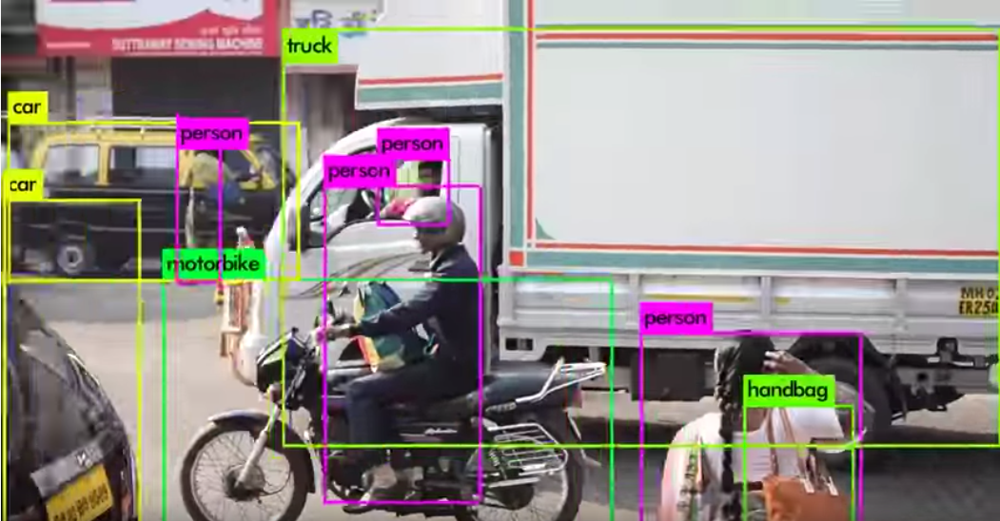

# YOLOv3 : A Machine Learning Model to Detect the Position and Type of an Object

# YOLOv3 : A Machine Learning Model to Detect the Position and Type of an Object

[David Cochard](/@cochard-dav?source=post_page---byline--60f1c18f8107---------------------------------------)

5 min read

·

Dec 8, 2020

--

[Listen](/m/signin?actionUrl=https%3A%2F%2Fmedium.com%2Fplans%3Fdimension%3Dpost_audio_button%26postId%3D60f1c18f8107&operation=register&redirect=https%3A%2F%2Fmedium.com%2Faxinc-ai%2Fyolov3-a-machine-learning-model-to-detect-the-position-and-type-of-an-object-60f1c18f8107&source=---header_actions--60f1c18f8107---------------------post_audio_button------------------)

Share

This is an introduction to「YOLOv3」, a machine learning model that can be used with [ailia SDK](https://ailia.jp/en/). You can easily use this model to create AI applications using [ailia SDK](https://ailia.jp/en/) as well as many other ready-to-use [ailia MODELS](https://github.com/axinc-ai/ailia-models).

---

## Overview

YOLOv3 is an deep learning model for detecting the position and the type of an object from the input image. It can classify objects in one of the 80 categories available (eg. car, person, motorbike…), and compute bounding boxes for those objects from a single input image.

Press enter or click to view image in full size

Below is a sample video of YOLOv3 recognition. It is able to detect cars, trucks, people, handbacks, and more.

Example applications of this model include counting people entering a store, monitoring occupancy ratio in a restaurant or road traffic, detecting abandoned bicycles, and detecting access to dangerous areas.

YOLOv3 was release in April 2018.

[## YOLOv3: An Incremental Improvement

### We present some updates to YOLO! We made a bunch of little design changes to make it better. We also trained this new…

arxiv.org](https://arxiv.org/abs/1804.02767?source=post_page-----60f1c18f8107---------------------------------------)

## Recognizable categories

YOLOv3 has been trained on the MS-COCO dataset and can identify the following 80 categories

coco\_category=[ “person”, “bicycle”, “car”, “motorcycle”, “airplane”, “bus”, “train”, “truck”, “boat”, “traffic light”, “fire hydrant”, “stop sign”, “parking meter”, “bench”, “bird”, “cat”, “dog”, “horse”, “sheep”, “cow”, “elephant”, “bear”, “zebra”, “giraffe”, “backpack”, “umbrella”, “handbag”, “tie”, “suitcase”, “frisbee”, “skis”, “snowboard”, “sports ball”, “kite”, “baseball bat”, “baseball glove”, “skateboard”, “surfboard”, “tennis racket”, “bottle”, “wine glass”, “cup”, “fork”, “knife”, “spoon”, “bowl”, “banana”, “apple”, “sandwich”, “orange”, “broccoli”, “carrot”, “hot dog”, “pizza”, “donut”, “cake”, “chair”, “couch”, “potted plant”, “bed”, “dining table”, “toilet”, “tv”, “laptop”, “mouse”, “remote”, “keyboard”, “cell phone”, “microwave”, “oven”, “toaster”, “sink”, “refrigerator”, “book”, “clock”, “vase”, “scissors”, “teddy bear”, “hair drier”, “toothbrush”]

## YOLOv3 “Tiny” model

There are two types of YOLOv3 models: the standard model, which has a high recognition accuracy, and the tiny model, which has a slightly lower recognition accuracy, but runs faster.

The mAP (accuracy) of the standard model YOLOv3–416 is 55.3 and the mAP of the tiny model is 33.1. The FLOPS (computational power) are 65.86 Bn and 5.56 Bn, respectively.

## Using YOLOv3 with ailia SDK

The ailia SDK supports both models with the Detector API since version 1.2.1. ailia SDK makes it possible to use YOLOv3 from Python and Unity on Windows, Mac, iOS, Android and Linux.

This is a sample of running YOLOv3 using ailia SDK and Python.

[## axinc-ai/ailia-models

### Shape : (1, 3, 416, 416) Range : [0.0, 1.0] category : [0,79] probablity : [0.0,1.0] position : x, y, w, h [0,1]…

github.com](https://github.com/axinc-ai/ailia-models/tree/master/object_detection/yolov3-tiny?source=post_page-----60f1c18f8107---------------------------------------)

This is a sample of running YOLOv3 using ailia SDK and Unity.

[## axinc-ai/ailia-models-unity

### Unity version of ailia models repository. Contribute to axinc-ai/ailia-models-unity development by creating an account…

github.com](https://github.com/axinc-ai/ailia-models-unity/tree/master/Assets/AXIP/AILIA-MODELS/ObjectDetection?source=post_page-----60f1c18f8107---------------------------------------)

In case you are using YOLOv3 with the ailia SDK in Python, you need to first load the model using the ailia.Detector API, feed in an image using the compute API, then simply get the count of detected objects using the get\_object\_count API, and the bounding box and categories using the get\_object API.

When using YOLOv3 from Unity, use the AiliaDetectorModel class to load the model, then use the ComputeFromImage API to feed it an image, and finally get a list of detected objects, bounding boxes and categories.

The Unity Package of the ailia SDK includes scenes that use YOLOv3 and can be used out-of-the-box on Windows, Mac, Linux, iOS and Android.

## Training the model on your own dataset

Now we will discuss how to run YOLOv3 trained on our own dataset using the ailia SDK.

YOLOv3 was developed using Darknet.

[## YOLO: Real-Time Object Detection

### You only look once (YOLO) is a state-of-the-art, real-time object detection system. On a Pascal Titan X it processes…

pjreddie.com](https://pjreddie.com/darknet/yolo/?source=post_page-----60f1c18f8107---------------------------------------)

A Keras implementation is available in the following repositories and can be used to convert Darknet models into a form that can be used in the ailia SDK or re-trained on your own dataset.

[## qqwweee/keras-yolo3

### A Keras implementation of YOLOv3 (Tensorflow backend) inspired by allanzelener/YAD2K. Download YOLOv3 weights from YOLO…

github.com](https://github.com/qqwweee/keras-yolo3?source=post_page-----60f1c18f8107---------------------------------------)

Models trained with Darknet can be converted to hdf5 files using keras-yolo3 with the following command. hdf5 to ONNX can be found in the next section.

> wget <https://pjreddie.com/media/files/yolov3.weights>  
> python convert.py yolov3.cfg yolov3.weights model\_data/yolo.h5  
> python yolo\_video.py [OPTIONS…] — image, for image detection mode, OR  
> python yolo\_video.py [video\_path] [output\_path (optional)]

To retrain the model on your own dataset, use the script train.py from the keras-yolo3 repository. The format of the annotated data needed to train keras-yolo3 is: one line per image, each line containing the path to the image file, the coordinates of the bounding box (x1,y1)-(x2,y2), followed by the category index. If there are multiple bounding boxes per image, separated each one of them with a space. The coordinates will be in pixel coordinates.

> image\_path x1,y1,x2,y2,category x1,y1,x2,y2,category

Next, create a text file containing the categories. Categories are listed in order starting at index 0. For example if one category is for face of people, you can simply list the category as below.

> face

With those files ready you can now start the training.

> python train.py

The paths of those input files being hardcoded in the script train.py, make sure to update them before running the script.

> annotation\_path = ‘train.txt’ # update here  
> log\_dir = ‘logs/000/’  
> classes\_path = ‘model\_data/voc\_classes.txt’ # update here  
> anchors\_path = ‘model\_data/yolo\_anchors.txt’

Next you can create an hdf5 file.

## Conversion from hdf5 to ONNX

To be used with ailia SDK, you need to convert hdf5 files to ONNX, using the following code from keras2onnx.

[## onnx/keras-onnx

### The original keras model was coming from: https://github.com/qqwweee/keras-yolo3, clone the project and follow the…

github.com](https://github.com/onnx/keras-onnx/tree/master/applications/yolov3?source=post_page-----60f1c18f8107---------------------------------------)

See the following repository for examples of face recognition using YOLOv3 with FDDB.

[## axinc-ai/yolov3-face

### Implement Face detection using keras-yolo3. git submodule init git submodule update Download fddb dataset (FDDB-folds…

github.com](https://github.com/axinc-ai/yolov3-face?source=post_page-----60f1c18f8107---------------------------------------)

Using the repository above, you can convert in ONNX with the following command. Please use Keras 2.2.4, Tensorflow 1.13.2, and keras2onnx 1.5.1 for the conversion.

---

## Related topics

[## YOLOv4 : A Machine Learning Model to Detect the Position and Type of an Object

### This is an introduction to「YOLOv4」, a machine learning model that can be used with ailia SDK. You can easily use this…

medium.com](/axinc-ai/yolov4-a-machine-learning-model-to-detect-the-position-and-type-of-an-object-4f108ed0507b?source=post_page-----60f1c18f8107---------------------------------------)

[## YOLOv5 : The Latest Model for Object Detection

### This is an introduction to「YOLOv5」, a machine learning model that can be used with ailia SDK. You can easily use this…

medium.com](/axinc-ai/yolov5-the-latest-model-for-object-detection-b13320ec516b?source=post_page-----60f1c18f8107---------------------------------------)

[## MobilenetSSD : A Machine Learning Model for Fast Object Detection

medium.com](/axinc-ai/mobilenetssd-a-machine-learning-model-for-fast-object-detection-37352ce6da7d?source=post_page-----60f1c18f8107---------------------------------------)

[## M2Det : Highly Accurate Object Detection Model

medium.com](/axinc-ai/m2det-highly-accurate-object-detection-model-b5c5bff27970?source=post_page-----60f1c18f8107---------------------------------------)

---

[ax Inc.](https://axinc.jp/en/) has developed [ailia SDK](https://ailia.jp/en/), which enables cross-platform, GPU-based rapid inference.

ax Inc. provides a wide range of services from consulting and model creation, to the development of AI-based applications and SDKs. Feel free to [contact us](https://axinc.jp/en/) for any inquiry.