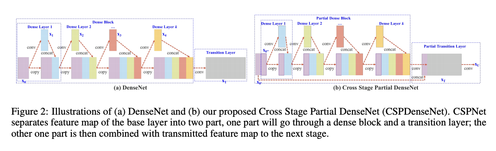
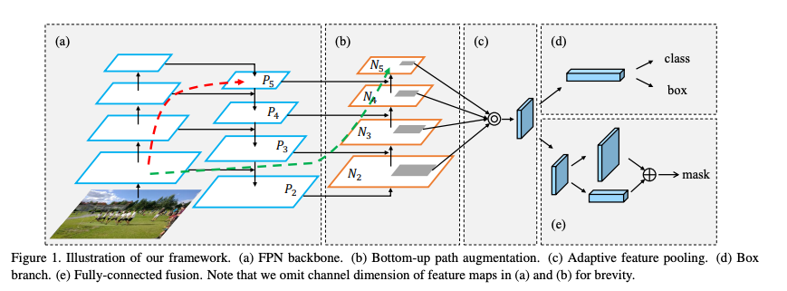
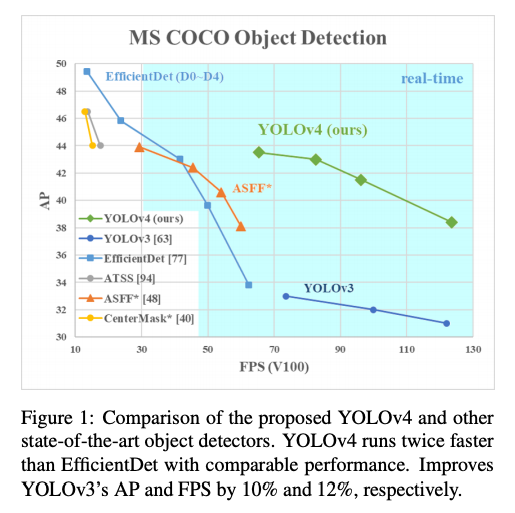
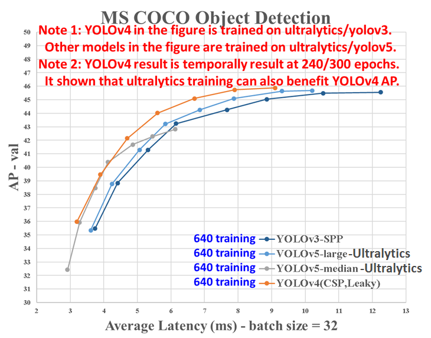

# YOLOv4 : A Machine Learning Model to Detect the Position and Type of an Object

# YOLOv4 : A Machine Learning Model to Detect the Position and Type of an Object

[David Cochard](/@cochard-dav?source=post_page---byline--4f108ed0507b---------------------------------------)

4 min read

·

Dec 9, 2020

--

[Listen](/m/signin?actionUrl=https%3A%2F%2Fmedium.com%2Fplans%3Fdimension%3Dpost_audio_button%26postId%3D4f108ed0507b&operation=register&redirect=https%3A%2F%2Fmedium.com%2Faxinc-ai%2Fyolov4-a-machine-learning-model-to-detect-the-position-and-type-of-an-object-4f108ed0507b&source=---header_actions--4f108ed0507b---------------------post_audio_button------------------)

Share

This is an introduction to「YOLOv4」, a machine learning model that can be used with [ailia SDK](https://ailia.jp/en/). You can easily use this model to create AI applications using [ailia SDK](https://ailia.jp/en/) as well as many other ready-to-use [ailia MODELS](https://github.com/axinc-ai/ailia-models).

---

## Overview

*YOLOv4* is the latest version of the YOLO series for fast object detection in a single image. Joseph Redmon, the creator of the YOLO model up to [YOLOv3](/axinc-ai/yolov3-a-machine-learning-model-to-detect-the-position-and-type-of-an-object-60f1c18f8107), has announced the end of development in February 2020. YOLOv4 was developed by Alexey Bochkovsky, who also developed the Windows version of Darknet.

Press enter or click to view image in full size

Source：<https://github.com/Tianxiaomo/pytorch-YOLOv4/blob/master/data/dog.jpg>

[## YOLOv4: Optimal Speed and Accuracy of Object Detection

### There are a huge number of features which are said to improve Convolutional Neural Network (CNN) accuracy. Practical…

arxiv.org](https://arxiv.org/abs/2004.10934?source=post_page-----4f108ed0507b---------------------------------------)

[## Tianxiaomo/pytorch-YOLOv4

### A minimal PyTorch implementation of YOLOv4.

github.com](https://github.com/Tianxiaomo/pytorch-YOLOv4?source=post_page-----4f108ed0507b---------------------------------------)

## The architecture of YOLOv4

YOLOv4 is designed based on recent research findings, using CSPDarknet53 as a Backbone, SPP (Spatial pyramid pooling) and PAN (Path Aggregation Network) for what is referred to as “the Neck”, and [YOLOv3](/axinc-ai/yolov3-a-machine-learning-model-to-detect-the-position-and-type-of-an-object-60f1c18f8107) for “the Head”.

Press enter or click to view image in full size

Source：<https://arxiv.org/pdf/2004.10934.pdf>

CSPNet is an optimization method aiming at partitioning feature map of the base layer into two parts and then merging them through a cross-stage hierarchy presented below.

Press enter or click to view image in full size

Source：<https://arxiv.org/pdf/1911.11929.pdf>

SPP (Spatial pyramid pooling)is a method of acquiring both fine and coarse information by simultaneously pooling on multiple kernel sizes (1,5,9,13).

Source：<https://arxiv.org/pdf/1406.4729.pdf>

PAN (Path Aggregation Network) is a technique that leverages information in layers close to the input by conveying features from different backbone levels to the Detector.

Press enter or click to view image in full size

Source：<https://arxiv.org/pdf/1803.01534.pdf>

The graph below shows the performance of YOLOv4. We can see that the the mAP has significantly improved compared to YOLOv3.

Source：<https://arxiv.org/pdf/2004.10934.pdf>

## How to use YOLOv4

YOLOv4 can be used with ailia SDK using the command below to detect objects from a webcam video stream.

> python3 yolov4.py -v 0

[## axinc-ai/ailia-models

### (Image from https://github.com/Tianxiaomo/pytorch-YOLOv4/blob/master/data/dog.jpg) Shape : (1, 3, 416, 416) Range …

github.com](https://github.com/axinc-ai/ailia-models/tree/master/object_detection/yolov4?source=post_page-----4f108ed0507b---------------------------------------)

## Export of YOLOv4 to ONNX

Darknet weights can be imported into Pytorch by using pytorch-YOLOv4. It also supports exporting to ONNX.

[## Tianxiaomo/pytorch-YOLOv4

### A minimal PyTorch implementation of YOLOv4.

github.com](https://github.com/Tianxiaomo/pytorch-YOLOv4?source=post_page-----4f108ed0507b---------------------------------------)

## About YOLOv5

YOLOv5 is developed by Ultralytics, the developers of the Pytorch version of YOLO. It does not use Darknet, and the name is controversial, with the original authors of YOLO stating that YOLOv4 is the canonical version. Also, YOLOv4 seems to be better in terms of performance.

Press enter or click to view image in full size

Source：<https://github.com/pjreddie/darknet/issues/2198>

[## What is the latest version of YOLO? Is V5 a scam? · Issue #2198 · pjreddie/darknet

### Hi guys, I am learning the YOLO, it looks great~! I think this Github repo and this website are the official websites…

github.com](https://github.com/pjreddie/darknet/issues/2198?source=post_page-----4f108ed0507b---------------------------------------)

---

## Related topics

[## YOLOv3 : A machine learning model to detect the position and type of an object

### This is an introduction to「YOLOv3」, a machine learning model that can be used with ailia SDK. You can easily use this…

medium.com](/axinc-ai/yolov3-a-machine-learning-model-to-detect-the-position-and-type-of-an-object-60f1c18f8107?source=post_page-----4f108ed0507b---------------------------------------)

[## YOLOv5 : The Latest Model for Object Detection

### This is an introduction to「YOLOv5」, a machine learning model that can be used with ailia SDK. You can easily use this…

medium.com](/axinc-ai/yolov5-the-latest-model-for-object-detection-b13320ec516b?source=post_page-----4f108ed0507b---------------------------------------)

[## MobilenetSSD : A Machine Learning Model for Fast Object Detection

medium.com](/axinc-ai/mobilenetssd-a-machine-learning-model-for-fast-object-detection-37352ce6da7d?source=post_page-----4f108ed0507b---------------------------------------)

[## M2Det : Highly Accurate Object Detection Model

medium.com](/axinc-ai/m2det-highly-accurate-object-detection-model-b5c5bff27970?source=post_page-----4f108ed0507b---------------------------------------)

---

[ax Inc.](https://axinc.jp/en/) has developed [ailia SDK](https://ailia.jp/en/), which enables cross-platform, GPU-based rapid inference.

ax Inc. provides a wide range of services from consulting and model creation, to the development of AI-based applications and SDKs. Feel free to [contact us](https://axinc.jp/en/) for any inquiry.