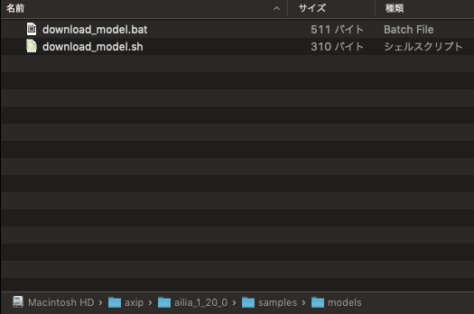
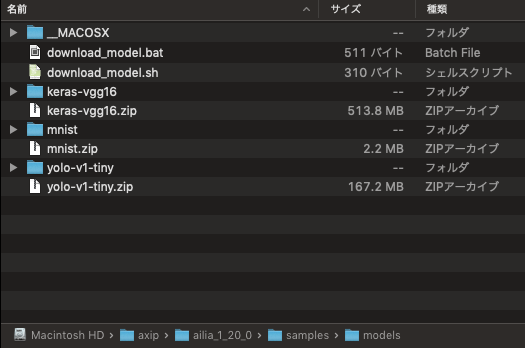
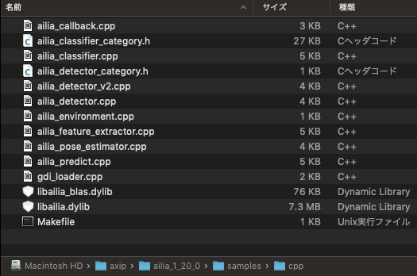
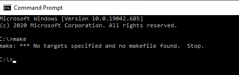
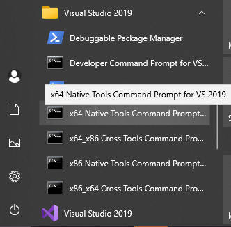
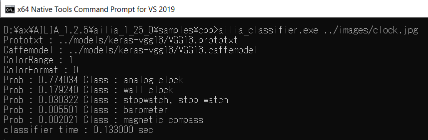

# ailia SDK Tutorial (C++)

# ailia SDK Tutorial (C++)

[David Cochard](/@cochard-dav?source=post_page---byline--75e59bbefffe---------------------------------------)

6 min read

·

Dec 28, 2020

--

[Listen](/m/signin?actionUrl=https%3A%2F%2Fmedium.com%2Fplans%3Fdimension%3Dpost_audio_button%26postId%3D75e59bbefffe&operation=register&redirect=https%3A%2F%2Fmedium.com%2Faxinc-ai%2Failia-sdk-tutorial-c-75e59bbefffe&source=---header_actions--75e59bbefffe---------------------post_audio_button------------------)

Share

This is a tutorial on how to use [ailia SDK](https://ailia.jp/en/) in C++. ailia SDK allows you to easily perform deep learning inference using C++ on the GPU.

---

## C++ API Overview

The core of the [ailia SDK](https://ailia.jp/en/) is implemented in C++, which enables cross-platform execution of machine learning models using C++. Our SDK includes various samples making use of those APIs. This article describes how to build and run those samples.

## License file setup

An license file is required to run ailia on Windows and Mac, but not on Linux, Jetson or RaspberryPi.

Place the file in the same folder as *ailia.dll* on Windows, and in the folder *~/Library/SHALO/* on Mac.

If you run the sample without a valid license file, an error AILIA\_STATUS\_LICENSE\_NOT\_FOUND = -20 will occur.

## How to run samples on each platform

## Mac

To use it on a Mac, both *Xcode* and the *Xcode Command Line Tools* are required. *Xcode* can be installed from the AppStore, the *Command Line Tools* using the following command.

> xcode-select install

To download the machine learning models used in the samples, navigate to the *samples/models* folder and run the script *download\_model.sh*

Here is what the what the folder looks like before and after downloading the models.

Next, copy the ailia core libraries *library/mac/libailia.dylib* and *library/mac/libailia\_blas.dylib* to the folder *samples/cpp*

The samples use OpenCV for loading images and videos. It supports OpenCV 3 and 4, both can be installed using *brew* with the following command.

> brew install opencv

The sample program expects OpenCV to be installed in */usr/local/lib*, but depending on your environment, it may be installed in a different path and you may get the following error.

> clang: error: no such file or directory: ‘/usr/local/lib/libopencv\_core.dylib’  
> clang: error: no such file or directory: ‘/usr/local/lib/libopencv\_imgproc.dylib’  
> clang: error: no such file or directory: ‘/usr/local/lib/libopencv\_imgcodecs.dylib’

In that case, please use the following command to check the OpenCV path and rewrite the path in the *Makefile*.

> find / -name=”opencv\*”

For example, if OpenCV is found in */usr/local/Cellar/opencv/4.2.0\_1*, rewrite the contents of the *Makefile* as follows:

Then run the following command from the *samples/cpp* folder.

> export OSTYPE=Mac  
> make

If successful, the folder content will look like this:

Run the object identification sample with the following command.

> ./ailia\_classifier ../images/clock.jpg

Here is the result you should get.

> Prototxt : ../models/keras-vgg16/VGG16.prototxt  
> Caffemodel : ../models/keras-vgg16/VGG16.caffemodel  
> ColorRange : 1  
> ColorFormat : 0  
> Prob : 0.773837 Class : analog clock  
> Prob : 0.179676 Class : wall clock  
> Prob : 0.030096 Class : stopwatch, stop watch  
> Prob : 0.005507 Class : barometer  
> Prob : 0.002026 Class : magnetic compass

## Windows

On Windows, you need *Visual Studio 2015* or newer and *gnumake* installed.

Visual Studio can be downloaded from the following link.

[## Download Visual Studio 2019 for Windows & Mac

### Full-featured integrated development environment (IDE) for Android, iOS, Windows, web, and cloud Powerful IDE, free for…

visualstudio.microsoft.com](https://visualstudio.microsoft.com/downloads/?source=post_page-----75e59bbefffe---------------------------------------)

In order to install *gnumake,* download and run the executable labelled “*Complete package, except sources”* from the link below.

[## make for Windows

### Make: GNU make utility to maintain groups of programs 3.81 Make is a tool which controls the generation of executables…

gnuwin32.sourceforge.net](http://gnuwin32.sourceforge.net/packages/make.htm?source=post_page-----75e59bbefffe---------------------------------------)

You need to add the *gnumake* executables to your environment variables (path), then you can run the *make* command from the command prompt to confirm that all is in place.

To download the machine learning model used in the sample, run the script *download\_model.bat* in the folder *samples/models.*

Next, copy the dll and lib files from the folder *library/windows/x64* to the sample folder *samples/cpp*.

On Windows, images are loaded via GDI+, therefore it is not necessary to install OpenCV.

Launch the “*x64 Native Tools* C*ommand Prompt”* associated to your version of Visual Studio and navigate to the *samples/cpp* folder.

Build the samples using the following command.

> set OSTYPE=Windows  
> make

Run the object identification sample with the following command.

> ./ailia\_classifier.exe ../images/clock.jpg

Press enter or click to view image in full size

## Linux

On Linux, use clang. clang is installed by default on Ubuntu 18.04LTS, the recommended environment for ailia SDK.

Since OpenCV and unzip are required to run the ailia SDK samples, install them using the following commands.

> apt install libopencv-dev  
> apt install unzip

Run *download\_model.sh* from the folder *samples/models*

> ./download\_model.sh

Copy the *.so* library files from the folder *library/linux* to *samples/cpp*

Then run the following commands from the *samples/cpp* folder

> export OSTYPE=Linux  
> make

Finally, run the object identification sample with the following command.

> ./ailia\_classifier ../images/clock.jpg

### iOS

In XCode, create a new iOS project and register *libailia.a* in the *library/ios* folder.

Add the frameworks *Accelerate.framework, Metal.framework and MetalPerformanceShaders.framework* to the build settings.

Press enter or click to view image in full size

Since the ailia SDK is a C language interface, set the extension of the file that calls the ailia SDK to .mm in order to call the C language from ObjectiveC.

Trained models are registered in *Supporting Files*. The path to the registered trained models can be retrieved using *pathForResource*.

Thereafter, inferences can be made by calling the *ailiaPredict* API.

XCode project samples can be downloaded from the following link.

[## axinc-ai/ailia-xcode

### Project sample of ailia SDK for xcode Xcode 11.3 Download u2net\_opset11.onnx in ./u2net folder. wget…

github.com](https://github.com/axinc-ai/ailia-xcode?source=post_page-----75e59bbefffe---------------------------------------)

### Android

For Android, the NDK is required, we specifically recommend NDK r19c. On Windows, Cygwin is also required.

<https://developer.android.com/ndk/downloads?hl=en>

To use the ailia SDK with the Android NDK, link *libailia-VER-libc++\_static.a* in the *library/android* folder, where *VER* stands for the version of the library.

Make the following settings in *Application.mk.* The API LEVEL must be 16 or higher, and APP\_STL must be set to c++\_static.

Link the library to *Android.mk* by using the following settings.

The code to perform inference is written in *main.cpp*. The trained models must be copied to the SD card in advance.

The build will generate a *.so* file, which we will call from Java via JNI.

<https://developer.android.com/ndk/samples/sample_hellojni>

The ailia SDK also provides a standard JNI API, which can be called directly from Java. You can also use *native-activity* to create .apk with only C code.

<https://developer.android.com/ndk/samples/sample_na>

## C++ samples

C++ samples can also be downloaded from the following repository.

[## axinc-ai/ailia-models-cpp

### The collection of pre-trained, state-of-the-art models for C++. ailia models (Python version) ailia SDK is a…

github.com](https://github.com/axinc-ai/ailia-models-cpp?source=post_page-----75e59bbefffe---------------------------------------)

---

[ax Inc.](https://axinc.jp/en/) has developed [ailia SDK](https://ailia.jp/en/), which enables cross-platform, GPU-based rapid inference.

ax Inc. provides a wide range of services from consulting and model creation, to the development of AI-based applications and SDKs. Feel free to [contact us](https://axinc.jp/en/) for any inquiry.

---

### References

[## ailia SDK Tutorial (Python)

### Here is a tutorial on how to use ailia SDK in Python. ailia SDK allows you to perform deep learning inference using…

medium.com](/axinc-ai/ailia-sdk-tutorial-python-ea29ae990cf6?source=post_page-----75e59bbefffe---------------------------------------)

[## ailia SDK Tutorial (Unity)

### Here is a tutorial on using ailia SDK in Unity, a fast way to perform deep learning inference using Unity with the GPU.

medium.com](/axinc-ai/ailia-sdk-tutorial-unity-54f2a8155b8f?source=post_page-----75e59bbefffe---------------------------------------)