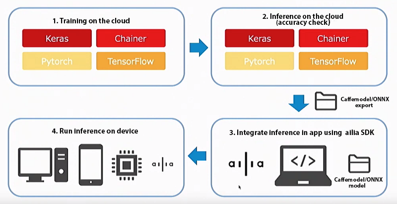
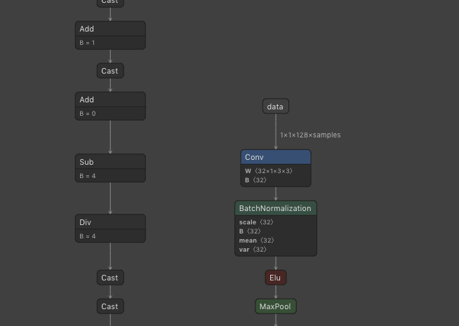

# ailia SDK tutorial (model conversion to ONNX)

# ailia SDK tutorial (model conversion to ONNX)

[](/@cochard-dav?source=post_page---byline--ac8bd2c76622---------------------------------------)

[David Cochard](/@cochard-dav?source=post_page---byline--ac8bd2c76622---------------------------------------)

9 min read

·

Mar 23, 2021

--

[Listen](/m/signin?actionUrl=https%3A%2F%2Fmedium.com%2Fplans%3Fdimension%3Dpost_audio_button%26postId%3Dac8bd2c76622&operation=register&redirect=https%3A%2F%2Fmedium.com%2Faxinc-ai%2Failia-sdk-tutorial-model-conversion-to-onnx-ac8bd2c76622&source=---header_actions--ac8bd2c76622---------------------post_audio_button------------------)

Share

This is a tutorial on exporting models trained with various learning frameworks such as Pytorch and TensorFlow to ONNX that can be used with ailia SDK. ailia SDK makes it easy to deploy ONNX to various platforms including mobile devices. For more information about ailia SDK, please refer to [here](https://ailia.jp/).

---

## Model formats supported by the ailia SDK

The ailia SDK supports the ONNX format. To use your own trained models with ailia SDK, use the export to ONNX feature provided by the training framework.

Press enter or click to view image in full size



The repository below contains a sample showing how to export to ONNX.

[## axinc-ai/export-to-onnx

### A model learned with Pytorch can be loaded by outputting it to ONNX format using torch.onnx.export, then using the…

github.com](https://github.com/axinc-ai/export-to-onnx?source=post_page-----ac8bd2c76622---------------------------------------)

In addition, examples of ailia MODELS export scripts can be found in the following wiki.

[## axinc-ai/ailia-models

### Pretrained models for ailia SDK. Contribute to axinc-ai/ailia-models development by creating an account on GitHub.

github.com](https://github.com/axinc-ai/ailia-models/wiki?source=post_page-----ac8bd2c76622---------------------------------------)

The ONNX version supported by ailia SDK is `opset = 10` . The supported layers are listed on the ailia SDK website and in the specifications.

[## ailia SDK - Deep Learning Framework -

### Object detection, image classification, features extraction. Use trained models for your embedded applications! Get…

ailia.jp](https://ailia.jp/en/?source=post_page-----ac8bd2c76622---------------------------------------)

## About model export

### Structure of the inference process for machine learning models

The inference process using a machine learning model consists of three stages: *pre-processing*, *inference*, and *post-processing*.

In the *pre-processing* stage, the input images is often normalized and channels might get re-ordered. In the *inference* stage, preprocessed data is input to a machine learning model, which outputs some data. The *post-processing* stage then makes sense of those data, often involving value range conversion, channel reordering, or sometimes more advanced processing.

Since the ONNX conversion of machine learning models does not include those pre-processing and post-processing stages, they need to be implemented separately in Python or C.

### Model export procedure

Exporting a machine learning model involves passing the model object to an export function in a Python script, which outputs the model in ONNX format.

Since the input is a model object, you can embed the export code directly into your program that contains the model you want to export. In the case of *Pytorch*, call `torch.onnx.export` after loading the .*pt* file using `load_state_dir`.

When exporting, you need to explicitly specify and check the input shape of the model. One way to check the input shape of a model is to actually load the model and call `print(input.shape)`, or you can use [Netron](/axinc-ai/visualizing-an-onnx-model-using-netron-49b845a3c5b9) to visualize the model structure.

### Implementation of pre-processing and post-processing

Since a machine learning model receives and returns data as arrays of numbers, it is necessary to write pre-processing and post-processing code to get meaningful information (eg. bounding boxes) from this data.

You will need to refer to the repository from which you got the original model from to see what kind of pre-processing and post-processing is actually required. Using the source code from the original repository, perform `print(input)`, `print(output)`, etc. to see what kind of data is actually flowing.

### Troubleshooting

If you are not getting the expected results from converted ONNX model, if must come from either the pre-processing, the inference, or the post-processing stage.

In order to isolate where things go wrong, save the input and output of the machine learning model at different stages in your program to a file using `numpy.save`, and use it to perform inference and see if the same data is output. With this iterative process it is possible to isolate whether the problem is caused by inference in ONNX, preprocessing, or postprocessing.

If for example the output of the ONNX model is the same as the original model using the same input data, it means then the export to ONNX is successful, then the issue must come from the pre-processing and post-processing.

## Exporting from Pytorch

Pytorch supports exporting to ONNX by default. The export is done with `torch.onnx.export`, where model and input variables are given as arguments. Make sure to set `opset_version=10` or `opset_version=11` to use the export with ailia SDK.

### Exporting a model with single input

Download VGG16, a single-input, single-output model from `torchvision`, and export it to `vgg16_pytorch.onnx` .

[## axinc-ai/export-to-onnx

### You can’t perform that action at this time. You signed in with another tab or window. You signed out in another tab or…

github.com](https://github.com/axinc-ai/export-to-onnx/blob/master/export_from_pytorch.py?source=post_page-----ac8bd2c76622---------------------------------------)

### Exporting a model with multiple inputs and outputs

When exporting a model with multiple inputs and outputs, give the input variables in list format.

### Export of specific functions

By default, `model.forward` is exported, but if you want to export a different function, such as `model.predict` , assign the function to `model.forward`.

### Exporting a model with variable length inputs

If the shape of the input is not determined until inference time, you can name the input with `input_names` and specify `dynamic_axes` for the names to make any axis variable length. Axes can be specified from 0.

When you view the exported model in [Netron](https://github.com/lutzroeder/netron), you will see that the X axis is variable length.



When reasoning with the ailia SDK, execute `net.set_input_shape((1,1,124,64))` to determine the shape.

### Exporting a model using Resize

In ONNX, the Resize operator has been extended from `opset=11` to support Resize matching Pytorch. `opset=11` has been partially enabled in ailia SDK since 1.2.4. When exporting models that use Resize, such as segmentation, the accuracy may be improved by exporting with `opset=11`.

## Exporting from Chainer

Chainer also officially supports exporting to ONNX, install `onnx_chainer` via pip.

```
pip3 install onnx_chainer
```

In the following example, VGG16 contained in chainercv is exported to ONNX.

[## axinc-ai/export-to-onnx

### You can’t perform that action at this time. You signed in with another tab or window. You signed out in another tab or…

github.com](https://github.com/axinc-ai/export-to-onnx/blob/master/export_from_chainer.py?source=post_page-----ac8bd2c76622---------------------------------------)

## Exporting from Keras

In the case of Keras, export with `keras2onnx` which can be installed using pip.

```
pip3 install keras2onnx
```

In the example below, we export the VGG16 model contained in keras to ONNX.

[## axinc-ai/export-to-onnx

### You can’t perform that action at this time. You signed in with another tab or window. You signed out in another tab or…

github.com](https://github.com/axinc-ai/export-to-onnx/blob/master/export_from_keras.py?source=post_page-----ac8bd2c76622---------------------------------------)

One thing to note when exporting with Keras is that the batch size of the input of the exported model is undefined (N). Therefore, it is necessary to call `set_input_shape` during inference.

### Export using TensorFlow2.x + Keras

If you want to export models using Keras, which is bundled with TensorFlow 2.x, you need to install `keras2onnx` from the source code as described in `pypi`.

```
Due to some reason, the package release paused, please install it from the source, and the support of keras or tf.keras over tensorflow 2.x is only available in the source.
```

[## keras2onnx

### The keras2onnx model converter enables users to convert Keras models into the ONNX model format. Initially, the Keras…

pypi.org](https://pypi.org/project/keras2onnx/?source=post_page-----ac8bd2c76622---------------------------------------)

For example, if I export a TensorFlow2 model with `keras2onnx 1.6.0`, the export to ONNX succeeds, but the following error occurs during inference in ONNX.

```
Op (MatMul) [ShapeInferenceError] Incompatible dimensions for matrix multiplication
```

Also, in `keras2onnx 1.7.0`, the following error occurs during export.

```
Unable to find out a correct type for tensor type = 20
```

[## error with the example model EfficientNet · Issue #494 · onnx/keras-onnx

### I was trying the tutorial notebook and I did small modifications. See my notebook here. after the existing model hdf5…

github.com](https://github.com/onnx/keras-onnx/issues/494?source=post_page-----ac8bd2c76622---------------------------------------)

These problems can be solved by installing `keras2onnx 1.8.0` from source code. To install keras2onnx from source code, run the following commands.

```
git clone git@github.com:onnx/keras-onnx.git # or download zip  
cd keras-onnx  
pip install .
```

## Export from TensorFlow

To export from TensorFlow, use `tf2onnx` which can be installed via pip.

```
pip3 install tf2onnx
```

In the following example, a graph imported from TensorFlow.keras to TensorFlow is output to ONNX. In the case of TensorFlow, the graph must be freezed beforehand, just as when exporting to TensorFlowLite. In the case of TensorFlow, you need to freeze the graph beforehand as you do when exporting to TensorFlow Lite. Also, you need to replace the training parameters with constants.

Also, since TensorFlow is `Channel Last` and ONNX is `Channel First`, `Transpose` occurs at every `Conv`. If you want to get the best performance, you need to use `TransposeOptimizer` to suppress the transpose generation.

Therefore, the code becomes more complex as shown below.

[## axinc-ai/export-to-onnx

### You can’t perform that action at this time. You signed in with another tab or window. You signed out in another tab or…

github.com](https://github.com/axinc-ai/export-to-onnx/blob/master/export_from_tensorflow.py?source=post_page-----ac8bd2c76622---------------------------------------)

When freezing a graph in TensorFlow, the name of the node of the final output must be specified in `convert_variables_to_constants`. The node name can be obtained by enumerating `graph_def.node`.

If you `import_graph_def` a frozen graph, the node name will have the prefix `import/` added to it, so you need to add `import/` to the node names of `input_names` and `output_names` you specify to tf2onnx.

### Troubleshooting export from TensorFlow

If your graph contains `BatchNormalization`, you may get an `*incompatible with expected resource*` error when you try to freeze it.

> ValueError: Input 0 of node import/mobilenet\_1.00\_224/conv1\_bn/cond/ReadVariableOp/Switch was passed float from import/conv1\_bn/gamma:0 incompatible with expected resource.

If you get an error when fetching a TensorFlow graph from Keras and freezing it, you can work around it by calling `tf.keras.backend.set_learning_phase(0)`.

[## Freezing network with batch norm does not work with TRT · Issue #22957 · tensorflow/tensorflow

### Dismiss GitHub is home to over 40 million developers working together to host and review code, manage projects, and…

github.com](https://github.com/tensorflow/tensorflow/issues/22957?source=post_page-----ac8bd2c76622---------------------------------------)

If you are using TensorFlow alone and the error occurs, you can work around it by inserting the following code.

[## import frozen graph with error “Input 0 of node X was passed float from Y:0 incompatible with…

### Note: create this issue for anybody who might come across the similar issue in the future. when I tried to convert…

github.com](https://github.com/onnx/tensorflow-onnx/issues/77?source=post_page-----ac8bd2c76622---------------------------------------)

## About Channel First and Channel Last

ONNX and ailia SDK handle internal tensors in `Channel First`format, which is a (N,C,H,W) format where data is stored in aggregate per channel, while `Channel Last` format is (N,H,W,C) where data is stored in interleaved channels. Channel First can be seen as RRRGGGBBB, and Channel Last as RGBRGBRGB.

Pytorch and Chainer are in Channel First format, while Keras and TensorFlow are in Channel Last format. When exporting from Pytorch or Chainer, the model can be given as-is to ailia SDK. When exporting from Keras or TensorFlow, a `Transpose` layer may be inserted to convert between Channel First and Channel Last formats. In that case you can improve the inference speed by removing the Transpose Layer with tf2onnx Transpose Optimizer or ONNX Optimizer.

## Output ofPrototxt

You will need to output prototxt from ONNX in order to load it in the ailia SDK.

The ailia SDK ships with a script for outputting prototxt from ONNX. This script outputs a .prototxt file when ONNX is given as an argument.

```
python3 onnx2prototxt.py input.onnx
```

[## axinc-ai/yolov3-face

### You can’t perform that action at this time. You signed in with another tab or window. You signed out in another tab or…

github.com](https://github.com/axinc-ai/yolov3-face/blob/master/onnx-ailia/onnx2prototxt.py?source=post_page-----ac8bd2c76622---------------------------------------)

## Testing with ailia SDK

We will load the ONNX and prototxt into the ailia SDK using the python API to test the inference.

[## axinc-ai/ailia-models

### You can’t perform that action at this time. You signed in with another tab or window. You signed out in another tab or…

github.com](https://github.com/axinc-ai/ailia-models/blob/master/vgg16/vgg16.py?source=post_page-----ac8bd2c76622---------------------------------------)

The ONNX output from Keras has an undefined batch size which cannot be inferred as is. After creating a Net or Classifier instance, call `set_input_shape` to set the input/output shape before calling `predict API` or `classifier API`.

```
net.set_input_shape((1,224,224,3))
```

## Profiling with ailia SDK

To analyze the speed, use the profile mode of the ailia SDK. The processing time of each layer will be output.

```
net.set_profile_mode(True)net.predict(input_data)print(net.get_summary())
```

## ONNX optimization

The ONNX graph can be optimized using `onnx.optimizer.optimize`. By performing graph optimization, we can merge the weights of `BatchNormalization` into `Convolution`, which can improve speed on mobiles.

> opt\_passes = [  
>  ‘extract\_constant\_to\_initializer’,   
>  ‘fuse\_add\_bias\_into\_conv’,   
>  ‘fuse\_bn\_into\_conv’,   
>  ‘fuse\_consecutive\_concats’,   
>  ‘fuse\_consecutive\_log\_softmax’,   
>  ‘fuse\_consecutive\_reduce\_unsqueeze’,   
>  ‘fuse\_consecutive\_squeezes’,   
>  ‘fuse\_consecutive\_transposes’,   
>  ‘fuse\_matmul\_add\_bias\_into\_gemm’,   
>  ‘fuse\_pad\_into\_conv’,   
>  ‘fuse\_transpose\_into\_gemm’,   
>  ]  
>  model = onnx.optimizer.optimize(model, opt\_passes )

The ailia SDK ships with a script (`onnx_optimizer.py`) to perform graph optimization.

[## axinc-ai/yolov3-face

### You can’t perform that action at this time. You signed in with another tab or window. You signed out in another tab or…

github.com](https://github.com/axinc-ai/yolov3-face/blob/master/onnx-ailia/onnx_optimizer.py?source=post_page-----ac8bd2c76622---------------------------------------)

This script outputs a `.opt.onnx` file when an ONNX model is given as an argument.

```
python3 onnx_optimizer.py input.onnx
```

The model still conforms to the standard ONNX specification even after graph optimization.

Note that the official ONNX optimizer has errors in some graphs. We are waiting for the official update for this.

We plan to add an option in the ailia SDK to allow optimization even when the official ONNX optimizer fails.

By uploading the output prototxt to `Netron`, you can analyze the graph structure.

[## Netron

### Edit description

lutzroeder.github.io](https://lutzroeder.github.io/netron/?source=post_page-----ac8bd2c76622---------------------------------------)

---

## Related topics

[## Visualizing an ONNX model using Netron

### The ailia SDK, an inference framework for edge devices, uses ONNX to perform fast GPU-based inference. In this article…

medium.com](/axinc-ai/visualizing-an-onnx-model-using-netron-49b845a3c5b9?source=post_page-----ac8bd2c76622---------------------------------------)

[## Using the ONNX Official Optimizer

### The ailia SDK, an inference framework for edge devices, uses the ONNX format to perform fast inference on the GPU. In…

medium.com](/axinc-ai/using-the-onnx-official-optimizer-27d1c7da3531?source=post_page-----ac8bd2c76622---------------------------------------)

---

[ax Inc.](https://axinc.jp/en/) has developed [ailia SDK](https://ailia.jp/en/), which enables cross-platform, GPU-based rapid inference.

ax Inc. provides a wide range of services from consulting and model creation, to the development of AI-based applications and SDKs. Feel free to [contact us](https://axinc.jp/en/) for any inquiry.