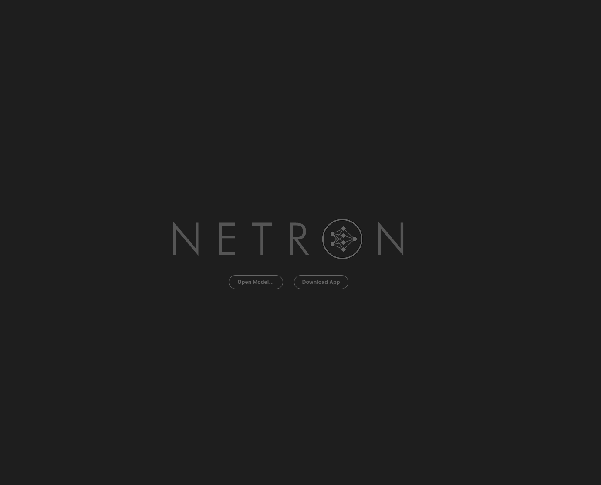
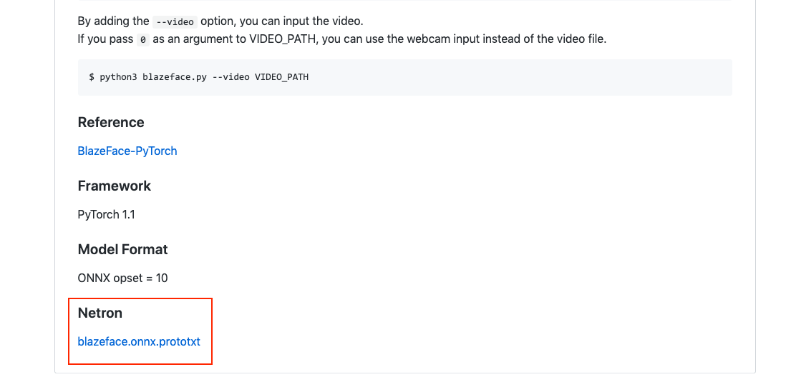

# Visualizing an ONNX model using Netron

# Visualizing an ONNX model using Netron

[David Cochard](/@cochard-dav?source=post_page---byline--49b845a3c5b9---------------------------------------)

2 min read

·

Mar 23, 2021

--

[Listen](/m/signin?actionUrl=https%3A%2F%2Fmedium.com%2Fplans%3Fdimension%3Dpost_audio_button%26postId%3D49b845a3c5b9&operation=register&redirect=https%3A%2F%2Fmedium.com%2Faxinc-ai%2Fvisualizing-an-onnx-model-using-netron-49b845a3c5b9&source=---header_actions--49b845a3c5b9---------------------post_audio_button------------------)

Share

The [ailia SDK](https://ailia.jp/en/), an inference framework for edge devices, uses ONNX to perform fast GPU-based inference. In this article, we will present our findings on the visualization of ONNX models obtained in the process of developing the ailia SDK.

---

## About Netron

Netron is a cross-platform machine learning model visualization tool that allows you to visualize the structure of your model by simply uploading an ONNX file or Prototxt.

[## lutzroeder/netron

### Netron is a viewer for neural network, deep learning and machine learning models. Linux: Download the .AppImage file or…

github.com](https://github.com/lutzroeder/netron?source=post_page-----49b845a3c5b9---------------------------------------)

## Usage

Click on Open Model and specify ONNX or Prototxt.

Press enter or click to view image in full size

Once opened, the graph of the model is displayed. By clicking on the layer, you can see the kernel size of Convolution and the names of the INPUTS and OUTPUTS blobs.

Press enter or click to view image in full size

## Analyze a model from a URL

You can also open the model from the URL parameter.

As an example let open the `BlazeFace`model using the URL below.

> [https://netron.app/?url=https://storage.googleapis.com/ailia-models/blazeface/blazeface.onnx.prototxt](https://netron.app/?url=https%3A%2F%2Fstorage.googleapis.com%2Failia-models%2Fblazeface%2Fblazeface.onnx.prototxt)

The README in the [ailia MODELS](https://github.com/axinc-ai/ailia-models) repository provides Netron links for various models such as [ResNet50](https://netron.app/?url=https%3A%2F%2Fstorage.googleapis.com%2Failia-models%2Fresnet50%2Fresnet50.onnx.prototxt) and [YOLOv3](https://netron.app/?url=https%3A%2F%2Fstorage.googleapis.com%2Failia-models%2Fyolov3-face%2Fyolov3-face.opt.onnx.prototxt), so please feel free to use them to analyze your model architecture.

Press enter or click to view image in full size

[## axinc-ai/ailia-models

### The collection of pre-trained, state-of-the-art models. ailia SDK is a cross-platform high speed inference SDK. The…

github.com](https://github.com/axinc-ai/ailia-models?source=post_page-----49b845a3c5b9---------------------------------------)

---

[ax Inc.](https://axinc.jp/en/) has developed [ailia SDK](https://ailia.jp/en/), which enables cross-platform, GPU-based rapid inference.

ax Inc. provides a wide range of services from consulting and model creation, to the development of AI-based applications and SDKs. Feel free to [contact us](https://axinc.jp/en/) for any inquiry.