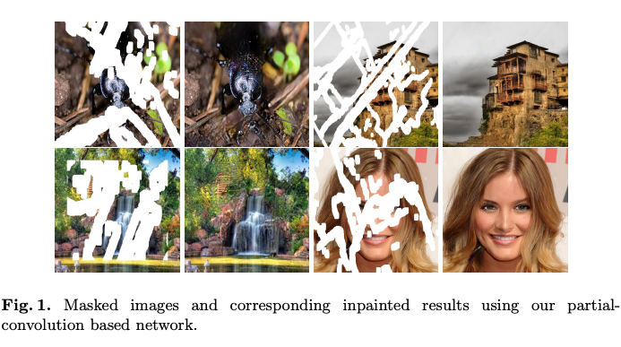
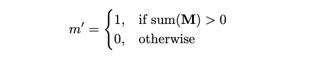

# Inpainting With Partial Conv: A machine learning model that predicts and fills in missing parts of an image.

# Inpainting With Partial Conv: A machine learning model that predicts and fills in missing parts of an image.

[](/@cochard-dav?source=post_page---byline--53c046343a85---------------------------------------)

[David Cochard](/@cochard-dav?source=post_page---byline--53c046343a85---------------------------------------)

3 min read

·

Mar 29, 2021

--

[Listen](/m/signin?actionUrl=https%3A%2F%2Fmedium.com%2Fplans%3Fdimension%3Dpost_audio_button%26postId%3D53c046343a85&operation=register&redirect=https%3A%2F%2Fmedium.com%2Faxinc-ai%2Finpainting-with-partial-conv-a-machine-learning-model-that-predicts-and-fills-in-missing-parts-of-53c046343a85&source=---header_actions--53c046343a85---------------------post_audio_button------------------)

Share

This is an introduction to「Inpainting With Partial Conv」, a machine learning model that can be used with [ailia SDK](https://ailia.jp/en/). You can easily use this model to create AI applications using [ailia SDK](https://ailia.jp/en/) as well as many other ready-to-use [ailia MODELS](https://github.com/axinc-ai/ailia-models).

---

## Overview

Inpaining With Partial Conv is a machine learning model for Image Inpainting published by NVIDIA in December 2018. Given an input image and a mask image, the AI predicts and repair the missing parts in an image.



Source：<https://arxiv.org/pdf/1804.07723.pdf>

[## Image Inpainting for Irregular Holes Using Partial Convolutions

### Existing deep learning based image inpainting methods use a standard convolutional network over the corrupted image…

arxiv.org](https://arxiv.org/abs/1804.07723?source=post_page-----53c046343a85---------------------------------------)

## Model architecture

Inpainting With Partial Conv is based on `PConvUNet` .

[## naoto0804/pytorch-inpainting-with-partial-conv

### Unofficial pytorch implementation of ‘Image Inpainting for Irregular Holes Using Partial Convolutions’ [Liu+, ECCV2018]…

github.com](https://github.com/naoto0804/pytorch-inpainting-with-partial-conv/blob/master/net.py?source=post_page-----53c046343a85---------------------------------------)

In `PConvUNet`, instead of UNet’s Conv, `Partial Conv` is used, which determines whether a pixel is included in the convolution depending on the mask value.


Source：<https://arxiv.org/pdf/1804.07723.pdf>

In normal convolution, the input X is multiplied by the weight W. In this case, the missing pixels are also used for convolution, resulting in poor image quality. In `Partial Convolutions`, only the pixels with a mask value M of 1 are used for convolution, greatly improving the image quality.



Source：<https://arxiv.org/pdf/1804.07723.pdf>

In the mask update, if even one pixel is valid, the convolution is enabled.

## Usage

The following command can be applied to any images located at the given path, the mask images will be read from a folder named `masks`.

```
python3 pytorch-inpainting-with-partial-conv --input IMAGE_PATH --savepath SAVE_IMAGE_PATH
```

[## ailia-models/image\_inpainting/pytorch-inpainting-with-partial-conv at master ·…

### (Image from Places2 dataset http://places2.csail.mit.edu/download.html) Shape : (n, 3, 256, 256) Left to right: input…

github.com](https://github.com/axinc-ai/ailia-models/tree/master/image_inpainting/pytorch-inpainting-with-partial-conv?source=post_page-----53c046343a85---------------------------------------)

You should get results as below, from the right is the input image, the mask image, the model result, and finally the ground truth image.

Press enter or click to view image in full size


Source：<https://pixabay.com/ja/photos/%E7%A9%BA%E6%B8%AF-%E3%83%88%E3%83%A9%E3%83%B3%E3%82%B9%E3%83%9D%E3%83%BC%E3%83%88-%E5%A5%B3%E6%80%A7-2373727/>

The model can also be used on drawn images.

Press enter or click to view image in full size


Source：[H2MD CHAN](https://h2md.jp/)

---

[ax Inc.](https://axinc.jp/en/) has developed [ailia SDK](https://ailia.jp/en/), which enables cross-platform, GPU-based rapid inference.

ax Inc. provides a wide range of services from consulting and model creation, to the development of AI-based applications and SDKs. Feel free to [contact us](https://axinc.jp/en/) for any inquiry.