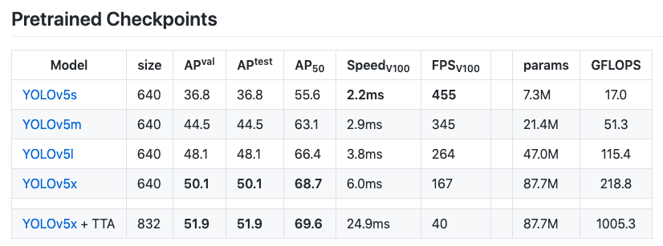
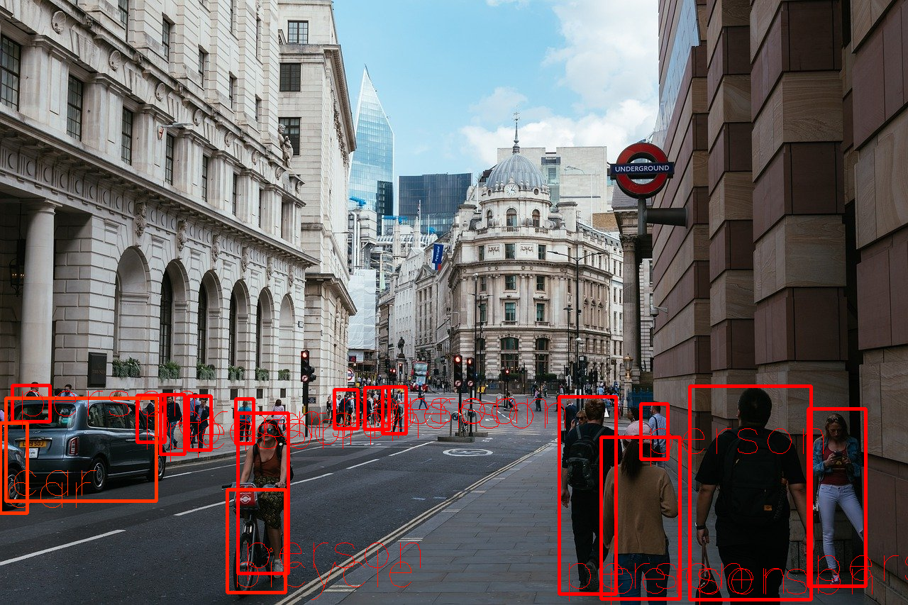
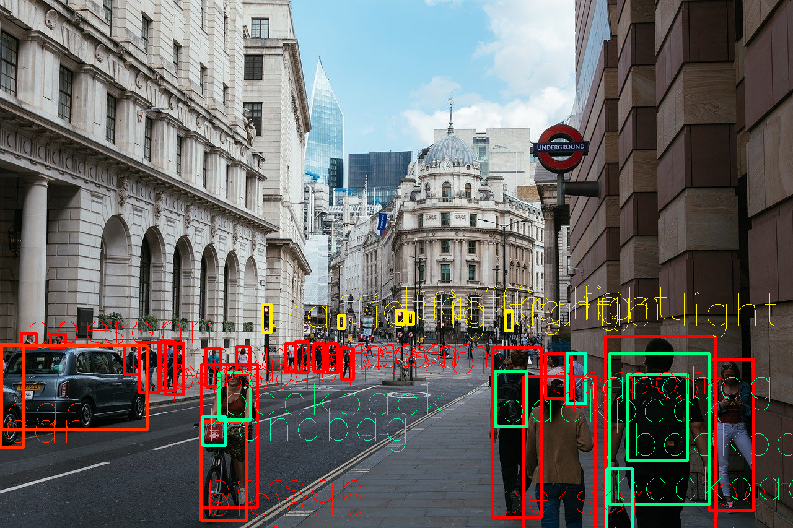
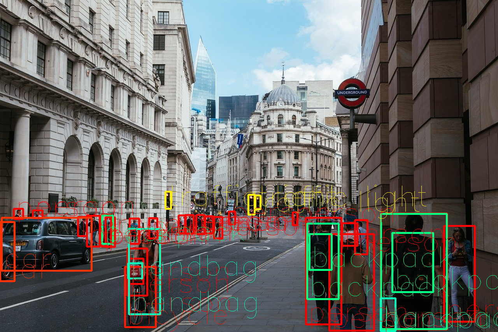
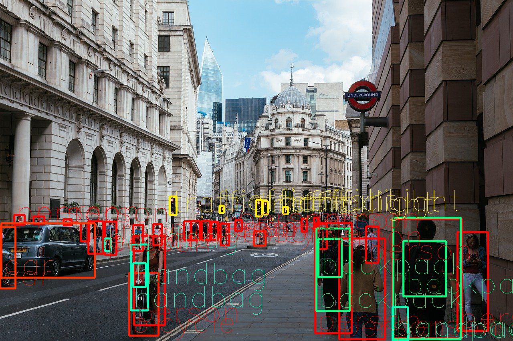

# YOLOv5 : The Latest Model for Object Detection

# YOLOv5 : The Latest Model for Object Detection

[](/@cochard-dav?source=post_page---byline--b13320ec516b---------------------------------------)

[David Cochard](/@cochard-dav?source=post_page---byline--b13320ec516b---------------------------------------)

4 min read

·

Mar 29, 2021

--

1

[Listen](/m/signin?actionUrl=https%3A%2F%2Fmedium.com%2Fplans%3Fdimension%3Dpost_audio_button%26postId%3Db13320ec516b&operation=register&redirect=https%3A%2F%2Fmedium.com%2Faxinc-ai%2Fyolov5-the-latest-model-for-object-detection-b13320ec516b&source=---header_actions--b13320ec516b---------------------post_audio_button------------------)

Share

This is an introduction to「YOLOv5」, a machine learning model that can be used with [ailia SDK](https://ailia.jp/en/). You can easily use this model to create AI applications using [ailia SDK](https://ailia.jp/en/) as well as many other ready-to-use [ailia MODELS](https://github.com/axinc-ai/ailia-models).

---

## Overview

YOLOv5 is the latest object detection model developed by `ultralytics`, the same company that developed the Pytorch version of [YOLOv3](/axinc-ai/yolov3-a-machine-learning-model-to-detect-the-position-and-type-of-an-object-60f1c18f8107), and was released in June 2020.

[## ultralytics/yolov5

### This repository represents Ultralytics open-source research into future object detection methods, and incorporates…

github.com](https://github.com/ultralytics/yolov5?source=post_page-----b13320ec516b---------------------------------------)

## YOLOv5 variants

YOLOv5 is available in four models, namely `s`, `m`, `l`, and `x`, each one of them offering different detection accuracy and performance as shown below.

Press enter or click to view image in full size


Source：<https://github.com/ultralytics/yolov5>

The mAP (accuracy) of `YOLOv5 s` is 55.6 with 17GFlops (computational power).

Press enter or click to view image in full size



Source：<https://github.com/ultralytics/yolov5>

As a comparison `YOLOv3-416` had an mAP of 55.3 for 65.86 GFlops.

Press enter or click to view image in full size


Source：<https://pjreddie.com/darknet/yolo/>

`YOLOv5 s` achieves the same accuracy as `YOLOv3-416` with about 1/4 of the computational complexity.

## The output from YOLOv5

When given a 640x640 input image, the model outputs the following 3 tensors.

(1, 3, 80, 80, 85) # anchor 0  
(1, 3, 40, 40, 85) # anchor 1  
(1, 3, 20, 20, 85) # anchor 2

The breakdown of the output is [cx, cy, w, h, conf, pred\_cls(80)].

## Using YOLOv5 with Pytorch

Use the following command to run `YOLOv5` , the model will be automatically downloaded.

```
python detect.py --source in.mp4
```

## Exporting YOLOv5 to ONNX

You can export `YOLOv5` to ONNX with the following commands.

```
python3 models/export.py --weights yolov5s.pt --img 640 --batch 1  
python3 models/export.py --weights yolov5m.pt --img 640 --batch 1  
python3 models/export.py --weights yolov5l.pt --img 640 --batch 1
```

You can also use the optional argument `--img-size` to specify the recognition resolution individually in the order of height and width.

```
python3 models/export.py — weights yolov5m.pt --img-size 640 1280 — batch 1
```

## Accuracy and performance comparison with YOLOv3

The inference speed has been measured using a MacBook Pro 13 with Intel Core i5 2.3GH (conf\_thres=0.25, nms\_thres=0.45).

Press enter or click to view image in full size


Source：<https://pixabay.com/ja/photos/%E3%83%AD%E3%83%B3%E3%83%89%E3%83%B3%E5%B8%82-%E9%8A%80%E8%A1%8C-%E3%83%AD%E3%83%B3%E3%83%89%E3%83%B3-4481399/>

In the results below, we can see that using the model `YOLOv5 s` gives similar results as the full `YOLOv3` model, with about 75% less operations.

YOLOv3 tiny (640x640)（48ms）

Press enter or click to view image in full size


YOLOv4 tiny(640x640) (59ms)

Press enter or click to view image in full size



YOLOv5 s (640x640)（98ms）

Press enter or click to view image in full size


YOLOv3 (640x640)（477ms）

Press enter or click to view image in full size


YOLOv4 (640x640) (653ms)

Press enter or click to view image in full size



YOLOv5 m (640x640)（229ms）

Press enter or click to view image in full size



YOLOv5 l (640x640)（438ms）

Press enter or click to view image in full size



## Using YOLOv5 with ailia SDK

You can use YOLOv5 with ailia SDK with the following command.

```
python3 yolov5.py -i input.jpg
```

[## axinc-ai/ailia-models

### (Image from https://github.com/ultralytics/yolov5/blob/master/data/images/bus.jpg) Shape : (1, 3, 640, 640) Range …

github.com](https://github.com/axinc-ai/ailia-models/tree/master/object_detection/yolov5?source=post_page-----b13320ec516b---------------------------------------)

---

## Related topics

[## YOLOv3 : A machine learning model to detect the position and type of an object

### This is an introduction to「YOLOv3」, a machine learning model that can be used with ailia SDK. You can easily use this…

medium.com](/axinc-ai/yolov3-a-machine-learning-model-to-detect-the-position-and-type-of-an-object-60f1c18f8107?source=post_page-----b13320ec516b---------------------------------------)

[## YOLOv4 : A Machine Learning Model to Detect the Position and Type of an Object

### This is an introduction to「YOLOv4」, a machine learning model that can be used with ailia SDK. You can easily use this…

medium.com](/axinc-ai/yolov4-a-machine-learning-model-to-detect-the-position-and-type-of-an-object-4f108ed0507b?source=post_page-----b13320ec516b---------------------------------------)

[## MobilenetSSD : A Machine Learning Model for Fast Object Detection

medium.com](/axinc-ai/mobilenetssd-a-machine-learning-model-for-fast-object-detection-37352ce6da7d?source=post_page-----b13320ec516b---------------------------------------)

[## M2Det : Highly Accurate Object Detection Model

medium.com](/axinc-ai/m2det-highly-accurate-object-detection-model-b5c5bff27970?source=post_page-----b13320ec516b---------------------------------------)

---

[ax Inc.](https://axinc.jp/en/) has developed [ailia SDK](https://ailia.jp/en/), which enables cross-platform, GPU-based rapid inference.

ax Inc. provides a wide range of services from consulting and model creation, to the development of AI-based applications and SDKs. Feel free to [contact us](https://axinc.jp/en/) for any inquiry.