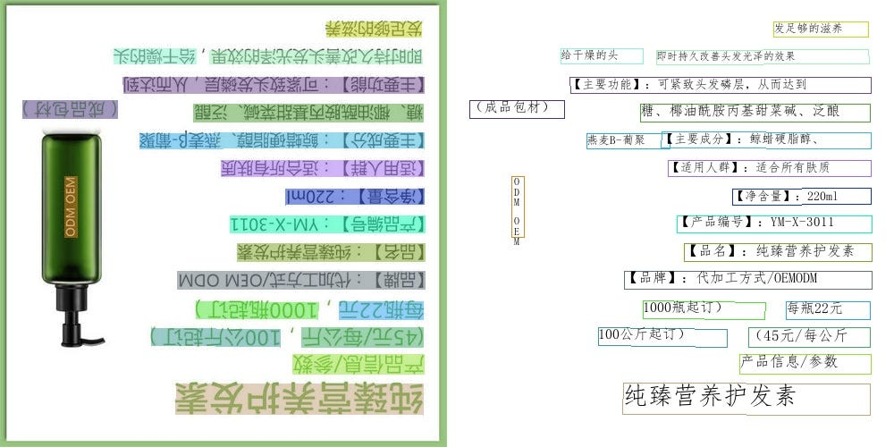
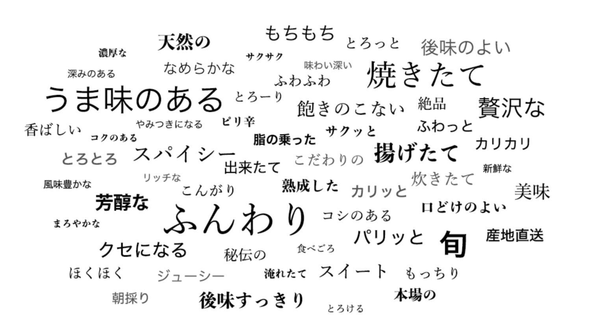

# PaddleOCR: The latest lightweight OCR system

# PaddleOCR: The latest lightweight OCR system

[](/@cochard-dav?source=post_page---byline--a13171d7ea3e---------------------------------------)

[David Cochard](/@cochard-dav?source=post_page---byline--a13171d7ea3e---------------------------------------)

8 min read

·

Apr 1, 2021

--

[Listen](/m/signin?actionUrl=https%3A%2F%2Fmedium.com%2Fplans%3Fdimension%3Dpost_audio_button%26postId%3Da13171d7ea3e&operation=register&redirect=https%3A%2F%2Fmedium.com%2Faxinc-ai%2Fpaddleocr-the-latest-lightweight-ocr-system-a13171d7ea3e&source=---header_actions--a13171d7ea3e---------------------post_audio_button------------------)

Share

This is an introduction to「PaddleOCR」, a machine learning model that can be used with [ailia SDK](https://ailia.jp/en/). You can easily use this model to create AI applications using [ailia SDK](https://ailia.jp/en/) as well as many other ready-to-use [ailia MODELS](https://github.com/axinc-ai/ailia-models).

---

## Overview

PaddleOCR is a state-of-the-art Optical Character Recognition (OCR) model published in September 2020 and developed by Chinese company Baidu using the `PaddlePaddle` (PArallel Distributed Deep LEarning) deep learning framework.

[## PaddlePaddle/PaddleOCR

### English | 简体中文 PaddleOCR aims to create multilingual, awesome, leading, and practical OCR tools that help users train…

github.com](https://github.com/PaddlePaddle/PaddleOCR?source=post_page-----a13171d7ea3e---------------------------------------)

[## PP-OCR: A Practical Ultra Lightweight OCR System

### The Optical Character Recognition (OCR) systems have been widely used in various of application scenarios, such as…

arxiv.org](https://arxiv.org/abs/2009.09941?source=post_page-----a13171d7ea3e---------------------------------------)

It is an excellent paper that gives a lot of consideration to the balance between recognition accuracy and computational load for practical use.  
In addition to these considerations, the paper also introduces the innovations made during training and the optimization of various designs based on experiments.

## Languages supported by PaddleOCR

It is an OCR that aims to support multiple languages, and as of March 2021, 27 languages are supported.

[## Multilingual OCR Development Plan · Issue #1048 · PaddlePaddle/PaddleOCR

### model name description model size download Update Date ch Chinese and English 3.71M inference model / trained model…

github.com](https://github.com/PaddlePaddle/PaddleOCR/issues/1048?source=post_page-----a13171d7ea3e---------------------------------------)

## Models used by PaddleOCR

Here is what the processing pipeline of PaddleOCR looks like.

Press enter or click to view image in full size


Source：<https://github.com/PaddlePaddle/PaddleOCR/blob/release/2.0/doc/ppocr_framework.png>

As shown in the figure, there are three major processing steps: 1) character position detection, 2) recognition of character orientation and correction 3) character content recognition.

The GitHub repository contains one model for each one of those steps. The models for step 1) and 2) are the same for all languages, whereas the model for step 3) exists for each supported language.

[## PaddlePaddle/PaddleOCR

### Note : Compared with models 1.1, which are trained with static graph programming paradigm, models 2.0 are the dynamic…

github.com](https://github.com/PaddlePaddle/PaddleOCR/blob/release/2.0/doc/doc_en/models_list_en.md?source=post_page-----a13171d7ea3e---------------------------------------)

## Output of PaddleOCR

Let’s try to recognize the text of the following image provided on GitHub.


Source：<https://github.com/PaddlePaddle/PaddleOCR/blob/release/2.0/doc/imgs/11.jpg>

Here is the output you get from PaddleOCR.

Press enter or click to view image in full size


The recognition is almost perfect.

---

Next, let’s take the inverted version of the previous image as the input.


And let’s see what PaddleOCR recognizes.

Press enter or click to view image in full size



Even when the character is upside down, and thanks to step 2), it is recognized almost perfectly.

---

Finally, let’s try to recognize words in Japanese using the following image, also provided on GitHub.

Press enter or click to view image in full size



Source：<https://github.com/PaddlePaddle/PaddleOCR/blob/release/2.0/doc/imgs/japan_2.jpg>

Here again PaddleOCR is able to recognized the text without mistakes.

Press enter or click to view image in full size


---

Let’s talk about details of the program. The following two variables will be output when the Japanese image above is used as input.

> np.shape(dt\_boxes) = (58, 4, 2)  
> np.shape(rec\_res) = (58, 2)

Above, `dt_boxes` is an abbreviation for “*detection bounding box*” and it contains the values of the four corners of the bounding box of the detected characters, expressed in XY coordinates.  
Here we have 58 bounding boxes, each of them has four XY coordinates, resulting in the number of elements (58, 4, 2).  
An extract of this data is shown below.

> [[675., 66.], [844., 66.], [844., 104.], [675., 104.]]

`rec_res` is an abbreviation for “*recognition result*”. It stores the predicted recognition string and the numerical value that expresses the degree of confidence in the result in the range 0 to 1.  
An example is shown below.

> (‘もちもち’, 0.98491704)

## Usage from PaddlePaddle

To use PaddleOCR from PaddlePaddle, you can refer to the Quick Start in the GitHub repository.

The procedure consists in installing the libraries listed in the *requirements.txt* file as well as *paddlepaddle*, then run the script. There are two versions of paddlepaddle, one for the CPU and one for the GPU, so you may want to install the one that fits your environment.

For example, if you want to perform Chinese language recognition, the command to run the script would be

```
# Predict a single image specified by image_dir  
python3 tools/infer/predict_system.py \  
        --image_dir="./doc/imgs/11.jpg" \  
        --det_model_dir="./inference/ch_ppocr_mobile_v2.0_det_infer/"  \  
        --rec_model_dir="./inference/ch_ppocr_mobile_v2.0_rec_infer/" \  
        --cls_model_dir="./inference/ch_ppocr_mobile_v2.0_cls_infer/" \  
        --use_angle_cls=True \  
        --use_space_char=True
```

If you want to perform Japanese recognition, the command to run the script is as follows.

```
# Predict a single image specified by image_dir  
python3 tools/infer/predict_system.py \  
        --image_dir="./doc/imgs/japan_2.jpg" \  
        --det_model_dir="./inference/ch_ppocr_mobile_v2.0_det_infer/"  \  
        --rec_model_dir="./inference/japan_mobile_v2.0_rec_infer/" \  
        --cls_model_dir="./inference/ch_ppocr_mobile_v2.0_cls_infer/" \  
        --use_angle_cls=True \  
        --use_space_char=True
```

The model file must be prepared in advance.  
For example, this can be accomplished with the following command

```
# Download the detection model of the ultra-lightweight Chinese OCR model and uncompress it  
wget https://paddleocr.bj.bcebos.com/dygraph_v2.0/ch/ch_ppocr_mobile_v2.0_det_infer.tar && tar xf ch_ppocr_mobile_v2.0_det_infer.tar# Download the recognition model of the ultra-lightweight Chinese OCR model and uncompress it  
wget https://paddleocr.bj.bcebos.com/dygraph_v2.0/ch/ch_ppocr_mobile_v2.0_rec_infer.tar && tar xf ch_ppocr_mobile_v2.0_rec_infer.tar# Download the angle classifier model of the ultra-lightweight Chinese OCR model and uncompress it  
wget https://paddleocr.bj.bcebos.com/dygraph_v2.0/ch/ch_ppocr_mobile_v2.0_cls_infer.tar && tar xf ch_ppocr_mobile_v2.0_cls_infer.tar# Download the angle classifier model of the ultra-lightweight Japanese OCR model and uncompress it  
wget https://paddleocr.bj.bcebos.com/dygraph_v2.0/multilingual/japan_mobile_v2.0_rec_infer.tar && tar xf japan_mobile_v2.0_rec_infer.tar
```

The command above triggers the download ofthe following four models.

> (1) Lightweight character detection model  
> (2) Character orientation recognition model  
> (3) Chinese character content recognition model  
> (4) Japanese character content recognition model

In addition to the models listed above, there are heavier detection models that focus on accuracy, and models for other languages. If necessary, you can customize the above command to download it.

## Exporting PaddleOCR to ONNX

There is actually no direct way to export PaddleOCR to ONNX as of March 2021.  
This can be found in the GitHub repository in the *Issues* section. The reason is probably that *PaddlePaddle* has its own support for mobile like ONNX.

Therefore, in order to export PaddlePaddle to ONNX, it is necessary to convert PaddlePaddle to Pytorch and then export from Pytorch to ONNX.

As for how to convert PaddlePaddle to Pytorch, there seems to be no official procedure either.  
One way is to build a network on Pytorch with the same structure as the model built on PaddlePaddle, and copy the weight values from the PaddlePaddle network to the Pytorch network one by one.

As for PaddleOCR, thankfully, the following GitHub repository has prepared a conversion program from PaddlePaddle to Pytorch.

[## frotms/PaddleOCR2Pytorch

### PytorchOCR由 PaddleOCR-2.0rc1+ 动态图版本移植。 高质量推理模型，准确的识别效果 超轻量ptocr\_mobile移动端系列 通用ptocr\_server系列 支持中英文数字组合识别、竖排文本识别、长文本识别…

github.com](https://github.com/frotms/PaddleOCR2Pytorch?source=post_page-----a13171d7ea3e---------------------------------------)

Use this repository to convert the desired model from PaddlePaddle to Pytorch.

There is no conversion code for the model that performs step “*(3) Character content recognition*” in languages other than Chinese, but it can be converted by converting only the number of classes in the final layer to the number of characters in each language.  
In other words, the network structure of the model for character content recognition is the same for all languages except for the final layer.

---

After converting from PaddlePaddle to Pytorch, you can export to ONNX using [the official procedure](https://pytorch.org/tutorials/advanced/super_resolution_with_onnxruntime.html).  
For the model that performs “(1) Character position detection”, since there are various possible input image sizes, export is performed so that it can dynamically respond to the height and width of the image.

```
# Input to the model  
x = torch.randn(1, 3, 960, 1280, requires_grad=True)  
  
# Export the model  
torch.onnx.export(converter.net,             # model being run  
                  x,                         # model input (or a tuple for multiple inputs)  
                  "./onnx/ch_ppocr_server_v2.0_det_train.onnx",  # where to save the model (can be a file or file-like object)  
                  export_params=True,        # store the trained parameter weights inside the model file  
                  opset_version=10,          # the ONNX version to export the model to  
                  do_constant_folding=True,  # whether to execute constant folding for optimization  
                  input_names = ['input'],   # the model's input names  
                  output_names = ['output'], # the model's output names  
                  dynamic_axes={'input' : {0 : 'batch_size',   
                                           2 : 'height_size',   
                                           3 : 'width_size'},  # variable lenght axes  
                                'output' : {0 : 'batch_size',   
                                            2 : 'height_size',   
                                            3 : 'width_size'}})
```

For the model that performs “(2) Character orientation recognition”, the input image size is resized to a fixed size according to the specification in config, so dynamic support is not necessary.  
The export is done with the fixed size specified in the config.

```
# Input to the model  
x = torch.randn(1, 3, 48, 192, requires_grad=True)  
  
# Export the model  
torch.onnx.export(converter.net,             # model being run  
                  x,                         # model input (or a tuple for multiple inputs)  
                  "./onnx/ch_ppocr_mobile_v2.0_cls_train.onnx",  # where to save the model (can be a file or file-like object)  
                  export_params=True,        # store the trained parameter weights inside the model file  
                  opset_version=10,          # the ONNX version to export the model to  
                  do_constant_folding=True,  # whether to execute constant folding for optimization  
                  input_names = ['input'],   # the model's input names  
                  output_names = ['output'], # the model's output names  
                  dynamic_axes={'input' : {0 : 'batch_size'},  # variable lenght axes  
                                'output' : {0 : 'batch_size'}})
```

For the model that performs “(3) Character content recognition”, the image at the detected character position is cropped and resized to a fixed height only according to the specification in the config, so dynamic support is required only for the horizontal size of the image.  
The export will be done at the fixed height specified in the config.

```
# Input to the model  
x = torch.randn(1, 3, 32, 320, requires_grad=True)  
  
# Export the model  
torch.onnx.export(converter.net,             # model being run  
                  x,                         # model input (or a tuple for multiple inputs)  
                  "./onnx/japan_mobile_v2.0_rec_infer.onnx",  # where to save the model (can be a file or file-like object)  
                  export_params=True,        # store the trained parameter weights inside the model file  
                  opset_version=10,          # the ONNX version to export the model to  
                  do_constant_folding=True,  # whether to execute constant folding for optimization  
                  input_names = ['input'],   # the model's input names  
                  output_names = ['output'], # the model's output names  
                  dynamic_axes={'input' : {0 : 'batch_size',   
                                           3 : 'width_size'},    # variable lenght axes  
                                'output' : {0 : 'batch_size',   
                                            1 : 'width_size'}})
```

## Usage with ailia SDK

To use it from the ailia SDK, use the following command. Japanese will be recognized for the input image.

```
$ python paddleocr.py -i input.png
```

[## axinc-ai/ailia-models

### (from https://github.com/PaddlePaddle/PaddleOCR/tree/dygraph/doc/imgs) Automatically downloads the onnx and prototxt…

github.com](https://github.com/axinc-ai/ailia-models/tree/master/text_recognition/paddleocr?source=post_page-----a13171d7ea3e---------------------------------------)

---

[ax Inc.](https://axinc.jp/en/) has developed [ailia SDK](https://ailia.jp/en/), which enables cross-platform, GPU-based rapid inference.

ax Inc. provides a wide range of services from consulting and model creation, to the development of AI-based applications and SDKs. Feel free to [contact us](https://axinc.jp/en/) for any inquiry.