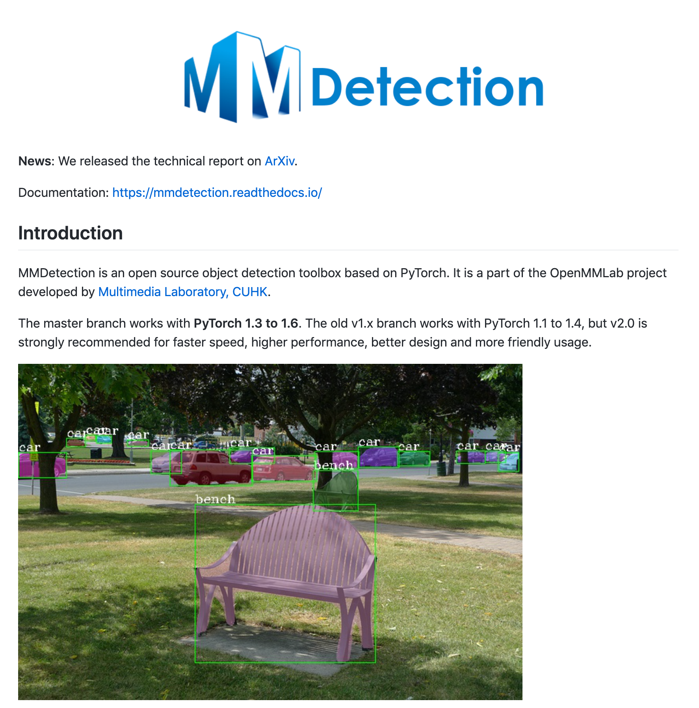

# Exporting MMDetection models to ONNX format

# Exporting MMDetection models to ONNX format

[](/@cochard-dav?source=post_page---byline--3ec839c38ff---------------------------------------)

[David Cochard](/@cochard-dav?source=post_page---byline--3ec839c38ff---------------------------------------)

2 min read

·

Apr 2, 2021

--

1

[Listen](/m/signin?actionUrl=https%3A%2F%2Fmedium.com%2Fplans%3Fdimension%3Dpost_audio_button%26postId%3D3ec839c38ff&operation=register&redirect=https%3A%2F%2Fmedium.com%2Faxinc-ai%2Fexporting-mmdetection-models-to-onnx-format-3ec839c38ff&source=---header_actions--3ec839c38ff---------------------post_audio_button------------------)

Share

MMDetection is an open-source object detection toolbox based on PyTorch. This article explains how to export MMDetection models to ONNX format for use with the [ailia SDK](https://ailia.jp/en/).

---

Press enter or click to view image in full size



Source：<https://github.com/open-mmlab/mmdetection>

## Structure of the MMDetection model

The MMDetection model consists of two files: a `config file` that represents the design of the neural network, and a `checkpoint file` that represents the trained parameters.

The config file is a text file written in Python, where variable names and data structures are set according to the MMDetection definition rules. Here is an example of such config file.

The structure of the config file is explained in the [MMDetection documentation site](https://mmdetection.readthedocs.io/en/latest/index.html).

[## Config System — MMDetection 2.4.0 documentation

### To help the users have a basic idea of a complete config and the modules in a modern detection system, we make brief…

mmdetection.readthedocs.io](https://mmdetection.readthedocs.io/en/latest/config.html?source=post_page-----3ec839c38ff---------------------------------------)

## Official conversion scripts

There is an [official conversion script available](https://github.com/open-mmlab/mmdetection/blob/master/tools/deployment/pytorch2onnx.py), which can be used to export MMDetection models to ONNX format.

```
python3 tools/pytorch2onnx.py <config file> <checkpoint file> --out <out.onnx> --shape 1120 768
```

Specify the paths of the *config* and *checkpoint* files as arguments, the name of the output ONNX file with the `--out` parameter, and the shape of the input tensor with the `--shape` parameter.

---

## OTEDetection

MMDetection does not yet have sufficient support for ONNX export, therefore exporting using `pytorch2onnx.py` may not work.

We will use `OTEDetection`, which was developed based on MMDetection to support ONNX export of many models, including SSD, FCOS, ATSS, FoveaBox, Faster & Mask R-CNN, Cascade & Cascade Mask R-CNN.

[## OTEDetection — openvinotoolkit/mmdetection

### This is an Object Detection and Instance Segmentation toolbox, that is a part of OpenVINO Training Extensions. Project…

github.com](https://github.com/openvinotoolkit/mmdetection?source=post_page-----3ec839c38ff---------------------------------------)

[## End-to-end Faster/Mask R-CNN models export to ONNX by druzhkov-paul · Pull Request #1386 ·…

### Since primitives like ROIAlign and NonMaxSuppression required for most of the detection/instance segmentation models…

github.com](https://github.com/open-mmlab/mmdetection/pull/1386?source=post_page-----3ec839c38ff---------------------------------------#issuecomment-639382141)

The OTEDetection conversion script runs as follows.

```
python3 tools/export.py <config file> <checkpoint file> <output dir> onnx
```

## Update to Version 2 format

OTEDetection is based on version 2 of MMDetection and is not compatible with version 1 format model files. In order to export a model file created in version 1 format to ONNX format, it must first be converted to version 2 format.

The model’s config file can be edited in a text-based format by referring to the instructions on the MMDetection documentation site; a detailed description of the config file can be found [here](https://github.com/openvinotoolkit/mmdetection/blob/ote/tools/upgrade_model_version.py).

For the checkpoint file, there is a [conversion tool available](https://github.com/openvinotoolkit/mmdetection/blob/ote/tools/upgrade_model_version.py), which can be used to run the following.

```
python tools/upgrade_model_version.py <checkpoint file v1> <output file>
```

---

[ax Inc.](https://axinc.jp/en/) has developed [ailia SDK](https://ailia.jp/en/), which enables cross-platform, GPU-based rapid inference.

ax Inc. provides a wide range of services from consulting and model creation, to the development of AI-based applications and SDKs. Feel free to [contact us](https://axinc.jp/en/) for any inquiry.